# 一、设计模式

## 1、OOP 基本特性

- 封装：也就是把客观事物封装成抽象的类，并且类可以把自己的属性和方法只让可信的类操作，对不可信的进行信息隐藏。
- 继承：是指这样一种能力，它可以使用现有的类的所有功能，并在无需重新编写原来类的情况下对这些功能进行扩展。
- 多态：指一个类实例的相同方法在不同情形有不同的表现形式。具体来说就是不同实现类对公共接口有不同的实现方式。但这些操作可以通过相同的方式（公共接口)予以调用。

## 2、面向对象设计原则

SOLID
- 单一职责原则（Single Responsibility Principle, SRP）：每个类都只负责单一的功能，切不可太多，并且一个类应当尽量的把一个功能做到极致，降低类的复杂度，提高类的可读性，提高系统的可维护性，降低变更引起的风险；

- 开闭原则（Open Closed Principle，OCP）：对修改关闭，对扩展开放，用抽象构建框架，用实现扩展细节；提高软件系统的可复用性及可维护性；第一点是，开闭原则并不是说完全杜绝修改，而是以最小的修改代码的代价来完成新功能的开发。第二点是，同样的代码改动，在粗代码粒度下，可能被认定为“修改”；在细代码粒度下，可能又被认定为“扩展”

- 里氏替换原则（Liskov Substitution Principle，LSP）：一个子类应该可以替换掉父类并且可以正常工作；子类可以扩展父类的功能，但不能改变父类原有的功能；
    - 子类可以实现父类的抽象方法，但是不能覆盖父类的非抽象方法；
    - 子类中可以增加自己特有的方法；
    - 当子类的方法重载父类的方法时，方法的前置条件（即方法的入参）要比父类方法的输入参数更宽松；
    - 当子类的方法实现父类的方法时（重写/重载或实现抽象方法），方法的后置条件（即返回值）要比父类更严格或者相等

    里氏替换与多态：多态是面向对象编程的一大特性，也是面向对象编程语言的一种语法。它是一种代码实现的思路。而里式替换是一种设计原则，用来指导继承关系中子类该如何设计，子类的设计要保证在替换父类的时候，不改变原有程序的逻辑及不破坏原有程序的正确性。
- 接口隔离原则（Interface Segregation Principle，ISP）：接口最小化原则，强调的是一个接口拥有的行为应该尽可能的小，尽量细化接口，使类具有很好的可读性、可扩展性和可维护性；接口隔离原则跟单一职责原则有点类似，不过稍微还是有点区别：单一职责原则针对的是模块、类、接口的设计。而接口隔离原则相对于单一职责原则，一方面它更侧重于接口的设计，另一方面它的思考的角度不同。它提供了一种判断接口是否职责单一的标准：通过调用者如何使用接口来间接地判定。如果调用者只使用部分接口或接口的部分功能，那接口的设计就不够职责单一；

- 迪米特原则（Law of Demeter，LOD）：也称最小知道原则，不该有直接依赖关系的类之间，不要有依赖；有依赖关系的类之间，尽量只依赖必要的接口（也就是定义中的“有限知识”）；基于最小接口而非最大实现编程；所谓高内聚，就是指相近的功能应该放到同一个类中，不相近的功能不要放到同一类中。相近的功能往往会被同时修改，放到同一个类中，修改会比较集中。所谓松耦合指的是，在代码中，类与类之间的依赖关系简单清晰。即使两个类有依赖关系，一个类的代码改动也不会或者很少导致依赖类的代码改动；

- 依赖倒置原则（Dependency Inversion Principle，DIP）：设计和实现要依赖于抽象而非具体。高层模块不该依赖于低层模块，二者都应该依赖于抽象，抽象不应该依赖于细节，细节应该依赖于抽象，针对接口编程，不要针对实现编程；

- 合成/聚合复用原则（Composite/Aggregate Reuse Principle，CARP）：如果新对象的某些功能在别的已经创建好的对象里面已经实现，那么应当尽量使用别的对象提供的功能，使之成为新对象的一部分，而不要再重新创建。如桥接模式；组合优于继承；

## 3、为什么适用设计模式

- 什么是设计模式：

	是一套被反复使用的、多数人知晓的、经过分类编目的、代码设计经验的总结.使用设计模式
	是为了重用代码、让代码更容易被他人理解、保证代码可靠性；

- 每个设计模式都有其适合范围，并解决特定问题.所以项目实践中应该针对特定使用场景选用合适的设计模式

## 4、设计模式分类

总共23种，可以分为三大类

### 4.1、创建型模式

提供了一种在创建对象的同时隐藏创建逻辑的方式，而不是使用新的运算符直接实例化对象，这使得程序在判断针对某个给定实例需要创建哪些对象时更加灵活:
- （1）工厂模式（Factory Pattern）
- （2）抽象工厂模式（Abstract Factory Pattern）
- （3）单例模式（Singleton Pattern）
- （4）建造者模式（Builder Pattern）
- （5）原型模式（Prototype Pattern）

### 4.2、结构型模式

这些设计模式关注类和对象的组合，继承的概念被用来组合接口和定义组合对象获得新功能的方式:
- （6）适配器模式（Adapter Pattern）
- （7）桥接模式（Bridge Pattern）
- （8）过滤器模式（Filter、Criteria Pattern）
- （9）组合模式（Composite Pattern）
- （10）装饰器模式（Decorator Pattern）
- （11）外观模式（Facade Pattern）
- （12）享元模式（Flyweight Pattern）
- （13）代理模式（Proxy Pattern）

### 4.3、行为型模式

这些设计模式特别关注对象之间的通信
- （14）责任链模式（Chain of Responsibility Pattern）
- （15）命令模式（Command Pattern）
- （16）解释器模式（Interpreter Pattern）
- （17）迭代器模式（Iterator Pattern）
- （18）中介者模式（Mediator Pattern）
- （19）备忘录模式（Memento Pattern）
- （20）观察者模式（Observer Pattern）
- （21）状态模式（State Pattern）
- （22）空对象模式（Null Object Pattern）
- （23）策略模式（Strategy Pattern）
- （24）模板模式（Template Pattern）
- （25）访问者模式（Visitor Pattern）

### 4.4、总结

设计模式要干的事情就是解耦。
- 创建型模式是将创建和使用代码解耦；
- 结构型模式是将不同功能代码解耦；
- 行为型模式是将不同的行为代码解耦

# 二、单例模式

## 1、什么是单例

只能有一个实例、单例类必须自己创建自己的唯一实例、单例类必须给所有其他对象提供这一实例。如：配置文件、线程池、工具类、缓存、日志对象；在应用中如果有两个或者两个以上的实例会引起错误，又或者换句话说，就是这些类，在整个应用中，同一时刻，有且只能有一种状态

单例的实现方式：懒汉、恶汉、双重检验锁、静态内部类、枚举

> 注意：单例类中对象的唯一性的作用范围是进程内的，在进程间是不唯一的。

## 2、懒汉模式

### 2.1、基本写法

- 是否 Lazy 初始化：是
- 是否多线程安全：否
- 实现难度：易
- 最大缺点：不支持多线程

```java
@NonThreadSafe
public class LazySingleton {
    private static LazySingleton lazySingleton;
    private LazySingleton(){}

    public static LazySingleton getInstance(){
        if (lazySingleton == null) {
            lazySingleton = new LazySingleton();
        }
        return lazySingleton;
    }
}
```

### 2.2、保证线程安全

```java
@ThreadSafe
public class LazyThreadSafeSingleton {
    private static LazyThreadSafeSingleton lazySingleton;
    private LazyThreadSafeSingleton(){}
    public synchronized static LazyThreadSafeSingleton getInstance(){
        if (lazySingleton == null) {
            lazySingleton = new LazyThreadSafeSingleton();
        }
        return lazySingleton;
    }
}
```

### 2.3、防止反射

懒汉模式的写法多线程不能完全防止反射的发生

```java
public class LazySingletonAvoidReflection {
    // 主要是构造器中加入判断，如果实例不为空，则抛异常
    private LazySingletonAvoidReflection(){
        if (lazySingleton != null){
            throw new RuntimeException("单例不能通过反射构建实例");
        }
    }
}
```

### 2.4、防止序列化

只需要在对应的单例应用中加入如下方法
```java
private Object readResolve(){
    return lazySingleton;
}
```

### 2.5、完整懒汉式

```java
public class LazySingletonComplete implements Serializable{
    private static LazySingletonComplete instance;
    private LazySingletonComplete(){
        if (instance != null){
            throw new RuntimeException("单例不能通过反射构建实例");
        }
    }
    public static LazySingletonComplete getInstance(){
        synchronized (LazySingletonComplete.class) {
            if (instance == null){
                instance = new LazySingletonComplete();
            }
            return instance;
        }
    }
    private Object readResolve(){
        return instance;
    }
}
```

## 3、饿汉模式

- 是否 Lazy 初始化：否
- 是否多线程安全：是
- 实现难度：易
- 优点：没有加锁，执行效率会提高
- 缺点：类加载时就初始化，浪费内存

### 3.1、基本写法

```java
@ThreadSafe
public class HungrySingleton {
    private final static HungrySingleton hungrySingleton = new HungrySingleton();
    private HungrySingleton(){}
    private static HungrySingleton getInstance(){
        return hungrySingleton;
    }
}
```

### 3.2、完整饿汉式

防止反射与序列化

```java
@ThreadSafe
public class HungrySingleton {
    private final static HungrySingleton hungrySingleton = new HungrySingleton();
    private HungrySingleton(){
        if (hungrySingleton != null){
            throw new RuntimeException("单例不能通过反射构建实例");
        }
    }
    private static HungrySingleton getInstance(){
        return hungrySingleton;
    }
    private Object readResolve(){
        return hungrySingleton;
    }
}
```

### 3.3、Runtime类

JDK中的`Runtime`类使用的就是恶汉模式来实现的
```java
public class Runtime {
    private static Runtime currentRuntime = new Runtime();
    public static Runtime getRuntime() {
        return currentRuntime;
    }
    private Runtime() {}
}
```

### 3.4、注意点

饿汉模式并不是一无是处，如果初始化耗时长，那我们最好不要等到真正要用它的时候，才去执行这个耗时长的初始化过程，这会影响到系统的性能（比如，在响应客户端接口请求的时候，做这个初始化操作，会导致此请求的响应时间变长，甚至超时）。采用饿汉式实现方式，将耗时的初始化操作，提前到程序启动的时候完成，这样就能避免在程序运行的时候，再去初始化导致的性能问题；

如果实例占用资源多，按照 fail-fast 的设计原则（有问题及早暴露），那我们也希望在程序启动时就将这个实例初始化好。如果资源不够，就会在程序启动的时候触发报错（比如 Java 中的 PermGen Space OOM），我们可以立即去修复。这样也能避免在程序运行一段时间后，突然因为初始化这个实例占用资源过多，导致系统崩溃，影响系统的可用性；

## 4、双重校验锁

### 4.1、基本实现

```java
public class LazyDoubleCheckSingleton {
    private static LazyDoubleCheckSingleton lazySingleton;
    private LazyDoubleCheckSingleton(){}
    public static LazyDoubleCheckSingleton getInstance(){
        if (lazySingleton == null) {
            synchronized (LazyDoubleCheckSingleton.class) {
                if (lazySingleton == null) {
                    lazySingleton = new LazyDoubleCheckSingleton();
                }
            }
        }
        return lazySingleton;
    }
}
```
存在问题：
- 上述代码也有问题：`lazySingleton = new LazyDoubleCheckSingleton();` 不是原子操作，其在JVM上大概做了三件事情：
	- （1）给 lazySingleton 分配内存
	- （2）调用 LazyDoubleCheckSingleton 的构造函数来初始化成员变量;
	- （3）将 lazySingleton 对象指向分配的内存空间（执行完这步 singleton 就为非 null 了）

但是在 JVM 的即时编译器中存在指令重排序的优化，上面的第二步骤和第三步骤执行的顺序是不能保障的；如果在步骤3执行完毕，步骤2还未执行之前，被其他线程抢占，这时 lazySingleton 已经是非 null 了但是未被初始化；所以线程会直接返回 lazySingleton 然后使用，然后顺理成章地报错；

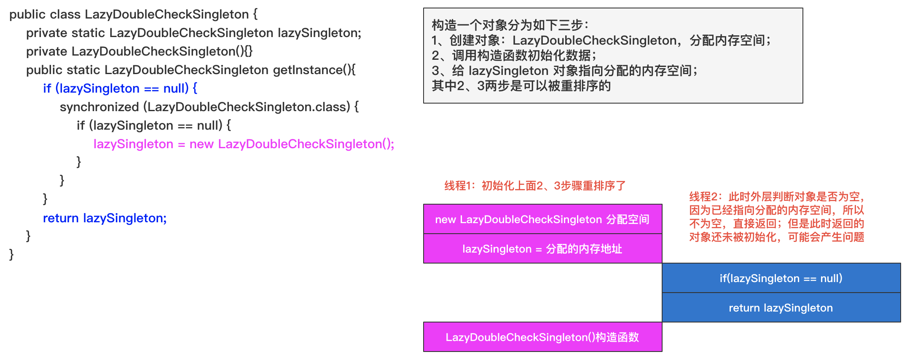

### 4.2、改进

volatile 会禁止指令重排序优化

```java
public class LazyDoubleCheckSingleton {
    private volatile static LazyDoubleCheckSingleton lazySingleton;
    private LazyDoubleCheckSingleton(){}
    public static LazyDoubleCheckSingleton getInstance(){
        if (lazySingleton == null) {
            synchronized (LazyDoubleCheckSingleton.class) {
                if (lazySingleton == null) {
                    lazySingleton = new LazyDoubleCheckSingleton();
                }
            }
        }
        return lazySingleton;
    }
}
```

***注意：***
在Java5以前的版本使用了volatile的双检锁还是有问题的，Java5以前的JMM（Java 内存模型）是存在缺陷的，即时将变量声明成volatile也不能完全避免重排序，主要是volatile变量前后的代码仍然存在重排序问题

### 4.3、提高性能

双重校验锁中加入volatile了会有一定的性能损耗，因为volatile为了保证共享变量在并发场景下的内存可见性，volatile变量的操作前后都会通过插入内存屏障来进行数据同步，即将线程的本地内存数据同步到主内存（或从主内存将数据同步到线程的本地内存），这个过程其实是有很大的损耗的，可以想办法降低对于volatile变量的访问次数，那就是通过定义局部变量的方式。

因为局部变量并不是共享的，所以不需要进行线程本地内存和主存之间的数据同步，操作效率就会很高。所以，使用局部变量，是一种性能提升的方式，可以减少主存与线程内存的拷贝次数；
```java
public class DoubleCheckWithLocalVariable {
    private volatile static DoubleCheckWithLocalVariable INSTANCE = null;
    private DoubleCheckWithLocalVariable() {
    }
    private static DoubleCheckWithLocalVariable getInstance() {
        DoubleCheckWithLocalVariable temp = INSTANCE;
        if (temp == null) {
            synchronized (DoubleCheckWithLocalVariable.class) {
                temp = INSTANCE;
                if (temp == null) {
                    temp = new DoubleCheckWithLocalVariable();
                    INSTANCE = temp;
                }
            }
        }
        return temp;
    }
}
```
在Spring源码中也有类似的操作，比如：ReactiveAdapterRegistry
```java
public class ReactiveAdapterRegistry {
    @Nullable
	private static volatile ReactiveAdapterRegistry sharedInstance;
    public static ReactiveAdapterRegistry getSharedInstance() {
		ReactiveAdapterRegistry registry = sharedInstance;
		if (registry == null) {
			synchronized (ReactiveAdapterRegistry.class) {
				registry = sharedInstance;
				if (registry == null) {
					registry = new ReactiveAdapterRegistry();
					sharedInstance = registry;
				}
			}
		}
		return registry;
	}
}
```

## 5、静态内部类

推荐的单例写法

### 5.1、基本写法

```java
public class StaticInnerClassSingleton {
    private static class StaticInnerClassSingletonHolder {
        private static final StaticInnerClassSingleton INSTANCE = new StaticInnerClassSingleton();
    }
    private StaticInnerClassSingleton(){}
    public static StaticInnerClassSingleton getInstance(){
        return StaticInnerClassSingletonHolder.INSTANCE;
    }
    // 防止序列化
    private Object readResolve() {
        return getInstance();
    }
}
```

- 这种方式同样利用了classloder的机制来保证初始化instance时只有一个线程，跟饿汉式不同的是：饿汉式只要 StaticInnerClassSingleton 类被装载了，那么instance就会被实例化（没有达到lazy loading效果），而这种方式是 StaticInnerClassSingleton 类被装载了，instance不一定被初始化，因为 StaticInnerClassSingletonHolder 类没有被主动使用，只有显示通过调用getInstance方法时，才会显示装载StaticInnerClassSingletonHolder类，从而实例化instance：

	* 加载一个类时，其内部类不会同时被加载；
	* 一个类被加载，当且仅当其某个静态成员（静态域、构造器、静态方法等）被调用时发生

- 由于对象实例化是在内部类加载的时候创建的，因此是线程安全的（因为在方法中创建，才存在并发问题，静态内部类随着方法调用而被加载，只加载一次，不存在并发问题）
- 反射会破坏上述单例结构

### 5.2、防止反射

只要通过变量来控制的，都无法完全防止反射的发生

```java
public class InnerClassSingleton {
    private static boolean initialized = false;
    private InnerClassSingleton(){
        synchronized (InnerClassSingleton.class){
            if (!initialized){
                initialized = !initialized;
            } else {
                throw new RuntimeException("无法构造单例");
            }
        }
    }
    static class InnerClassSingletonHolder{
        private static final InnerClassSingleton instance = new InnerClassSingleton();
    }
    public static InnerClassSingleton getInstance() {
        return InnerClassSingletonHolder.instance;
    }
}
```

## 6、枚举实现

目前最好的方式，避免了反射的攻击和序列化的问题

```java
public enum SingletonEnum {
	INSTANCE;
	// 在反射时，通过私有构造器newInstance是会抛出非法参数异常：IllegalArgumentException
	// Exception in thread "main" java.lang.IllegalArgumentException: Cannot reflectively create enum objects
	public static void main(String... args)throws Exception{
		Constructor[] array = SingletonEnum.INSTANCE.getClass().getDeclaredConstructors();
		for (Constructor constructor : array) {
			constructor.setAccessible(true);
			constructor.newInstance(null);
		}
	}
}
```

[枚举本质](../Java基础/Java基础知识.md#十八枚举类)

## 7、破坏单例情况

在反序列化的过程中到底发生了什么，使得反序列化后的单例不是唯一的？分析一下 ObjectInputputStream 的readObject 方法执行情况到底是怎样的

- ObjectInputStream 的readObject的调用栈：readObject--->readObject0--->readOrdinaryObject--->checkResolve

- 看下 readOrdinaryObject方法的代码片段			
```java
/**
 * 这里创建的这个obj对象，就是本方法要返回的对象，也可以暂时理解为是ObjectInputStream的readObject返回的对象
 * (1).isInstantiable：如果一个serializable/externalizable的类可以在运行时被实例化，那么该方法就返回true.
 * 针对serializable和externalizable我会在其他文章中介绍.
 * (2).desc.newInstance：该方法通过反射的方式调用无参构造方法新建一个对象
 */
Object obj;
try {
	obj = desc.isInstantiable() ? desc.newInstance() : null;
} catch (Exception ex) {
	throw (IOException) new InvalidClassException(desc.forClass().getName()，"unable to create instance").initCause(ex);
}
```

- 结论：为什么序列化可以破坏单例了？ 序列化会通过反射调用无参数的构造方法创建一个新的对象
```java
/**
 * hasReadResolveMethod:如果实现了serializable 或者 externalizable接口的类中包含readResolve则返回true
 * invokeReadResolve:通过反射的方式调用要被反序列化的类的readResolve方法
 */
if (obj != null &&	handles.lookupException(passHandle) == null &&	desc.hasReadResolveMethod()){
	Object rep = desc.invokeReadResolve(obj);
	if (unshared && rep.getClass().isArray()) {
		rep = cloneArray(rep);
	}
	if (rep != obj) {
		handles.setObject(passHandle， obj = rep);
	}
}
```
- 如何防止序列化/反序列化破坏单例模式：在类中定义readResolve就可以解决该问题，定义的readResolve方法，并在该方法中指定要返回的对象的生成策略，就可以防止单例被破坏
```java
/**
 * 使用双重校验锁方式实现单例
 */
public class Singleton implements Serializable{
	private volatile static Singleton singleton;
	private Singleton (){
		// 防止反射创建新的实例
		if (singleton != null){
			throw new IllegalArgumentException("cannot exist two instance");
		}
	}
	public static Singleton getSingleton() {
		if (singleton == null) {
			synchronized (Singleton.class) {
				if (singleton == null) {
					singleton = new Singleton();
				}
			}
		}
		return singleton;
	}
	private Object readResolve() {
		return singleton;
	}
}
```

另外使用 Unsafe类也会破坏单例：
```java
UnsafeUtils.getUnsafe().allocateInstance(Singleton.class);
```

## 8、容器单例

```java
public class ContainerSingleton {
    private static Map<String, Object> singleMap = new HashMap<>();
    private ContainerSingleton(){}

    public static void putInstance(String key, Object instance) {
        if (StringUtils.isNotBlank(key) && instance != null) {
            if (!singleMap.containsKey(key)){
                singleMap.put(key,instance);
            }
        }
    }
    public static Object getInstance(String key) {
        return singleMap.get(key);
    }
}
```

可以参考`java.awt.Desktop`，其中有使用该类单例

如果应用中有比较多的单例，可以通过容器来进行管理，类比SPring的IOC容器

## 9、ThreadLocal与单例

ThreadLocal 可以确保在一个线程中对象是唯一的，但是无法保证在整个应用中对象时唯一的，如Mybatis的`ErrorContext`类

```java
public class ThreadLocalSingleton {
    private static ThreadLocal<ThreadLocalSingleton> instance = new ThreadLocal<>(){
        @Override
        protected Object initialValue() {
            return new ThreadLocalSingleton();
        }
    };
    private ThreadLocalSingleton(){}
    public static ThreadLocalSingleton getInstance(){
        return instance.get();
    }
}
```

## 10、单例与JVM垃圾回收

当一个单例的对象长久不用时，会不会被jvm的垃圾收集机制回收?(Hotspot 虚拟机)

### 10.1、分析思路

- Hotspot 垃圾收集算法:GC Root
- 方法区的垃圾收集方法，JVM卸载类的判断方法

### 单例与static

当需要共享的变量很多时，使用static变量占用内存的时间过长，在类的整个生命周期，而对象只是存在于对象的整个生命周期。卸载一个实例比卸载一个类容易；

使用单例模式可以限制对象实例的个数，除了返回实例的操作之外不能被new出来。这在某些需要限制对象访问的场合下是有用的。使用static的话并不能限制对象实例的个数

## 11、总结

有两个问题需要注意

- 如果单例由不同的类装载器装入，那便有可能存在多个单例类的实例。假定不是远端存取，例如一些servlet容器对每个servlet使用完全不同的类装载器，这样的话如果有两个servlet访问一个单例类，它们就都会有各自的实例，解决方案:
```java
private static Class getClass(String classname)throws ClassNotFoundException {
	ClassLoader classLoader = Thread.currentThread().getContextClassLoader();

		if(classLoader == null)     
			classLoader = Singleton.class.getClassLoader();     

		return (classLoader.loadClass(classname));     
	}     
}  
```
- 如果Singleton实现了java.io.Serializable 接口，那么这个类的实例就可能被序列化和复原。不管怎样，如果你序列化一个单例类的对象，接下来复原多个那个对象，那你就会有多个单例类的实例:
```java
public class Singleton implements java.io.Serializable {     
	public static Singleton INSTANCE = new Singleton(); 
	protected Singleton() { }     
	private Object readResolve() {     
			return INSTANCE;     
	}    
} 
```

- 如果单例接口实现了cloneable接口，那么有可能会破坏单例模式，所以在重写clone方法时需要特殊处理
```java
public class Singleton implements Cloneable{
    private Singleton(){}
    private static Singleton instance = new Singleton();
    public static Singleton getInstance(){
        return instance;
    } 
    protected Object clone() throws UnsupportedException{
        return getInstance();
    }
}
```

## 12、不使用synchronized和lock实现线程安全的单例

上面的代码要么显示或者隐式的使用了synchronized或者lock，饿汉模式和内部类模式是因为类的初始化是由ClassLoader完成的，这其实就是利用了ClassLoader的线程安全机制啊；ClassLoader的loadClass方法在加载类的时候使用了synchronized关键字；

可以使用CAS来实现线程安全的单例；借助CAS（AtomicReference）实现单例模式

```java
public class CASSingleton {
    private static AtomicReference<CASSingleton> INSTANCE = new AtomicReference<>();
    private CASSingleton(){}
    public static CASSingleton getInstance() {
        for (;;){
            CASSingleton instance = INSTANCE.get();
            // 如果singleton不为空，就返回singleton
            if (instance != null) {
                return instance;
            }
            instance = new CASSingleton();
            // CAS操作，预期值是NULL，新值是singleton
            // 如果成功，返回singleton
            // 如果失败，进入第二次循环，singletonAtomicReference.get()就不会为空了
            if (INSTANCE.compareAndSet(null, instance)) {
                return instance;
            }
        }
    }
}
```
或者：
```java
public class CASStampSingleton {
    private static AtomicStampedReference<CASStampSingleton> reference = new AtomicStampedReference<>(null, 1);
    private CASStampSingleton() {
    }
    public static CASStampSingleton getInstance() {
        while (true) {
            CASStampSingleton instance = CASStampSingleton.reference.getReference();
            if (instance != null) {
                return instance;
            }
            instance = new CASStampSingleton();
            if (reference.compareAndSet(null, instance, 1, 2)) {
                return instance;
            }
        }
    }
}
```
## 13、JDK中使用场景

* Runtime 体现了饿汉式单例
* Console 体现了双检锁懒汉式单例
* Collections 中的 EmptyNavigableSet 内部类懒汉式单例
* ReverseComparator.REVERSE_ORDER 内部类懒汉式单例
* Comparators.NaturalOrderComparator.INSTANCE 枚举饿汉式单例

# 三、工厂模式

## 1、简单工厂

静态工厂方法：由一个工厂对象决定创建出哪一种产品类的实例

- 简单工厂模式解决的问题是如何去实例化一个合适的对象，但是其违背了开闭原则
- 简单工厂模式的核心思想就是：有一个专门的类来负责创建实例的过程
- 适用场景：
    - 工厂类负责创建的对象比较少
    - 客户端只知道传入工厂类的参数，对于如何创建对象不关心

```java
public interface IProduct {
    public void method();
}
public class ProductA implements IProduct{
    public void method() {
        System.out.println("产品A方法");
    }
}
public class ProductB implements IProduct{
    public void method() {
        System.out.println("产品B方法");
    }
}
public class Creator {
    private Creator(){}
    public static IProduct createProduct(String productName){
        if (productName == null) { return null;}
        if (productName.equals("A")) {
            return new ProductA();
        }else if (productName.equals("B")) {
            return new ProductB();
        }else {
            return null;
        }
    }
}
```

JDK中有使用的了简单工厂模式：
- Calendar类
- DriverManager

## 2、工厂方法

- 工厂方法：工厂父类负责定义创建产品对象的公共接口，而工厂子类则负责生成具体的产品对象，这样做的目的是将产品类的实例化操作延迟到工厂子类中完成，即通过工厂子类来确定究竟应该实例化哪一个具体产品类。

- 工厂方法模式弥补了简单工厂模式不满足开闭原则的诟病，当我们需要增加产品时，只需要增加相应的产品和工厂类，而不需要修改现有的代码，其是符合开闭原则的；但是其类的个数容易过多，增加复杂度；

- 实例代码：

    ```java
    // 抽象产品接口
    public interface Light {
        public void turnOn();
        public void turnOff();
    }
    // 具体的产品
    public class BuldLight implements Light{
        public void turnOn() {System.out.println("BuldLight On"); }
        public void turnOff() {System.out.println("BuldLight Off");}
    }
    public class TubeLight implements Light{
        public void turnOn() {System.out.println("TubeLight On");}
        public void turnOff() {System.out.println("TubeLight Off");}
    }
    // 抽象的工厂接口
    public interface Creator {
        public Light createLight();
    }
    // 创建指定产品的具体工厂
    public class BuldCreator implements Creator{
        public Light createLight() {return new BuldLight();}
    }
    public class TubeCreator implements Creator{
        public Light createLight() {return new TubeLight();}
    }
    ```

- 工厂方法适用场景：
    - JDBC的Driver和Connection适用的场景就是我们需要一个产品帮我们完成一项任务，但是这个产品有可能有很多品牌（像这里的mysql，oracle），为了保持我们对产品操作的一致性，我们就可能要用到工厂方法模式
    - JDK中运用的工厂方法：Iterator；URLStreamHandlerFactory与URLStreamHandler
    - logback中的实现类

## 3、抽象工厂

抽象工厂模式提供了一个创建一系列相关或相互依赖对象的接口，无需指定他们具体的类；

### 3.1、两个概念

- 产品等级结构 ：产品等级结构即产品的继承结构，如一个抽象类是电视机，其子类有海尔电视机、海信电视机、TCL电视机，则抽象电视机与具体品牌的电视机之间构成了一个产品等级结构，抽象电视机是父类，而具体品牌的电视机是其子类。
- 产品族 ：在抽象工厂模式中，产品族是指由同一个工厂生产的，位于不同产品等级结构中的一组产品，如海尔电器工厂生产的海尔电视机、海尔电冰箱，海尔电视机位于电视机产品等级结构中，海尔电冰箱位于电冰箱产品等级结构中；

当系统所提供的工厂所需生产的具体产品并不是一个简单的对象，而是多个位于不同产品等级结构中属于不同类型的具体产品时需要使用抽象工厂模式

### 3.2、抽象工厂与工厂模式

- 抽象工厂与工厂模式：抽象工厂模式与工厂方法模式最大的区别在于，工厂方法模式针对的是一个产品等级结构，而抽象工厂模式则需要面对多个产品等级结构，一个工厂等级结构可以负责多个不同产品等级结构中的产品对象的创建 。当一个工厂等级结构可以创建出分属于不同产品等级结构的一个产品族中的所有对象时，抽象工厂模式比工厂方法模式更为简单、有效率


### 3.3、四个角色

抽象工厂模式包含四个角色
- 抽象工厂用于声明生成抽象产品的方法；
- 具体工厂实现了抽象工厂声明的生成抽象产品的方法，生成一组具体产品，这些产品构成了一个产品族，每一个产品都位于某个产品等级结构中；
- 抽象产品为每种产品声明接口，在抽象产品中定义了产品的抽象业务方法；
- 具体产品定义具体工厂生产的具体产品对象，实现抽象产品接口中定义的业务方法；

### 3.4、适用场景

- 客户端不依赖产品实例如何被创建、实现等细节；
- 强调一系列相关的产品对象一起使用创建对象需要大量重复代码；
- 属于同一个产品族的产品将在一起使用，这一约束必须在系统的设计中体现出来
- 提供了产品类的类库

JDK中使用场景：Connection、Statement、PreparedStatement和mybatis中的SqlSessionFactory、SqlSession

### 3.5、优缺点

- 优点：
    - 抽象工厂模式隔离了具体类的生成，使得客户并不需要知道什么被创建；
    - 当一个产品族中的多个对象被设计成一起工作时，它能够保证客户端始终只使用同一个产品族中的对象；
    - 增加新的具体工厂和产品族很方便，无须修改已有系统，符合“开闭原则”；

- 缺点：
    - 在添加新的产品对象时，难以扩展抽象工厂来生产新种类的产品，这是因为在抽象工厂角色中规定了所有可能被创建的产品集合，要支持新种类的产品就意味着要对该接口进行扩展，而这将涉及到对抽象工厂角色及其所有子类的修改，显然会带来较大的不便；
    - 开闭原则的倾斜性（增加新的工厂和产品族容易，增加新的产品等级结构麻烦）；

### 3.6、实现

基本类图

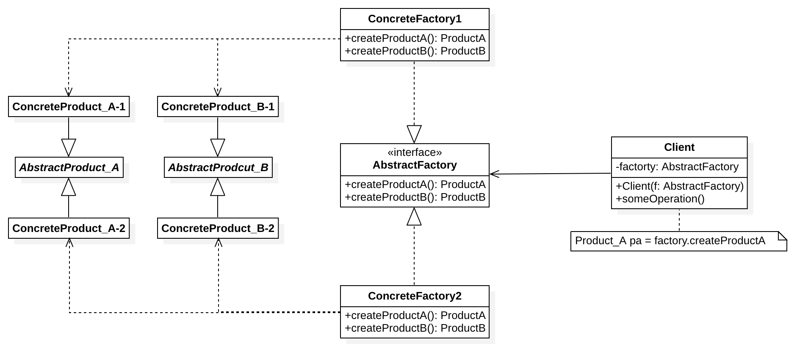

- 抽象产品：AbstractProduct_A、AbstractProduct_B 是抽象产品接口；为构成系列产品的一组不同但相关的产品声明接口
- 具体产品（Concrete Product） 是抽象产品的多种不同类型实现。 所有变体都必须实现相应的抽象产品；
- 抽象工厂（Abstract Factory） 接口声明了一组创建各种抽象产品的方法；
- 具体工厂（sConcrete Factory） 实现抽象工厂的构建方法。 每个具体工厂都对应特定产品变体， 且仅创建此种产品变体；

实现案例：
```java
// AbstractFactory 抽象工厂：我们需要创建课程，课程需要包含视频和文章
public interface CourseFactory {
    Video getVideo(); // 视频
    Article getArticle(); // 文章
}
// AbstractProduct_A、AbstractProduct_B 抽象产品：视频和文章
public abstract class Video {
    public abstract void produce();
}
public abstract class Article {
    public abstract void produce();
}
// 具体产品：Java视频和Java文章
public class JavaVideo extends Video {
    public void produce() {System.out.println("录制Java课程视频"); }
}
public class JavaArticle extends Article {
    public void produce() {System.out.println("编写Java课程手记"); }
}
// 具体产品：Python视频和Python文章
public class PythonVideo extends Video {
    public void produce() {System.out.println("录制Python课程视频"); }
}
public class PythonArticle extends Article {
    public void produce() {System.out.println("编写Python课程手记"); }
}
// 具体工厂：创建Java课程的工厂和创建Python课程的工厂
public class JavaCourseFactory implements CourseFactory {
    public Video getVideo() {
        return new JavaVideo();
    }
    public Article getArticle() {
        return new JavaArticle();
    }
}
public class PythonCourseFactory implements CourseFactory {
    public Video getVideo() {
        return new PythonVideo();
    }
    public Article getArticle() {
        return new PythonArticle();
    }
}
// Client 调用方
public class Client {
    public static void main(String[] args) {
        CourseFactory courseFactory = new JavaCourseFactory();
        Video video = courseFactory.getVideo();
        Article article = courseFactory.getArticle();
        video.produce();
        article.produce();
    }
}
```

## 4、三者的区别

- 简单工厂 ：用来生产同一等级结构中的任意产品。（对于增加新的产品，主要是新增产品，就要修改工厂类。符合单一职责原则。不符合开放-封闭原则）；当每个对象的创建逻辑都比较简单的时候，推荐使用简单工厂模式；
- 工厂方法 ：用来生产同一等级结构中的固定产品。（支持增加任意产品，新增产品时不需要更改已有的工厂，需要增加该产品对应的工厂。符合单一职责原则、符合开放-封闭原则。但是引入了复杂性）；将多个对象的创建逻辑放到一个工厂类中，当每个对象的创建逻辑都比较复杂的时候，为了避免设计一个过于庞大的简单工厂类；
- 抽象工厂 ：用来生产不同产品族的全部产品。（增加新产品时，需要修改工厂，增加产品族时，需要增加工厂。符合单一职责原则，部分符合开放-封闭原则，降低了复杂性）

# 四、建造者模式

## 1、定义

将一个复杂的对象构建与它的表示分离，使得同样的构建过程可以创建不同的表示；

用户只需要指定需要见着的类型就可以得到他们，建造过程及细节不需要知道

## 2、适用场景

- 如果一个对象有非常复杂的内部结构，或者想把复杂的对象的创建和适用分离
- 属性之间存在依赖关系；
- 希望创建的对象是不可变对象，对象创建之后不能修改内部的属性值；

## 3、与工厂模式区别

- 工厂模式是用来创建不同但是相关类型的对象（继承同一父类或者接口的一组子类），由给定的参数来决定创建哪种类型的对象；
- 建造者模式是用来创建一种类型的复杂对象，通过设置不同的可选参数，“定制化”地创建不同的对象

## 4、使用场景

- JDK：StringBuilder(StringBuffer)
- Guava：CacheBuilder
- Spring：BeanDefinitionBuilder
- Mybatis：SqlSessionFactoryBuilder

## 5、代码

```java
public class ResourcePoolConfig {

    private final String name;
    private final int maxTotal;
    private final int maxIdle;
    private final int minIdle;

    private ResourcePoolConfig(Builder builder) {
        this.name = builder.name;
        this.maxTotal = builder.maxTotal;
        this.maxIdle = builder.maxIdle;
        this.minIdle = builder.minIdle;
    }
    //我们将Builder类设计成了ResourcePoolConfig的内部类。
    //我们也可以将Builder类设计成独立的非内部类ResourcePoolConfigBuilder。
    public static class Builder {
        private static final int DEFAULT_MAX_TOTAL = 8;
        private static final int DEFAULT_MAX_IDLE = 8;
        private static final int DEFAULT_MIN_IDLE = 0;
        private String name;
        private int maxTotal = DEFAULT_MAX_TOTAL;
        private int maxIdle = DEFAULT_MAX_IDLE;
        private int minIdle = DEFAULT_MIN_IDLE;
        public ResourcePoolConfig build() {
            // 校验逻辑放到这里来做，包括必填项校验、依赖关系校验、约束条件校验等
            if (StringUtils.isBlank(name)) {
                throw new IllegalArgumentException("...");
            }
            if (maxIdle > maxTotal) {
                throw new IllegalArgumentException("...");
            }
            if (minIdle > maxTotal || minIdle > maxIdle) {
                throw new IllegalArgumentException("...");
            }
            return new ResourcePoolConfig(this);
        }
        public Builder setName(String name) {
            if (StringUtils.isBlank(name)) {
                throw new IllegalArgumentException("...");
            }
            this.name = name;
            return this;
        }
        public Builder setMaxTotal(int maxTotal) {
            if (maxTotal <= 0) {
                throw new IllegalArgumentException("...");
            }
            this.maxTotal = maxTotal;
            return this;
        }
        public Builder setMaxIdle(int maxIdle) {
            if (maxIdle < 0) {
                throw new IllegalArgumentException("...");
            }
            this.maxIdle = maxIdle;
            return this;
        }
        public Builder setMinIdle(int minIdle) {
            if (minIdle < 0) {
                throw new IllegalArgumentException("...");
            }
            this.minIdle = minIdle;
            return this;
        }
    }
    public String getName() {
        return name;
    }
    public int getMaxTotal() {
        return maxTotal;
    }
    public int getMaxIdle() {
        return maxIdle;
    }
    public int getMinIdle() {
        return minIdle;
    }
}
```

## 6、UML类图

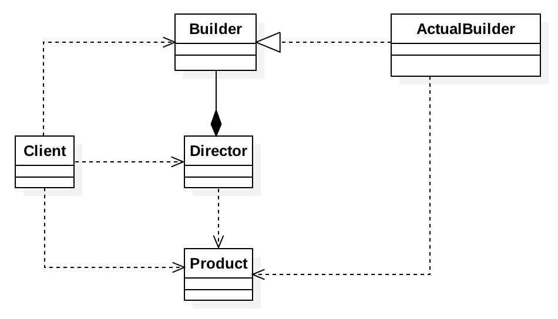

首先建造者接口（Builder）和具体的建造者（ActualBuilder）应该是要新建的，而指挥者（Director）、产品（Product）

一些基本模型不会变，而其组合经常变化的时候，可以选择使用构造者模式

# 五、原型模式

## 1、原型模式

如果对象的创建成本比较大，而同一个类的不同对象之间差别不大（大部分字段都相同），在这种情况下，我们可以利用对已有对象（原型）进行复制（或者叫拷贝）的方式来创建新对象，以达到节省创建时间的目的。这种基于原型来创建对象的方式就叫作原型设计模式（Prototype Design Pattern），简称原型模式

**什么叫创建成本大？**如果对象中的数据需要经过复杂的计算才能得到（比如排序、计算哈希值），或者需要从 RPC、网络、数据库、文件系统等非常慢速的 IO 中读取，这种情况下，我们就可以利用原型模式，从其他已有对象中直接拷贝得到，而不用每次在创建新对象的时候，都重复执行这些耗时的操作；

## 2、适用场景

- 类初始化消耗较多资源
- new产生的一个对象需要非常繁琐的过程；
- 构造函数比较复杂
- 循环体中产生大量的对象

## 3、优缺点

- 必须配备克隆方法
- 深拷贝与浅拷贝要运用得当

不过实际当中我们使用原型模式时，也可以写一个基类实现Cloneable接口重写clone方法，然后让需要具有拷贝功能的子类继承自该类，这是一种节省代码量的常用方式

原型模式中的克隆可以破坏单例模式

## 4、示例代码

原型模式有两种实现方法，深拷贝和浅拷贝。
- 浅拷贝只会复制对象中基本数据类型数据和引用对象的内存地址，不会递归地复制引用对象，以及引用对象的引用对象；
- 深拷贝得到的是一份完完全全独立的对象。所以，深拷贝比起浅拷贝来说，更加耗时，更加耗内存空间

## 5、JDK使用场景

所有实现了cloneable接口的都是使用了原型模式

# 六、代理模式

* [代理模式详解](http://www.cnblogs.com/zuoxiaolong/p/pattern3.html)
* [代理模式](https://ehlxr.me/2020/01/02/java-dynamic-proxy/)

## 1、基本概念

给目标对象提供一个代理对象，并由代理对象控制对目标对象的引用，通过引入代理对象的方式来间接访问目标对象，防止直接访问目标对象给系统带来的不必要复杂性；

## 2、代理的分类

- 远程代理
- 虚拟代理
- 保护代理
- 智能引用代理

根据字节码的创建时机来分：
- 所谓静态也就是在程序运行前就已经存在代理类的字节码文件，代理类和真实主题角色的关系在运行前就确定了。
- 而动态代理的源码是在程序运行期间由JVM根据反射等机制动态的生成，所以在运行前并不存在代理类的字节码文件

## 3、适用场景

Spring AOP、Hibernate数据查询、测试框架的后端mock、RPC远程调用、Java注解对象获取、日志、用户鉴权、全局性异常处理、性能监控，甚至事务处理等

## 4、优缺点

- 优点：
    - 代理模式能将代理对象与真实被调用的目标对象分离；
    - 一定程度上降低了系统的耦合度，扩展性好；
    - 保护目标对象；
    - 增强目标对象；
- 缺点：
    - 造成系统设计中类的数据增加；
    - 在客户端和目标对象增加一个代理对象，会造成请求处理速度变慢；
    - 增加系统的复杂度

## 5、代理的实现方式

### 5.1、静态代理

#### 5.1.1、基本概念
    
代理和被代理的对象在代理之前是确定的，都实现了相同的接口或者继承相同的抽象类；

#### 5.1.2、实现方式

- 继承：即代理对象继承被代理的对象，重写其方法时直接调用父类的方法；代理类一般要持有一个被代理的对象的引用，对于我们不关心的方法，全部委托给被代理的对象处理 自己处理我们关心的方法，静态代理对于这种，被代理的对象很固定，我们只需要去代理一个类或者若干固定的类，数量不是太多的时候，可以使用

- 聚合：（在当前类引用其他类对象），代理类与被代理类实现相同的接口

#### 5.1.3、最佳实现方式：聚合

[代码参考](https://github.com/chenlanqing/java-code/tree/master/java-design/java-design-pattern/src/main/java/com/blue/fish/design/pattern/structural/proxy/staticproxy)
```java
public class OrderServiceStaticProxy {
    private IOrderService iOrderService;
    public int saveOrder(Order order){
        beforeMethod(order);
        iOrderService = new OrderServiceImpl();
        int result = iOrderService.saveOrder(order);
        afterMethod();
        return result;
    }
    /**
     * 类似于AOP中的beforeAdvice
     * @param order
     */
    private void beforeMethod(Order order) {
        int userId = order.getUserId();
        int dbRouter = userId % 2;
        System.out.println("静态代理分配到【db"+dbRouter+"】处理数据");
        //todo 设置dataSource;
        DataSourceContextHolder.setDBType("db"+String.valueOf(dbRouter));
        System.out.println("静态代理 before code");
    }
    /**
     * 类似于AOP中的afterAdvice
     */
    private void afterMethod(){
        System.out.println("静态代理 after code");
    }
}
```
测试类：
```java
public class TestStaticProxy {
    public static void main(String[] args) {
        Order order = new Order();
        order.setUserId(2);
        OrderServiceStaticProxy proxy = new OrderServiceStaticProxy();
        proxy.saveOrder(order);
    }
}
```

#### 5.1.4、缺点

虽然静态代理实现简单，且不侵入原代码，但是，当场景稍微复杂一些的时候，静态代理的缺点也会暴露出来。
- 当需要代理多个类的时候，由于代理对象要实现与目标对象一致的接口，有两种方式：
    - 只维护一个代理类，由这个代理类实现多个接口，但是这样就导致代理类过于庞大；
    - 新建多个代理类，每个目标对象对应一个代理类，但是这样会产生过多的代理类；
- 当接口需要增加、删除、修改方法的时候，目标对象与代理类都要同时修改，不易维护；

### 5.2、动态代理

动态代理的常用实现方式是反射。反射机制是指程序在运行期间可以访问、检测和修改其本身状态或行为的一种能力，使用反射我们可以调用任意一个类对象，以及类对象中包含的属性及方法；但动态代理不止有反射一种实现方式，例如，动态代理可以通过 CGLib 来实现，而 CGLib 是基于 ASM（一个 Java 字节码操作框架）而非反射实现的。简单来说，动态代理是一种行为方式，而反射或 ASM 只是它的一种实现手段而已；

#### 5.2.1、JDK 动态代理

- [JDK动态代理原理分析](https://www.cnblogs.com/throwable/p/12272262.html)

动态代理有一个强制性要求：就是被代理的类必须实现了某一个接口，或者本身就是接口，就像 Connection；
- 两个核心类：位于`java.lang.reflect`包下
    - Proxy 动态代理类：`public static Object newProxyInstance(ClassLoader loader，Class<?>[] interfaces，InvocationHandler h)`返回代理类的一个实例，返回后的代理类可以被当作代理类使用
    - `InvocationHandler`：该接口值定义了一个方法，`public Object invoke(Object proxy， Method method， Object[] args)throws Throwable;`，proxy ==> 被代理的类， method ==> 被代理的方法， args ==> 被代理的方法的参数数组
    - 生成代理类：`byte[] classFile = ProxyGenerator.generateProxyClass("被代理的类", ConcreteSubject.class.getInterfaces());`
    - 为什么需要InvocationHandler？因为需要一个InvocationHandler来衔接代理生成的对象，对应的代理对象需要指向对应的invocationHandler
    - 为什么传接口对象？只有传了接口，才能知道根据哪个接口来创建代理对象，有多个是因为一个类可能有多实现接口；
    - 为什么需要传classLoader？因为如果不传，可能无法加载对应的类

- JDK 动态代理的实现步骤：
    - ①.创建一个实现接口 InvocationHandler 的类，必须实现 invoke 方法；
    - ②.创建被代理的类和接口；
    - ③.调用 Proxy 的静态方法 newProxyInstance 创建一个代理类；
    - ④.通过代理调用方法
    ```java
    // InvocationHandlerImpl 实现了 InvocationHandler 接口，并能实现方法调用从代理类到委托类的分派转发
    // 其内部通常包含指向委托类实例的引用，用于真正执行分派转发过来的方法调用
    InvocationHandler handler = new InvocationHandlerImpl(..); 
    // 通过Proxy为包括Interface接口在内的一组接口动态创建代理类的类对象
    Class clazz = Proxy.getProxyClass(classLoader, new Class[] { Interface.class, ... }); 
    // 通过反射从生成的类对象获得构造函数对象
    Constructor constructor = clazz.getConstructor(new Class[] { InvocationHandler.class }); 
    // 通过构造函数对象创建动态代理类实例
    Interface Proxy = (Interface)constructor.newInstance(new Object[] { handler });
    ```
    
- 如果不实现接口也可使用动态代理：具体是在实现 InvocationHandler 的方法时写成如下：
    ```java
    Method sourceMethod = source.getClass().getDeclaredMethod(method.getName(), method.getParameterTypes());
    sourceMethod.setAccessible(true);
    Object result = sourceMethod.invoke(source， args);
    // 而一般是写成如下：
    method.invoke(source, args);
    ```

**为什么代理一旦要实现一个接口？**
```java
// 将生成的代理类写入磁盘文件：
public void writeProxyClass()
    String proxyName = "com.blue.fish.design.pattern.structural.proxy.dynamicproxy.$Proxy0";
    Class[] interfaces = new Class[]{IOrderService.class};
    int accessFlags = Modifier.PUBLIC;
    byte[] proxyClassFile = ProxyGenerator.generateProxyClass(proxyName, interfaces, accessFlags);
    // 将字节数组写出到磁盘
    File file = new File("$Proxy0.class");
    OutputStream outputStream = new FileOutputStream(file);
    outputStream.write(proxyClassFile);
}
// 通过代理之后生成的代码，或者 在代码中添加一行代码：System.getProperties().put("sun.misc.ProxyGenerator.saveGeneratedFiles", "true")，就能实现将程序运行过程中产生的动态代理对象的class文件写入到磁盘
public class $Proxy0 extends Proxy implements IOrderService {
    private static Method m1;
    private static Method m3;
    private static Method m2;
    private static Method m0;

    public $Proxy0(InvocationHandler var1) throws  {
        super(var1);
    }
    public final int saveOrder(Order var1) throws  {
        try {
            return (Integer)super.h.invoke(this, m3, new Object[]{var1});
        } catch (RuntimeException | Error var3) {
            throw var3;
        } catch (Throwable var4) {
            throw new UndeclaredThrowableException(var4);
        }
    }
}
```
通过代理之后的类可以发现，代理类继承了 Proxy 类；因为Java中不支持多继承，JDK的动态代理在创建代理对象时，默认让代理对象继承了Proxy类，所以JDK只能通过接口去实现动态代理；另外生成的代理类重写了equals、hashCode、toString等方法，类和所有方法都被 public final 修饰，所以代理类只可被使用，不可以再被继承；

调用方法的时候通过 super.h.invoke(this, m1, (Object[])null); 调用，其中的 super.h.invoke 实际上是在创建代理的时候传递给 Proxy.newProxyInstance 的 InvocationHandler 的具体实现类的对象，负责实际的调用处理逻辑；

**动态代理示例：**
```java
// 定义 InvocationHandler
public class LogHandler implements InvocationHandler {
    Object target;  // 被代理的对象，实际的方法执行者
    public LogHandler(Object target) {
        this.target = target;
    }
    @Override
    public Object invoke(Object proxy, Method method, Object[] args) throws Throwable {
        before();
        Object result = method.invoke(target, args);  // 调用 target 的 method 方法
        after();
        return result;  // 返回方法的执行结果
    }
    // 调用invoke方法之前执行
    private void before() {
        System.out.println(String.format("log start time [%s] ", new Date()));
    }
    // 调用invoke方法之后执行
    private void after() {
        System.out.println(String.format("log end time [%s] ", new Date()));
    }
}
// 测试
public class OrderServiceProxyTest {
    public static void main(String[] args) throws IllegalAccessException, InstantiationException {
        // 设置变量可以保存动态代理类，默认名称以 $Proxy0 格式命名，默认是生成到当前目录下的  com/sun/proxy/$Proxy0.class
        // 或者通过虚拟机参数： -Djdk.proxy.ProxyGenerator.saveGeneratedFiles=true
        System.getProperties().setProperty("sun.misc.ProxyGenerator.saveGeneratedFiles", "true");
        // 1. 创建被代理的对象，IOrderService接口的实现类
        OrderServiceImpl orderServiceImpl = new OrderServiceImpl();
        // 2. 获取对应的 ClassLoader
        ClassLoader classLoader = orderServiceImpl.getClass().getClassLoader();
        // 3. 获取所有接口的Class，这里的OrderServiceImpl只实现了一个接口IOrderService，
        Class[] interfaces = orderServiceImpl.getClass().getInterfaces();
        // 4. 创建一个将传给代理类的调用请求处理器，处理所有的代理对象上的方法调用
        //    这里创建的是一个自定义的日志处理器，须传入实际的执行对象 orderServiceImpl
        InvocationHandler logHandler = new LogHandler(orderServiceImpl);
        /*
		   5.根据上面提供的信息，创建代理对象 在这个过程中，
               a.JDK会通过根据传入的参数信息动态地在内存中创建和.class 文件等同的字节码
               b.然后根据相应的字节码转换成对应的class，
               c.然后调用newInstance()创建代理实例
		 */
        IOrderService proxy = (IOrderService) Proxy.newProxyInstance(classLoader, interfaces, logHandler);
        // 调用代理的方法
        Order order = new Order();
        order.setObject("Hello");
        order.setUserId(1);
        proxy.saveOrder(order);
        // 保存JDK动态代理生成的代理类，类名保存为 IOrderServiceProxy
        // ProxyUtils.generateClassFile(orderServiceImpl.getClass(), "IOrderServiceProxy");
    }
}
```

#### 5.2.2、CGLIB 动态代理

##### 5.2.2.1、介绍

它的底层是通过使用一个小而快的字节码处理框架ASM（Java字节码操控框架）来转换字节码并生成新的类

##### 5.2.2.2、CGLib代理实现

使用cglib实现动态代理，需要在`MethodInterceptor`实现类中定义代理行为

代理行为在intercept方法中定义，同时通过getInstance方法（该方法名可以自定义）获取动态代理的实例，并且可以通过向该方法传入类对象指定被代理对象的类型。

由CGLIB创建的代理类，不会包含父类中的私有方法

示例：
```java
// 实现 MethodInterceptor
public class SubjectInterceptor implements MethodInterceptor {
    /**
     * @param o           表示要进行增强的对象
     * @param method      表示拦截的方法
     * @param objects     数组表示参数列表，基本数据类型需要传入其包装类型，如int-->Integer、long-Long、double-->Double
     * @param methodProxy 表示对方法的代理，invokeSuper方法表示对被代理对象方法的调用
     * @return 执行结果
     * @throws Throwable 异常
     */
    @Override
    public Object intercept(Object o, Method method, Object[] objects, MethodProxy methodProxy) throws Throwable {
        preAction();
        Object result = methodProxy.invokeSuper(o, objects);
        postAction();
        return result;
    }
    private void preAction() {
        log.info("SubjectInterceptor.preAction()");
    }
    private void postAction() {
        log.info("SubjectInterceptor.postAction()");
    }
}
// 测试类
public class CgLibProxyClient {
    public static void main(String[] args) {
        MethodInterceptor methodInterceptor = new SubjectInterceptor();
        Enhancer enhancer = new Enhancer();
        enhancer.setSuperclass(OrderServiceImpl.class);
        enhancer.setCallback(methodInterceptor);
        IOrderService subject = (IOrderService) enhancer.create();
        Order order = new Order();
        order.setUserId(1);
        subject.saveOrder(order);
    }
}
```
**CGLIB 创建动态代理类的模式是：**
- 查找目标类上的所有`非final` 的`public`类型的方法定义；
- 将这些方法的定义转换成字节码；
- 将组成的字节码转换成相应的代理的class对象；
- 实现 MethodInterceptor接口，用来处理对代理类上所有方法的请求

#### 5.2.3、JDK 与 CGLIB 代理的比较

- JDK：基于Java反射机制实现，只能代理实现了接口的类；没有实现接口的类不能实现 JDK 的动态代理；
- CGLIB：针对类来实现代理的，对指定目标产生一个子类，通过方法拦截技术拦截所有父类方法的调用；CGLib是通过继承来实现的，因此不能代理被final修饰的类；
- JDK动态代理通过JVM实现代理类字节码的创建，cglib通过ASM创建字节码；
- 使用cglib代理的对象则无需实现接口，达到代理类无侵入；
- cglib代理无需实现接口，通过生成类字节码实现代理，比反射稍快，不存在性能问题，但cglib会继承目标对象，需要重写方法，所以目标对象不能为final类

综上所述，JDK 动态代理和 CGLib 代理的创建速度和执行速度，在新版本的 Java 中差别并不是很大，Spring 选用了 CGLib，主要是因为它能够代理普通类的缘故

#### 5.2.4、Spring中代理的选择

- 当Bean有实现接口时，Spring就会使用JDK的动态代理；
- 当Bean没有实现接口时，Spring使用CGLib
- 当然也可以强制使用CGLib，只需要在Spring配置中增加：`<aop:aspectj-autoproxy proxy-target-class="true" />`，使用Springboot时使用配置：`spring.aop.proxy-target-class=true`
- 在SpringBoot中，默认使用的就是CGLIB方式来创建代理：在它的配置文件中，spring.aop.proxy-target-class默认是true
    ```json
    {
      "name": "spring.aop.proxy-target-class",
      "type": "java.lang.Boolean",
      "description": "Whether subclass-based (CGLIB) proxies are to be created (true), as opposed to standard Java interface-based proxies (false).",
      "defaultValue": true
    }
    ```
    设置输出CGLIB生成的类：`System.setProperty(DebuggingClassWriter.DEBUG_LOCATION_PROPERTY, "D:\\class");`
Spring中动态代理的核心类：
- ProxyFactoryBean
- JdkDynamicAopProxy
- CglibAopProxy

### 5.3、静态代理与动态代理

#### 5.3.1、相同点

从虚拟机加载类的角度来讲，本质上是一样：都是在原有类的基础上，加入一些多出的行为，甚至完全替换原有的行为；

#### 5.3.2、区别

静态代理

如果在使用静态代理的时候需要写很多重复代码时，考虑改用动态带来来实现

动态代理的使用是为了解决这样一种问题，就是我们需要代理一系列类的某一些方法：最典型的应用就是 SpringAOP

# 七、桥接模式

## 1、定义

将抽象部分与它的实现部分分离，使它们都可以独立地变化。是结构型

更容易理解的表述是：实现系统可从多种维度分类，桥接模式将各维度抽象出来，各维度独立变化，之后可通过聚合，将各维度组合起来，减少了各维度间的耦合；

将抽象和抽象的具体实现进行解耦，这样可以使得抽象和抽象的具体实现可以独立进行变化，通过组合的方式建立两个类之间的联系，而不是继承；

比如JDBC，实际上，JDBC 本身就相当于“抽象”。注意，这里所说的“抽象”，指的并非“抽象类”或“接口”，而是跟具体的数据库无关的、被抽象出来的一套“类库”。具体的 Driver（比如，com.mysql.jdbc.Driver）就相当于“实现”。注意，这里所说的“实现”，也并非指“接口的实现类”，而是跟具体数据库相关的一套“类库”。JDBC 和 Driver 独立开发，通过对象之间的组合关系，组装在一起。JDBC 的所有逻辑操作，最终都委托给 Driver 来执行

## 2、适用场景

- 当一个对象有多个变化因素时，可以考虑使用桥接模式，通过抽象这些变化因素，将依赖具体实现修改为依赖抽象；
- 当我们期望一个对象的多个变化因素可以动态变化，而且不影响客户端的程序使用时；
- 如果使用继承的实现方案，会导致产生很多子类，任何一个变化因素都需要产生多个类来完成，就要考虑桥接模式

## 3、UML类图


上述类图中即不同的银行有不同账户体系

## 4、优缺点

- 优点：
    - 降低了沿着两个或多个维度扩展时的复杂度，防止类的过度膨胀；
    - 解除了两个或多个维度之间的耦合，使它们沿着各自方向变化而不互相影响；
    - 分离了抽象部分及其具体实现部分；
    - 提高了系统可用性；

## 5、JDK或者框架中使用场景

- 只要你用到面向接口编程，其实都是在用桥接模式，比如JDBC，Driver、Connection等

## 6、桥接模式与策略模式

桥接模式比策略模式更复杂，更具可塑性，可以说桥接模式中包含策略模式。
- 桥接模式注重的是将两个类的职责隔离开来，并任意组合；
- 策略模式的目的是将不同的算法封装起来便于运行时任意替换。

因此可以想象成，桥接组合的实现几乎不会在运行时更改，而策略模式的算法很有可能在运行时替换；

## 7、示例

API 接口监控告警的例子：根据不同的告警规则，触发不同类型的告警。告警支持多种通知渠道，包括：邮件、短信、微信、自动语音电话。通知的紧急程度有多种类型，包括：SEVERE（严重）、URGENCY（紧急）、NORMAL（普通）、TRIVIAL（无关紧要）。不同的紧急程度对应不同的通知渠道。比如，SERVE（严重）级别的消息会通过“自动语音电话”告知相关人员；

Notification 类相当于抽象，MsgSender 类相当于实现，两者可以独立开发，通过组合关系（也就是桥梁）任意组合在一起。所谓任意组合的意思就是，不同紧急程度的消息和发送渠道之间的对应关系，不是在代码中固定写死的，我们可以动态地去指定（比如，通过读取配置来获取对应关系）

基本代码：
```java
public interface MsgSender {
  void send(String message);
}
public class TelephoneMsgSender implements MsgSender {
  private List<String> telephones;
  public TelephoneMsgSender(List<String> telephones) {
    this.telephones = telephones;
  }
  @Override
  public void send(String message) {
    //...
  }
}
public class EmailMsgSender implements MsgSender {
  // 与TelephoneMsgSender代码结构类似，所以省略...
}
public class WechatMsgSender implements MsgSender {
  // 与TelephoneMsgSender代码结构类似，所以省略...
}
public abstract class Notification {
  protected MsgSender msgSender;
  public Notification(MsgSender msgSender) {
    this.msgSender = msgSender;
  }
  public abstract void notify(String message);
}
public class SevereNotification extends Notification {
  public SevereNotification(MsgSender msgSender) {
    super(msgSender);
  }
  @Override
  public void notify(String message) {
    msgSender.send(message);
  }
}
public class UrgencyNotification extends Notification {
  // 与SevereNotification代码结构类似，所以省略...
}
public class NormalNotification extends Notification {
  // 与SevereNotification代码结构类似，所以省略...
}
public class TrivialNotification extends Notification {
  // 与SevereNotification代码结构类似，所以省略...
}
```

# 八、装饰器模式

## 1、基本概念

装饰模式是在不必改变原类文件和使用继承的情况下，动态的扩展一个对象的功能。它是通过创建一个包装对象，也就是装饰来包裹真实的对象

注意几点
- 不改变原类文件
- 不使用继承
- 动态扩展

装饰器模式主要解决继承关系过于复杂的问题，通过组合来替代继承。它主要的作用是给原始类添加增强功能。这也是判断是否该用装饰器模式的一个重要的依据。

除此之外，装饰器模式还有一个特点，那就是可以对原始类嵌套使用多个装饰器。为了满足这个应用场景，在设计的时候，装饰器类需要跟原始类继承相同的抽象类或者接口。

## 2、适用场景

- 扩展一个类的功能或者给一个类添加职责；
- 动态的给一个对象添加功能，这些功能是可以动态的撤销；

## 3、优缺点

- 继承的有力补充，比继承灵活，不改变原有对象的情况下给一个对象扩展功能；
- 符合开闭原则；

## 4、装饰者模式与其他设计模式

**装饰者与代理模式：**两者都是基于组合关系的
- 代理类附加的是跟原始类无关的功能，代理模式体现封装性，非业务功能与业务功能分开，而且使用是透明的，使用者只需要关注于自身的业务，在业务场景上适用于对某一类功能进行加强，比如日志，事务，权限
- 装饰器模式中，装饰器类附加的是跟原始类相关的增强功能，装饰器模式体现多态性，优点在于避免了继承爆炸，适用于扩展多个平行功能。在场景上，这些扩展的功能可以像火车厢一样串起来，使原有的业务功能不断增强


- 装饰者与适配器模式

## 5、UML类图

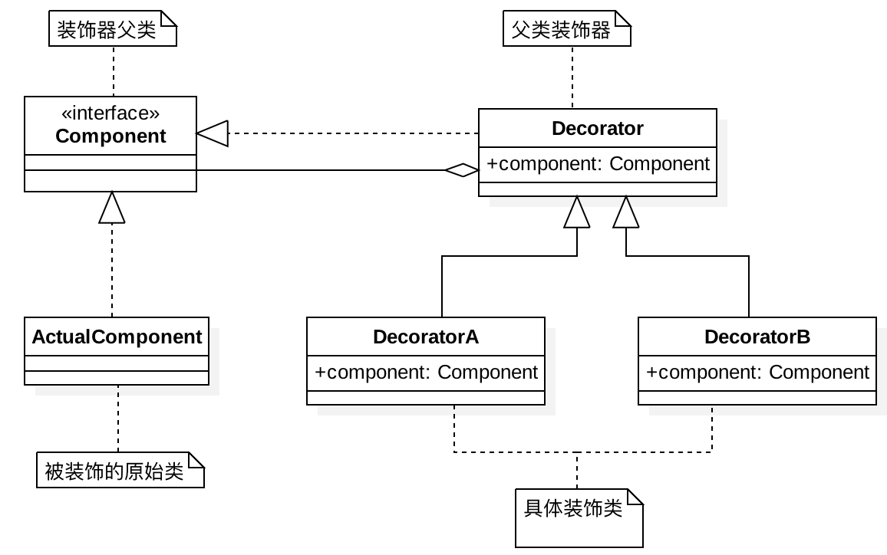

## 6、一般实现


## 7、JDK中装饰器模式

### 7.1、深入剖析 InputStream 中的装饰模式

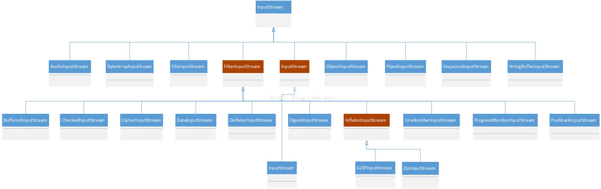

从上图可以看出

- 抽象组件：InputStream，这是一个抽象类，为各种子类型提供统一的接口；
- 具体组件：ByteArrayInputStream、FileInputStream、PipedInputStream、StringBufferInputStream(JDK8 以后过期)等，它们实现了抽象组件所规定的接口；
- 抽象装饰者：FilterInputStream，它实现了 InputStream 所规定的接口；
- 具体装饰者：BufferedInputStream、DataInputStream 以及两个不常用到的类LineNumberInputStream（JDK8 以后过期）、PushbackInputStream 等；

**注意：**

- ①、InputStream 类型中的装饰模式是半透明的；
- ②、PushbackInputStream 是一个半透明的装饰类，这个装饰类提供了额外的方法unread()，换言之，它破坏了理想的装饰模式的要求如果客户端持有一个类型为InputStream对象的引用in的话，那么如果in的真实类型是 PushbackInputStream的话，只要客户端不需要使用unread()方法，那么客户端一般没有问题.但是如果客户端必须使用这个方法，就必须进行向下类型转换.将in的类型转换成为PushbackInputStream之后才可能调用这个方法.但是，这个类型转换意味着客户端必须知道它拿到的引用是指向一个类型为 PushbackInputStream 的对象。这就破坏了使用装饰模式的原始用意；

### 7.2、深入剖析 OutputStream 中的装饰模式

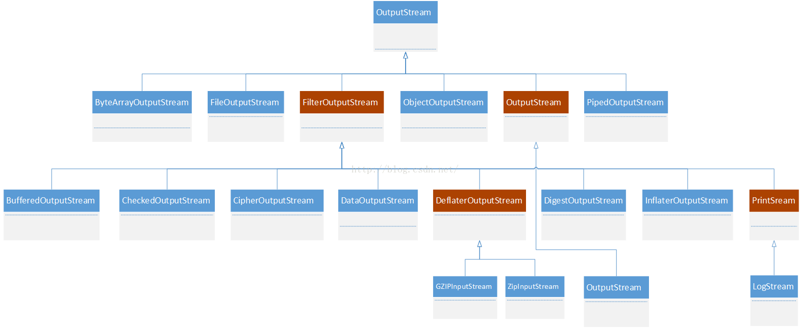

从图可以看出:
- 抽象组件：OutputStream，这是一个抽象类，为各种子类型提供统一的接口；
- 具体组件：ByteArrayOutputStream、FileOutputStream、ObjectOutputStream、PipedOutputStream等，它们实现了抽象组件所规定的接口；
- 抽象装饰者：FilterOutputStream，它实现了 OutputStream 所规定的接口；
- 具体装饰者：BufferedOutputStream、CheckedOutputStream、CipheOutputSteam、DataOutputStream 等，

### 7.3、字符输入流

- 抽象组件：Reader，这是一个抽象类，为各种子类型提供统一的接口；
- 具体组件：CharArayReader、FilterReader、InputStreamReader、PipedReader、StringReader 等，它们实现了抽象组件所规定的接口；
- 抽象装饰者：BufferedReader 、FilterReader、InputStreamReader，它实现了Reader所规定的接口；
- 具体装饰者：LineNumberReader、PushbackReader、FileReader 等；

### 7.4、字符输出流

- 抽象组件：Writer，这是一个抽象类，为各种子类型提供统一的接口；
- 具体组件：BufferedWriter、CharArrayWriter、FilterWriter、OutputStreamWriter、PipedWriter、PrintWriter、StringWriter等，它们实现了抽象组件所规定的接口；
- 抽象装饰者：OutputStreamWriter，它实现了 Writer 所规定的接口；
- 具体装饰者：FileWriter；


# 九、适配器模式

- [Adapter](https://refactoringguru.cn/design-patterns/adapter)

## 1、适配器模式

适配器模式将一个类的接口，转化成客户期望的另一个接口，适配器让原本接口不兼容的类可以并存合作。

从实现上可以分为类适配器和对象适配器，这两种的区别在于实现方式的不同：一种是采用继承，一种是采用组合的方式；

另外从使用目的上来说，也可以分为两种：特殊适配器和缺省适配器，这两种的区别在于使用目的上的不同，一种为了复用原有的代码并适配当前的接口，一种为了提供缺省的实现，避免子类需要实现不该实现的方法；

需要注意的是：适配器模式是补救措施，所以在系统设计过程中请忘掉这个设计模式，这个模式只是在你无可奈何时的补救方式

## 2、适用场景

场景通常情况下是，系统中有一套完整的类结构，而我们需要利用其中某一个类的功能（通俗点说可以说是方法），但是我们的客户端只认识另外一个和这个类结构不相关的接口，此时适配器就可以上场了，我们可以将这个现有的类与我们的目标接口进行适配，最终获得一个符合需要的接口并且包含待复用的类的功能的类
- 类适配器：一般是针对适配目标是接口的情况下使用；使用继承来实现
- 对象适配器：一般是针对适配目标是类或者是需要复用的对象多于一个的时候使用；使用组合关系来实现
- 缺省适配器：一般是为了弥补接口过大所犯下的过错；但由于JAVA语言规则的原因，实现一个接口必须实现它的全部方法，所以我们的子类不得不被迫写一堆空方法在那；这时候缺省适配器用上了；使用的时候只需要继承缺省的接口就可以

## 3、JDK与框架中使用适配器

Java 核心程序库中有一些标准的适配器：
- java.util.Arrays#asList()
- java.util.Collections#list()
- java.util.Collections#enumeration()
- java.io.InputStreamReader(InputStream) （返回 Reader对象）
- java.io.OutputStreamWriter(OutputStream) （返回 Writer对象）
- javax.xml.bind.annotation.adapters.XmlAdapter#marshal() 和 #unmarshal()

适配器可以通过以不同抽象或接口类型实例为参数的构造函数来识别。 当适配器的任何方法被调用时， 它会将参数转换为合适的格式， 然后将调用定向到其封装对象中的一个或多个方法。

Java 日志中的应用应用了适配器模式

## 4、UML类图

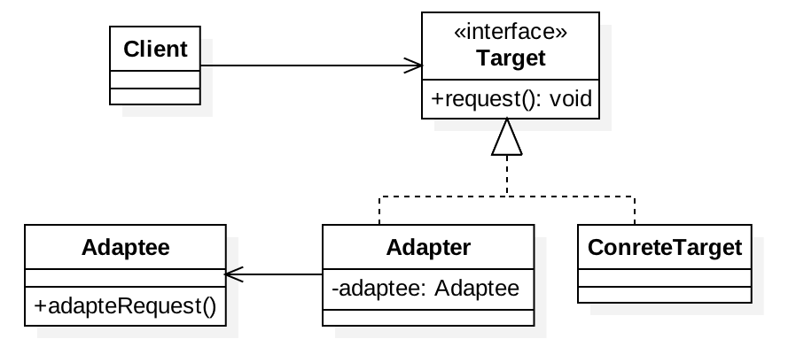

## 5、应用场景

### 5.1、封装有缺陷的接口设计

为了隔离设计上的缺陷，希望对外部系统提供的接口进行二次封装，抽象出更好的接口设计，这个时候就可以使用适配器模式了，比如：
```java
public class CD { //这个类来自外部sdk，我们无权修改它的代码
  //...
  public static void staticFunction1() { //... }
  public void uglyNamingFunction2() { //... }
  public void tooManyParamsFunction3(int paramA, int paramB, ...) { //... }
   public void lowPerformanceFunction4() { //... }
}
// 使用适配器模式进行重构
public interface ITarget {
  void function1();
  void function2();
  void fucntion3(ParamsWrapperDefinition paramsWrapper);
  void function4();
  //...
}
// 注意：适配器类的命名不一定非得末尾带Adaptor
public class CDAdaptor extends CD implements ITarget {
  //...
  public void function1() {
     super.staticFunction1();
  }
  public void function2() {
    super.uglyNamingFucntion2();
  }
  public void function3(ParamsWrapperDefinition paramsWrapper) {
     super.tooManyParamsFunction3(paramsWrapper.getParamA(), ...);
  }
  public void function4() {
    //...reimplement it...
  }
}
```

### 5.2、统一多个类的接口设计

某个功能的实现依赖多个外部系统（或者说类）。通过适配器模式，将它们的接口适配为统一的接口定义，然后就可以使用多态的特性来复用代码逻辑：
```java
public class ASensitiveWordsFilter { // A敏感词过滤系统提供的接口
  //text是原始文本，函数输出用***替换敏感词之后的文本
  public String filterSexyWords(String text) {
    // ...
  }
  public String filterPoliticalWords(String text) {
    // ...
  } 
}
public class BSensitiveWordsFilter  { // B敏感词过滤系统提供的接口
  public String filter(String text) {
    //...
  }
}
public class CSensitiveWordsFilter { // C敏感词过滤系统提供的接口
  public String filter(String text, String mask) {
    //...
  }
}
// 未使用适配器模式之前的代码：代码的可测试性、扩展性不好
public class RiskManagement {
  private ASensitiveWordsFilter aFilter = new ASensitiveWordsFilter();
  private BSensitiveWordsFilter bFilter = new BSensitiveWordsFilter();
  private CSensitiveWordsFilter cFilter = new CSensitiveWordsFilter();
  public String filterSensitiveWords(String text) {
    String maskedText = aFilter.filterSexyWords(text);
    maskedText = aFilter.filterPoliticalWords(maskedText);
    maskedText = bFilter.filter(maskedText);
    maskedText = cFilter.filter(maskedText, "***");
    return maskedText;
  }
}
// 使用适配器模式进行改造
public interface ISensitiveWordsFilter { // 统一接口定义
  String filter(String text);
}
public class ASensitiveWordsFilterAdaptor implements ISensitiveWordsFilter {
  private ASensitiveWordsFilter aFilter;
  public String filter(String text) {
    String maskedText = aFilter.filterSexyWords(text);
    maskedText = aFilter.filterPoliticalWords(maskedText);
    return maskedText;
  }
}
//...省略BSensitiveWordsFilterAdaptor、CSensitiveWordsFilterAdaptor...
// 扩展性更好，更加符合开闭原则，如果添加一个新的敏感词过滤系统，
// 这个类完全不需要改动；而且基于接口而非实现编程，代码的可测试性更好。
public class RiskManagement { 
  private List<ISensitiveWordsFilter> filters = new ArrayList<>();
 
  public void addSensitiveWordsFilter(ISensitiveWordsFilter filter) {
    filters.add(filter);
  }
  public String filterSensitiveWords(String text) {
    String maskedText = text;
    for (ISensitiveWordsFilter filter : filters) {
      maskedText = filter.filter(maskedText);
    }
    return maskedText;
  }
}
```

### 5.3、替换依赖的外部系统

当把项目中依赖的一个外部系统替换为另一个外部系统的时候，利用适配器模式，可以减少对代码的改动。具体的代码示例如下所示：
```java
// 外部系统A
public interface IA {
  //...
  void fa();
}
public class A implements IA {
  //...
  public void fa() { //... }
}
// 在我们的项目中，外部系统A的使用示例
public class Demo {
  private IA a;
  public Demo(IA a) {
    this.a = a;
  }
  //...
}
Demo d = new Demo(new A());

// 将外部系统A替换成外部系统B
public class BAdaptor implemnts IA {
  private B b;
  public BAdaptor(B b) {
    this.b= b;
  }
  public void fa() {
    //...
    b.fb();
  }
}
// 借助BAdaptor，Demo的代码中，调用IA接口的地方都无需改动，
// 只需要将BAdaptor如下注入到Demo即可。
Demo d = new Demo(new BAdaptor(new B()));
```

### 5.4、兼容老版本接口

JDK中早期集合的都实现了一个elements()方法，其会返回一个Enumeration；JDK新的集合中开始使用Iterator（迭代器），和Enumeration接口很像，但是其支持删除元素能力，为了将枚举适配到迭代器，对应的集合中有个Enumerator，其实现了两个接口，比如Hashtable中`private class Enumerator<T> implements Enumeration<T>, Iterator<T>`，因为枚举是个只读接口，适配器无法实现一个有实际功能的remove方法，只能抛出异常；

将一个枚举适配为迭代器
```java
/**
* 将一个枚举适配成迭代器
*/
public class EnumerationIteratorAdapter<T> implements Iterator<T> {
    private Enumeration<T> enumeration;
    @Override
    public boolean hasNext() {
        return enumeration.hasMoreElements();
    }
    @Override
    public T next() {
        return enumeration.nextElement();
    }
    // 这个remove方法可以不实现，因为该方法在Iterator接口中已经是默认方法了
    @Override
    public void remove() {
        throw new UnsupportedOperationException("remove");
    }
}
```
将一个迭代器适配为枚举
```java
/**
* 将一个迭代器适配为枚举
*/
public class IteratorEnumerationAdapter<T> implements Enumeration<T> {
    private Iterator<T> iterator;
    @Override
    public boolean hasMoreElements() {
        return iterator.hasNext();
    }
    @Override
    public T nextElement() {
        return iterator.next();
    }
}
```

## 6、代理、桥接、装饰器、适配器 4 种设计模式的区别

代理、桥接、装饰器、适配器，这 4 种模式是比较常用的结构型设计模式。它们的代码结构非常相似。笼统来说，它们都可以称为 Wrapper 模式，也就是通过 Wrapper 类二次封装原始类
- 代理模式：代理模式在不改变原始类接口的条件下，为原始类定义一个代理类，主要目的是控制访问，而非加强功能，这是它跟装饰器模式最大的不同。
- 桥接模式：桥接模式的目的是将接口部分和实现部分分离，从而让它们可以较为容易、也相对独立地加以改变。
- 装饰器模式：装饰者模式在不改变原始类接口的情况下，对原始类功能进行增强，并且支持多个装饰器的嵌套使用。
- 适配器模式：适配器模式是一种事后的补救策略。适配器提供跟原始类不同的接口，而代理模式、装饰器模式提供的都是跟原始类相同的接口。


# 十、外观（门面）模式

## 1、定义

又叫门面模式，提供了一个统一的接口，用来访问子系统中的一群接口；

外观模式定义了一个高层接口，让子系统更容易使用；其属于结构型设计模式。

外观是提供了更直接的操作，并未将原来的子系统阻隔起来。如果需要子系统类的更高层功能，还是可以使用原来的子系统。

其实是有点类似我们的web架构：action -> service -> dao

## 2、适用场景

子系统越来越复杂，增加外观模式提供简单调用接口；

构建多层系统结构，利用外观对象作为每层的入口，简化层间调用；

## 3、优缺点

- 优点：
    - 简化了调用过程，无需了解深入子系统，防止带来风险；
    - 减少系统依赖，松散耦合
    - 符合迪米特法则；
- 缺点：
    - 不符合开闭原则

## 4、UML类图

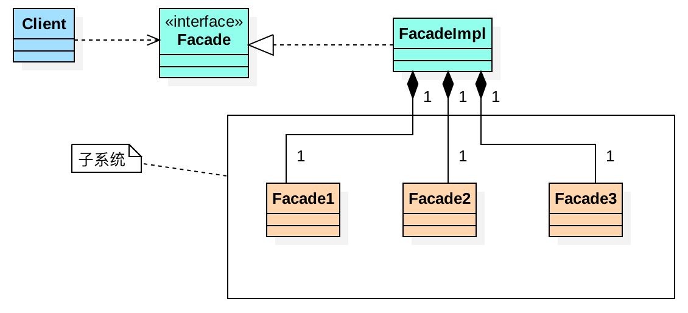

它主要由两部分组成，一部分是子系统（包括接口，实现类，等等），一部分是外观接口和实现类，外观接口负责提供客户端定制的服务，外观实现则负责组合子系统中的各个类和接口完成这些服务，外观接口则是提供给客户端使用的，这样就解除了客户端与子系统的依赖，而让客户端只依赖于外观接口，这是一个优秀的解耦实践。

以积分兑换为业务，三个流程：判断库存、积分兑换资格、运输为三个子系统，详细代码参考：[门面模式](https://github.com/chenlanqing/java-code/tree/master/java-design/java-design-pattern/src/main/java/com/blue/fish/design/pattern/structural/facade)

## 5、使用场景

- Tomcat中有大量的Facade类：RequestFacade、ResponseFacade等
- Slf4j日志框架：屏蔽了各种日志框架的差异，提供了一个统一的日志接口给用户使用

# 十一、组合模式

## 1、定义

将对象组合成树形结构以表示“部分整体”的层次结构。组合模式使得用户对单个对象和组合对象的使用具有一致性

组合模式用来表示部分与整体的层次结构（类似于树结构），而且也可以使用户对单个对象（叶子节点）以及组合对象（非叶子节点）的使用具有一致性，一致性的意思就是说，这些对象都拥有相同的接口

常见的场景有：公司、子公司以及部门；书的目录、文件系统、网站的菜单等，都是数结构

组合模式，将一组对象组织成树形结构，将单个对象和组合对象都看做树中的节点，以统一处理逻辑，并且它利用树形结构的特点，递归地处理每个子树，依次简化代码实现。使用组合模式的前提在于，你的业务场景必须能够表示成树形结构

## 2、适用场景

- 如果你想表示“部分整体”的层次结构，可以使用组合模式；
- 如果你想让客户端可以忽略复杂的层次结构，使用统一的方式去操作层次结构中的所有对象，也可以使用组合模式

## 3、UML类图

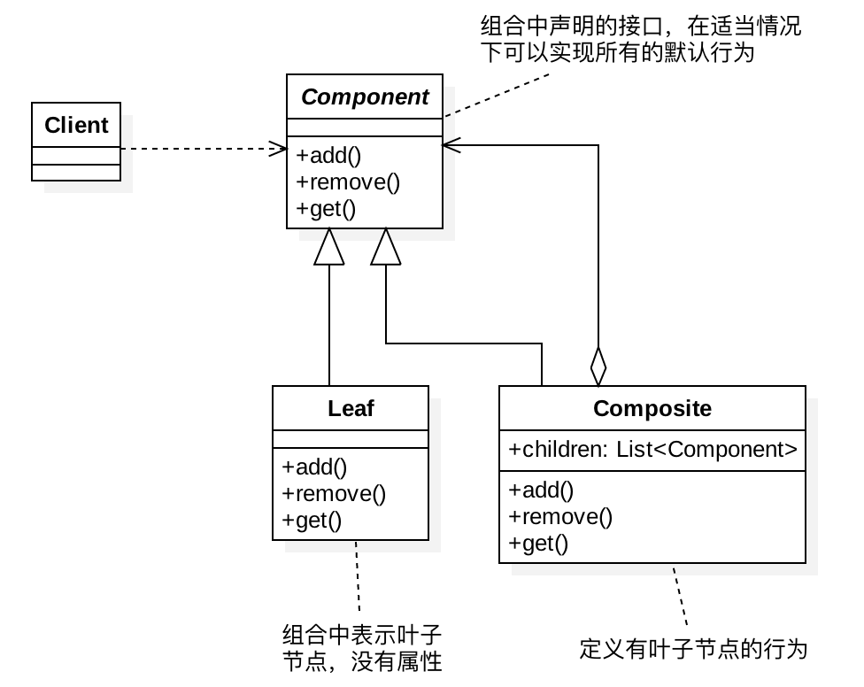

## 4、优缺点

- 优点：
    - 使客户端调用简单，它可以一致使用组合结构或是其中单个对象，简化了客户端代码；
    - 容易在组合体内增加对象部件。客户端不必因加入了新的部件而更改代码。有利于功能的扩展；
- 缺点：
    - 需要抉择使用透明方式还是安全方式；
    - 透明方式违背了面向对象的单一职责原则；安全方式增加了客户需要端判定的负担

## 5、示例

希望在内存中构建整个公司的人员架构图（部门、子部门、员工的隶属关系），并且提供接口计算出部门的薪资成本（隶属于这个部门的所有员工的薪资和）；

部门包含子部门和员工，这是一种嵌套结构，可以表示成树这种数据结构。计算每个部门的薪资开支这样一个需求，也可以通过在树上的遍历算法来实现。所以，从这个角度来看，这个应用场景可以使用组合模式来设计和实现：
```java
public abstract class HumanResource {
  protected long id;
  protected double salary;
  public HumanResource(long id) {
    this.id = id;
  }
  public long getId() {
    return id;
  }
  public abstract double calculateSalary();
}
public class Employee extends HumanResource {
  public Employee(long id, double salary) {
    super(id);
    this.salary = salary;
  }
  @Override
  public double calculateSalary() {
    return salary;
  }
}
public class Department extends HumanResource {
  private List<HumanResource> subNodes = new ArrayList<>();
  public Department(long id) {
    super(id);
  }
  @Override
  public double calculateSalary() {
    double totalSalary = 0;
    for (HumanResource hr : subNodes) {
      totalSalary += hr.calculateSalary();
    }
    this.salary = totalSalary;
    return totalSalary;
  }
  public void addSubNode(HumanResource hr) {
    subNodes.add(hr);
  }
}
// 构建组织架构的代码
public class Demo {
  private static final long ORGANIZATION_ROOT_ID = 1001;
  private DepartmentRepo departmentRepo; // 依赖注入
  private EmployeeRepo employeeRepo; // 依赖注入
  public void buildOrganization() {
    Department rootDepartment = new Department(ORGANIZATION_ROOT_ID);
    buildOrganization(rootDepartment);
  }
  private void buildOrganization(Department department) {
    List<Long> subDepartmentIds = departmentRepo.getSubDepartmentIds(department.getId());
    for (Long subDepartmentId : subDepartmentIds) {
      Department subDepartment = new Department(subDepartmentId);
      department.addSubNode(subDepartment);
      buildOrganization(subDepartment);
    }
    List<Long> employeeIds = employeeRepo.getDepartmentEmployeeIds(department.getId());
    for (Long employeeId : employeeIds) {
      double salary = employeeRepo.getEmployeeSalary(employeeId);
      department.addSubNode(new Employee(employeeId, salary));
    }
  }
}
```

# 十二、享元模式

## 1、定义

所谓“享元”，顾名思义就是被共享的单元。享元模式的意图是复用对象，节省内存，前提是享元对象是不可变对象。

具体来讲，当一个系统中存在大量重复对象的时候，如果这些重复的对象是不可变对象，就可以利用享元模式将对象设计成享元，在内存中只保留一份实例，供多处代码引用。这样可以减少内存中对象的数量，起到节省内存的目的；之所以要求享元是不可变对象，那是因为它会被多处代码共享使用，避免一处代码对享元进行了修改，影响到其他使用它的代码。

## 2、适用场景

当对象数量太多时，将导致对象创建及垃圾回收的代价过高，造成性能下降等问题。享元模式通过共享相同或者相似的细粒度对象解决了这一类问题；

## 3、状态

- 内部状态：是存储在享元对象内部，一般在构造时确定或通过setter设置，并且不会随环境改变而改变的状态，因此内部状态可以共享；
- 外部状态：是随环境改变而改变、不可以共享的状态。外部状态在需要使用时通过客户端传入享元对象。外部状态必须由客户端保存

## 4、UML类图

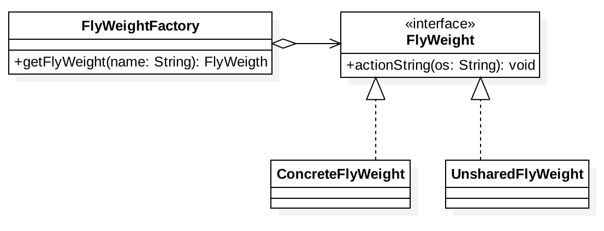

- FlyWeight：享元接口或者（抽象享元类），定义共享接口
- ConcreteFlyWeight：具体享元类，该类实例将实现共享
- UnSharedConcreteFlyWeight：非共享享元实现类
- FlyWeightFactory：享元工厂类，控制实例的创建和共享

## 5、优缺点

- 优点：
    - 享元模式的外部状态相对独立，使得对象可以在不同的环境中被复用（共享对象可以适应不同的外部环境）
    - 享元模式可共享相同或相似的细粒度对象，从而减少了内存消耗，同时降低了对象创建与垃圾回收的开销

- 缺点：
    - 外部状态由客户端保存，共享对象读取外部状态的开销可能比较大
    - 享元模式要求将内部状态与外部状态分离，这使得程序的逻辑复杂化，同时也增加了状态维护成本

## 6、JDK使用场景

- Integer中的IntegerCache
- String、Long 等内部都使用了享元模式

## 7、对比

**享元模式跟单例的区别：**

在单例模式中，一个类只能创建一个对象，而在享元模式中，一个类可以创建多个对象，每个对象被多处代码引用共享。实际上，享元模式有点类似于单例的变体：多例；

**享元模式跟对象池的区别：**

对象池、连接池（比如数据库连接池）、线程池等也是为了复用；池化技术中的“复用”可以理解为“重复使用”，主要目的是节省时间（比如从数据库池中取一个连接，不需要重新创建）。在任意时刻，每一个对象、连接、线程，并不会被多处使用，而是被一个使用者独占，当使用完成之后，放回到池中，再由其他使用者重复利用。享元模式中的“复用”可以理解为“共享使用”，在整个生命周期中，都是被所有使用者共享的，主要目的是节省空间

## 8、代码示例

它的代码实现非常简单，主要是通过工厂模式，在工厂类中，通过一个 Map 来缓存已经创建过的享元对象，来达到复用的目的：
```java
public class CharacterStyle {
  private Font font;
  private int size;
  private int colorRGB;
  public CharacterStyle(Font font, int size, int colorRGB) {
    this.font = font;
    this.size = size;
    this.colorRGB = colorRGB;
  }
  @Override
  public boolean equals(Object o) {
    CharacterStyle otherStyle = (CharacterStyle) o;
    return font.equals(otherStyle.font)
            && size == otherStyle.size
            && colorRGB == otherStyle.colorRGB;
  }
}
public class CharacterStyleFactory {
  private static final List<CharacterStyle> styles = new ArrayList<>();
  public static CharacterStyle getStyle(Font font, int size, int colorRGB) {
    CharacterStyle newStyle = new CharacterStyle(font, size, colorRGB);
    for (CharacterStyle style : styles) {
      if (style.equals(newStyle)) {
        return style;
      }
    }
    styles.add(newStyle);
    return newStyle;
  }
}
public class Character {
  private char c;
  private CharacterStyle style;

  public Character(char c, CharacterStyle style) {
    this.c = c;
    this.style = style;
  }
}
public class Editor {
  private List<Character> chars = new ArrayList<>();

  public void appendCharacter(char c, Font font, int size, int colorRGB) {
    Character character = new Character(c, CharacterStyleFactory.getStyle(font, size, colorRGB));
    chars.add(character);
  }
}
```

# 十三、观察者模式

## 1、基本概念

观察者模式：有时又被称为发布-订阅模式、模型-视图模式、源-收听者模式或从属者模式，是软件设计模式的一种；在此种模式中，一个目标物件管理所有相依于它的观察者物件，并且在它本身的状态改变时主动发出通知。这通常透过呼叫各观察者所提供的方法来实现。此种模式通常被用来实作事件处理系统；

简而言之：就是一个类管理着所有依赖于它的观察者类，并且它状态变化时会主动给这些依赖它的类发出通知；被依赖的对象叫作被观察者（Observable），依赖的对象叫作观察者（Observer）

## 2、观察者模式类图

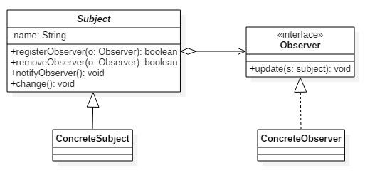

- Subject：被观察者，定义被观察者必须实现的职责，能够动态取消或者添加观察者；一般是抽象类或者具体实现类，仅仅完成作为被观察者必须实现的职责：管理观察者并通知观察者；
- Observer：观察者，即进行update操作，对接收到的信息进行处理；
- ConcreteSubject：具体被观察者，具体的观察者定义被观察者的自己的业务逻辑，同时定义对哪些事件进行通知；
- ConcreteObserver：具体观察者，不同观察者有不同的处理逻辑

## 3、基础模板代码

```java
public interface Subject {
  void registerObserver(Observer observer);
  void removeObserver(Observer observer);
  void notifyObservers(Message message);
}
public interface Observer {
  void update(Message message);
}
public class ConcreteSubject implements Subject {
  private List<Observer> observers = new ArrayList<Observer>();
  @Override
  public void registerObserver(Observer observer) {
    observers.add(observer);
  }
  @Override
  public void removeObserver(Observer observer) {
    observers.remove(observer);
  }
  @Override
  public void notifyObservers(Message message) {
    for (Observer observer : observers) {
      observer.update(message);
    }
  }
}
public class ConcreteObserverOne implements Observer {
  @Override
  public void update(Message message) {
    //TODO: 获取消息通知，执行自己的逻辑...
    System.out.println("ConcreteObserverOne is notified.");
  }
}
public class ConcreteObserverTwo implements Observer {
  @Override
  public void update(Message message) {
    //TODO: 获取消息通知，执行自己的逻辑...
    System.out.println("ConcreteObserverTwo is notified.");
  }
}
public class Demo {
  public static void main(String[] args) {
    ConcreteSubject subject = new ConcreteSubject();
    subject.registerObserver(new ConcreteObserverOne());
    subject.registerObserver(new ConcreteObserverTwo());
    subject.notifyObservers(new Message());
  }
}
```

## 4、事件

EventBus，事件总线，它提供了实现观察者模式的骨架代码，Google Guava EventBus 就是一个比较著名的 EventBus 框架，它不仅仅支持异步非阻塞模式，同时也支持同步阻塞模式；

基础示例：
```java
// Google Guava EventBus 示例
public class UserController {
  private UserService userService; // 依赖注入
  private EventBus eventBus; // Guava EventBus 对外暴露的所有可调用接口，都封装在 EventBus 类中,EventBus 实现了同步阻塞的观察者模式，AsyncEventBus 继承自 EventBus，提供了异步非阻塞的观察者模式
  private static final int DEFAULT_EVENTBUS_THREAD_POOL_SIZE = 20;

  public UserController() {
    //eventBus = new EventBus(); // 同步阻塞模式
    eventBus = new AsyncEventBus(Executors.newFixedThreadPool(DEFAULT_EVENTBUS_THREAD_POOL_SIZE)); // 异步非阻塞模式
  }
  public void setRegObservers(List<Object> observers) {
    for (Object observer : observers) {
      eventBus.register(observer); // 用来注册观察者;
    }
  }
  public Long register(String telephone, String password) {
    //省略输入参数的校验代码
    //省略userService.register()异常的try-catch代码
    long userId = userService.register(telephone, password);

    eventBus.post(userId); // 用来给观察者发送消息

    return userId;
  }
}
public class RegPromotionObserver {
  private PromotionService promotionService; // 依赖注入
  @Subscribe
  public void handleRegSuccess(Long userId) {
    promotionService.issueNewUserExperienceCash(userId);
  }
}
public class RegNotificationObserver {
  private NotificationService notificationService;

  @Subscribe
  public void handleRegSuccess(Long userId) {
    notificationService.sendInboxMessage(userId, "...");
  }
}
```

## 5、优缺点

### 5.1、优点

- 抽象主题只依赖于抽象观察者
- 观察者模式支持广播通信
- 观察者模式使信息产生层和响应层分离

### 5.2、缺点

- 如一个主题被大量观察者注册，则通知所有观察者会花费较高代价
- 如果某些观察者的响应方法被阻塞，整个通知过程即被阻塞，其它观察者不能及时被通知
- 每一个观察者都要实现观察者接口，才能添加到被观察者的列表当中，假设一个观察者已经存在，而且我们无法改变其代码，那么就无法让它成为一个观察者了；
- 如果在观察者和观察目标之间有循环依赖的话，观察目标会触发它们之间进行循环调用，可能导致系统崩溃；即广播链问题，一个观察者既可以是观察者也可以是被观察者

## 6、应用场景

观察者模式的应用场景非常广泛，小到代码层面的解耦，大到架构层面的系统解耦，再或者一些产品的设计思路，都有这种模式的影子，比如，邮件订阅、RSS Feeds，本质上都是观察者模式。

不同的应用场景和需求下，这个模式也有截然不同的实现方式，有同步阻塞的实现方式，也有异步非阻塞的实现方式；有进程内的实现方式，也有跨进程的实现方式；

同步阻塞是最经典的实现方式，主要是为了代码解耦；异步非阻塞除了能实现代码解耦之外，还能提高代码的执行效率；


# 十四、模板模式

## 1、定义

定义一个操作中的算法的骨架，而将步骤延迟到子类中。模板方法使得子类可以不改变一个算法的结构即可重定义算法的某些特定步骤；
- 抽象类：实现了模板方法，定义了算法的骨架；
- 具体类：实现抽象类中的抽象方法，以完成完整的算法。

主要作用是：复用和扩展；

## 2、适用场景

- 在某些类的算法中，用了相同的方法，造成代码的重复；
- 控制子类扩展，子类必须遵守算法规则；

比如：员工入职到一家公司，刚入职的时候需要走入职流程，一般都有固定的流程，但是其中有些流程员工可以选择忽略，比如调档案、迁户口等员工可以选择的流程；

## 3、优缺点

- 优点：
    - 模板方法模式通过把不变的行为搬移到超类，去除了子类中的重复代码
    - 子类实现算法的某些细节，有助于算法的扩展；
    - 通过一个父类调用子类实现的操作，通过子类扩展增加新的行为，符合“开放-封闭原则”；
- 缺点：每个不同的实现都需要定义一个子类，这会导致类的个数的增加，设计更加抽象

## 4、UML类图

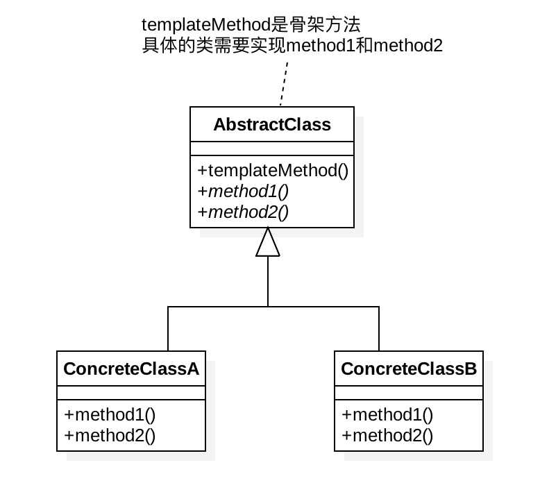

## 5、使用场景

- JDK中的集合，比如AbstractList、AbstractSet、AbstractMap；
- JDK中的：AbstractQueuedSynchronizer，其模板方式实现有些特殊，没有抽象类存在，取而代之的是需要子类去实现那些方法通过一个方法体;
- JDK中类加载过程，ClassLoader类就使用了模板模式，去保证类加载过程中的唯一性，类加载过程如下：
    - 首先看是否有已经加载好的类。
    - 如果父类加载器不为空，则首先从父类类加载器加载。
    - 如果父类加载器为空，则尝试从启动加载器加载。
    - 如果两者都失败，才尝试从findClass方法加载。

## 6、回调

**什么是回调？**

A 类事先注册某个函数 F 到 B 类，A 类在调用 B 类的 P 函数的时候，B 类反过来调用 A 类注册给它的 F 函数。这里的 F 函数就是“回调函数”。A 调用 B，B 反过来又调用 A，这种调用机制就叫作“回调”

回调可以细分为同步回调和异步回调。从应用场景上来看，同步回调看起来更像模板模式，异步回调看起来更像观察者模式。回调跟模板模式的区别，更多的是在代码实现上，而非应用场景上。回调基于组合关系来实现，模板模式基于继承关系来实现，回调比模板模式更加灵活

**回调的应用场景：**
- JdbcTemplate、RedisTemplate、RestTemplate 等都是基于同步回调的方式实现的；
- addShutdownHook()： Callback 更侧重语法机制的描述，Hook 更加侧重应用场景的描述

**模板模式与回调：**
- **从应用场景上来看**
    - 同步回调跟模板模式几乎一致。它们都是在一个大的算法骨架中，自由替换其中的某个步骤，起到代码复用和扩展的目的。而异步回调跟模板模式有较大差别，更像是观察者模式。

- **从代码实现上来看**
    - 回调和模板模式完全不同。回调基于组合关系来实现，把一个对象传递给另一个对象，是一种对象之间的关系；模板模式基于继承关系来实现，子类重写父类的抽象方法，是一种类之间的关系。

# 十五、策略模式

## 1、定义

它定义了算法家族，分别封装起来，让它们之间可以互相替换，此模式让算法的变化不会影响到使用算法的客户端

策略类的定义比较简单，包含一个策略接口和一组实现这个接口的策略类：
- 策略类：定义所有支持的算法的公共接口
- 具体策略类：封装了具体的算法或行为，继承于Stratege类；
- 上下文类：可以使用工厂方法模式维护一个对Stratege对象的引用；

## 2、适用场景

- 当实现某个功能需要有不同算法要求时；
- 不同时间应用不同的业务规则时

一句话：当代码中使用了大量的if...else语句时，可以考虑使用策略模式

## 3、优缺点

- 优点：
    - 策略模式是一种定义一系列算法的方法，从概念上来看，所有算法完成的都是相同的工作，只是实现不同，它可以以相同的方式调用所有的算法，减少了各种算法类与使用算法类之间的耦合；
    - 策略模式的Strategy类为Context定义了一系列的可供重用的算法或行为。继承有助于析取出这些算法的公共功能；
    - 策略模式每个算法都有自己的类，可以通过自己的接口单独测试。因而简化了单元测试；
    - 策略模式将具体算法或行为封装到Strategy类中，可以在使用这些类中消除条件分支（避免了不同行为堆砌到一个类中）；
- 缺点：
    - 将选择具体策略的职责交给了客户端，并转给Context对象

## 4、UML类图

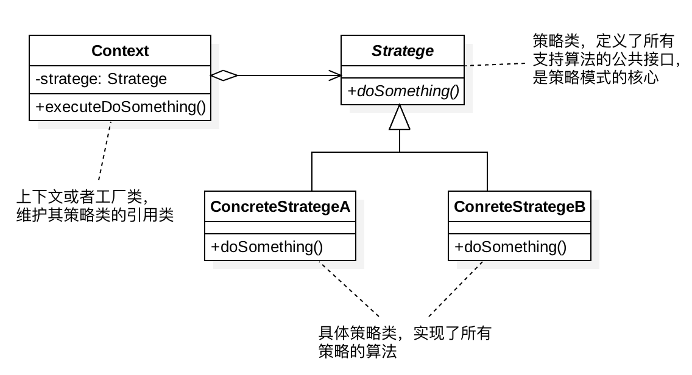

## 5、基本实现

（1）定义策略
```java
public interface Strategy {
    void algorithmInterface();
}
public class ConcreteStrategyA implements Strategy {
    @Override
    public void  algorithmInterface() {
        //具体的算法...
    }
}
public class ConcreteStrategyB implements Strategy {
    @Override
    public void  algorithmInterface() {
        //具体的算法...
    }
}
```
（2）策略的创建
```java
public class StrategyFactory {
    private static final Map<String, Strategy> strategies = new HashMap<>();
    static {
        strategies.put("A", new ConcreteStrategyA());
        strategies.put("B", new ConcreteStrategyB());
    }
    public static Strategy getStrategy(String type) {
        if (type == null || type.isEmpty()) {
            throw new IllegalArgumentException("type should not be empty.");
        }
        return strategies.get(type);
    }
}
```
一般来讲，如果策略类是无状态的，不包含成员变量，只是纯粹的算法实现，这样的策略对象是可以被共享使用的，不需要在每次调用 getStrategy() 的时候，都创建一个新的策略对象。针对这种情况，可以使用上面这种工厂类的实现方式，事先创建好每个策略对象，缓存到工厂类中，用的时候直接返回；

如果策略类是有状态的，根据业务场景的需要，我们希望每次从工厂方法中，获得的都是新创建的策略对象：
```java
public class StrategyFactory {
    public static Strategy getStrategy(String type) {
        if (type == null || type.isEmpty()) {
            throw new IllegalArgumentException("type should not be empty.");
        }

        if (type.equals("A")) {
            return new ConcreteStrategyA();
        } else if (type.equals("B")) {
            return new ConcreteStrategyB();
        }
        return null;
    }
}
```

## 6、模板模式与策略模式

- 当一个操作的流程较为复杂，可分为多个步骤，且对于不同的操作实现类，流程步骤相同，只有部分特定步骤才需要自定义，此时可以考虑使用模板模式。
- 如果一个操作不复杂（即只有一个步骤），或者不存在相同的流程，那么应该使用策略模式。

从这也可看出模板模式和策略模式的区别：策略模式关注的是多种策略（广度），而模板模式只关注同种策略（相同流程），但是具备多个步骤，且特定步骤可自定义（深度）

# 十六、责任链模式

- [使用框架实现责任链模式](https://developer.aliyun.com/article/1036712)
- [Auto-pipeline](https://github.com/foldright/auto-pipeline)
- [Apache-commons-chain](https://github.com/apache/commons-chain)
- [StepChain](https://github.com/zengfr/stepchain)
- [chain-of-responsibility](https://refactoringguru.cn/design-patterns/chain-of-responsibility)

## 1、定义

通过把请求从一个对象传递到链条中下一个对象的方式来解除对象之间的耦合，直到请求被处理完毕。链中的对象是同一接口或抽象类的不同实现。

任务代码较为复杂，需要拆分为多个子步骤时，尤其是后续可能在任意位置添加新的子步骤、删除旧的子步骤、交换子步骤顺序，可以考虑使用责任链模式；

## 2、适用场景

- 当程序需要使用不同方式处理不同种类请求， 而且请求类型和顺序预先未知时， 可以使用责任链模式。 该模式能将多个处理者连接成一条链。 接收到请求后， 它会 “询问” 每个处理者是否能够对其进行处理。 这样所有处理者都有机会来处理请求；
- 当必须按顺序执行多个处理者时， 可以使用该模式：无论你以何种顺序将处理者连接成一条链， 所有请求都会严格按照顺序通过链上的处理者；
- 如果所需处理者及其顺序必须在运行时进行改变， 可以使用责任链模式： 如果在处理者类中有对引用成员变量的设定方法， 你将能动态地插入和移除处理者， 或者改变其顺序

## 3、实际应用

责任链模式常用在框架开发中，用来实现框架的过滤器、拦截器功能，让框架的使用者在不需要修改框架源码的情况下，添加新的过滤拦截功能。这也体现了之前讲到的对扩展开放、对修改关闭的设计原则。
- Servlet中的Filter，FilterChain，我们实现的Filter就是责任，FilterChain是一个链条（ApplicationFilterChain）
- SpringMVC 过滤器：Interceptor（ HandlerExecutionChain ）
- Spring Security 使用责任链模式，可以动态地添加或删除责任（处理 request 请求）
- Spring AOP 通过责任链模式来管理 Advisor
- Dubbo Filter 过滤器链也是用了责任链模式（链表），可以对方法调用做一些过滤处理，譬如超时(TimeoutFilter)，异常(ExceptionFilter)，Token(TokenFilter)等；
- Mybatis 中的 Plugin 机制使用了责任链模式，配置各种官方或者自定义的 Plugin，与 Filter 类似，可以在执行 Sql 语句的时候做一些操作；
- Netty 中的 Pipeline和ChannelHandler通过责任链设计模式来组织代码逻辑

## 4、UML类图

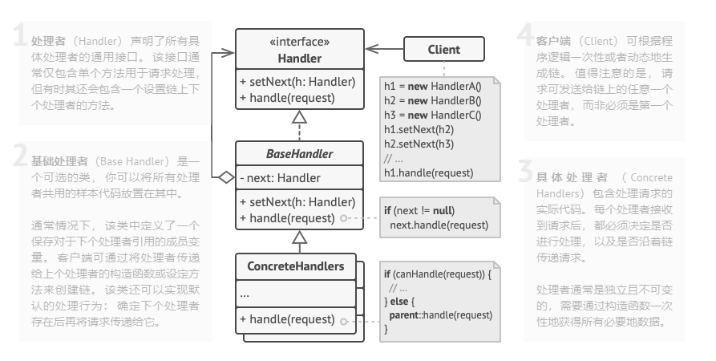

## 5、注意事项

可以控制请求处理的顺序，但是部分请求可能未被处理；

## 6、责任链实现

基本实现
```java
public interface IHandler {
  boolean handle();
}
public class HandlerA implements IHandler {
  @Override
  public boolean handle() {
    boolean handled = false;
    //...
    return handled;
  }
}
public class HandlerB implements IHandler {
  @Override
  public boolean handle() {
    boolean handled = false;
    //...
    return handled;
  }
}

public class HandlerChain {
  private List<IHandler> handlers = new ArrayList<>();

  public void addHandler(IHandler handler) {
    this.handlers.add(handler);
  }

  public void handle() {
    for (IHandler handler : handlers) {
      boolean handled = handler.handle();
      if (handled) {
        break;
      }
    }
  }
}

// 使用举例
public class Application {
  public static void main(String[] args) {
    HandlerChain chain = new HandlerChain();
    chain.addHandler(new HandlerA());
    chain.addHandler(new HandlerB());
    chain.handle();
  }
}
```

## 7、Spring Gateway

可以研究下 spring gateway 中关于 GlobalFilter 等的实现

# 十七、状态模式

- [状态模式](https://refactoringguru.cn/design-patterns/state)
- [重学设计模式-状态模式](https://bugstack.cn/md/develop/design-pattern/2020-07-02-重学%20Java%20设计模式《实战状态模式》.html)
- [spring statemachine](https://github.com/spring-projects/spring-statemachine)

## 1、定义

状态模式是一种行为设计模式，让你能在一个对象的内部状态变化时改变其行为，使其看上去就像改变了自身所属的类一样；

状态模式通过将事件触发的状态转移和动作执行，拆分到不同的状态类中，来避免分支判断逻辑

状态模式一般用来实现状态机，而状态机常用在游戏、工作流引擎等系统开发中

状态模式是状态机的一种实现方式即可。状态机又叫有限状态机，它有 3 个部分组成：状态、事件、动作。其中，事件也称为转移条件。事件触发状态的转移及动作的执行。不过，动作不是必须的，也可能只转移状态，不执行任何动作。

## 2、适用场景

- 如果对象需要根据自身当前状态进行不同行为，同时状态的数量非常多且与状态相关的代码会频繁变更的话，可使用状态模式；
- 如果某个类需要根据成员变量的当前值改变自身行为，从而需要使用大量的条件语句时，可使用该模式；
- 当相似状态和基于条件的状态机转换中存在许多重复代码时，可使用状态模式

在 Java 语言中， 状态模式通常被用于将基于 switch语句的大型状态机转换为对象。

## 3、实现方式

针对状态机，主要有三种实现方式：
- 分支逻辑法：利用 if-else 或者 switch-case 分支逻辑，参照状态转移图，将每一个状态转移原模原样地直译成代码。对于简单的状态机来说，这种实现方式最简单、最直接，是首选；
- 查表法：对于状态很多、状态转移比较复杂的状态机来说，查表法比较合适。通过二维数组来表示状态转移图，能极大地提高代码的可读性和可维护性；
- 状态模式：对于状态并不多、状态转移也比较简单，但事件触发执行的动作包含的业务逻辑可能比较复杂的状态机来说，首选这种实现方式


状态模式如何实现：
- 确定哪些类是上下文；
- 声明状态接口；
- 为每个实际状态创建一个继承于状态接口的类，然后检查上下文中的方法并将与特定状态相关的所有代码抽取到新建的类中；
- 在上下文类中添加一个状态接口类型的引用成员变量， 以及一个用于修改该成员变量值的公有设置器；
- 再次检查上下文中的方法， 将空的条件语句替换为相应的状态对象方法。

**状态：**
```java
@Getter
public enum Status {
    // 1创建编辑、2待审核、3审核通过(任务扫描成活动中)、4审核拒绝(可以撤审到编辑状态)、5活动中、6活动关闭、7活动开启(任务扫描成活动中)
    Editing(1, "editingState", "创建编辑"),
    Check(2, "checkState", "待审核"),
    Pass(3, "passState", "审核通过(任务扫描成活动中)"),
    Refuse(4, "refuseState","审核拒绝(可以撤审到编辑状态)"),
    Doing(5, "doingState","活动中"),
    Close(6, "closeState","活动关闭"),
    Open(7, "openState","活动开启(任务扫描成活动中)"),

    private final int code;
    private final String beanName;
    private final String desc;
    private Status(int code, String beanName, String desc) {
        this.code = code;
        this.beanName = beanName;
        this.desc = desc;
    }
}
```
**状态上下文**
```java
public abstract class State {
    // 活动提审
    public abstract String arraignment(String activityId, Enum<Status> currentStatus);
    // 审核通过
    public abstract String checkPass(String activityId, Enum<Status> currentStatus);
    // 审核拒绝
    public abstract String checkRefuse(String activityId, Enum<Status> currentStatus);
    // 撤审撤销
    public abstract String checkRevoke(String activityId, Enum<Status> currentStatus);
    // 活动关闭
    public abstract String close(String activityId, Enum<Status> currentStatus);
    // 活动开启
    public abstract String open(String activityId, Enum<Status> currentStatus);
    // 活动执行
    public abstract String doing(String activityId, Enum<Status> currentStatus);
}
```
**具体状态上下文**
```java
@Service("checkState") // 活动状态；待审核
public class CheckState extends State {
    public String arraignment(String activityId, Enum<Status> currentStatus) {
        return "待审核状态不可重复提审";
    }
    public String checkPass(String activityId, Enum<Status> currentStatus) {
        return "活动审核通过完成";
    }
    public String checkRefuse(String activityId, Enum<Status> currentStatus) {
        return "活动审核拒绝完成";
    }
    public String checkRevoke(String activityId, Enum<Status> currentStatus) {
        return "活动审核撤销回到编辑中";
    }
    public String close(String activityId, Enum<Status> currentStatus) {
        return "活动审核关闭完成";
    }
    public String open(String activityId, Enum<Status> currentStatus) {
        return "非关闭活动不可开启";
    }
    public String doing(String activityId, Enum<Status> currentStatus) {
        return "待审核活动不可执行活动中变更";
    }
}
```
更多具体状态上下文参考diamante：[itstack-demo-design](https://github.com/fuzhengwei/itstack-demo-design/blob/master/itstack-demo-design-19-02/src/main/java/org/itstack/demo/design/StateHandler.java)

**上下文：维护各个状态**
```java
@Component
public class StateHandler {
    @Resource
    private Map<String, State> statusMap;
    private final Map<Enum<Status>, State> stateMap = new ConcurrentHashMap<Enum<Status>, State>();
    @PostConstruct
    public void init() {
        stateMap.put(Status.Check, statusMap.get(Status.Check.getBeanName()));     // 待审核
        stateMap.put(Status.Close, statusMap.get(Status.Close.getBeanName()));     // 已关闭
        stateMap.put(Status.Doing, statusMap.get(Status.Doing.getBeanName()));     // 活动中
        stateMap.put(Status.Editing, statusMap.get(Status.Editing.getBeanName())); // 编辑中
        stateMap.put(Status.Open, statusMap.get(Status.Open.getBeanName()));      // 已开启
        stateMap.put(Status.Pass, statusMap.get(Status.Pass.getBeanName()));       // 审核通过
        stateMap.put(Status.Refuse, statusMap.get(Status.Refuse.getBeanName()));   // 审核拒绝
    }
    public String arraignment(String activityId, Enum<Status> currentStatus) { // currentStatus 表示当前状态
        return stateMap.get(currentStatus).arraignment(activityId, currentStatus);
    }
    public String checkPass(String activityId, Enum<Status> currentStatus) {
        return stateMap.get(currentStatus).checkPass(activityId, currentStatus);
    }
    public String checkRefuse(String activityId, Enum<Status> currentStatus) {
        return stateMap.get(currentStatus).checkRefuse(activityId, currentStatus);
    }
    public String checkRevoke(String activityId, Enum<Status> currentStatus) {
        return stateMap.get(currentStatus).checkRevoke(activityId, currentStatus);
    }
    public String close(String activityId, Enum<Status> currentStatus) {
        return stateMap.get(currentStatus).close(activityId, currentStatus);
    }
    public String open(String activityId, Enum<Status> currentStatus) {
        return stateMap.get(currentStatus).open(activityId, currentStatus);
    }
    public String doing(String activityId, Enum<Status> currentStatus) {
        return stateMap.get(currentStatus).doing(activityId, currentStatus);
    }
}
```
**使用**
```java
@RestController
@RequestMapping("/activity")
public class ActivityController {
    @Resource
    private StateHandler stateHandler;
    // 审核通过
    @RequestMapping("/approval")
    public String approval(@RequestParam Integer activityId) {
        return stateHandler.checkPass(activityId.toString(), Status.Check);
    }
}
```

## 4、UML类图

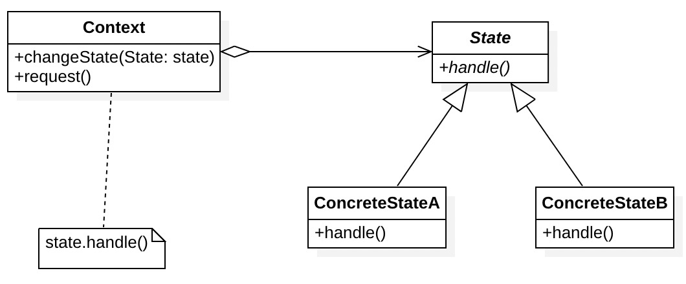

## 5、注意事项

**与策略模式对比:** 
- 这个模式看上去与策略模式相似，但有一个关键性的不同——在状态模式中，特定状态知道其他所有状态的存在，且能触发从一个状态到另一个状态的转换；策略则几乎完全不知道其他策略的存在；
- 状态可被视为策略的扩展：两者都基于组合机制，它们都通过将部分工作委派给 “帮手” 对象来改变其在不同情景下的行为。策略使得这些对象相互之间完全独立，它们不知道其他对象的存在。但状态模式没有限制具体状态之间的依赖，且允许它们自行改变在不同情景下的状态；


# 十八、迭代器模式


# 参考资料

* [JDK中设计模式](https://juejin.im/post/5cd842d56fb9a0323070efc0)
* [设计模式大杂烩](http://www.cnblogs.com/zuoxiaolong/p/pattern26.html)
* [Java设计模式](http://www.jasongj.com/design_pattern/summary/)
* [设计模式](http://www.cnblogs.com/wangjq/category/389973.html)
* [设计模式的应用](https://www.itcodemonkey.com/article/14407.html)
* [单例模式的七种写法](http://www.hollischuang.com/archives/205)
* [实现牛逼的单例模式](http://www.cnblogs.com/rjzheng/p/8946889.html)
* [单例与序列化](http://www.hollischuang.com/archives/1144)
* [单例模式与垃圾回收](http://blog.csdn.net/zhengzhb/article/details/7331354)
* [简单工厂模式](http://www.jasongj.com/design_pattern/simple_factory/)
* [简单工厂模式详解](http://www.cnblogs.com/zuoxiaolong/p/pattern4.html)
* [观察者模式](http://www.cnblogs.com/zuoxiaolong/p/pattern7.html)
* [观察者模式](http://www.jasongj.com/design_pattern/observer/)
* [观察者模式](https://www.cnblogs.com/wangjq/archive/2012/07/12/2587966.html)
* [策略模式](http://www.cnblogs.com/zuoxiaolong/p/pattern8.html)
* [设计模式在营销系统中的实践](https://tech.meituan.com/2020/03/19/design-pattern-practice-in-marketing.html)
