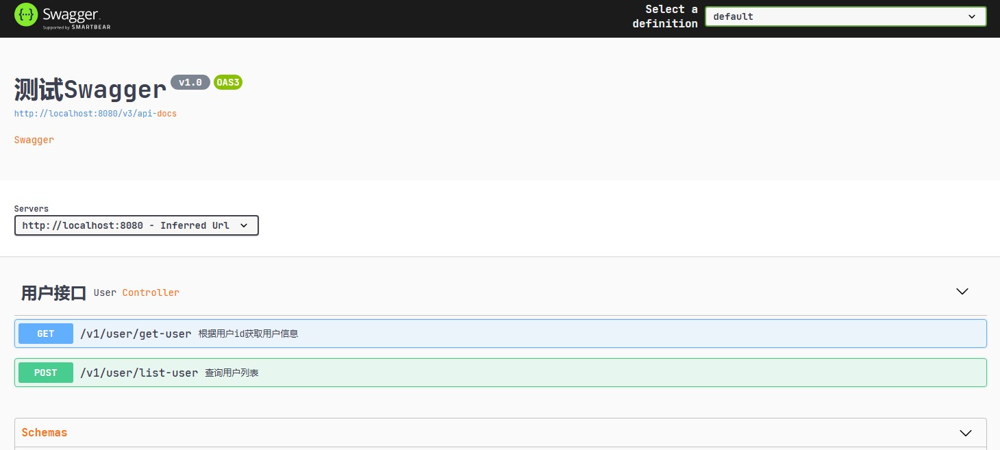
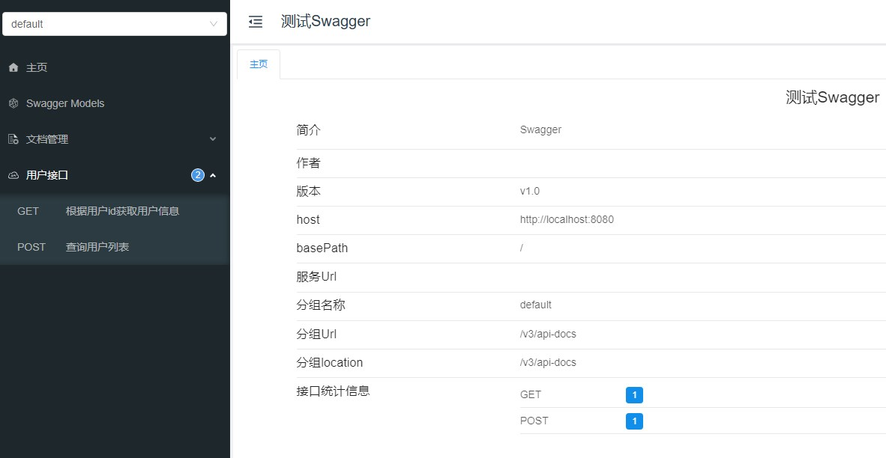

# 一、Swagger

- [开源集成Swagger](https://swagger.io/tools/open-source/open-source-integrations/)
- [Swagger](https://swagger.io/)
- [Swagger specifications convert to AsciiDoc and PDF](https://blog.devgenius.io/swagger-specifications-convert-to-asciidoc-and-pdf-with-a-custom-font-8e734c6fdd8c)

## 1、集成Swagger-UI

- [Spring Boot整合Swagger-UI](https://javabetter.cn/springboot/swagger.html)

> 说明：这里SpringBoot采用的是2.7.18，swagger采用的是springfox:3.0.0

### 1.1、基本步骤
  
（1）在 pom.xml 文件中添加 Swagger 的 starter
```xml
<dependency>
    <groupId>io.springfox</groupId>
    <artifactId>springfox-boot-starter</artifactId>
    <version>3.0.0</version>
</dependency>
```
- springfox-swagger 是一个基于 Spring 生态系统的，Swagger 规范的实现。
- springfox-boot-starter 是 springfox 针对 Spring Boot 项目提供的一个 starter，简化 Swagger 依赖的导入，否则我们就需要在 pom.xml 文件中添加 springfox-swagger、springfox-swagger-ui 等多个依赖

（2）添加Java配置
```java
@Configuration
@EnableOpenApi // 注解表明开启 Swagger
public class SwaggerConfig {
    @Bean
    public Docket docket() {
        Docket docket = new Docket(DocumentationType.OAS_30) // 使用 3.0 版本的 Swagger API。OAS 是 OpenAPI Specification 的简称，翻译成中文就是 OpenAPI 说明书，Swagger 遵循的就是这套规范
                .apiInfo(apiInfo())
                .enable(true)
                .select()
                // apis： 指定匹配所有的 URL，这里可以自定义匹配规则
                .apis(RequestHandlerSelectors.basePackage("com.controller"))
                .paths(PathSelectors.any())
                .build();

        return docket;
    }
    private ApiInfo apiInfo() {// 配置 API 文档基本信息，标题、描述、作者、版本等。
        return new ApiInfoBuilder()
                .title("SpringBoot+Swagger")
                .description("SpringBoot+Swagger集成项目")
                .contact(new Contact("QingFan", "",""))
                .version("v1.0")
                .build();
    }
}
```
SwaggerConfig 类中包含了一个 @Bean 注解声明的方法 docket()，该方法会被 Spring 的 AnnotationConfigApplicationContext 或 AnnotationConfigWebApplicationContext 类进行扫描，然后添加到 Spring 容器当中

（3）添加Controller
```java
@RestController
@Api(tags = "用户接口")
@RequestMapping("/v1/user")
public class UserController {
    @GetMapping("/get-user")
    @ApiOperation("根据用户id获取用户信息")
    public Result<UserVO> getUser(@RequestParam("id") Long id) {
        return Result.ok(new UserVO());
    }
}
```
相关注解参考：[Swagger-Core Annotations](https://github.com/swagger-api/swagger-core/wiki/Annotations-1.5.X)

（4）启动服务，在浏览器中输入 http://localhost:8080/swagger-ui/ 就可以访问 Swagger 生成的 API 文档了，显示效果如下：



### 1.2、版本兼容问题

在 Spring Boot 整合 Swagger 的过程中，Spring Boot 2.6.7 版本和 springfox 3.0.0 版本不兼容，启动的时候直接就报错了：
```java
org.springframework.context.ApplicationContextException: Failed to start bean 'documentationPluginsBootstrapper'; nested exception is java.lang.NullPointerException
	at org.springframework.context.support.DefaultLifecycleProcessor.doStart(DefaultLifecycleProcessor.java:182) ~[spring-context-5.3.31.jar:5.3.31]
	...
	at org.springframework.boot.web.servlet.context.ServletWebServerApplicationContext.refresh(ServletWebServerApplicationContext.java:147) ~[spring-boot-2.7.18.jar:2.7.18]
	at org.springframework.boot.SpringApplication.refresh(SpringApplication.java:732) ~[spring-boot-2.7.18.jar:2.7.18]
	at org.springframework.boot.SpringApplication.refreshContext(SpringApplication.java:409) ~[spring-boot-2.7.18.jar:2.7.18]
	at org.springframework.boot.SpringApplication.run(SpringApplication.java:308) ~[spring-boot-2.7.18.jar:2.7.18]
	at org.springframework.boot.SpringApplication.run(SpringApplication.java:1300) ~[spring-boot-2.7.18.jar:2.7.18]
	at org.springframework.boot.SpringApplication.run(SpringApplication.java:1289) ~[spring-boot-2.7.18.jar:2.7.18]
	at com.qing.fan.Boot2Swagger2.main(Boot2Swagger2.java:15) ~[classes/:na]
Caused by: java.lang.NullPointerException: null
	at springfox.documentation.spring.web.WebMvcPatternsRequestConditionWrapper.getPatterns(WebMvcPatternsRequestConditionWrapper.java:56) ~[springfox-spring-webmvc-3.0.0.jar:3.0.0]
	at springfox.documentation.RequestHandler.sortedPaths(RequestHandler.java:113) ~[springfox-core-3.0.0.jar:3.0.0]
	at springfox.documentation.spi.service.contexts.Orderings.lambda$byPatternsCondition$3(Orderings.java:89) ~...
	at springfox.documentation.spring.web.plugins.AbstractDocumentationPluginsBootstrapper.withDefaults(AbstractDocumentationPluginsBootstrapper.java:107) ~[springfox-spring-web-3.0.0.jar:3.0.0]
	at springfox.documentation.spring.web.plugins.AbstractDocumentationPluginsBootstrapper.buildContext(AbstractDocumentationPluginsBootstrapper.java:91) ~[springfox-spring-web-3.0.0.jar:3.0.0]
	at springfox.documentation.spring.web.plugins.AbstractDocumentationPluginsBootstrapper.bootstrapDocumentationPlugins(AbstractDocumentationPluginsBootstrapper.java:82) ~[springfox-spring-web-3.0.0.jar:3.0.0]
	at springfox.documentation.spring.web.plugins.DocumentationPluginsBootstrapper.start(DocumentationPluginsBootstrapper.java:100) ~[springfox-spring-web-3.0.0.jar:3.0.0]
	at org.springframework.context.support.DefaultLifecycleProcessor.doStart(DefaultLifecycleProcessor.java:179) ~[spring-context-5.3.31.jar:5.3.31]
```
Github上已经有人针对这个提了问题：[because "this.condition" is null #28794](https://github.com/spring-projects/spring-boot/issues/28794)，在Springfox的github上有个问题：[swagger-starter3.0 not support springBoot2.6.x version #3934](https://github.com/springfox/springfox/issues/3934)

其中一个解决方案是切换到[Springdoc](https://springdoc.org/)，但是相对比较麻烦，如果需要从Springfox迁移到Springdoc上，需要改动比较多，详细参考：[Migrating from SpringFox](https://springdoc.org/#migrating-from-springfox)

另外一个解决方案就是：[Spring 5.3/Spring Boot 2.4 support](https://github.com/springfox/springfox/issues/3462)，主要原因：Springfox 和 Spring 在 pathPatternsCondition 上产生了分歧，这两个步骤就是用来消除这个分歧的：
（1）将匹配策略调整为 ant-path-matcher（application.yml）
```yaml
spring:
  mvc:
    path match:
        matching-strategy: ANT_PATH_MATCHER
```
（2）swagger配置类增加如下信息：
```java
@Bean
public static BeanPostProcessor springfoxHandlerProviderBeanPostProcessor() {
    return new BeanPostProcessor() {
        @Override
        public Object postProcessAfterInitialization(Object bean, String beanName) throws BeansException {
            if (bean instanceof WebMvcRequestHandlerProvider || bean instanceof WebFluxRequestHandlerProvider) {
                customizeSpringfoxHandlerMappings(getHandlerMappings(bean));
            }
            return bean;
        }
        private <T extends RequestMappingInfoHandlerMapping> void customizeSpringfoxHandlerMappings(List<T> mappings) {
            List<T> copy = mappings.stream()
                    .filter(mapping -> mapping.getPatternParser() == null)
                    .collect(Collectors.toList());
            mappings.clear();
            mappings.addAll(copy);
        }
        @SuppressWarnings("unchecked")
        private List<RequestMappingInfoHandlerMapping> getHandlerMappings(Object bean) {
            try {
                Field field = ReflectionUtils.findField(bean.getClass(), "handlerMappings");
                field.setAccessible(true);
                return (List<RequestMappingInfoHandlerMapping>) field.get(bean);
            } catch (IllegalArgumentException | IllegalAccessException e) {
                throw new IllegalStateException(e);
            }
        }
    };
}
```

### 2、Swagger整合Knife4j

- [Swagger-Knife4j](https://javabetter.cn/gongju/knife4j.html)

Knife4j 的前身是 swagger-bootstrap-ui，是 springfox-swagger-ui 的增强 UI 实现。swagger-bootstrap-ui 采用的是前端 UI 混合后端 Java 代码的打包方式，在微服务的场景下显得非常臃肿，改良后的 Knife4j 更加小巧、轻量，并且功能更加强大


整体上看起来比较难看，可以结合 [Knife4j](https://doc.xiaominfo.com/docs/quick-start) 来美化页面展示；

（1）添加 Knife4j 的依赖
```xml
<dependency>
    <groupId>com.github.xiaoymin</groupId>
    <artifactId>knife4j-spring-boot-starter</artifactId>
    <version>3.0.3</version>
</dependency>
```
> 说明：这里不需要引入 springfox-boot-starter

（2）其他配置同集成swagger

（3）启动应用后，访问：http://localhost:8080/doc.html



**可能存在的问题**

按照上述步骤集成Knife4j，可能会报如下错误：
```java
Caused by: java.lang.NoClassDefFoundError: javax/validation/constraints/NotBlank
```
原因是 javax-validation 版本冲突，导致没有NotBlank，解决办法：
```xml
<dependency>
    <groupId>com.github.xiaoymin</groupId>
    <artifactId>knife4j-spring-boot-starter</artifactId>
    <version>3.0.3</version>
    <exclusions>
        <exclusion>
            <artifactId>validation-api</artifactId>
            <groupId>javax.validation</groupId>
        </exclusion>
    </exclusions>
</dependency>
<dependency>
    <groupId>javax.validation</groupId>
    <artifactId>validation-api</artifactId>
    <version>2.0.1.Final</version>
</dependency>
```

# 二、SpringDoc

- [springdoc-openapi v1.8.0](https://springdoc.org/v1/)
- [springdoc-openapi v2.6.0](https://springdoc.org/)

## 1、关于版本

[SpringBoot与SpringDoc版本对应](https://springdoc.org/#what-is-the-compatibility-matrix-of-springdoc-openapi-with-spring-boot)

# 参考资料

- [mkdocs-material](https://github.com/squidfunk/mkdocs-material)
- [YApi](https://github.com/YMFE/yapi)
- [hoppscotch-开源API，对标Postman](https://github.com/hoppscotch/hoppscotch)
