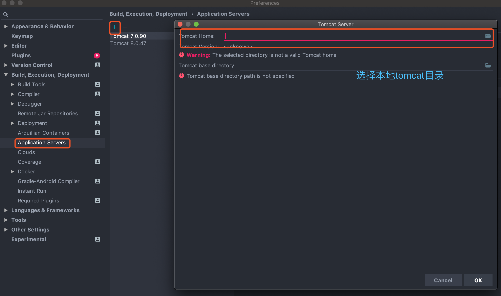
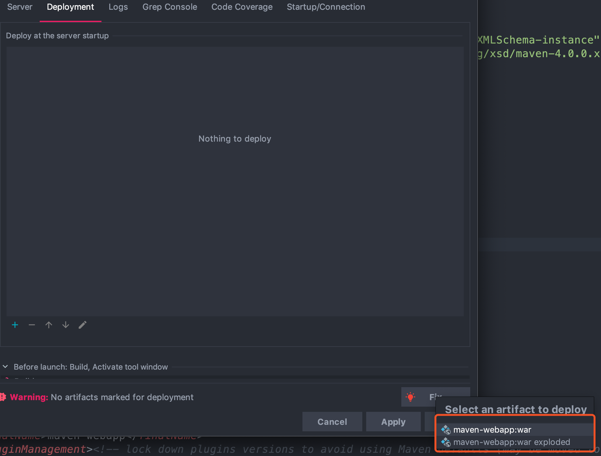
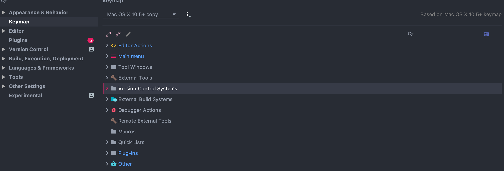
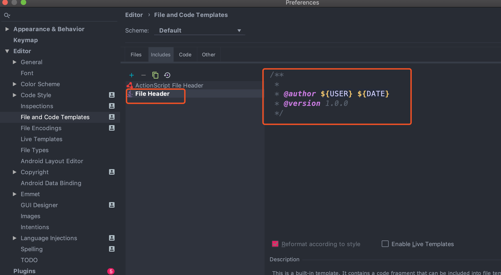
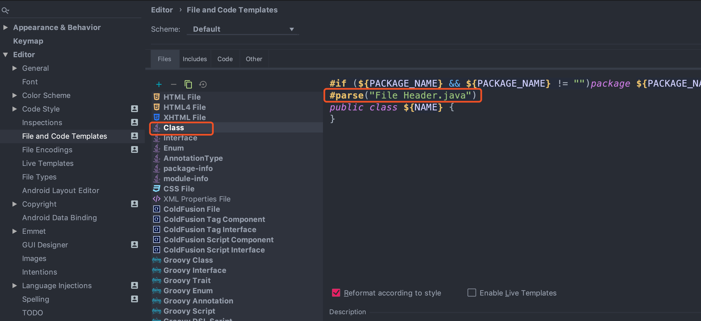
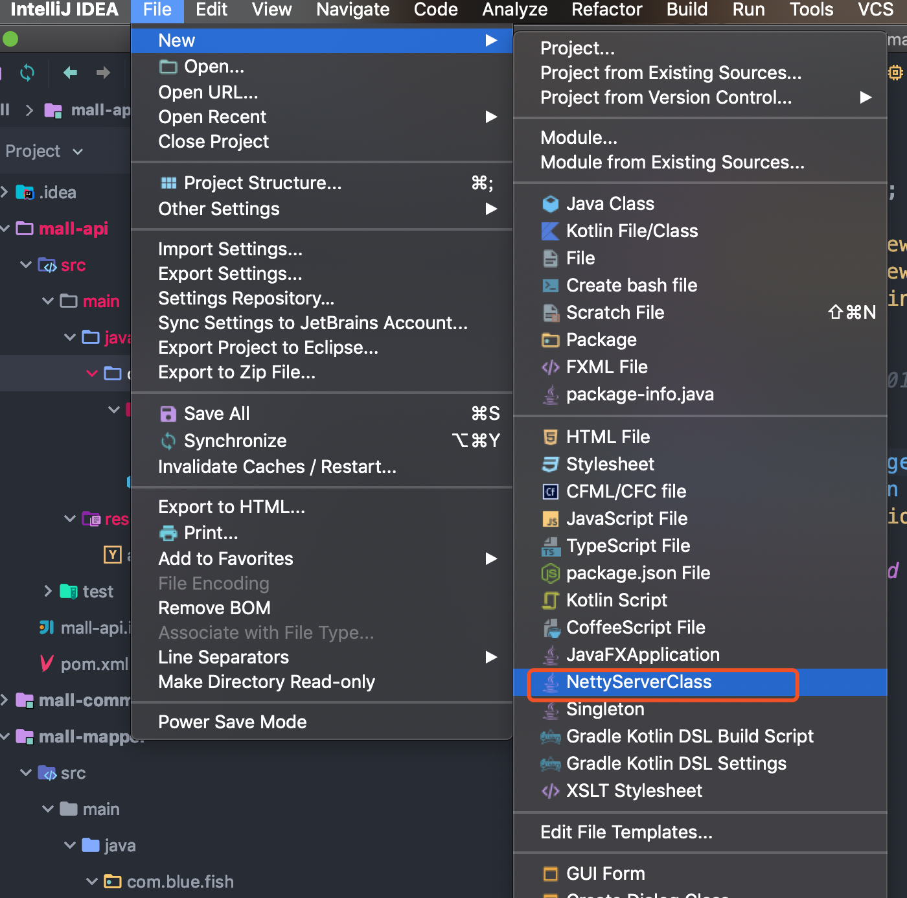

# 1、Tomcat部署

## 1.1、添加Tomcat

- 首先在File -> Settings -> Build, Execution, Deployment -> Application Servers 设置Tomcat的目录
- 点击"+"，选择Tomcat Server，选择对应的Tomcat目录

    

    或者在Edit Congigurations，添加Tomcat实例，直接配置Tomcat目录

    

- 部署项目

    

## 1.2、Tomcat部署war与explode的区别

https://blog.csdn.net/u013041642/article/details/79475095


# 2、配置开发环境

## 2.1、快捷键设置

设置路径：Settings -> KeyMap



根据个人习惯可以设置为eclipse的快捷键，如果是Mac，可以选择Eclipse Mac(OS)

## 2.2、模板设置

Settings -> Editor -> File and Code Templates

### 2.2.1、添加类签名及版本信息



上面的`FileHeader.java`可以定义为通用的文件注释，还可以增加版权信息等



将上面定义好的的FileHeader引入到到include里的Class里面，使用parse来解析：
```java
#if (${PACKAGE_NAME} && ${PACKAGE_NAME} != "")package ${PACKAGE_NAME};#end
#parse("File Header.java")
public class ${NAME} {
}
```

同样的，可以再include里面添加模板文件，比如添加了一个NettyServerClass


在new里面可以选择NettyServerClass作为Java类文件模板：



## 2.3、Maven

Settings -> Build, Execution, Deployment -> Build Tools -> Maven


## 2.4、方法分割线以及字符缩进


# 3、IDEA常用插件

- 阿里巴巴代码插件：Alibaba Java Coding Guidelines
- 背景图片插件：Background Image Plus
- 格式化xml：Eclipse Code Fromatter
- Mybtis插件：Free Mybatis Plugin、Mybatis plugin、Mybatis xml validator、MyBatisCodeHelperPro
- Lombok
- 主题插件：Material Theme UI、Atom Material Icons
- 代码扫描插件：SonarLint
- CodeGlance：可以显示代码的缩略图
- GenerateAllSetter：一键调用一个对的所有set方法
- GrepConsole
- GsonFormat：可以将一个json字符串转成对象
- HOCON
- idea-mybatis-generator
- jclasslib ByteCode viewer
- JMH Plugin
- Key Promoter X
- Maven Helper
- RestfulToolkit
- SonarLint
- Statistic
- VisualVM Launcher
- ASM
- IDE Eval Reset
- mybatisX
- Rainbow Brackets ：括号插件

# 4、idea插件开发

https://plugins.jetbrains.com/docs/intellij/getting-started.html

https://github.com/judasn/IntelliJ-IDEA-Tutorial/blob/master/plugins-develop.md

https://juejin.cn/post/6844904127990857742