# 一、JavaEE项目

## 1、创建一个普通的Java项目

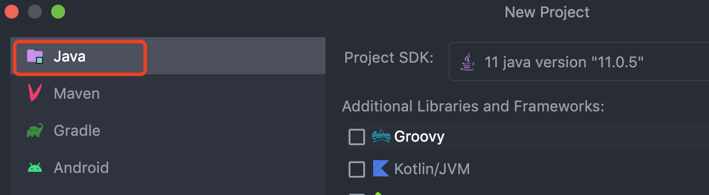

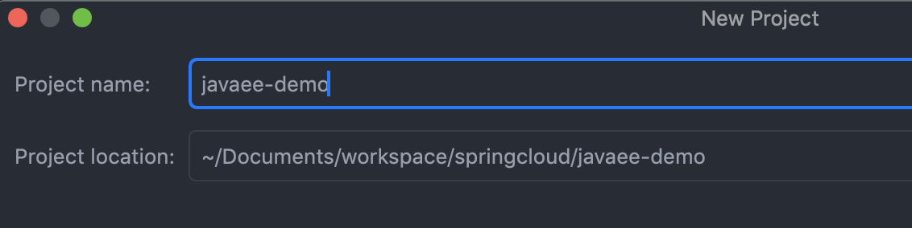

## 2、目录结构

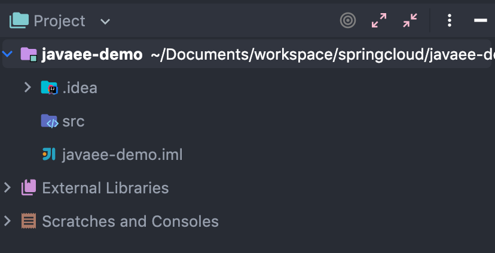

## 3、添加web目录

在项目上右键，点击 Add Framework Support

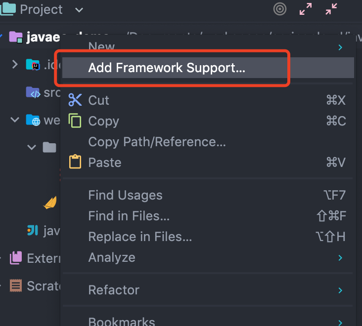

勾选Web Application

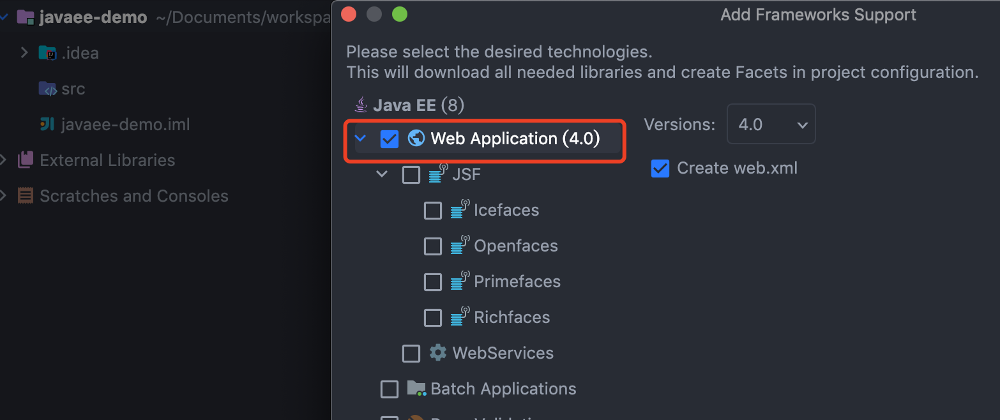

添加成功后的目录

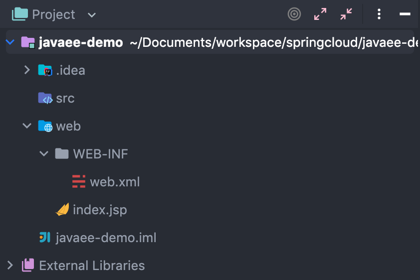

## 4、添加目录

添加web目录成功后WEB-INF目录下还缺少：存放编译后class文件的目录classes以及存放第三方jar包的lib目录

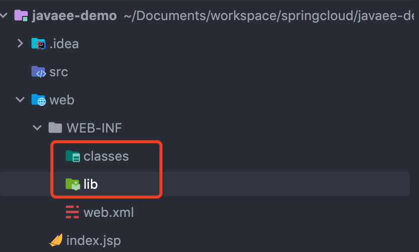

## 5、配置文件夹路径

File -> Project Structure -> 选择Module：选择 Paths -> 选择"Use module compile output path" -> 将Output path和Test output path都选择刚刚创建的classes文件夹

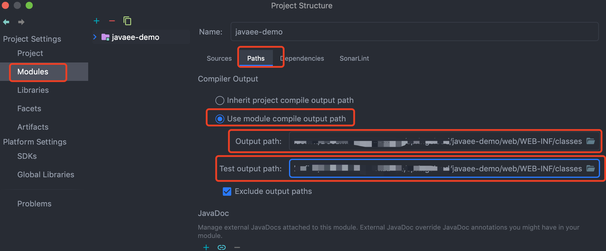

设置jar包保存到lib文件夹：Dependencies -> Module SDK选择为11 -> 点击左边的“+”号 -> 选择 “Jars or Directories”，弹出选择 前面创建的 lib 目录；

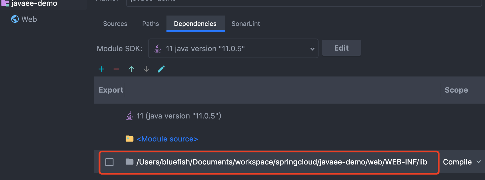

## 6、配置Tomcat容器

菜单栏->run->Edit Configurations->Tomcat Server->local,配置Deployment

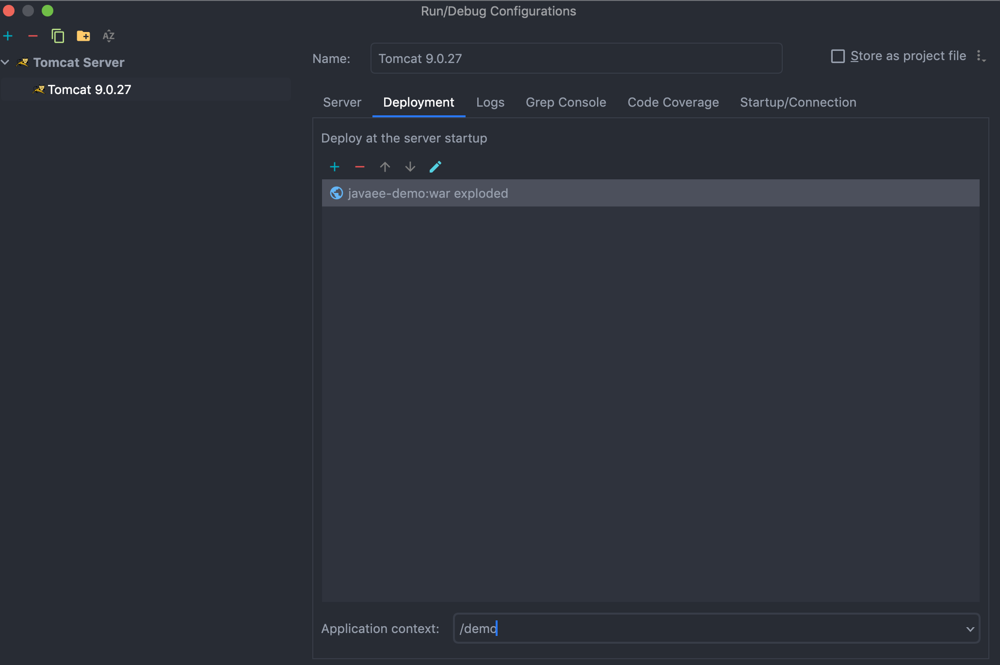

## 7、启动Tomcat项目

启动成功，访问8080即可

## 8、导入Servlet Jar包

选择 File -> Project Structure 进入页面，然后选择 Libraries，点击 + 号，选择Java

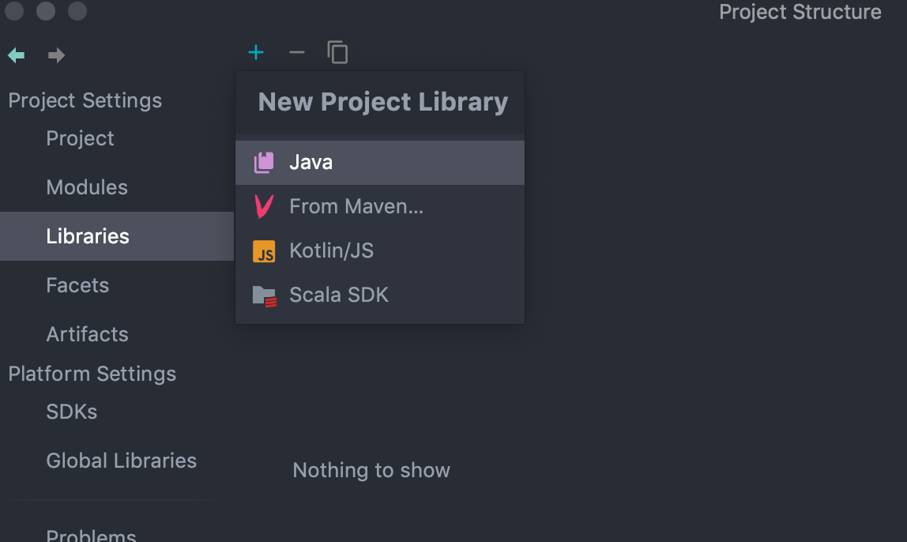

接着进行选择，需要选择的是你的tomcat安装目录下的lib文件夹中的servlet的jar包，选好之后OK：

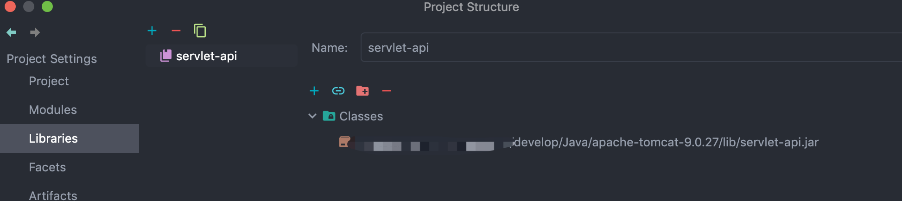

继续点击左侧的Artifacts,选择右侧的servlet-api，鼠标右击，选择`Put into /WEB-IF/lib`，点击apply，ok

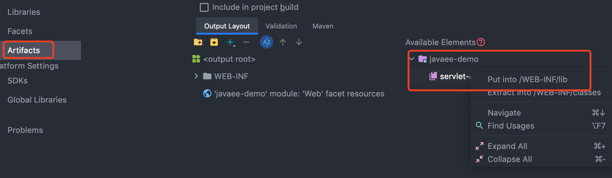

查看工程的依赖包

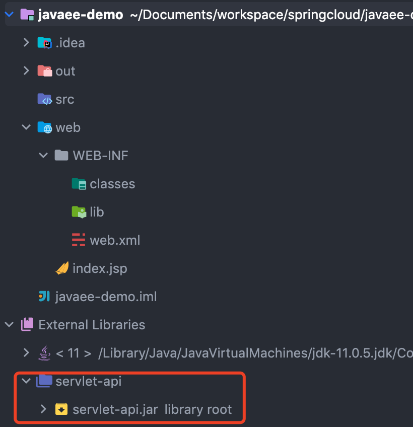

## 9、Servlet案例

在上述步骤都完成之后，就可以编写Servlet了

### 9.1、Servlet

继承 HttpServlet 即可；
```java
public class SyncServlet extends HttpServlet {
    @Override
    protected void doPost(HttpServletRequest request, HttpServletResponse response) throws ServletException, IOException {
        doGet(request, response);
    }
    @Override
    protected void doGet(HttpServletRequest request, HttpServletResponse response) throws ServletException, IOException {
        long start = System.currentTimeMillis();
        try {
            Thread.sleep(3000);
        } catch (InterruptedException e) {
            e.printStackTrace();
        }
        response.getWriter().write("ok");
        System.out.println("总耗时：" + (System.currentTimeMillis() - start));
    }
}
```

### 9.2、xml配置

在web.xml中增加如下配置：
```xml
<servlet>
    <servlet-name>syncServlet</servlet-name>
    <servlet-class>com.qing.fan.SyncServlet</servlet-class>
</servlet>

<servlet-mapping>
    <servlet-name>syncServlet</servlet-name>
    <url-pattern>/syncServlet</url-pattern>
</servlet-mapping>
```
页面访问时：http://localhost:8080/syncServlet

### 9.3、注解配置

Servlet3.0之后，支持对应的注解来配置实现了，只需要在对应的 Servlet 上配置注解即可；
```java
@WebServlet(urlPatterns = "/syncServlet")
public class SyncServlet extends HttpServlet {
}
@Target({ElementType.TYPE})
@Retention(RetentionPolicy.RUNTIME)
@Documented
public @interface WebServlet {
    /**
     * The name of the servlet
     */
    String name() default "";
    
    /**
     * The URL patterns of the servlet
     */
    String[] value() default {};
    /**
     * The URL patterns of the servlet
     */
    String[] urlPatterns() default {};
    /**
     * The load-on-startup order of the servlet 
     */
    int loadOnStartup() default -1;
    /**
     * The init parameters of the servlet
     */
    WebInitParam [] initParams() default {};
    /**
     * 当前servlet是否支持异步操作
     *
     * @return {@code true} if the servlet supports asynchronous operation mode
     * @see javax.servlet.ServletRequest#startAsync
     * @see javax.servlet.ServletRequest#startAsync(ServletRequest,
     * ServletResponse)
     */
    boolean asyncSupported() default false;
    String smallIcon() default "";
    String largeIcon() default "";
    String description() default "";
    String displayName() default "";
}
```

# 二、Maven-JavaEE项目


# 三、SpringMVC-JavaEE项目


# 四、SpringMVC-Maven-Maven-JavaEE项目


# 五、SpringBoot内嵌项目


