# 一、基本配置

- [IDEA高效使用指南](https://idea.javaguide.cn/tips/)

## 1、Tomcat部署

### 1.1、添加Tomcat

- 首先在File -> Settings -> Build, Execution, Deployment -> Application Servers 设置Tomcat的目录
- 点击"+"，选择Tomcat Server，选择对应的Tomcat目录

    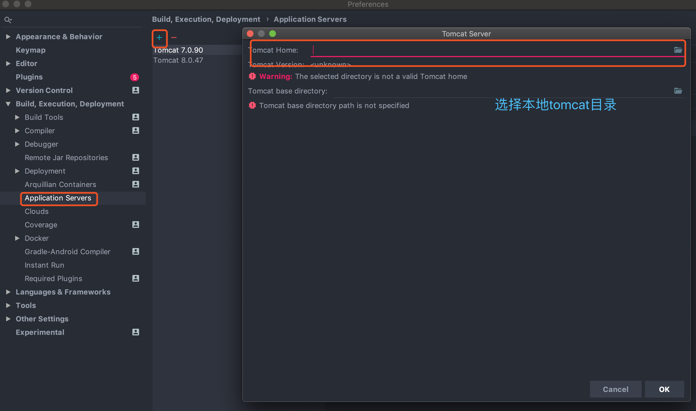

    或者在Edit Congigurations，添加Tomcat实例，直接配置Tomcat目录

    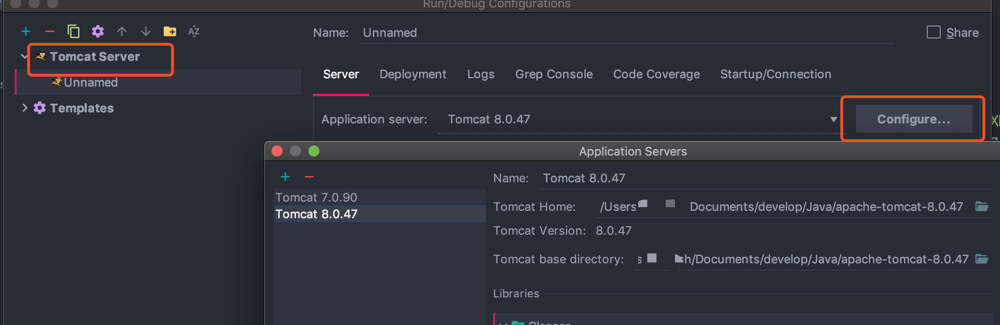

- 部署项目

    

### 1.2、Tomcat部署war与explode的区别

https://blog.csdn.net/u013041642/article/details/79475095


## 2、配置开发环境

### 2.1、快捷键设置

设置路径：Settings -> KeyMap

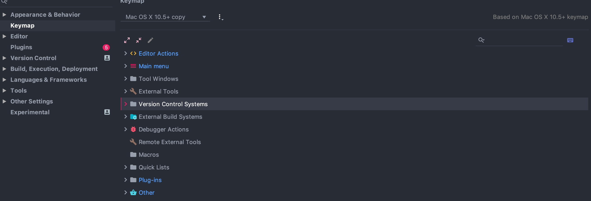

根据个人习惯可以设置为eclipse的快捷键，如果是Mac，可以选择Eclipse Mac(OS)

### 2.2、模板设置

Settings -> Editor -> File and Code Templates

#### 2.2.1、添加类签名及版本信息

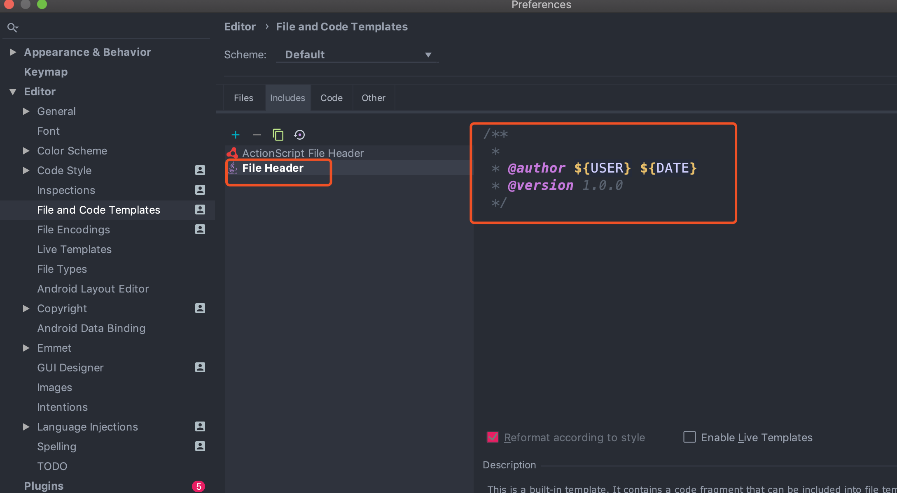

上面的`FileHeader.java`可以定义为通用的文件注释，还可以增加版权信息等

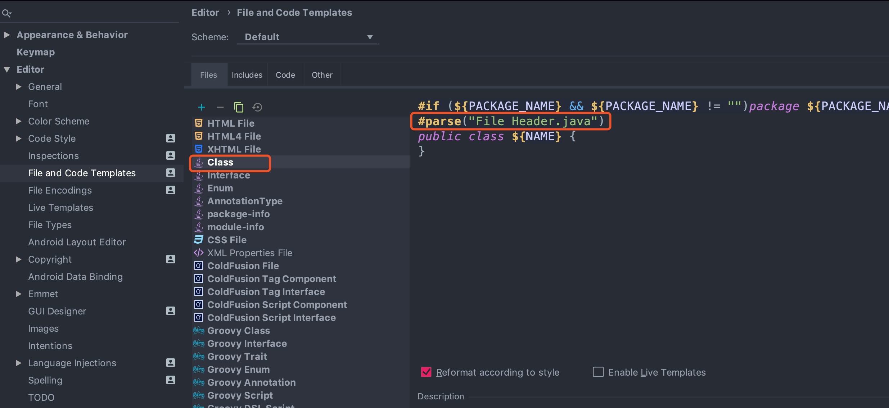

将上面定义好的的FileHeader引入到到include里的Class里面，使用parse来解析：
```java
#if (${PACKAGE_NAME} && ${PACKAGE_NAME} != "")package ${PACKAGE_NAME};#end
#parse("File Header.java")
public class ${NAME} {
}
```

同样的，可以再include里面添加模板文件，比如添加了一个NettyServerClass

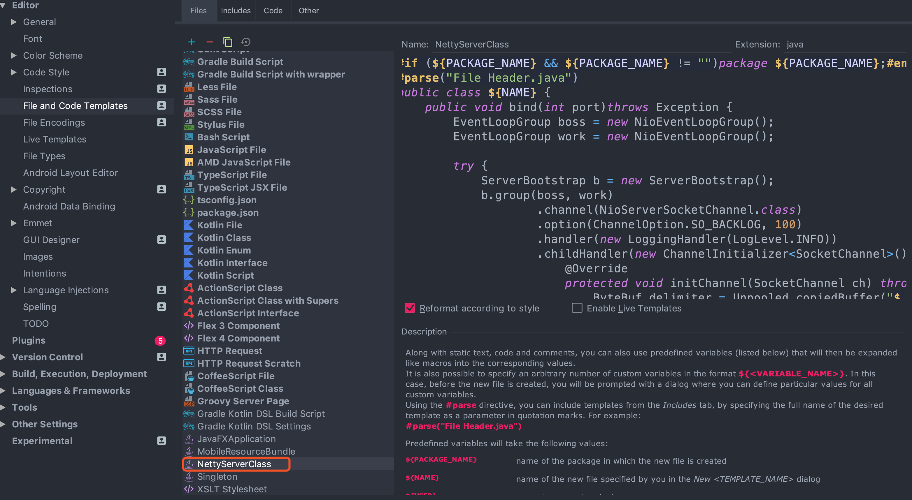

在new里面可以选择NettyServerClass作为Java类文件模板：

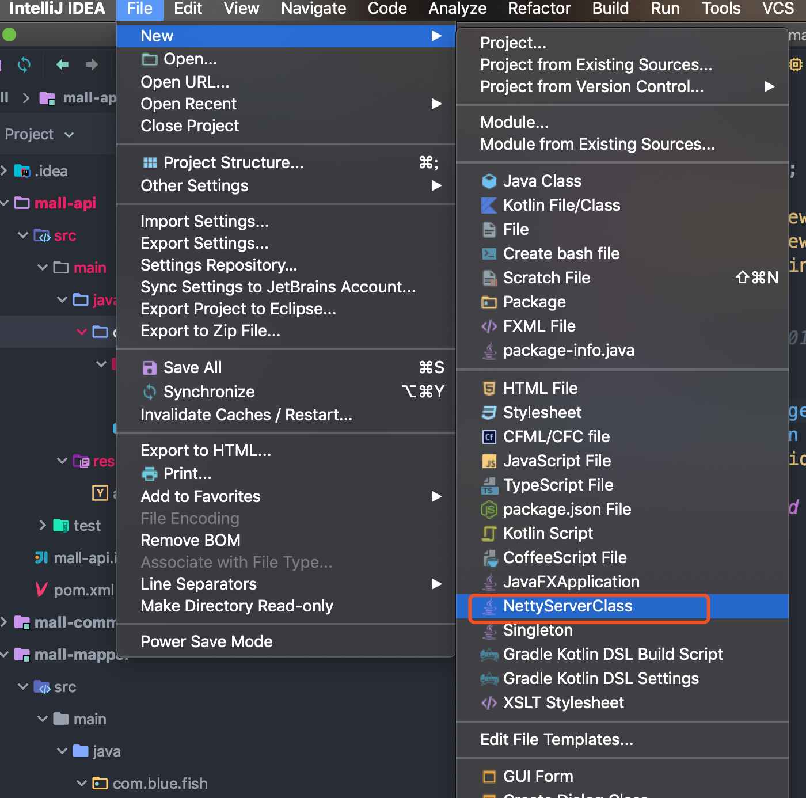

### 2.3、Maven

Settings -> Build, Execution, Deployment -> Build Tools -> Maven

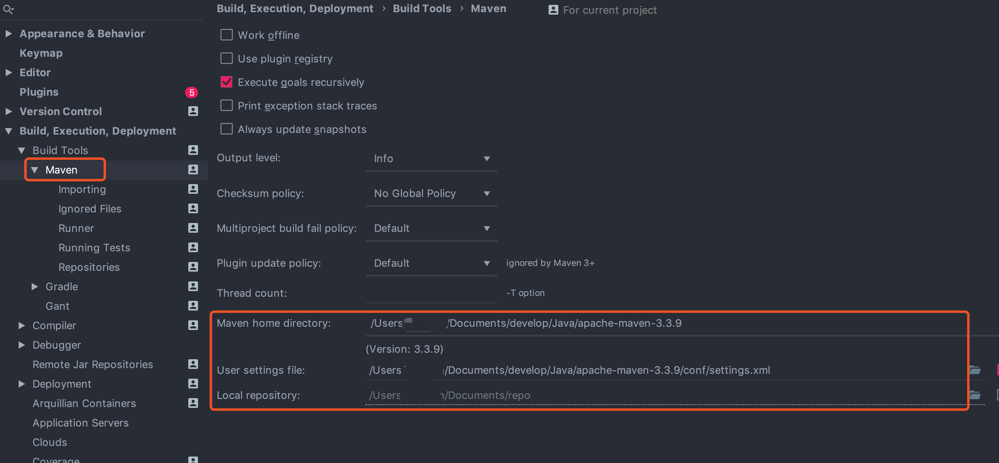

### 2.4、方法分割线以及字符缩进

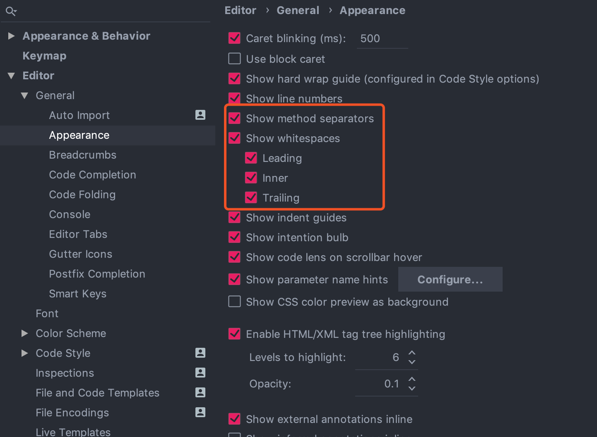

## 5、IDEA各种设置

### 5.1、pom文件依赖漏洞检查警告线去除方式

- [pom文件依赖漏洞检查警告线去除方式](https://blog.csdn.net/julv7759/article/details/126050095)

### 5.2、设置工程图标

如果需要展示个性化logo，可以在目录中`.idea` 增加一个图片文件，命名：`icon.png` ，该工程会自动识别该文件

### 5.3、修改idea默认配置路径

- [Changing IDE default directories used for config, plugins, and caches storage](https://intellij-support.jetbrains.com/hc/en-us/articles/207240985-Changing-IDE-default-directories-used-for-config-plugins-and-caches-storage)

以Windows为例，IDEA默认配置路径基本都是在C盘目录下的：
```java
// idea的相关配置、插件目录
C:{user.home}/AppData/Roaming/JetBrains/IdeaIC2024.2
// idea的相关系统配置目录：缓存、日志等
C:{user.home}/AppData/Local/JetBrains/IdeaIC2024.2
```
修改 `IDE_HOME\bin\idea.properties` 文件中的注释更改默认值，确保取消注释定义这些属性的行：
```properties
idea.config.path=
idea.system.path=
idea.plugins.path=
idea.log.path=
```
修改对应的配置为：
```properties
## 配置的目录
idea.config.path=D:/cache/idea/trunk-config
## 配置缓存的目录：index
idea.system.path=D:/cache/idea/trunk-system 
## 配置插件的目录，一般是在 config目录里面的
idea.plugins.path=D:/cache/idea/trunk-config/plugins
## 配置日志目录
idea.log.path=D:/cache/idea/trunk-system/trunk-log
```
**如何将默认配置的数据移动到新目录中：**
- 将`C:{user.home}/AppData/Roaming/JetBrains/IdeaIC2024.2` 移动到新的目录：`idea.config.path`
- `C:{user.home}/AppData/Local/JetBrains/IdeaIC2024.2` 目录下的数据不需要移动；

做完之后即可使用原有的目录配置数据

### 5.4、自定义Tags

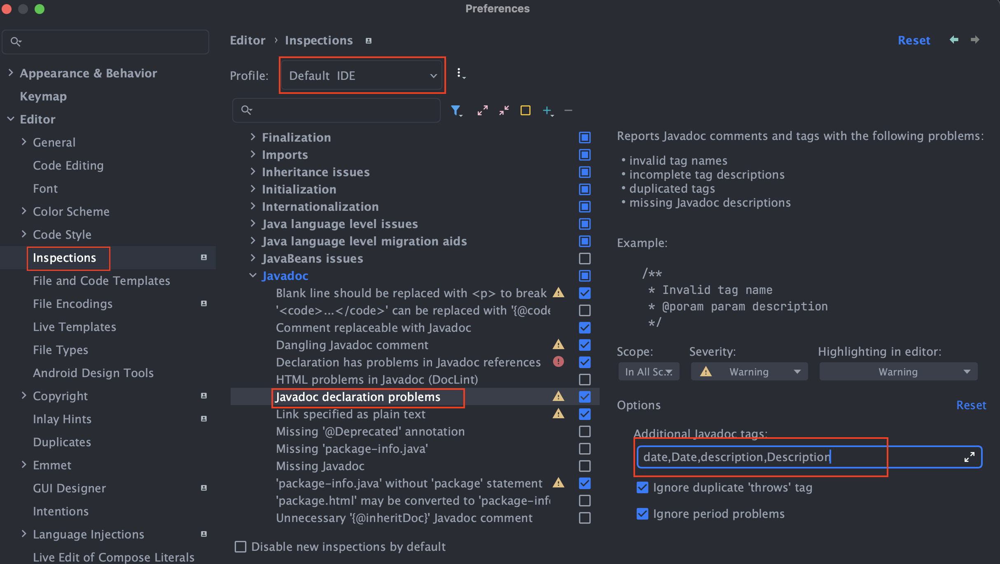

如果在Java doc 添加了不支持的标签，比如：
```java
/**
 * @date
 * @description
 */
```
idea会提示：Wrong tags，可以通过提示添加到自定义tags上

## 6、运行报错问题汇总

### 6.1、运行报Java版本错误

比如报如下错：`java: 警告: 源发行版 17 需要目标发行版 17`

主要检查如下几个地方：

（1）File -> Project Structure


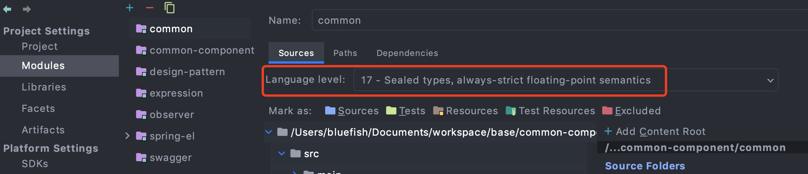

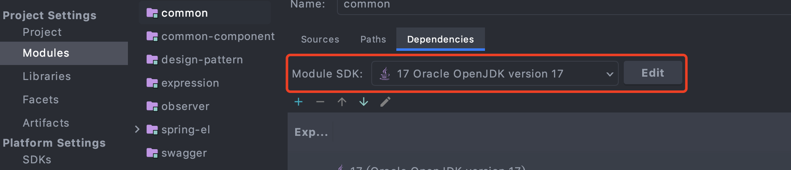

（2）Fils -> Settings

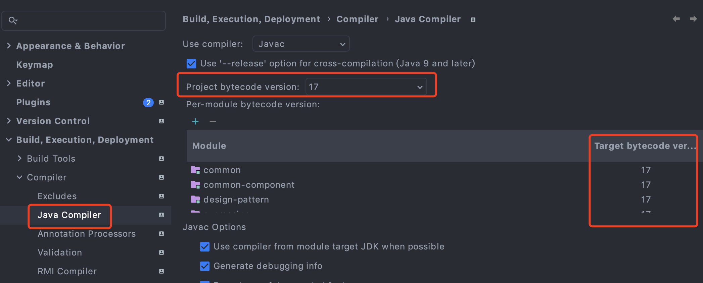

# 二、Plugin

- [idea插件开发指南](https://github.com/fuzhengwei/guide-idea-plugin)
- [idea相关实用插件](https://github.com/yysimple/idea-plugins)
- [aviatorscript-ideaplugin](https://github.com/yanchangyou/aviatorscript-ideaplugin)

IntelliJ 平台的 IDE 采用微内核的设计理念，其可扩展性极高。 IntelliJ 平台现有的许多 IDE 功能，都是采用插件的形式实现。插件功能运行在 IDE 进程中。插件拓展 IDE 的能力，这些能力，大部分是通过配置文件的形式注册到 IDE 中，具体的注册方式有多种，例如通过实现一个定义好的接口，将该接口实现类的全路径通过配置，注册到 IDE 中。IDE 基于面向对象编程语言的多态、反射等特性，来回调到我们的实现类方法（这与 Java 的 SPI 很像呢）。这也是IDE插件不同于普通的 Java 项目，在插件项目中不需要编写 main 函数来启动插件

## 1、Plugins

- 阿里巴巴代码插件：Alibaba Java Coding Guidelines
- 背景图片插件：Background Image Plus
- 格式化xml：Eclipse Code Fromatter
- Mybtis插件：Free Mybatis Plugin、Mybatis plugin、Mybatis xml validator、MyBatisCodeHelperPro
- Lombok
- 主题插件：Material Theme UI、Atom Material Icons
- 代码扫描插件：SonarLint
- CodeGlance：可以显示代码的缩略图
- GenerateAllSetter：一键调用一个对的所有set方法
- GrepConsole
- GsonFormat：可以将一个json字符串转成对象
- HOCON
- idea-mybatis-generator
- jclasslib ByteCode viewer
- JMH Plugin
- Key Promoter X
- Maven Helper
- RestfulToolkit
- SonarLint
- Statistic
- VisualVM Launcher
- ASM
- mybatisX
- Rainbow Brackets ：括号插件
- metricsreloaded
- ANTLR
- git commit message helper:标准化提交内容的插件
- GitToolBox
- Better Highlights：代码认知复杂度
- BinEd - Binary/Hex Editor 二进制文件查看

## 2、插件开发

https://plugins.jetbrains.com/docs/intellij/getting-started.html

https://github.com/judasn/IntelliJ-IDEA-Tutorial/blob/master/plugins-develop.md

https://juejin.cn/post/6844904127990857742

https://juejin.cn/post/7137092683125751815

# 三、Spring源码导入

## 1、本地环境

- Gradle
- Git
- JDK8+
- IntelliJ IDEA-2018
- Windows/Mac

## 2、获取源码

从[官方仓库](https://github.com/spring-projects/spring-framework)Fork出属于自己的仓库，这样针对修改或者注释都可以直接提交到自己的仓库中去；

- 使用idea从git创建新项目（https://github.com/chenlanqing/spring-framework.git）
- gradle会自动build项目；
- 预编译spring-oxm项目，在idea上终端上执行命令：`./gradlew :spring-oxm:compileTestJava`

# 四、Tomcat源码导入

* [IDEA导入Tomcat源码](http://www.jb51.net/article/95120.htm)

## 1、环境配置

- JDK8+
- Maven
- Windows/Mac
- Tomcat环境

## 2、导入步骤

- 下载Tomcat源码，可以从[svn](http://svn.apache.org/repos/asf/tomcat/)上下载
- 在下载的源码目录中新建`pom.xml`文件，文件内容如下：
	```xml
	<?xml version="1.0" encoding="UTF-8"?>
	<project xmlns="http://maven.apache.org/POM/4.0.0"
	         xmlns:xsi="http://www.w3.org/2001/XMLSchema-instance"
	         xsi:schemaLocation="http://maven.apache.org/POM/4.0.0 http://maven.apache.org/xsd/maven-4.0.0.xsd">
	    <modelVersion>4.0.0</modelVersion>
	    <groupId>org.apache.tomcat</groupId>
	    <artifactId>Tomcat8.0</artifactId>
	    <name>Tomcat8.0</name>
	    <version>8.0</version>
	    <build>
	        <finalName>Tomcat8.0</finalName>
	        <sourceDirectory>java</sourceDirectory>
	        <testSourceDirectory>test</testSourceDirectory>
	        <resources>
	            <resource>
	                <directory>java</directory>
	            </resource>
	        </resources>
	        <testResources>
	            <testResource>
	                <directory>test</directory>
	            </testResource>
	        </testResources>
	        <plugins>
	            <plugin>
	                <groupId>org.apache.maven.plugins</groupId>
	                <artifactId>maven-compiler-plugin</artifactId>
	                <version>2.3</version>
	                <configuration>
	                    <encoding>UTF-8</encoding>
	                    <source>1.8</source>
	                    <target>1.8</target>
	                </configuration>
	            </plugin>
	        </plugins>
	    </build>
	    <dependencies>
	        <dependency>
	            <groupId>junit</groupId>
	            <artifactId>junit</artifactId>
	            <version>4.12</version>
	            <scope>test</scope>
	        </dependency>
	        <dependency>
	            <groupId>org.easymock</groupId>
	            <artifactId>easymock</artifactId>
	            <version>3.4</version>
	        </dependency>
	        <dependency>
	            <groupId>ant</groupId>
	            <artifactId>ant</artifactId>
	            <version>1.7.0</version>
	        </dependency>
	        <dependency>
	            <groupId>wsdl4j</groupId>
	            <artifactId>wsdl4j</artifactId>
	            <version>1.6.2</version>
	        </dependency>
	        <dependency>
	            <groupId>javax.xml</groupId>
	            <artifactId>jaxrpc</artifactId>
	            <version>1.1</version>
	        </dependency>
	        <dependency>
	            <groupId>org.eclipse.jdt.core.compiler</groupId>
	            <artifactId>ecj</artifactId>
	            <version>4.5.1</version>
	        </dependency>
	    </dependencies>
	</project>	
	```
- 将该工程导入到idea中，这时如果尝试其他tomcat会报错(`org.apache.catalina.startup.Bootstrap#main`)
- 需要设置一个运行时的 catalina_home目录，需要下载一个tomcat软件的压缩包，下载跟你源代码对应的tomcat软件；
- 将该tomcat软件放在和源码同一级目录，建一个和该目录平行的目录catalina-home，将tomcat软件解压后，在解压的目录下，将以下目录拷贝到catalina-home中：
	```
	bin
    conf
    lib
    logs
    temp
    webapps
    work
	```
- 最终目录结构是这样的：
	```
	|-catalina_home
	|-tomcat8
	```

# 其他

## 1、编程字体

- [source code Pro](https://github.com/adobe-fonts/source-code-pro)
- [Cascadia Code](https://github.com/microsoft/cascadia-code)
- [Fira Code](https://github.com/tonsky/FiraCode)

# 参考资料
* [IDEA导入Tomcat源码](http://www.jb51.net/article/95120.htm)


