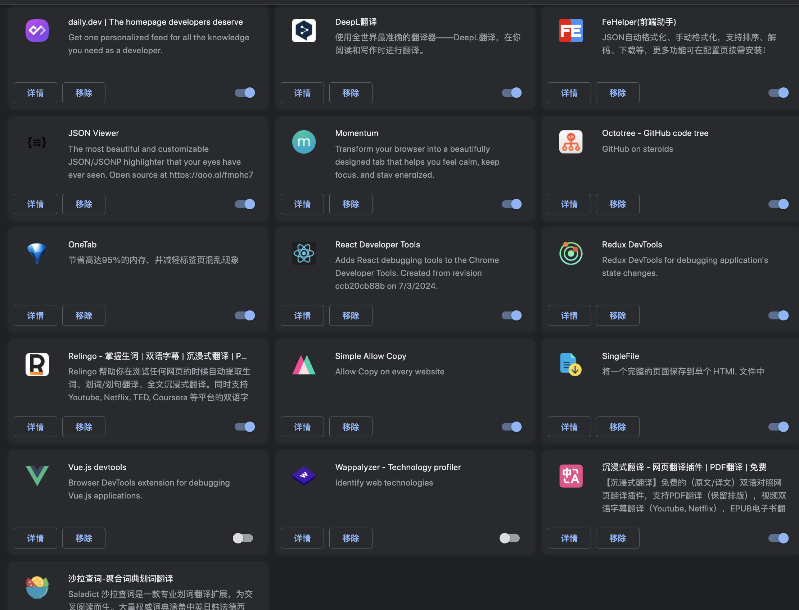

# 一、Visual Studio Code插件

- [VSCode插件开发全攻略（一）](http://blog.haoji.me/vscode-plugin-overview.html)

## 1、常用插件

- Hex Editor
- 主题：Atom Material Icons、Atom One Dark、Icons
- Git blames
- Live Server
- Open in browser
- Markdown preview
- Mermaid Preview
- vscode-pdf

## 2、Markdown-PDF插件

markdown导出pdf时如果需要支持 数学表达式，需要在头添加如下代码
```html
<script type="text/javascript" src="http://cdn.mathjax.org/mathjax/latest/MathJax.js?config=TeX-AMS-MML_HTMLorMML"></script>
<script type="text/x-mathjax-config"> MathJax.Hub.Config({ tex2jax: {inlineMath: [['$', '$']]}, messageStyle: "none" });</script>
```

# 二、Chrome插件

- [Chrome插件(扩展)开发全攻略](http://blog.haoji.me/chrome-plugin-develop.html)
- [前端开发常用Chrome插件](https://www.developers.pub/wiki/1006381/1010639)
- [2024最受欢迎Chrome插件](https://chromewebstore.google.com/collection/2024_favorites)

## 1、常用插件



### 1.1、日常用

- DeepL翻译：阅读写作翻译器
- Momentum
- OneTab
- Simple Allow Copy
- SingleFile：保存网页
- Proxy SwitchyOmega
- 沉浸式翻译
- Relingo翻译插件
- 篡改猴
- YouTube Dubbing：youtube中文翻译
- [中文搜索结果黑名单](https://github.com/cobaltdisco/Google-Chinese-Results-Blocklist)
- Dark Reader:给所有网站一键加上暗黑模式
- Tab Manager Plus:可视化展示所有标签页
- 身份验证器

### 1.2、开发用

- FeHelper(前端助手)
- JSON Viewer
- Octotree - GitHub code tree
- React Developer Tools
- Web Developer
- User-Agent Switcher: 一键修改 UA，让你快速模拟成 iPhone、Android、微信内置浏览器，甚至是搜索引擎爬虫
- Redux DevTools
- Lighthouse : Google 官方出品的性能检测工具
- Wappalyzer - Technology profiler:一点开就能告诉你：它是 React 还是 Vue，后端是 Node 还是 PHP，甚至能识别 CMS、统计工具、CDN、服务器环境
- Page Assist - 本地 AI 模型的 Web UI
- [Websocket Dev Tool](https://www.websocket-devtools.com/)
- Postman Interceptor 或者 apifox

## 2、Chrome 驱动

https://googlechromelabs.github.io/chrome-for-testing/

## 3、开源插件

- [自动化浏览器插件](https://github.com/AutomaApp/automa)

# 三、翻译工具

https://cn.v2ex.com/t/1003094
