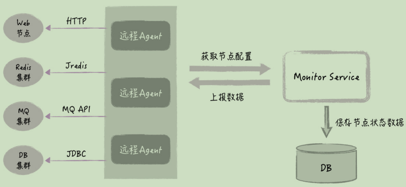
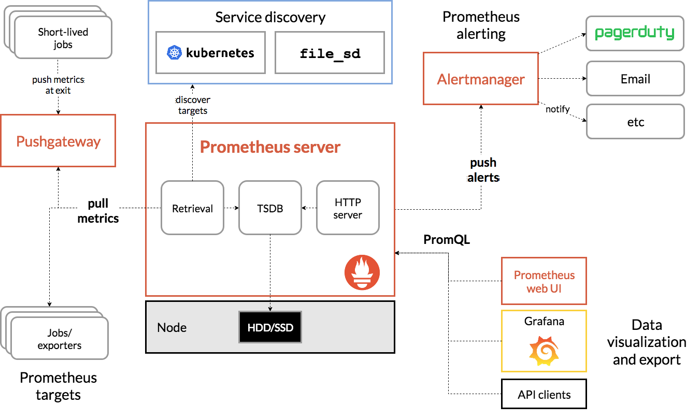

# 一、监控

## 1、监控的分类

系统的组成，它包括接入层、应用系统、中间件、基础设施这几个部分，那监控也是针对这些部分来实施的。一般来说，监控可以分为 5 个层次，从上到下，分别为用户体验监控、业务监控、应用监控、中间件监控、基础平台监控：
- 用户体验监控：指的是从前端用户的访问速度出发，来监测系统的可用性，包括页面能否打开、关键接口的响应时间等等，用户体验监控一般结合前端的埋点来实现；
- 业务监控：它是从业务结果的角度来看，比如说订单数、交易金额等等，业务监控也是最直观的，我们知道，如果业务数据没问题，系统整体也就没有问题。对于业务监控，我们一般是从数据库里定时拉取业务数据，然后以曲线的方式展示业务指标随着时间的变化过程。除了当前的曲线，一般还有同比和环比曲线。同比是和前一天的数据进行比监控的痛点；
- 应用监控：指的是对自己开发的代码进行监控，比如接口在一段时间内的调用次数、响应时间、出错次数等等。更深入一点的应用监控还包含了调用链监控，很多APM监控工具，比如 Cat、Skywalking等
- 中间件监控：指的是对标准中间件进行监控，它是第三方开发的代码，比如数据库、缓存、Tomcat 等等，这些组件对应的是系统的 PaaS 层
- 基础平台监控：指的是对系统底层资源进行监控，如操作系统、硬件设备等等，这个层次的监控对应的是系统的 IaaS 层。Zabbix 就是典型的基础设施监控工具，它可以监控CPU、内存和磁盘的使用情况；

## 2、监控的痛点与解决思路

**监控的痛点**

面对事故，就像是热锅上的蚂蚁，众说纷纭，谁也不能肯定问题出在哪里。结果呢，我们病急乱投医，胡乱干预系统，不但没能解决问题，而且往往引发了二次事故。

监控方式是碎片化的，对于处理线上紧急事故，它无疑是低效的，这里有很多问题
- **发现问题慢**：业务监控的曲线一般 1 分钟更新一次，有时候因为正常的业务抖动，Monitor 还需要把这种情况排除掉。因此，他会倾向于多观察几分钟，这样就导致问题的确认有很大的滞后性；
- **定位问题慢**：系统节点多，大量的人需要介入排查，而且由于节点依赖复杂，需要反复沟通才能把信息串起来，因此很多时候，这种排查方式是串行或者说无序的。一方面，无关的人会卷入进来，造成人员的浪费；另一方面排查效率低，定位问题的时间长；
- **解决问题慢**：当定位到问题，对系统进行调整后，验证问题是否已经得到解决，也不是一件很直观的事情，需要各个研发到相应的监控系统里去进行观察，通过滞后的业务曲线观察业务是否恢复。

**解决思路**

能不能把系统所有的监控信息自动关联起来，并且以一种直观的方式展示，让所有人一看就明白是哪里出了问题，以及出问题的原因是什么呢？
- 要实时，我们需要第一时间知道系统当前是否有问题。
- 要直观，节点是否有问题，我们需要很直观地就能判断出来，就像交通图上的红黄绿颜色标识一样；
- 是整体，我们需要针对系统做整体监控，就像交通图一样，它是针对周边整体的道路情况进行展示，我们也需要把系统的各个节点放在一起，清晰地给出节点依赖关系。

## 3、监控系统设计

监控系统一般分为4部分：节点信息采集、节点接入、数据上报和前端展示。

### 3.1、节点信息采集

节点分为 4 类：Web 应用、Redis、MQ 和数据库，一般采用agent的方式，有agent负责采集数据
- **对于 Redis 节点**，Agent 通过 redis API，尝试连接 Redis 实例并进行简单的读写。如果这个操作没有问题，就表明 Redis 当前的健康状态是正常的，否则就是错误的。
- **对于 MQ 节点**，Agent 是通过 MQ API，来检测 MQ 节点是否有活跃的消费者在连接，同时检测队列积压的消息数量。如果没有活跃的消费者，或者未消费的消息超过了预设的值，就表明当前的 MQ 节点的健康状态是错误的，否则它就是正常的。
- **对于数据库节点**，Agent 是通过 JDBC 去连接数据库，并对表进行简单的读写。如果操作成功，表明数据库的健康状态是正常的，否则就是错误的

对于这三类节点，它们的健康状态只有正常和错误两种，没有警告状态。

**对于 Web 应用来说**，Agent 采集的方式则稍微复杂一些，它会同时采集应用的功能和性能数据，具体包括最近 3s 的接口调用次数、接口平均响应时间、接口出错次数、节点的健康状态和错误消息；Web 节点会预先提供一个 HTTP 接口，Agent 通过调用这个接口，返回当前 Web 实例最近 3s 的健康状态

Agent 在获取了这 4 类节点的健康状态后，会调用 Monitor Service 进行数据上报，如果节点有问题，上报内容还包括具体的错误消息



Agent 本身是一个独立的应用，它不需要和节点部署在一起，如果节点数量少，我们部署一个 Agent 实例就可以；如果节点的数量比较多，我们可以部署多个Agent 实例，比如给每类节点部署一个实例。总的要求就是，让 Agent 能够在 3s 内，完成所有节点的健康信息收集就可以了。

### 3.2、接入监控系统

对于 Redis、MQ、DB 这三类节点，接入监控系统只需要提供配置信息就可以了，无需额外的开发；对于 Web 应用接入监控，我们需要对应用代码做些改造：
- 针对每次接口调用，应用程序需要在接口代码中记录本次调用的耗时以及出错状况；
- 应用程序需要汇总最近 3 秒的接口调用情况，根据规则，给出节点的健康状态；
- 应用程序提供一个对外的 HTTP 接口，供 Agent 来获取上一步给出的健康状态

监控团队可以提供SDK，SDK 通过在接口方法中进行埋点，可以收集每次接口的调用情况

### 3.3、前端信息展示

### 3.4、库表设计

- 系统信息表，用来定义监控体系里有哪些系统，其中 Layout（布局）定义了该系统前端的布局方式。
- 节点信息表，用来定义节点的配置信息，其中节点类型可选的值有 Web 应用、Redis、MQ、DB 等等，节点类型决定了节点健康信息的获取方式。其他字段用于 Agent 如何去连接节点，还有邮箱和手机用于节点出错时，相应的人可以接收报警信息。
- 节点监控状态表，用来记录每个节点的最新健康状态，用于 Dashboard 显示。

# 二、Prometheus

- [Prometheus Overview](https://prometheus.io/docs/introduction/overview/) 

## 1、原理

Prometheus 的基本架构：



- **数据采集模块**：最左边的 Prometheus targets 就是数据采集的对象，而 Retrieval 则负责采集这些数据。从图中你也可以看到，Prometheus 同时支持 Push 和 Pull 两种数据采集模式。
  - Pull 模式，由服务器端的采集模块来触发采集。只要采集目标提供了 HTTP 接口，就可以自由接入（这也是最常用的采集模式）。
  - Push 模式，则是由各个采集目标主动向 Push Gateway（用于防止数据丢失）推送指标，再由服务器端从 Gateway 中拉取过去（这是移动应用中最常用的采集模式）。

  由于需要监控的对象通常都是动态变化的，Prometheus 还提供了服务发现的机制，可以自动根据预配置的规则，动态发现需要监控的对象
- **数据存储模块**：为了保持监控数据的持久化，图中的 TSDB（Time series database）模块，负责将采集到的数据持久化到 SSD 等磁盘设备中。TSDB 是专门为时间序列数据设计的一种数据库，特点是以时间为索引、数据量大并且以追加的方式写入
- **数据查询和处理模块**：TSDB，在存储数据的同时，其实还提供了数据查询和基本的数据处理功能，而这也就是 PromQL 语言。PromQL 提供了简洁的查询、过滤功能，并且支持基本的数据处理方法，是告警系统和可视化展示的基础
- **告警模块**：右上角的 AlertManager 提供了告警的功能，包括基于 PromQL 语言的触发条件、告警规则的配置管理以及告警的发送等。不过，虽然告警是必要的，但过于频繁的告警显然也不可取。所以，AlertManager 还支持通过分组、抑制或者静默等多种方式来聚合同类告警，并减少告警数量
- **可视化展示模块**：Prometheus 的 web UI 提供了简单的可视化界面，用于执行 PromQL 查询语句，但结果的展示比较单调。不过，一旦配合 Grafana，就可以构建非常强大的图形界面了


## 2、配置

修改默认端口9090：
- 修改yml配置文件：
```yml
scrape_configs:
  - job_name: "prometheus"
    static_configs:
      - targets: ["localhost:8090"]
```
- 按照启动prometheus
```
./prometheus --config.file=prometheus.yml --web.listen-address=:8090
```

# 三、APM系统

## 1、APM系统介绍

- [什么是APM](https://www.cxyxiaowu.com/20614.html)
- [APM介绍与实现](https://www.javadoop.com/post/apm)

APM 通常认为是 Application Performance Management 的简写，它主要有三个方面的内容，分别是 Logs(日志)、Traces(链路追踪) 和 Metrics(报表统计)

常见的APM系统
- [Pinpoint](https://pinpoint-apm.github.io/pinpoint/index.html)
- [Skywalking](https://skywalking.apache.org/)
- [Jaeger](https://www.jaegertracing.io/)
- [Zipkin](https://zipkin.io/)
- [Cat](https://github.com/dianping/cat)
- [OpenTracing](https://opentracing.io/)

## 2、skyWalking

- [SkyWalking](https://github.com/apache/incubator-skywalking)
- [SkyWalking-Agent 插件体系](http://www.iocoder.cn/SkyWalking/agent-plugin-system/)
- [SkyWalking中文文档](http://www.itmuch.com/books/skywalking/)
- [SkyWalking原理分析](http://www.bewindoweb.com/306.html)

### 2.1、基本概念

### 2.2、使用

#### 2.2.2.1、单机版SkyWalking

- 环境要求：JDK8+，如使用 ElasticSearch7 的版本，那么需要 JDK 11+；
- 确保如下端口可用：
	- 11800：和Skywalking通信的gRPC端口
	- 12800：和Skywalking通信的HTTP端口
	- 8080：UI所占用的端口
- 下载[Skywalking](https://skywalking.apache.org/)
- 解压，并到bin目录：`cd apache-skywalking-apm-bin/bin`，执行启动命令：`sh startup.sh`
- 页面访问：`http://localhost:8080`，页面：


### 2.3、Skywalking架构

### 2.4、Skywalking使用

Skywalking有多种使用方式，目前最流行(也是最强大)的使用方式是基于Java agent的。Java agent支持的框架、中间件等，[具体列表](https://github.com/apache/skywalking/blob/v6.6.0/docs/en/setup/service-agent/java-agent/Supported-list.md)

**配置agent**

skywalking的agent目录结构：
```
+-- agent
    +-- activations
         apm-toolkit-log4j-1.x-activation.jar
         apm-toolkit-log4j-2.x-activation.jar
         apm-toolkit-logback-1.x-activation.jar
         ...
    +-- config
         agent.config  
    +-- plugins
         apm-dubbo-plugin.jar
         apm-feign-default-http-9.x.jar
         apm-httpClient-4.x-plugin.jar
         .....
    skywalking-agent.jar
```
- 将 agent 目录拷贝到任意位置，避免污染源agent；
- 配置 config/agent.config ：如果Skywalking和微服务部署在不同的服务器，还需修改 collector.backend_service 的值，该配置用来指定微服务和Skywalking通信的地址，默认是 127.0.0.1:11800 ，按需修改即可。当然 agent.config 文件里面有很多的配置，本文下面的表格有详细讲解

**启动应用**

- `java -jar` 启动的应用：`java -javaagent:/opt/agent/skywalking-agent.jar -Dskywalking.agent.service_name=mall -jar spring-boot.jar`
- Tomcat应用：修改 `${TOMCAT_HOME}/bin/catalina.sh` 的第一行：`CATALINA_OPTS="$CATALINA_OPTS -javaagent:/opt/agent/skywalking-agent.jar"; export CATALINA_OPTS`

### 2.5、Java agent插件

[Java Agent](../Java虚拟机/JVM-字节码.md#5字节码运用-JavaAgent) 是插件化、可插拔的，Skywalking的插件分为三种：
- 内置插件：在agent的 `plugins` 目录下；
- 引导插件：在agent的 `bootstrap-plugins` 目录下；
- 可选插件：在agent的 `optional-plugins` 目录下；

Java Agent只会启用 plugins 目录下的所有插件，bootstrap-plugins 目录以及 optional-plugins 目录下的插件不会启用。如需启用引导插件或可选插件，只需将JAR包移到 plugins 目录下，如需禁用某款插件，只需从 plugins 目录中移除即可；

插件扩展：Skywalking生态还有一些插件扩展，例如Oracle、Resin插件等。这部分插件主要是由于许可证不兼容/限制，Skywalking无法将这部分插件直接打包到Skywalking安装包内，于是托管在这个[地址](https://github.com/SkyAPM/java-plugin-extensions)，如果需要使用的话，直接下载放到plugins目录下即可

**Java agent配置：**

详细Java agent配置参考：https://github.com/apache/skywalking/blob/v6.6.0/docs/en/setup/service-agent/java-agent/README.md

**配置方式：**

agent的配置方式有很多种：
- agent config方法：在agent/config目录下，有个agent.config配置文件，可以直接在里面配置，比如：`agent.service_name=mall`

- 系统属性(-D)：使用 `-Dskywalking. + agent.config`配置文件中的key 即可；例如：`agent.config` 文件中有一个属性名为 `agent.service_name`，那么如果使用系统属性的方式，则可以写成：`java -javaagent:/opt/agent/skywalking-agent.jar -Dskywalking.agent.service_name=你想设置的值 -jar spring-boot.jar`

- 代理选项：在JVM参数中的代理路径之后添加属性即可。格式：`-javaagent:/path/to/skywalking-agent.jar=[option1]=[value1],[option2]=[value2]`；例如：`java -javaagent:/opt/agent/skywalking-agent.jar=agent.service_name=你想设置的值 -jar somr-spring-boot.jar`；

- 系统环境变量：agent.config 文件中默认的大写值，都可以作为环境变量引用。例如，agent.config 中有如下内容：`agent.service_name=${SW_AGENT_NAME:Your_ApplicationName}`；这说明Skywalking会读取名为 SW_AGENT_NAME 的环境变量。

配置优先级：`代理选项 > 系统属性（-D） > 系统环境变量 > 配置文件`

### 2.6、配置监听任意方法

在 Skywalking中有个插件 `apm-customize-enhance-plugin.jar`，可以自定义增强任意类里的方法，从而实现对任意类里任意方法的监控;

举个例子，有一个类，定义如下：
```java
package com.blue.fish.demo.service;
public class TestService1 {
    public static void staticMethod(String str0, int count, Map m, List l, Object[] os) {
      // 业务逻辑
    }
  ...
}
```
那么，想要对该方法进行监控，则可如下操作：
- 移动jar包：将 `optional-plugins/apm-customize-enhance-plugin-6.5.0.jar` 移动到`plugins` 目录；
- 编写增强规则，编写一个文件，名为例如 customize_enhance.xml ，内容如下：
	```xml
	<?xml version="1.0" encoding="UTF-8"?>
	<enhanced>
		<class class_name="com.blue.fish.demo.service.TestService1">
			<method method="staticMethod(java.lang.String,int.class,java.util.Map,java.util.List,[Ljava.lang.Object;)" operation_name="/is_static_method_args" static="true">
				<operation_name_suffix>arg[0]</operation_name_suffix>
				<operation_name_suffix>arg[1]</operation_name_suffix>
				<operation_name_suffix>arg[3].[0]</operation_name_suffix>
				<tag key="tag_1">arg[2].['k1']</tag>
				<tag key="tag_2">arg[4].[1]</tag>
				<log key="log_1">arg[4].[2]</log>
			</method>
		</class>
	</enhanced>
	```
	配置说明：
	|配置	|说明|
	|------|----|
	|class_name	|要被增强的类|
	|method | 类的拦截器方法，方法参数：基本类型.class、引用类型是全类名（java.lang.String）、如果是数组的话可以写个方法打印出来即可|
	|operation_name |	如果进行了配置，将用它替代默认的operation_name|
	|operation_name_suffix|	表示在operation_name后添加动态数据|
	|static	|方法是否为静态方法|
	|tag	|将在local span中添加一个tag。key的值需要在XML节点上表示。|
	|log	|将在local span中添加一个log。key的值需要在XML节点上表示。|
	|`arg[x]`	|表示输入的参数值。比如args[0]表示第一个参数。|
	|`.[x]`	|当正在被解析的对象是Array或List，你可以用这个表达式得到对应index上的对象。|
	|`.[‘key’]`	|当正在被解析的对象是Map, 你可以用这个表达式得到map的key。|
- 配置：agent.config中添加配置：`plugin.customize.enhance_file=customize_enhance.xml的绝对路径`

### 2.7、配置忽略endpoint

插件 `apm-trace-ignore-plugin`，过滤掉希望被忽略的endpoint，可以设置多个URL路径模式。匹配到的endpoint将会不会被追踪，当前的匹配规则遵循Ant Path匹配样式，比如/path/*，/path/**，/path/?；

将`apm-trace-ignore-plugin-x.jar`复制到`agent/plugins`，重启agent，插件将会生效；

有两种方式配置要忽略的endpoint的模式。通过系统环境变量配置有更高的优先级：
- 通过设置系统环境变量配置。增加 skywalking.trace.ignore_path 到系统环境变量中，值是要忽略的路径。多个路径之间用，分隔；
- 将`/agent/optional-plugins/apm-trace-ignore-plugin/apm-trace-ignore-plugin.config` 复制到 `/agent/config/` 目录下, 增加过滤规则：`trace.ignore_path=/your/path/1/**,/your/path/2/**`

### 2.8、编写Skywalking插件

- [Skywalking插件开发指南](http://www.itmuch.com/books/skywalking/guides/Java-Plugin-Development-Guide.html)
- [SkyWalking apm-sniffer原理学习与插件编写](https://skywalking.apache.org/zh/blog/2018-12-21-SkyWalking-apm-sniffer-beginning.html)

**前置知识：**
- Java Agent
- [byte-buddy](https://github.com/raphw/byte-buddy)：动态操作二进制码的库

**术语：**
- Span：可理解为一次方法调用，一个程序块的调用，或一次RPC/数据库访问。只要是一个具有完整时间周期的程序访问，都可以被认为是一个span。SkyWalking Span 对象中的重要属性
	- component：组件，详见:ComponentsDefine.Class
	- tag：标签，k-v结构，关键标签，key详见：Tags.Class
	- peer：对端资源，用于拓扑图，若DB组件，需记录集群信息；
	- operationName：操作名称，若span=0，operationName将会搜索的下拉列表；
	- layer：显示，在链路页显示，详见SpanLayer.Class。
- Trace：调用链，通过归属于其的Span来隐性的定义。一条Trace可被认为是一个由多个Span组成的有向无环图（DAG图），在SkyWalking链路模块你可以看到，Trace又由多个归属于其的trace segment组成。
- Trace segment：Segment是SkyWalking中的一个概念，它应该包括单个OS进程中每个请求的所有范围，通常是基于语言的单线程。由多个归属于本线程操作的Span组成

具体可以参考：[SkyWalking Plugin](https://gitee.com/chenlanqing/java-component/blob/master/monitor/skywalking-plugin/README.md)

### 2.9、告警配置

Skywalking的告警由规则来定义，规则存放在 skywalking根目录`/config/alarm-settings.yml`中，该文件结构大致如下：
```yml
rules:
  endpoint_percent_rule:
    metrics-name: endpoint_percent
    include-names:
      - dubbox-provider
    exclude-names:
      - dubbox-consumer
    threshold: 75
    op: <
    period: 10
    count: 3
    silence-period: 10
    message: Successful rate of endpoint {name} is lower than 75%
webhooks:
  - http://127.0.0.1/notify/
  - http://127.0.0.1/go-wechat/
```
**规则定义：**

规则的key的含义如下：
- endpoint_percent_rule：规则名称，将会在告警消息体中展示，必须唯一，且以 _rule 结尾；
- metrics-name：度量名称，取值可在 skywalking根目录/config/official_analysis.oal 中找到，填写其中的key即可，对OAL感兴趣的，可前往 https://github.com/apache/skywalking/blob/v6.6.0/docs/en/concepts-and-designs/oal.md 阅读其定义；
- include-names：将此规则作用于匹配的实体名称上，实体名称可以是服务名称或端点名称等
- exclude-names：将此规则作用于不匹配的实体名称上，实体名称可以是服务名称或端点名称等
- threshold：阈值
- op：操作符，目前支持 >、<、=
- period：多久检测一次告警规则，即检测规则是否满足的时间窗口，与后端开发环境匹配
- count：在一个period窗口中，如果实际值超过该数值将触发告警
- silence-period：触发告警后，在silence-period这个时间窗口中不告警，该值默认和period相同。例如，在时间T这个瞬间触发了某告警，那么在(T+10)这个时间段，不会再次触发相同告警
- message：告警消息体，{name} 会解析成规则名称；

**默认规则：**

Skywalking默认提供的 alarm-settings.yml ，定义的告警规则如下：
```
过去3分钟内服务平均响应时间超过1秒
服务成功率在过去2分钟内低于80%
服务90%响应时间在过去3分钟内高于1000毫秒
服务实例在过去2分钟内的平均响应时间超过1秒
端点平均响应时间过去2分钟超过1秒
```

**Webhook：**

Webhook表达的意思是，当告警发生时，将会请求的地址URL（用POST方法）。警报消息将会以 application/json 格式发送出去。消息例如：
```json
[
    {
        "scopeId":1,
        "scope":"SERVICE",
        "name":"serviceA",
        "id0":12,
        "id1":0,
        "ruleName":"service_resp_time_rule",
        "alarmMessage":"alarmMessage xxxx",
        "startTime":1560524171000
    }
]
```
- scopeId、scope：作用域，[取值范围](https://github.com/apache/skywalking/blob/v6.6.0/oap-server/server-core/src/main/java/org/apache/skywalking/oap/server/core/source/DefaultScopeDefine.java)
- name：目标作用域下的实体名称；
- id0：作用域下实体的ID，与名称匹配；
- id1：暂不使用；
- ruleName： alarm-settings.yml 中配置的规则名称；
- alarmMessage：告警消息体；
- startTime：告警时间（毫秒），时间戳形式

根据如上消息体，可定义入参对象如下：
```java
public class SkyWalkingAlarm {
    private Integer scopeId;
    private String scope;
    private String name;
    private Integer id0;
    private Integer id1;
    private String ruleName;
    private String alarmMessage;
    private Long startTime;
    // getters and setters...
}
```
Controller编写如下即可：
```java
public class SkyWalkingAlarmController {
    @PostMapping("/alarm")
    public IMOOCJSONResult alarm(@RequestBody List<SkyWalkingAlarm> alarms) {
        // 接收到告警后的业务处理
        // 根据服务发现组件上面的服务名称，找到对应的/actuator/info
        // 如果配置了相关的info属性，可以从中获取到对应的info属性，比如邮件等信息；
        return IMOOCJSONResult.ok();
    }
}
```

### 2.10、动态配置

从Skywalking 6.5.0开始，部分Skywalking配置项支持“动态配置”，这样修改完配置后，就无需重启Skywalking啦

### 2.11、skywalking+istio

基于skywalking+istio 构建 APM、链路追踪

## 3、zipkin

https://juejin.im/post/5a7a9e0af265da4e914b46f1
https://juejin.im/post/5c3604abe51d45522a41f4b0

## 4、Pinpoint


## 4、Spring Cloud Sleuth


## 5、MDC：Mapped Diagnostic Context，映射调试上下文

## 6、Jaeger

# 参考资料

- [Dapper, a Large-Scale Distributed Systems Tracing Infrastructure](https://research.google/pubs/dapper-a-large-scale-distributed-systems-tracing-infrastructure/)
- [CAT-美团开源实时监控组件](https://tech.meituan.com/2018/11/01/cat-in-depth-java-application-monitoring.html)
- [大厂如何做系统监控](https://juejin.cn/post/7259945408762806332)
- [夜莺监控](https://n9e.github.io/)
- [Bistoury-java应用生产问题诊断工具](https://github.com/qunarcorp/bistoury)
- [hertzBeat-易用友好的开源实时监控系统](https://github.com/apache/hertzbeat)
- [sampler：一个用于shell命令执行、可视化和告警的工具](https://github.com/sqshq/sampler)
- [本机操作系统和硬件信息](https://github.com/oshi/oshi)
