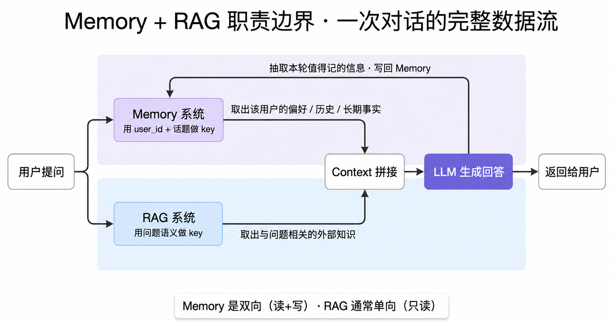
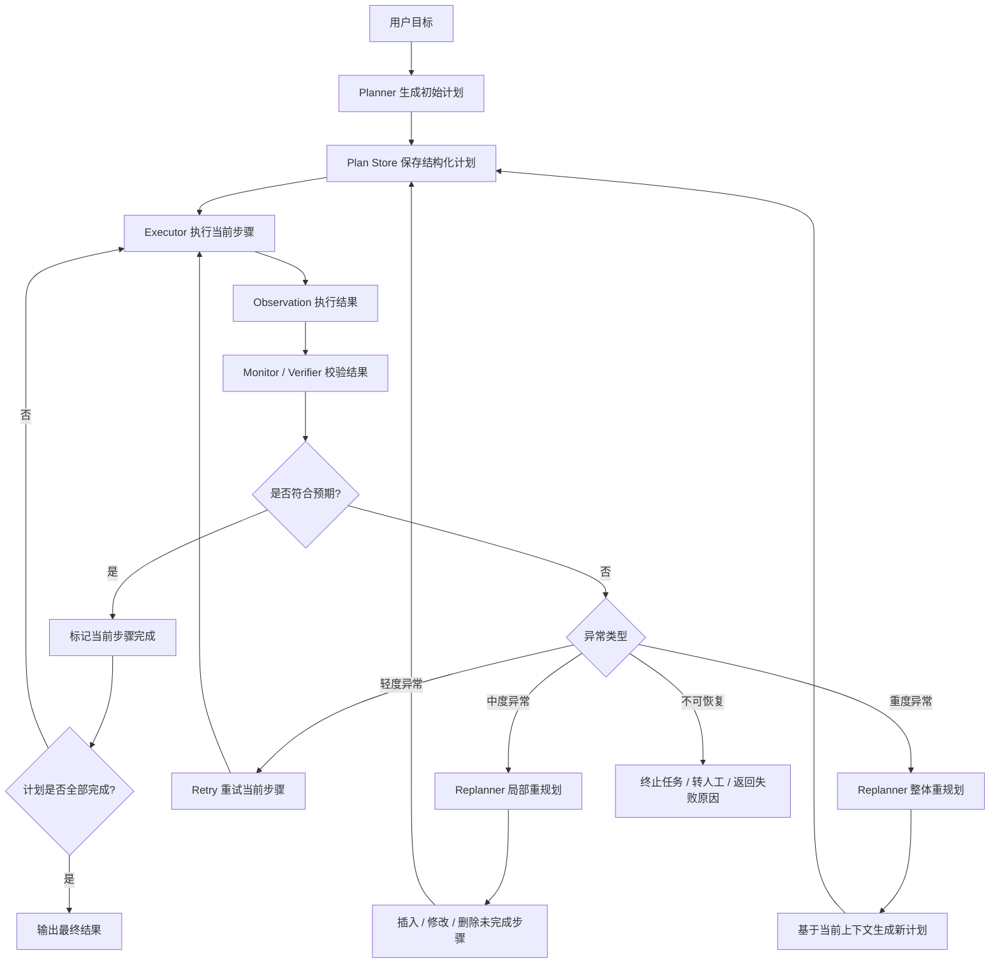
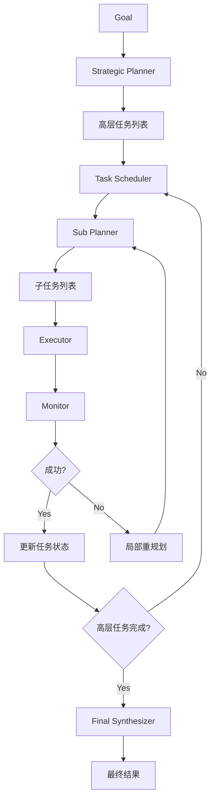
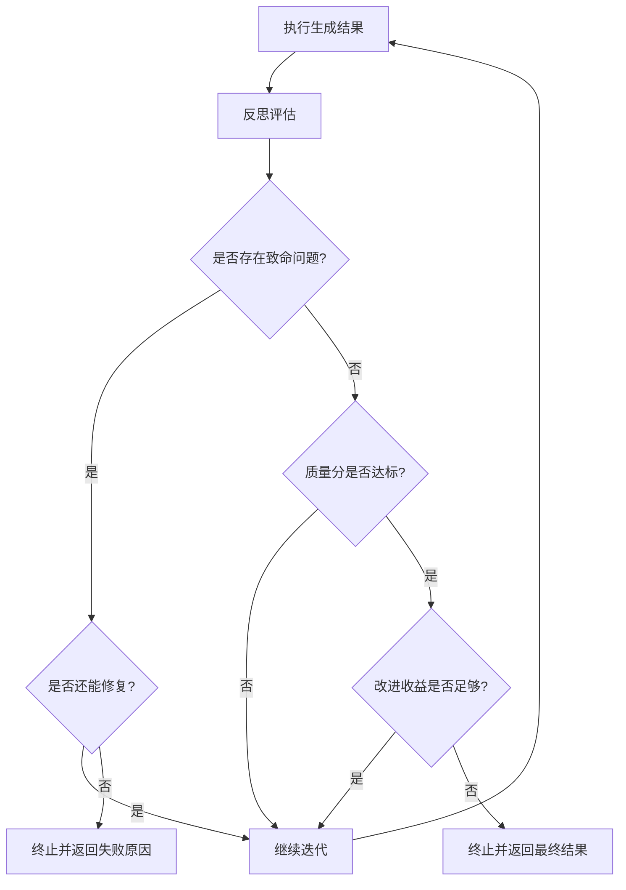
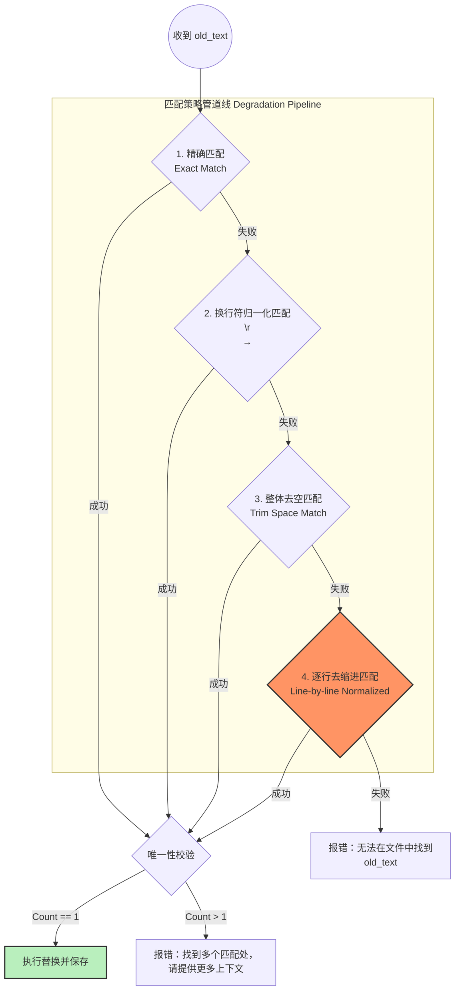
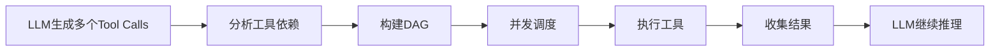
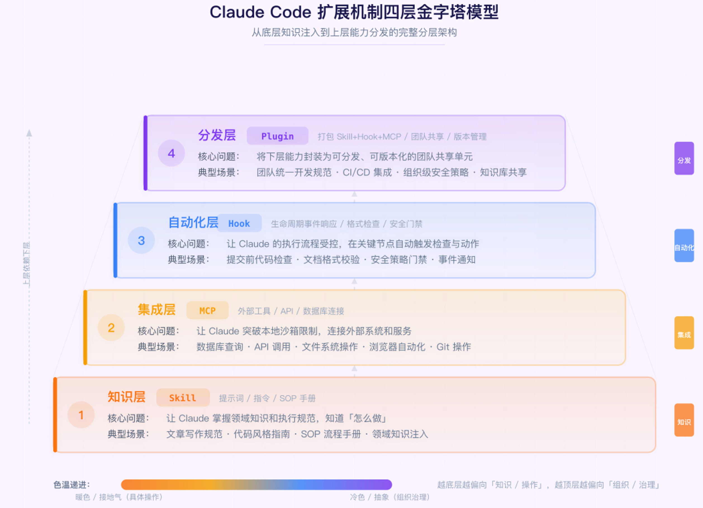
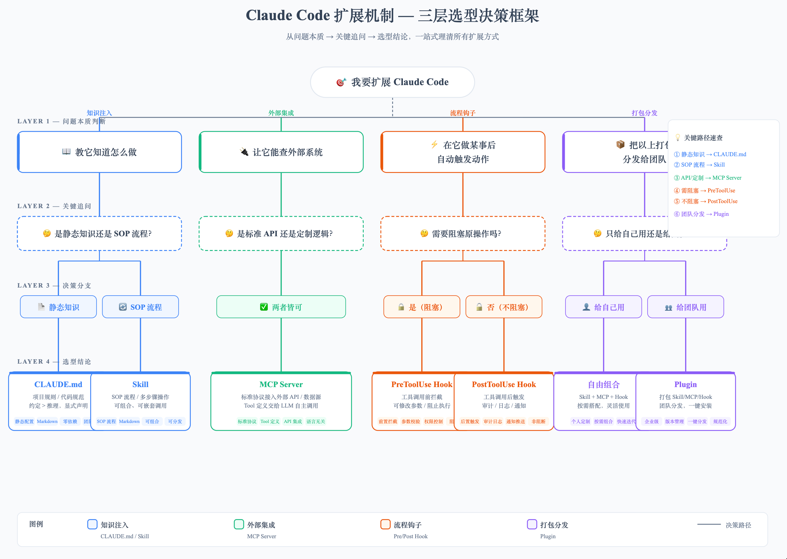

# LLM

## 1、大模型岗位能力要求

### 1.1、产品经理

- 大模型基础知识了解：什么是大模型 / 基本概念如训练 微调 学习等 -->方便和工程师沟通
- 大模型能力的边界了解: 有哪些能力 / 可以做什么 / 有什么缺点 --> 方便结合公司业务找到切入点
- 大模型基本使用（prompt）： 更体会大模型的能力和测试
- 业务数据从哪里来？：评估功能是否有数据来支持实现以及最终验收评估


### 1.2、大模型应用开发工程师

- 大模型基础知识：大模型技术架构（transfromer,embedding）/ 哪些可用的大模型
- 如何调用大模型: gpu知识 / 复杂prompt技术 / python / pytorch / transformers
- 大模型能力评估：是否需要进行微调
- 大模型应用开发中间件: langchain / llamaindex / rag / agent / embedding / 向量数据库等
- 大模型技术选型: 根据业务选择什么大模型 / 中间件选型
- 大模型AI应用开发流程: 开发 / 迭代 / 评估
- 功能容错能力分析：是否允许出现错误 / 如何后处理

### 1.3、大模型推理部署工程师

- 推理框架： vLLM、Tensorrt-LLM、DeepSpeed 和Text Generation Inference
- 掌握推理优化技术：模型压缩/量化技术、解码方法、底层优化与分布式并行推理
- GPU优化知识： cuda / 并行计算优化 / 访存优化 / 低比特计算
- 主流大模型架构: 包含哪些算子 / 各部分耗时分析和优化
- 模型推理性能测试：并发性能，资源利用率，吞吐

### 1.4、大模型算法工程师

- 推理熟悉大模型的训练和微调全过程：数据准备，清理，预训练、指令微调、强化学习，分布式训练，训练策略，模型评测
- 参数高效模型训练技术：LoRA / Prompt Tuning / Prefix Tuning / P-Tuning
- 大模型训练框架：Pytorch、Tensorflow、 Megatron、Deepspeed
- 负责跟踪、探索业界前沿的大模型训练及优化方案
- 大模型评测

## 2、怎么在AI项目中引入deepsearch功能

## 3、如何从零开始训练一个模型

数据准备 → 预训练 → 后训练（或称对齐）

https://mp.weixin.qq.com/s/O4KQPtYExtLcBbBximlffQ

## [大模型部署有哪些主流方案](https://mp.weixin.qq.com/s/z_Pen3M-ycP3mHYYKzAp9g)

大模型部署框架的本质问题是：怎么在固定的硬件上跑得更快、更省显存、支持更多并发用户？

主流框架按定位分四类
1. vLLM：当前生产部署里很常见的框架，UC Berkeley 出品。核心创新是 PagedAttention，把 KV Cache 像操作系统虚拟内存一样分页管理，大幅减少碎片，显存利用率能明显提高。配合 Continuous Batching 实现很高的吞吐量，是很多团队部署 LLM API 时会优先评估的方案。
2. SGLang：vLLM 之后的新一代推理框架，LMSYS 出品。核心创新是 RadixAttention，把多请求的共享前缀（如 System Prompt、Few-shot 示例、对话历史）组织成树结构，相同前缀只存一份 KV Cache。在 Agent、多轮对话、批量 Prompt 场景下比 vLLM 显存更省、首 token 延迟更低。
3. TGI（Text Generation Inference）：HuggingFace 出品，与整个 HF 生态深度集成。优点是开箱即用、支持各种 HF Hub 上的模型、企业级 API 接口（鉴权、metrics、健康检查）。但要注意它近两年的增长势头不如 vLLM / SGLang，选它更多是看中 HF 生态和既有系统集成，而不是追求极致性能。
4. llama.cpp：CPU / 边缘设备部署的事实标准。用 C++ 重写整个推理栈，配合 GGUF 量化文件格式，可以让 7B 模型在 MacBook Pro 上跑、在树莓派上跑、在手机上跑。是个人开发者和边缘部署的首选。

如何选择：
- 生产高吞吐 LLM API：vLLM 默认
- Agent / 多轮对话 / Few-shot：SGLang 更省
- 拥抱 HuggingFace 生态、企业级：TGI
- 本地 / Mac / 边缘 / 无 GPU：llama.cpp
- 极致性能、自家定制：TensorRT-LLM（NVIDIA 官方）

### 直接用 transformers 库跑模型」会有什么问题

最朴素的部署方式是写个 Python 脚本，加载 HF transformers 的 AutoModelForCausalLM，调 model.generate()。能跑起来，但效率会很糟糕，三个核心痛点：
- **KV Cache 显存碎片严重**：每来一个请求，朴素实现会预分配「最大可能长度」（比如 4096 tokens）的 KV Cache 显存。但实际上大多数请求只用 200-500 tokens，剩下的 3500+ tokens 显存就空着浪费了。一台 80GB H100 理论能跑 100 个并发请求，实际只能跑 30 个，显存白白浪费 60-70%
- **批量推理调度低效**：朴素批量处理（static batching）是「凑齐 N 个请求一起跑、所有请求一起结束」。但每个请求生成长度不同（有的 50 tokens 就完了、有的要 1000 tokens），短的请求等长的请求，GPU 大量时间在「跑了一半在等」。吞吐率上不去
- **重复计算**：如果每个用户都用同一段 System Prompt（比如 1000 tokens 的产品知识库），朴素实现每次都要重新算这 1000 tokens 的 KV Cache，浪费极大

部署框架就是为了解决这三个痛点。三大优化方向：内存高效（显存碎片）+ 批量调度（吞吐率）+ 缓存复用（重复计算）。每个主流框架在这三个方向上都有自己的创新。

## 大模型的 DPO 和 PPO 的区别是什么？

DPO 和 PPO 都是大模型对齐训练里的方法，都是在 SFT 之后让模型的输出更符合人类期望。
- PPO 是强化学习里的一个算法，在大模型里的用法是：先额外训练一个「奖励模型」来给模型的回答打分，然后用 PPO 这个 RL 算法不断调整大模型的参数，让它生成的内容往高分方向走。这套流程需要同时维护好几个模型，工程复杂度高，训练也容易不稳定，所以成本比较大。
- DPO 是后来提出的简化方案，它不需要单独训练奖励模型。它直接拿「人类偏好对」数据，就是同一个问题的「好回答」和「差回答」，让模型直接学「应该更像哪个」。更准确地说，DPO 是从带 KL 约束的 RLHF 目标推导出来的一个闭式偏好优化目标，不是说它和任意 PPO 训练过程都完全等价。工程上可以把它理解成把复杂 RL 流程简化成监督学习问题，只需要两个模型，更稳定、更好实现。

简单总结：PPO 是「先训练裁判、再训练选手」，DPO 是「直接拿比赛录像告诉选手哪个动作对哪个动作错」，两者目标一致，但 DPO 省去了裁判这个中间层。

## LLM能否自己做规划

https://mp.weixin.qq.com/s/_WTjjSCKssTd20lBoGzycQ

主要是考察：对 Agent 框架底层机制的理解深度

### 现状

在目前主流的 Agent 系统里，不论是 ReAct、BabyAGI 还是 AutoGPT，核心的 “Planning（规划）” 都是写在 Prompt 或代码结构里的
```
You are an AI assistant. To complete tasks, always think step by step, consider tools you have, and reason before acting.
Use this format:
Think
Decide
Act
Observe
```
这其实就是在告诉模型如何“装作”会规划。模型的每一步行动、观察、反思，都是在模板引导下按部就班地产生。 它并不是在“主动思考”，而是在“填空题”

现在的规划，不是 LLM 自己悟出来的，是我们写给它的

### LLM 能不能自己做规划

能，但是不靠谱，真正的“Agent 规划”，要求的是：
- 能动态调整计划；
- 能看环境反馈再决定下一步；
- 能持续修正目标。

这些，目前 LLM 靠自己还做不到。

所以我们才会看到各种框架都在帮它“补脑”：
- ReAct：让它“想一步，做一步”；
- MRKL：帮它“选工具”；
- BabyAGI：帮它“维护任务列表”；
- AutoGPT：帮它“循环执行命令”。

它们的本质都一样，让 LLM 看起来像在思考，其实是被程序框架“拎着走”

## LLM当前弊端

- **只会「说」不会「做」**。你让 LLM「帮我订一张机票」，它会详细告诉你怎么订，但它真没法替你去携程下单。你让它「帮我把这个 Bug 修了」，它能给你改好的代码，但它没法自己打开编辑器去改文件、跑测试。说白了，LLM 的能力被困在对话框里了，它没法跟外部世界互动，没法操作任何系统；
- **没有「记忆」**。你跟 ChatGPT 聊了一下午，聊了很多你的个人情况和项目背景。结果第二天开一个新对话，它完全不记得你是谁了。因为 LLM 的记忆只限于当前这轮对话的上下文窗口，对话一结束，一切归零；
- **不会用「工具」**。你问 LLM 今天上海天气怎么样，它只能根据训练数据里的旧知识来猜，而不是像你一样打开天气 App 查实时数据。LLM 本身不能上网搜索、不能查数据库、不能调 API，所有回答都来自它「脑子里」已有的知识，而这些知识不仅有截止日期，还可能是错的，也就是常说的「幻觉」问题。
- **不会「规划」**。如果你给 LLM 一个复杂任务，比如「帮我做一份竞品分析报告」，它只能一次性生成一大段文字。它不会像人一样先想想应该先搜集哪些信息、分析哪些维度、用什么框架来组织，然后一步一步去执行。LLM 是「被动响应型」的，你问一句它答一句，没法自主拆解任务、制定计划、分步执行

## LLM 幻觉

所谓幻觉（Hallucination），简单来说就是大模型自信地说出一些听起来很专业但实际上是编造的内容，幻觉不等于「错误」。如果模型说「我不知道这个问题的答案」，那不叫幻觉。幻觉是模型不知道但假装知道，用流畅、自信的语言编造错误信息。

### 幻觉类型

- 事实性幻觉：生成的内容与客观事实不符。比如把爱因斯坦的出生年份说错了，或者编造了一个不存在的学术论文。这又分为两类：
  - 内在幻觉（Intrinsic）：生成内容与输入的上下文信息矛盾。比如文档中写的是 A，但模型说成 B。
  - 外在幻觉（Extrinsic）：生成内容无法从输入上下文或任何已知知识中验证。比如凭空编造了一个不存在的事件。
- 忠实性幻觉

### 幻觉产生的原因

- 数据层面的原因：训练数据中可能包含错误信息、偏见或过时的知识。模型把这些「有问题的知识」学进去了，自然就会输出错误信息。这就是所谓的「垃圾进，垃圾出」。
- 训练层面的原因：大模型的训练目标是「预测下一个 token」，它追求的是生成流畅、连贯的文本，而不是确保每句话都是正确的。这导致模型更倾向于生成「看起来合理」的内容，而不是「事实上正确」的内容。
- 推理层面的原因：在推理阶段，用户的提示词也可能诱导幻觉

### 防止幻觉

1. RAG，RAG 通过以下机制降低幻觉
- 注入真实知识：检索到的文档是真实存在的资料，模型基于这些资料来生成回答，大幅减少了「凭空编造」的可能性。研究表明 RAG 能将事实性幻觉降低 20%-40%
- 注意力机制偏向：当 Prompt 中包含检索文档时，大模型的注意力权重会显著偏向这些文档（约 70-80% 的注意力集中在检索片段），这确保了模型优先参考检索到的真实信息；
- 可追溯可验证：RAG 生成的回答可以追溯到具体的文档来源，如果发现回答有误，可以定位是哪个文档出了问题；

2. Prompt 工程约束：核心思路是通过精心设计的提示词，来约束模型的行为边界
- 限制知识范围：在 Prompt 中明确告诉模型，只能基于给定的资料来回答，不要「发挥」，回答只能来源于提供的文档，超出的部分一律不许碰；
- 要求标注来源：让模型在回答时标注每个观点来自哪个文档、哪个段落
- 鼓励承认不确定：「如果你对某个问题的答案不确定，请坦诚地说『我不确定』或者『根据现有信息无法确认』，而不是猜测。」
- 结构化推理：让模型先列出推理步骤，再给出结论

3. 输出验证（独立校验）：Prompt 约束是「事前预防」，输出验证则是「事后检查」。核心思路很简单：不让模型的回答直接到达用户，中间加一层验证环节
- 用另一个模型来交叉验证，也叫 LLM-as-Judge（用大模型当裁判），是目前自动化幻觉检测最主流的方式
- 用规则引擎验证关键数据：对于数字、日期、人名、金额等关键信息，可以建立规则引擎来校验
- 基于一致性的多次采样验证：对同一个问题，让模型生成多个回答，然后比较这些回答是否一致。如果多个回答对某个关键事实的说法不一致，说明模型对这个事实没有把握，这个事实很可能就是幻觉

4. 领域微调：
- 用领域数据做有监督微调（SFT）
- 用 RLHF 引导「诚实」

## 大模型的 Function Call 能力是怎么训练出来的？

Function Call 的能力主要靠两个训练阶段来培养，这两个阶段解决的是不同的问题。
- 第一个是 SFT，就是给模型喂大量「包含工具调用的完整对话样本」，每条样本覆盖工具定义、用户问题、模型应该输出的结构化 JSON 调用、工具执行结果、最终答案，让模型通过模仿学会整套流程。但光有 SFT 不够，模型可能学得过激，遇到什么问题都想调工具。
- 第二个阶段是 RLHF，通过人类标注「哪种回答更好」来训练奖励模型，再用强化学习调整主模型，让它学会「能直接回答的就直接回答，需要实时数据才去调工具」这个边界感。

一句话总结：SFT 教会怎么调，RLHF 教会什么时候调。

## 什么是模型蒸馏

模型蒸馏是一种能力迁移方法，用一个性能更强的 Teacher Model 生成标签、概率分布、推理过程或偏好数据，再训练一个更小的 Student Model，让小模型在特定任务上接近大模型表现。它的核心价值是降低推理成本、降低延迟、方便私有化或端侧部署。

## 蒸馏和微调区别？

微调是让模型学习任务数据，蒸馏是让学生模型学习老师模型的行为。两者可以组合，比如先用强模型生成领域问答数据，再对小模型做 SFT。

## Prompt、RAG、SFT、DPO、RL 到底怎么选

Prompt 先做轻约束，RAG/工具处理动态知识，SFT 稳定行为，DPO/RLHF 对齐偏好，有明确 reward 再考虑 RL
- 只是表达和格式问题，先用 Prompt：Prompt 能稳定解决，就不要训练，训练会引入数据、成本、版本、评测、回滚问题
- 是动态知识问题，优先 RAG 或工具，因为知识要可更新、可追溯、可替换。微调不是知识库；
- 是稳定行为问题，再考虑 SFT
- 是偏好问题，考虑 DPO 或 RLHF
- 有可验证 reward，才考虑 RL

## 通用基模越来越强了，垂类 SFT、RLHF、DPO 会不会被抹平？

低质量微调会被抹平，高质量行为控制不会

什么微调容易被抹平？
- 用几千条普通QA补通用知识
- 没有评测集，只靠主观感觉
- 把动态业务规则训进模型
- 数据质量低，答案互相矛盾
- 基模一升级，收益就消失

这种微调确实越来越不值钱。因为你补的是通用能力，而通用能力正是基模迭代最快的部分。

但还有一些价值不会自动被基模抹平：
- 业务固定流程
- 品牌话术口径
- 安全拒答边界
- 小模型降本
- 工具调用格式
- Agent 多步决策偏好
- 线上失败样本回流

微调的价值正在从补能力，转向控行为、控偏好、控成本、控风险

## 工程上怎么证明微调有收益

微调不是训练一次就结束，而是数据治理、训练、离线评测、灰度上线、线上监控、失败样本回流的闭环

# Prompts

## 提示词注入


# RAG

- [35 道高频 RAG 面试题总结](https://articles.zsxq.com/id_h3529hb345rr.html)
- [RAG 相关面试题](https://mp.weixin.qq.com/s/BqOdWsCjtXoUllUuFVb29w)
- [GraphRAG](https://mp.weixin.qq.com/s/f8M0MWpdcH4AeauZrdxgqw)

## 现在上下文窗口都 200 万 token 了，RAG 还有存在的必要吗？

https://mp.weixin.qq.com/s/uI4j2MAvNPmshdZ8uzPnCQ

不是说 RAG 过时了，也不是说长上下文万能。关键是作为工程师，做选型的时候有没有认真算过账——成本账、准确率账、延迟账。不要因为'大家都在用 RAG'就用 RAG。

选型决策：
- 第一步：看文档量。 超过 200 万 token（约 1500 份 10 页文档）——只能 RAG，没有选择。
- 第二步：看查询量。 文档量在上下文窗口以内时，如果每月查询少于 50 次，长上下文可能更划算（省了基础设施成本）。超过 50 次，RAG 的边际成本优势开始体现。
- 第三步：看延迟要求。 用户直接使用的产品，TTFT 超过 3 秒就不行——选 RAG。内部分析工具、离线报告生成——延迟不敏感，长上下文可以考虑。
- 第四步：看问题类型。 主要是精确查找类问题（"XX 的定义是什么"）——RAG 更强。主要是综合分析类问题（"比较这三份文档的观点"）——长上下文更强。两者兼有——RAG + 长上下文组合方案。

**RAG vs 长上下文？**

两者不是替代关系，是互补关系。文档量超过上下文窗口只能用 RAG；文档量小且查询少可以考虑长上下文；但最优方案往往是两者结合——RAG 粗筛 + 长上下文精读。

三个维度做过对比。
- 成本上，大查询量 RAG 便宜几十倍，因为每次只传 Top-5 而不是全量文档。
- 准确率上，精确查找 RAG 更强因为检索聚焦，多文档综合长上下文更强因为信息更全。
- 延迟上，RAG 首字延迟约 1 秒，长上下文传 70 万 token TTFT 要 10 秒以上，面向用户的产品基本不可接受。

比如：5000 份文档约 3500 万 token，远超窗口只能 RAG；但有个客户只有 200 份文档、每月查询不到 50 次，我建议他直接用 Gemini 长上下文，省了搭 Milvus 的运维成本"

## 假设你的系统答案准确率从 85% 掉到 72% 了。问题出在哪？

有 3 种可能：

第一种，检索出了问题。向量召回的文档不相关，模型拿着错误的文档当然答不对。这种情况要去优化 Embedding 模型或者调整检索策略。

第二种，检索没问题，生成出了问题。文档召回是对的，但模型生成答案时引入了幻觉——它没有忠实地使用检索到的文档，而是夹杂了自己的"知识"。这种情况要去优化 Prompt 或者加更强的忠实度约束。

第三种，检索和生成都没问题，是测试集的标注有问题。标准答案本身不够准确或不够完整，导致正确的回答被判为错误

正确的做法是：检索阶段单独评，生成阶段单独评，最后再看端到端

## RAG 项目的检索准确率是多少？效果不好的时候你怎么优化的？

优化思路：从链路的每一步找问题
- 文档处理阶段——PDF 表格提取准确率够不够？图片里的文字有没有 OCR？不同格式（PDF/Word/Markdown）分别做了什么适配？
- Chunk 阶段——chunk_size 合不合理？有没有针对不同文档类型调参？overlap 设的多少？
- 检索阶段——纯向量还是混合检索？Top-K 设多少？有没有加 Rerank？
- 生成阶段——Prompt 怎么写的？幻觉怎么处理的？

四种高级优化策略:
- Query 改写——用户的问题可能表述不清或太短，先用 LLM 改写成更适合检索的 query
- 多路召回——同一问题用多种方式检索：原问题检索、改写问题检索、提取关键词检索、拆分子问题检索，最后合并结果
- Parent-Child 检索——检索时用小 chunk（精确匹配），返回时用大 chunk（保留上下文）。具体做法：小 chunk 存向量索引用于检索，每个小 chunk 关联一个父 chunk，检索命中后返回父 chunk 的完整内容
- 上下文窗口扩展——检索到一个 chunk 后，把它前后的 chunk 也带上，保证上下文完整;

## 用的向量模型是哪个？为什么选它？有没有做过评估对比？

## Chunk 粒度你怎么切的？固定大小？内容语义？有没有做 sliding window？

## 向量库召回效果好不好？有没有加 rerank？有没有 query rewrite？

## Prompt 是怎么构造的？知识内容和用户问题怎么融合？有没有模板设计？

## 向量库查询失败怎么办？有没有兜底？

## 系统怎么部署的？支持并发吗？是否支持热更新？

```
                              用户问题
                                 ↓
                          Query Rewrite（可选）
                                 ↓
                ┌─────────────向量召回───────────────┐
                ↓                                   ↓
           多文档语义切分                       Embedding 模型
                ↓                                   ↓
           Chunk 压缩/筛选                  向量入库（Faiss/Qdrant）
                ↓                                   ↓
               TopK 检索结果 ←────────────← Query Embedding
                ↓
         Rerank（可选）/ 过滤低质量段落
                ↓
        拼接 Prompt（格式/长度控制等）
                ↓
        发送给 LLM（ChatGPT/DeepSeek）
                ↓
            返回最终答案
```

## RAG 检索到了正确信息，LLM 还是编造了不存在的内容，怎么办？

幻觉的两种类型：  
① 内在幻觉——检索结果里有正确信息，但 LLM 生成的内容和检索结果矛盾。比如检索说"准确率 91%"，LLM 说"准确率 95%"。  
② 外在幻觉——LLM 生成了检索结果里根本没有的内容。检索只提到了 A，LLM 自己编了 B。

六种幻觉处理策略：  
1. Prompt 约束——在 Prompt 里明确要求"只能基于检索结果回答，检索结果没有的信息不要编造"。
2. 输出自校验——LLM 生成回答后，再用一次 LLM 检查：回答的每一条是否都能在检索结果中找到依据？找不到的标注为"未验证"。
3. 引用标注——要求 LLM 在回答时标注每条信息的来源 chunk，方便人工核查。
4. 温度调低——temperature 设 0.1-0.3，降低 LLM 的随机性，减少"编造"的倾向。
5. 检索结果和生成结果的对齐——生成回答后，把回答和检索结果做相似度对比，如果回答中有大段内容和所有检索结果都不相关，大概率是幻觉。
6. 兜底回答——当检索结果的相似度都低于阈值时，直接回答"未找到相关信息"，而不是让 LLM 硬编。


## Memory 与 RAG

| 维度     | RAG                                             | Memory                                               |
| -------- | ----------------------------------------------- | ---------------------------------------------------- |
| 数据来源 | 外部知识库（文档、网页、产品手册、代码库）      | 用户与模型的交互历史 + 用户主动告知的偏好            |
| 数据归属 | 全局共享（所有用户查同一个知识库）             | 用户私有（每个人有自己的记忆，互不可见）             |
| 更新频率 | 离线构建索引 + 定期增量更新                     | 实时写入 + 持续演化                                  |
| 读写方向 | 通常只读（检索→生成）                           | 双向（读出 + 写回，每轮对话都可能更新）              |
| 检索 key | 问题语义（用户当前提问的 embedding）            | 用户身份 + 当前话题（user_id + topic）               |
| 冲突处理 | 一般不处理（文档版本由 ETL 控制）               | 必须处理（用户先说喜欢辣后说不吃辣怎么办）           |
| 遗忘机制 | 不需要（旧文档自然下沉到检索末尾）              | 必须有（不重要的记忆要能淘汰）                       |

RAG 是图书馆，Memory 是日记本

这两者的边界：



- Memory 是双向的（读 + 写），RAG 通常是单向的（只读）。 这是最直观的差别。Memory 系统在每轮对话里既要读又要写——读出该用户的历史记忆、写入本轮新产生的记忆；RAG 系统一般只在用户提问时读知识库一次
- Memory 的检索 key 跟 RAG 完全不同。 Memory 是 (user_id, topic) 的复合 key——必须先定位到某个用户，再在他的私有空间里检索；RAG 是 query_embedding 的单 key——直接对问题做向量相似度检索，跟用户是谁无关
- Memory 必须做 RAG 不做的事：冲突消解（新旧记忆冲突时取哪个）、遗忘机制（淘汰长期不用的记忆）、隐私隔离（不同用户的记忆绝对不能互通）。这些都不是 RAG 的范围

Memory 和 RAG 的关系:
- 两者不在同一层：RAG 是一种检索增强生成的技术范式，Memory 是一种让模型获得用户长期上下文的产品能力。一个是 how，一个是 what。Memory 系统内部可以使用 RAG 技术做检索，但 Memory 还要解决 RAG 不管的事——写入、更新、遗忘、冲突消解、隐私隔离。所以在 Agent 架构里，它们是两个独立模块，最后拼进同一个 context；
- 三个核心差异：
  - 数据来源：RAG 接外部知识库，Memory 接用户交互历史。
  - 数据归属：RAG 全局共享，Memory 用户私有。
  - 读写方向：RAG 通常只读，Memory 必须双向。
  - 检索 key：RAG 用问题语义，Memory 用 user_id + topic
- ChatGPT Memory 是纯 Memory，记的是用户自己的偏好；Anthropic Memory tool 是纯 Memory，用文件系统而不是向量库；Cursor 项目索引是纯 RAG，对代码做 embedding 检索；Claude Code 个人 Memory 是纯 Memory。RAG 是技术手段，Memory 是产品职责

## 为什么 Agent Skill 不靠向量 RAG 召回？

因为 Skill 本质是「做事的流程手册」，靠模型自己看目录、按需翻页（渐进式披露 + 文件系统）；而向量 RAG 是「把文档切碎、按相似度捞回片段」。一个是主动翻手册，一个是被动捞碎片——活儿不一样，自然不用同一套召回
- RAG：在海量、非结构化的知识库里做事实问答——「公司去年的报销政策是什么」这种。知识体量越大，向量检索的加速价值越明显；
- SKILL：把过程性专长打包——「这件事分几步、用哪个工具、有哪些坑」。它管的是「怎么做」，顺带还能改工具权限。

## 面试两点句式

系统描述型
- 构建基于大语言模型的知识增强问答系统，支持文档解析、向量召回、Prompt 构造、答案生成全链路流程。
- 项目采用 Faiss + text-embedding-3 构建向量库，实现毫秒级语义检索；结合 Prompt 工程提升上下文注入效果。

技术挑战型
- 针对知识重复、文本冗余问题，优化 Chunk 生成逻辑，引入 sliding window + 去重策略，有效提升知识利用率。
- 使用 query rewrite 技术处理用户自然语言问题，提升召回准确率 12%。

工程能力型
- 使用 FastAPI + Streamlit 构建前后端分离系统，支持多轮问答、token 成本统计与错误日志追踪。
- 项目支持私有化部署，封装为一键运行的 Docker 镜像，支持企业内网部署。

效果指标型
- 系统上线后在内部知识问答场景中覆盖率达 92%，用户满意度超 87%，平均响应时间小于 1.2 秒。
- 在真实评测集上与 baseline（无 query rewrite + 无 rerank）相比，召回 Top-5 命中率提升 15%。


# MCP

## MCP 的消息格式：JSON-RPC 2.0

为什么？MCP 需要一种「Client 调用 Server 的方法，Server 返回结果」的通信模式，这本质上就是远程过程调用（RPC）

JSON-RPC 2.0 是现成的、足够轻量的 RPC 规范，用 JSON 格式易读易调试，任何编程语言都能实现，不管 Server 是 Python 写的还是 TypeScript 写的，消息格式都一样，不需要额外的序列化工具。

每条消息就是一个 JSON 对象，格式固定：
```json
// 请求消息（Client -> Server）
{
  "jsonrpc": "2.0",
  "id": 1,                        // 请求 ID，用于匹配响应
  "method": "tools/call",         // 调用的方法名
  "params": {
    "name": "take_screenshot",    // 工具名
    "arguments": {"url": "https://example.com"}
  }
}

// 响应消息（Server -> Client）
{
  "jsonrpc": "2.0",
  "id": 1,                        // 对应请求的 ID
  "result": {
    "content": [{"type": "image", "data": "...base64..."}]
  }
}
```
JSON-RPC 本身只定义消息格式，不关心底层怎么传输，MCP 在此基础上定义了两种传输层实现

## MCP 协议通常采用什么通信方式？

MCP 支持两种主要的传输方式，分别适用于不同场景。
- 本地场景用 stdio，Client 把 Server 作为子进程启动，通过标准输入输出通信，延迟极低，不用开端口，也没有网络安全问题，我用 Claude Desktop 接本地工具走的就是这种方式。
- 远程场景现在推荐用 Streamable HTTP，Server 作为独立的 HTTP 服务部署，多个 Client 可以共享同一个 Server，适合团队统一管理工具服务。

MCP 早期版本（2024-11-05 规范）的远程传输是「HTTP + SSE」双端点方案，2025 年 3 月的规范更新里被标记为 deprecated（保留向后兼容但不推荐新项目使用），Streamable HTTP 成为了推荐的远程传输方式。不管哪种传输方式，底层消息格式都统一用 JSON-RPC 2.0，传输方式只影响「怎么传」，消息协议本身不变

## 为什么 SSE 被弃用了

在 2025 年 3 月的规范更新里被标记为 deprecated，仍然保留向后兼容，但新项目应该直接用 Streamable HTTP；

为什么要替换？原因是架构上有一个小尴尬：Client 向 Server 发请求要走 POST 端点，Server 向 Client 推数据要走另一条 SSE 长连接端点，同一个对话被拆成了两条通道。这带来的具体问题是状态管理复杂，比如 Client POST 了一条消息之后网络突然断了，那条消息到底被处理了没、SSE 流会不会推回结果，Client 没有一个简单的办法判断，出问题时排查链路很长；

Streamable HTTP 的做法是把这两条通道合并成一个端点：Client 照样 POST 发请求，Server 根据情况决定返回「一个普通 JSON」还是「一条 SSE 流」，不需要 Client 提前开另一条连接；

注意这里的关键：Streamable HTTP 并没有抛弃 SSE，流式推送的部分底层还是 SSE（Content-Type: text/event-stream），只是把端点从两个合成一个。架构更简洁、对负载均衡和 serverless 环境都更友好

# Agent

## Agent 对接业务系统API的最佳方案是什么

一般来说：
- 公司里的业务服务的http、rpc接口，要做成 mcp 服务；
- 规范、标准、提示、流程等要做 skills

## 过度依赖大模型会存在什么问题

完全依赖大模型自纠错重试，在工业场景有三大隐患：放大故障、误操作风险、成本失控。模型基于不完整错误信息盲目试错，可能越修越错，甚至形成无限循环。

工程上必须加防线：返回结构化错误（标明是否可重试）、设置重试预算、区分工具风险等级（写操作需严格限制）、约束参数变化范围、引入熔断机制。

本质：让模型负责“想”，系统负责“控”，避免失控执行

## Agent 的核心组成

- 第一个是大脑，也就是 LLM，负责理解意图、推理判断、决定下一步行动。
- 第二个是规划模块，负责把复杂任务拆解成可执行的步骤。
- 第三个是记忆模块，负责存储和检索信息，让 Agent 能在长时间任务中保持连贯。
- 第四个是工具模块，是 Agent 的「手和脚」，让它能跟外部世界互动。

## ReAct Agent 

### 使用正则表达式来解析大语言模型的输出（如 Thought 和 Action）存在什么问题

比如：
```py
thought_match = re.search(r"Thought:\s*(.*?)(?=\nAction:|$)", text, re.DOTALL)
action_match  = re.search(r"Action:\s*(.*?)(?=\n(?:Thought|Observation):|$)", text, re.DOTALL)
match = re.match(r"(\w+)\[(.*)\]", action_text, re.DOTALL)
```
存在的问题：很多场景下可能无法解析出来

| 场景 | 示例输出 | 结果 |
|------|---------|------|
| LLM 输出多余前缀 | `"当然！\nThought: ..."` | thought 正常，但常见于 GPT-4o/Claude |
| Action 内容含换行 | `Finish[第一行\n第二行]` | `(?=\n...)` 会提前截断 |
| 字段顺序颠倒 | LLM 先输出 Action 再 Thought | 两个都能匹配但语义错乱 |
| 大小写变体 | `action:` / `THOUGHT:` | 完全匹配失败，返回 `None` |
| 中英文混排 | `思考:` 代替 `Thought:` | 无法匹配（中文 prompt 常见） |
| 多个 Action 块 | 模型输出了两个 `Action:` | `re.search` 只取第一个 |

有哪些更好的解决方法：

**（1）结构化输出（Structured Output）**  

让 LLM 直接输出 JSON，从根本上规避解析问题：
```py
REACT_PROMPT_TEMPLATE = """
...
请严格以 JSON 格式回应，不要输出任何其他内容：
{{
  "thought": "你的思考过程",
  "action": {{
    "type": "tool_call" | "finish",
    "tool_name": "工具名（type为tool_call时）",
    "tool_input": "工具输入（type为tool_call时）",
    "final_answer": "最终答案（type为finish时）"
  }}
}}

Question: {question}
History: {history}
"""
```
对于支持 Function Calling / Tool Use 的模型（OpenAI、Claude、Gemini），可直接使用原生工具调用 API，彻底绕过文本解析：
```py
tools_schema = [
    {
        "name": "Search",
        "description": "网页搜索引擎",
        "input_schema": {
            "type": "object",
            "properties": {"query": {"type": "string"}},
            "required": ["query"]
        }
    }
]
# Claude API 示例
response = client.messages.create(
    model="claude-opus-4-6",
    tools=tools_schema,
    messages=messages
)
# 响应直接包含结构化的 tool_use block，无需解析
```

（2）强化正则 + 防御性解析

## Plan-and-Execute

### 规划阶段生成的计划是"静态"的（一次性生成，不可修改）。如果在执行过程中发现某个步骤无法完成或结果不符合预期，应该如何设计一个"动态重规划"机制？

把 Plan-and-Execute 改成 Plan-and-Monitor-and-Replan 架构



1. 计划不要设计成纯文本，而要结构化，这样后续才能精确修改某一步，而不是重新生成一大段计划
2. 每一步执行后都做结果校验，需要引入一个 Monitor / Verifier；
3. 动态重规划不是全量推翻，而是局部修正
4. Replanner 的输入要包含执行上下文:不要只把失败原因丢给模型，而是给完整状态

### 分层规划系统


主要优势：
- 优势一：降低规划复杂度
- 优势二：节省上下文，分层规划：执行时只关注：当前高层任务 + 当前子计划；
- 优势三：局部重规划
- 优势四：支持多 Agent 协作，高层 Planner：复杂拆分任务，底层 Agent：具体执行任务的
- 优势五：支持长期任务

## Reflection

### 终止条件是"反馈中包含无需改进"或"达到最大迭代次数"。这种设计是否合理？能否设计一个更智能的终止条件？

属于最基础的终止机制，优点是简单、稳定、容易实现；缺点是容易出现两类问题：
- 误停：模型说“无需改进”，但结果仍有问题
- 空转：已经没有明显收益，但还在继续反思

可行的终止条件：

核心思想是：
- 不要只相信模型说“无需改进”
- 要用结构化指标判断是否应该停止

**推荐的终止条件**  
强制终止：
- 达到最大迭代次数
- 超过Token/时间/成本预算
- 出现不可恢复错误

质量终止：
- 用户目标全部满足
- 自动验证通过
- 反思评分达到阈值
- 无致命问题

收益终止：
- 连续N轮提升很小
- 反馈高度重复
- 修改差异很小

## MCP 解决了 Function Call 的什么问题

MCP 和 Function Calling 不在同一层。 一个是协议，一个是 API 字段。比较它们的"feature 差异"是错的，要比较的是"抽象层级"

MCP 解决的是 N×M → N+M 的工程复杂度问题。 Function Calling 形态下，每个客户端要为每个工具单独适配，复杂度乘法增长；MCP 协议层引入后变成加法增长

MCP 让"工具"成为可复用资产。 写一份 Server 实现，被任意 Client 复用。这件事 Function Calling 在它的形态下做不到——因为它跟模型厂商强绑定

MCP 不是 Function Calling 的升级版，是 Agent 时代必需的协议层抽象——就像 LSP 之于 IDE，HTTP 之于 Web。

MCP 是 Agent 时代的协议层，跟 Function Calling 不在同一层抽象——FC 是各家 API 私有字段，N×M 重复适配；MCP 是基于 JSON-RPC 2.0 的开放协议，N+M 收敛复杂度。我们项目里把内部数据库工具包成 MCP Server 之后，Claude Code、Cursor、Cline 三个客户端都能复用同一份实现，升级时只改 Server 不动 Client，工具就真的变成了可复用资产

## Tools、Workflow 和 Agent 三者的区别是什么？

- [Agent、传统编程、Workflow 区别](https://mp.weixin.qq.com/s/4-p6yujL0nrwihnbkilZLw)

### 三层结构

- Tools 是最小的能力单元，就是封装好的可调用函数，比如搜索、执行代码、发邮件，它只负责「执行」，本身没有任何决策能力；
- Agent 是一个完整的决策系统，内部用 LLM 做大脑，自己判断什么时候调哪个 Tool、要不要继续、什么时候结束，是主动的；
- Workflow 是更上层的编排框架，把 Agent、LLM、Tools 组织成一条确定性流程，每个节点做什么、按什么顺序流转都是开发者事先写死的。

三者最核心的区别就一句话：Tools 不做决策只执行，Agent 自己做决策，Workflow 是开发者替所有节点把决策提前写好。

### Tool

Tools 是整个体系里最简单、最底层的概念，它就是一个封装好的函数，有明确的输入参数、明确的输出结果，就这么简单。

Tools 和普通函数唯一的区别是：你需要额外写一份「说明书」告诉 LLM 这个工具叫什么名字、能做什么事、需要传哪些参数，这样 LLM 才知道自己有哪些能力可以调用。

工具本身没有任何决策能力，它甚至不知道自己「应该」在什么时候被使用。 

### Agent，拿着工具自己做决定的人

Agent 就是那个「拿着工具、自己决定用哪个」的角色。你给 Agent 一个目标，比如「帮我调研一下最近竞品的动态」，它不会直接给你一个答案。而是开始自己思考：我要完成这个目标，第一步应该搜索什么关键词？搜索结果里有没有我需要的信息？需不需要再多搜几次？什么时候才算调研完了？

Agent 和 Tools 最本质的区别：**Tools 被动等待调用，Agent 主动做决策。**

Agent 的运行方式是一个反复循环的过程：想清楚（Thought）-> 行动（Action）-> 看结果（Observation）-> 再想清楚 -> 再行动…… 直到 LLM 判断任务完成为止，这个循环才结束。

### Workflow，把所有人组织起来的总指挥

把整个执行流程的「骨架」写在代码里，LLM、Agent、Tools 都只是这个流程里的「节点」，每个节点负责完成自己那一步。

Workflow 和 Agent 最核心的区别：谁在做「下一步去哪」这个决策？Agent 是 LLM 自己决定，Workflow 是开发者在代码里写死。

Workflow 最大的优点是可预测、可控、好调试。你在代码里看到什么，它就做什么，不会有任何「惊喜」。

Workflow 的控制权在代码手里，流程是确定的、可预测的、可复现的，但灵活性比较差。Agent 的控制权在 LLM 手里，行为是动态的、灵活的、能适应变化的，但相应地也带来了不确定性。

从成本角度看，Workflow 因为流程固定，token 消耗比较省，大约是 Agent 的四分之一。Agent 因为需要反复推理决策，token 消耗要高得多。

从可靠性看，Workflow 行为可预测，出了问题容易定位；Agent 决策路径不确定，调试起来更困难。

### 总结

目前生产环境里最主流的模式是「Agentic Workflow」：用 Workflow 固定主流程的骨架，在需要灵活判断的节点嵌入 Agent，其余固定节点直接用 LLM 或 Tools

| 维度       | Tools               | Agent                          | Workflow                           |
| :--------- | :------------------ | :----------------------------- | :--------------------------------- |
| 决策能力   | 无（只执行，不决策） | 有（LLM 自主动态决策）         | 无（开发者在代码里写死）            |
| 执行方式   | 被动，等待被调用    | 主动，自主循环直到完成         | 按开发者定义的顺序执行             |
| 确定性     | 高（输入固定则输出固定） | 低（同输入可能走不同路径）     | 高（行为完全可预测）               |
| 灵活性     | 只做一件事          | 高（能应对预料之外的情况）     | 低（流程提前写死，难以动态调整）   |
| 调试难度   | 容易（单一函数）    | 难（执行路径不确定）          | 容易（链路清晰，可逐步追踪）       |
| 适用场景   | 封装单一具体能力    | 路径未知的复杂任务             | 流程相对固定的业务系统             |

### 什么时候用 Workflow，什么时候用 Agent？

从最简单的方案开始，只在明确需要时才增加复杂度;

如果任务步骤是固定的、可以提前规划好的，或者对可靠性要求很高（比如金融交易、医疗系统），那就用 Workflow。如果任务是开放式的、无法预知所有步骤，或者需要灵活应对各种意外情况，那就用 Agent

## 在多智能体系统中，如何解决智能体间的冲突和竞争？

标准答案：
- 优先级队列机制
- 共识算法（如PBFT）
- 资源锁定策略
- 仲裁者模式

## 如何量化评估智能体系统的性能？

评估维度：
- 响应时间（RT）
- 准确率（Accuracy）
- 用户满意度（CSAT）
- 系统稳定性（SLA）

加分回答：建立A/B测试框架，实时监控关键指标，定期优化模型参数

## 如何设计智能体的状态持久化方案？

- Redis缓存策略
- 数据库事务管理
- 状态快照机制
- 故障恢复策略

## SubAgents 中父子通信为什么不采用函数调用？

首先是思考两个问题：
- 第一个追问：如果 subagent 是个跑 5 分钟的代码评审任务，那这 5 分钟里，父 agent 能干啥？用户跟父 agent 说话又会发生什么？
  - 父 agent 啥也干不了，被同步阻塞死了。用户在这 5 分钟里跟它说话也没反应；
- 第二个追问：如果父 agent 想同时派 5 个 subagent 并行调研 5 个模块，你这个「调函数等返回」的方案要怎么改？
  - 要么 5 个 subagent 全在主线程里阻塞排队，要么得手动搓各种并发代码，整体会乱成一锅粥；；

## Agent 为什么容易翻车？

Agent 的核心是动态决策，它不是固定 Workflow，每一步都会根据中间结果决定下一步。所以它的自由度更高，也更容易出现死循环、工具误调用、上下文污染、多步任务中断和权限越界。工程上不能只靠模型自觉，需要用步数限制、状态记录、工具边界、错误恢复、权限确认和审计来兜底。

边走边判断，就意味着每一步都可能判断错。

所以 Agent 的可靠性，不只取决于模型聪不聪明。还取决于：
- 每一步有没有状态记录
- 工具有没有清晰边界
- 失败能不能恢复
- 有没有停止条件
- 有没有人工确认
- 有没有审计和回放

现在模型能力、工具调用、MCP 都成熟了，为什么 Agent 真正上生产还是容易翻车？

Agent 生产不稳的根因，不是某一个 Prompt 没写好，而是长链路执行过程不可见。生产级 Agent 必须把计划、上下文、工具调用、状态变化、成本和评估结果全部纳入观测，否则出了错无法定位，也无法持续改进。

## 怎么理解 Agent Harness 可观测性？它到底要观测什么？

Agent Harness 可观测性，是对 Agent 执行过程中的目标、计划、上下文、工具调用、状态变化、成本、风险和结果质量进行全链路记录、度量、回放和评估的能力。

可观测性不是为了事后甩锅，而是为了让 Agent 的每一次执行都能变成可分析、可复现、可改进的工程数据。

Agent Harness 可观测性，本质上是在 Harness 里给 Agent 装眼睛。它不只看最终答案，而是把一次任务拆成目标、计划、上下文、工具、状态、成本、评估这些可观察对象，让系统能定位错误、复盘过程、控制成本，并把失败样本沉淀成后续改进。

## Agent 可观测性和普通日志有什么区别

传统日志关注服务状态，Agent 可观测性关注执行意图和决策过程。

Agent 出问题时，HTTP 状态码可能全是 200，但任务已经偏了。所以生产级 Agent 需要结构化 Trace，把 Plan、Action、Observation、State Diff、Context Source 和 Eval Result 串起来，而不是只打输入输出日志；

## 如果让你设计 Agent Trace，你会记录哪些字段？

把 Agent Trace 设计成任务级和步骤级两层。任务级记录原始目标、版本、状态、总成本和最终评估；步骤级记录每一步的计划、上下文来源、模型输出、工具调用、状态差异、成本和局部评估。这样失败后既能看全局链路，也能定位到具体哪一步开始出问题

## 怎么防止 Agent 死循环？

**为什么会死循环？**

第一，缺停止条件。Agent 不知道什么时候应该停。它以为继续调用工具就能解决问题。  

第二，缺失败记忆。同一个工具已经失败过，它没有记住。于是反复重试。    

第三，缺任务完成判断。它不知道当前信息已经不足以继续推进，应该转向追问用户。

**如何兜底：**
- 限制最大步数：超过步数，就必须总结当前进展和缺失信息
- 记录失败工具：如果同一个工具用同一组关键参数失败过，不要无限重试，应该改变策略：
  - 缺参数，就追问用户
  - 工具超时，就有限重试
  - 无数据，就换查询范围
  - 权限不足，就停止说明
- 设计停止条件
  - 已经拿到足够证据
  - 缺少关键输入
  - 工具连续失败
  - 达到最大步数
  - 进入高风险动作前

这几个条件一触发，Agent 就不能继续自由探索。它要么交付阶段性结果。要么请求用户补充。要么进入人工确认。

答案：我会设置最大步数、最大重试次数和停止条件，并记录失败工具和关键参数。如果同一个工具因为同样原因失败，就不能无限重试，要根据错误码选择追问用户、缩小范围、换工具或停止说明。

## 怎么防止 Agent 调错工具？

**为什么会误调用：** 工具边界不清，Agent 就会把咨询当执行
- 第一，工具描述太像，比如：get_order_info、query_order、search_order、order_detail，模型分不清哪个该用；
- 第二，读写工具没分开：查询和操作混在一个工具里；
- 第三，参数 Schema 太松
- 第四，工具返回值没有明确状态

**如何解决：** 核心是把工具边界写进系统
- 查询工具和动作工具分开
- 高风险动作必须二次确认：只要涉及钱、权限、通知、生产环境、删除、修改，都不要让 Agent 单独决定，用户确认后再执行；
- 工具调用前做规则校验，不要把所有判断都交给模型，模型负责决策，系统负责守门；
- 返回结构化错误：不要只返回 "error"，要告诉智能体哪里错、怎么改
- 当连续失败 2~3 次时，不要继续盲调工具，而是强制进入反思步骤

工具设计上要把查询类和动作类分开，工具描述写清适用场景和不适用场景，参数 Schema 收紧类型、枚举和必填字段。执行前还要做规则校验，高风险动作只能先生成草稿，用户确认后才能调用正式执行工具。

## 架构设计：为什么需要 Tool Registry

在 Harness（驾驭工程）的理念中，Main Loop 永远是“瞎子”和“聋子”。它不应该知道 bash 命令怎么调用，也不应该知道 read_file 需要什么参数格式。它只负责维护上下文，并将模型吐出来的 JSON 字符串丢给执行层。因此，Tool Registry 扮演了一个极其关键的“集线器（Hub）”和“路由器（Router）”的角色。它的核心职责有三：
- 动态挂载（Register）：允许开发者在引擎启动时，随时随地向系统插拔新的工具实现。
- 描述暴露（Expose Schema）：在每次向大模型发起推理前，Registry 负责把当前所有已挂载工具的名称、描述以及 JSON Schema 打包成列表，交给 Provider 翻译给大模型听。
- 路由分发与执行（Dispatch & Execute）：当大模型决定调用某个工具，并吐出一串 JSON 参数（ToolCall）时，Registry 负责找到对应的函数，把 JSON 丢给它执行，最后将结果封装成统一的 ToolResult 返回给 Main Loop；

## Tool 设计需要注意什么

在大模型的 API 调用中，Token 就是金钱，Context 就是生命线。如果放任大模型读取超大文件，不仅会引发高昂的账单，还会导致上下文爆炸，甚至导致 API 拒绝服务。

驾驭工程的真谛就是：绝不把系统的安全性寄希望于大模型的理智，而是在底层的工具实现中强制兜底

### 读文件 Tool 文件过长的处理方法

真实的实践中，比如代码库探索场景中，如果大模型需要分析一个 20000 行的核心业务类，如何解决文件字符过多问题？
- **工具输出卸载（Tool Call Offloading）**：工业级 Harness 的主流做法是在工具执行层实现输出卸载策略——当文件或命令输出超过阈值（通常为数千至数万字符）时，Harness 自动将完整内容写入磁盘临时目录，并向模型返回一段“头部预览 + 尾部预览 + 文件路径引用”的摘要消息，例如：“文件过长（共 5000 行，已卸载至 ）。以下为首尾预览，如需完整内容请调用 read_file('')。” 通过这种方式，既保留了模型的决策依据，又倒逼其按需局部读取；
- **结合全局 Context Compaction**：即使我们在单工具内通过卸载策略放宽了读取限制，在引擎的全局层面，工业级 Harness 依然在 Main Loop 中设有上下文窗口监控机制。当 Token 使用量接近模型上下文窗口的预设阈值（通常为 75%~98%）时，Harness 会触发 Compaction——对历史会话进行压缩（策略有多种，比如智能摘要等)，保留架构决策、未解决的 Bug 等高价值信息，裁剪冗余工具输出，使 Agent 得以在不丢失关键上下文的前提下继续长时运行

## Tool 是不是越多越好？为什么工具越多，Agent 越笨？

大模型的每一次思考（每一次 Turn 发起请求时），都必须把这些极其冗长的工具描述（JSON Schema）全部阅读一遍。这在业界被称为 Context Bloat（上下文膨胀）

这会带来三个致命的后果：
- **极高的成本与延迟**：仅仅为了问一句“帮我看看 main.go 的代码”，你就要向大模型发送 3 万个 Token 的前置工具描述。每次 API 请求的时间和金钱成本呈指数级上升。
- **注意力分散**：这是最致命的。大模型的核心机制是注意力（Attention）。工具描述越多，大模型对核心任务指令的注意力就越弱。它非常容易发生幻觉（Hallucination），在几十个长得差不多的工具中调用了错误的那一个。
- **无尽的适配维护**：你每加一个特定的专用工具（比如 search_jira_ticket），就要在引擎里维护一套繁琐的反序列化和 API 请求代码。一旦第三方接口变更，Agent 直接罢工；

**如何解决这个问题？**：回归操作系统的本质，在 OpenClaw / pi 的极简哲学中，仅需为大模型提供 4 个基础工具：
- read：读取文件内容（获取环境信息）。
- write：创建新文件或完全覆盖文件。
- edit：精准的局部代码替换（外科手术式修改。由于其具备多级降级的复杂性，我们将在下一讲专门实现）。
- bash：在当前工作区执行任意 Shell 命令（终极执行器）

把底层操作系统的能力直接还给模型，用大模型的自然语言直接驱动 bash，这才是 Agent 正确的工具使用形态；

## Bash Tool 如何解决安全问题？

对于在本地开发者机器上运行的 Agent，过度前置的安全校验往往是“安全剧场（Security Theater）”

> 安全剧场（Security Theater）指一些安全措施主要停留在形式层面——例如做了很多看起来很严格的校验 / 流程，但这些手段对真实风险的降低帮助有限，或无法有效覆盖攻击的关键路径。其效果更像“展示安全姿态”，而不是实质性地提升安全性

在基础开发阶段，OpenClaw 奉行 YOLO 模式：默认全权信任，直接在工作区（WorkDir）中执行;

注意：在本地开发环境我们可以 YOLO，但是如果接入企业 IM 用于远端服务器线上运维时，会引入严格的 Human-in-the-loop 人工审批。这是部署环境差异决定的架构折中；

## Edit File Tool 如何实现文件编辑的？

大模型在输出 old_text 时，经常会犯一种极其顽固的错误——格式幻觉

把容错做在底层工具里，吸收大模型的误差。不要求精确匹配，而是实现一条多级模糊匹配链


在这套多级匹配的管道线中：
- 级别 1：最快最安全的精确匹配。
- 级别 2：解决不同操作系统（Windows vs Unix）换行符导致的幻觉。
- 级别 3：忽略整个代码块首尾的多余空行。
- 级别 4（核心容错）：将 old_text 和原始文件都按行切分，去掉每一行的首尾空格（消除缩进差异），然后再进行比对。

最关键的安全底线是“唯一性校验”：模糊匹配可能会导致匹配到代码里多个相似的片段。如果匹配结果 > 1，工具绝对不能盲目替换，而是必须抛出错误，要求大模型提供更多的上下行代码以精确定位

## Tool 数量过多，从工程角度如何优化工具的组织和检索机制？

工具数量过多，如果一次性都塞给 LLM，会造成：
- Prompt 过长
- Token 消耗巨大
- 工具选择准确率下降
- 同类工具混淆
- 推理速度变慢

工程上通常会采用 分层工具检索（Tool Retrieval） 架构。
- 工具分组（Tool Category），按照类似文件夹的方式组织；
- Tool Embedding 检索，给每个工具建立向量描述
- Tool RAG：给每个 tool 建立知识库；
- Router Agent：增加一个专门的路由智能体，每个专门的 Agent 包含独有的工具；
- MCP Registry
- 技能化（Skill）：不要让模型直接面对 100 个 Tool

| 工具数量     | 推荐方案                           |
| -------- | ------------------------------ |
| < 20     | 直接全部放 Prompt                   |
| 20~50    | 分类路由                           |
| 50~200   | Tool Embedding Retrieval       |
| 200~1000 | Router Agent + Tool RAG        |
| 1000+    | MCP Registry + Dynamic Loading |

很多 Agent 平台（包括 Claude Code、OpenAI Agents、企业级 MCP 平台）采用的核心思路：不要让模型在 100 个工具里硬选，而是先检索，再选择

## Agent 中，如果执行多个 Tool，如何并行执行？

1. 判断是否可以并行：第一步不是并发，而是分析工具之间是否存在依赖关系。
- 无依赖 → 并行执行
- 有依赖 → 按依赖关系分层执行（DAG）

独立性假设：如果大模型在同一个 Turn（单次 Response）中并行下发了多个工具调用，Harness 引擎必须假设这些调用是互不依赖、互相独立的。引擎应当无脑并行执行它们。为什么？因为大模型在经过大量 RLHF（基于人类反馈的强化学习）微调后，它非常清楚：如果有强先后依赖的操作，必须分两个 Turn 来完成。

2. Agent 并行执行流程


- LLM 一次生成多个 Tool Call
- Runtime 判断哪些可以并行
- 使用协程/线程池执行
- 聚合所有结果
- 返回给 LLM 继续推理

3. Python 推荐方案

- Python 3.11+：asyncio.TaskGroup
- Python 3.10 及以下：asyncio.gather()， Python 3.10 及以下：asyncio.gather（）

4. 必须控制并发数
- API 调用数
- 数据库连接数
- 第三方服务 QPS

5. 每个 Tool 都要有保护机制，建议统一实现：
- 超时（Timeout）
- 重试（Retry）
- 异常隔离（Exception Handling）
- 日志记录（Logging）

避免一个工具失败导致整个 Agent 失败。

6. Tool Result 要标准化：每个工具统一返回

> Agent 的并行执行本质上是：LLM 一次生成多个 Tool Call，Runtime 根据依赖关系构建 DAG，对无依赖任务使用 asyncio 等机制并发调度，并结合限流、超时、重试、异常隔离等工程能力，最终聚合结果供 LLM 完成后续推理

## 如何解决 Tool 并行执行的并发问题

一个可行的思路是在 Tool Registry 层面引入一种“基于文件路径的细粒度锁（File-Path based Mutex）”策略，使用 sync.Map 为每个文件路径维护一把独立的 RWMutex。前提是所有协程必须严格遵守“先获锁，后操作文件”的规范，RWMutex 才能将并发的文件 I/O 序列化，从而消除 Data Race

更健壮的 Harness 并发策略可以是：由 Harness 引擎（而非模型本身）在分发 ToolCall 批次时，检查本批次是否全部为只读工具调用。若是，则启用并发 Goroutine；若批次中存在任何写操作，则退化为顺序执行。这种“只读并发、涉写串行”的策略，以极低的复杂度，在绝大多数场景下同时保证了性能与正确性

## Agent 上下文污染怎么办？

上下文污染：错误信息、过期信息、无关信息、未验证假设，被放进上下文后，影响后续判断

**上下文污染来自哪里？**
- 第一，用户猜测：用户说“我觉得可能是 xx”，这不是证据；
- 第二，工具返回的噪音：日志、搜索结果、RAG 片段里经常有无关信息；
- 第三，过期上下文：前面得到的结论，在后面可能已经被推翻
- 第四，模型自己的中间假设：模型说“可能是数据库问题”，如果不标记为假设，很容易被后面当事实

**如何解决：** 上下文管理要分层，不要把所有东西都丢进同一个上下文，需要分类处理：
- 事实：来自工具、数据库、日志、监控，而且能追溯来源；
- 假设：模型推测、用户猜测、待验证的原因；
- 废弃信息：已经被验证无关、过期或错误的信息

上下文不能混成一锅粥。我会把事实、假设和废弃信息分开管理。工具返回的可追溯结果才能进入事实区，模型推测和用户猜测只能作为假设，已经被证伪或过期的信息要标记废弃。最终回答必须基于事实和证据。

## Agent 如何更适合生产环境

生产环境要把 Agent 放在工程护栏里。包括任务边界、工具边界、执行限制、状态管理、权限控制、人工确认、审计日志和交付前检查。Agent 可以动态决策，但系统必须负责守门和回放。

## Agent Memory

### Agent Memory 如何存储

- 写入冲突：新旧信息打架，如何取舍；
- 信息过期：三个月前的旧偏好还要不要？
- 用户隔离：用户 A 不能看到用户 B 的记忆；
- 合规删除：用户注销，数据安全

# Hermes

## hermes agent 是怎么不断自我纠正、自我进化的？

hermes 的关键不在模型会不会"反思"，而是它把纠错做成了一套可执行、可验证、可沉淀、可回归的机制

运行时靠工具纠偏：嘴上说了就调工具，read_file、terminal，回头验证，一步不省。错误会被工具结果直接逼出来  
跨会话靠memory 减重复错误：只留稳定事实，不把 memory 做成流水账，用久了，低级重复错误往下走  
复杂经验靠skill 复用：一次做成的经验不是只留在那一 z次，能接到下一次同类任务上  
系统层面靠 eval、regression、observability 把能力守住，没有评测和回归，进化可能是错觉，没有可观测性，错了你也很难知道从哪下手。

普通 agent 像一次性执行器，hermes 像在执行里纠偏、在复盘后留经验、长期慢慢长能力的 agent operating system。

# ClaudeCode

## Claude Code 的上下文窗口是怎么管理的

Claude Code 用的不是滑动窗口、定期摘要、向量召回那一类常见方案，而是一种叫『全量重写加分通道恢复』的工程化思路。

第一层，触发时机。用的是绝对 token 阈值，公式是「有效上下文窗口减去 13k 缓冲」。13k 这个数字是基于摘要任务 p99.99 输出长度算出来的，留出来的空间刚好能安全装下摘要本身。这一层讲完，面试官就知道你不是临时抱佛脚，是真翻过源码。

第二层，取舍逻辑。反直觉的点是它不保留最近 N 条，而是把所有历史消息一刀切全部送进摘要器重写一份。关键的状态信息单独走「附件通道」恢复，比如最近读过的 5 个文件（每个最多 5k token，总预算 50k）、异步任务状态、当前计划文件。CLAUDE.md 这种永久指令则不进摘要，而是通过清空 getUserContext 缓存让它在下一轮自动重新加载。

第三层，摘要 prompt 设计。用 9 部分结构化清单约束输出，重点强调「所有用户消息」必须枚举不能落、「当前正在做的事」要精确到文件和函数名。摘要用的是当前对话的同一个模型，不省钱换小模型，目的是保证质量，顺便复用 prompt cache。

第四层，接续机制。压缩之后会清空文件状态缓存、并发生成附件、用 buildPostCompactMessages 把新消息链组装好。摘要外面包一句「本会话是从之前一次因上下文耗尽而中断的对话延续过来的」，让模型知道自己是接力不是从头开始。自动触发时还会打开 suppressFollowUpQuestions 开关，避免摘要里塞新问题打断当前任务。

Claude Code 这套设计反映的不是『省 token』的小聪明，而是『信息分通道管理』的工程哲学。

## [为什么 Claude Code不用 RAG 索引代码，而是用 grep](https://mp.weixin.qq.com/s/5y4leh2VfBMLcle1dpOroQ)

Claude Code 不是只用 grep，真正使用的是一套被官方称作 agentic search（智能体检索） 的方法：由模型自己驱动一个 Glob → Grep → Read 的循环——先用 Glob 按文件名模式缩小范围，再用 Grep（底层是 Rust 写的 ripgrep）在文件内容里做正则匹配，最后用 Read 精确读取命中文件的片段；遇到开放式的大范围探索，它还会派出一个只读的 Explore 子代理去并行翻找。grep 只是这套组合拳里的一个原语，远不是全部；

Claude Code 放弃的是 向量 RAG（embedding + 向量数据库）；

### 问题回答

RAG 很强，不等于所有检索都该用 RAG，尤其是代码检索，代码不是一篇篇静态文档，代码是每天都在变的、强结构化的、需要精确定位的工程对象，所以 Claude Code 这种编程 Agent，没有把核心检索路径押在传统 RAG 上，而是把最朴素的工具做到了极致：Glob 找文件，Grep 搜内容，Read 读上下文，再让模型多轮判断下一步，把 grep 放进了 Agent 的多轮工具调用循环里，让模型像程序员一样边搜、边读、边判断、边修正

Claude Code 不用传统 RAG 作为代码检索主路径，不是因为 RAG 落后，而是因为代码检索更需要实时性、精确性、可解释性和多轮决策

先看 RAG的思路：先把代码切块，做 Embedding，写进向量库。用户提问时，再把 Query 也向量化，召回语义相似的 Top-K 片段，塞给模型；这套方案适合：知识库问答、产品文档、FAQ、政策条文、客服资料，因为：
- 文档相对稳定
- 用户问题偏语义匹配
- 目标通常是"找到相关材料"
- 答案可以由多个文档片段综合出来；

但是代码检索是另外一种形态：
- 文件刚改完，下一秒就要读到最新内容；
- 函数名、类名、变量名必须精确匹配；
- 调用链不能被切碎；
- 搜索过程要能根据结果不断改方向；
- 错了要能知道是哪一步搜错了；

### 关于代码检索

代码检索和文档检索，根本不是一类问题，代码检索至少有四类目标：
- 第一类，找符号：比如找 getUserById、UserService、AuthMiddleware。这类问题不需要语义相似，要的就是字面命中；
- 第二类，找入口：比如"登录逻辑在哪"，这时你可能不知道具体函数名，但你会先搜 login、auth、token、passport，再看命中的文件，这是关键词探索，不是一次向量召回就结束；
- 第三类，找关系：比如"这个字段从接口进来以后，在哪里校验、在哪里入库、哪里返回给前端"，这就不是找一个片段，而是找一条路径；
- 第四类，找变化：比如"刚才改了支付状态，为什么测试挂了"，这时最重要的是最新文件内容、git diff、最近修改的文件；RAG 索引如果没更新，召回的就是旧代码，旧代码拿来修新 bug，这不是帮忙，是添乱；

所以代码检索的核心不是"找相似内容"，而是：在一个不断变化的结构化工程里，快速定位当前任务真正需要的最小上下文；

### RAG 代码检索存在的问题

RAG 能做代码检索，但是会存在相关问题：

**1. Chunk 很容易破坏代码结构**

RAG 的第一步是切块，文档切块主要考虑语义段落，代码切块就麻烦了：
- 按固定行数切，函数会被切断；
- 按函数切，类上下文可能丢了；
- 按类切，文件又可能太大；
- 按 AST 切，语言多了以后工程复杂度直接上来；

更要命的是，代码片段不是孤立的，一个函数的意义，往往来自：
- 参数类型
- 返回类型
- 调用方
- 被调用函数
- 配置项
- 数据库 schema
- 测试用例

传统 RAG 召回一个函数片段，看起来相关，但上下文可能是残的，模型基于残缺上下文改代码，幻觉概率就上来了；

**2. 向量相似不等于代码正确**

向量检索擅长找"意思相近"，但代码场景经常要找"名字相同"，你让系统找 validateToken，向量库可能召回：
- verifyToken
- decodeToken
- refreshToken
- validateSession

这些语义都很像，但你要改的是 validateToken，别的函数再像，也不是目标，这就是代码场景里最典型的问题：语义相似是优势，但精确匹配是底线；

**3. 索引滞后会伤害实时开发**

知识库 RAG 可以每天更新一次，代码不行，让 Claude Code 改一个文件，它刚写完，下一步就要读这个文件验证，如果走 RAG，就有一个尴尬问题：索引更新了吗？
- 没更新，查到旧代码。
- 更新，谁来决定哪些 chunk 失效？跨文件引用怎么同步？刚改了函数签名，调用方 chunk 要不要重算？

这些都能做，但代价很大，而 grep 和 Read 是现读磁盘，文件是什么样，它看到的就是什么样，这里没有缓存一致性问题；

**4. Top-K 是一次性下注，Agent 需要边走边看**

传统 RAG 的核心流程是一次召回：用户问问题，系统召回 Top-K，模型基于 Top-K 回答，如果 Top-K 召回错了，后面就全歪。

代码开发不是这样，程序员找问题，一般是这样的：
- 先搜一个关键词。
- 没搜到，换个词。
- 搜到太多，缩小目录。
- 看到一个文件，发现它调用另一个函数，再跟过去看。
- 看到测试报错，再回头查实现。

这是一串动态决策，不是一次性把材料发完，RAG 更像发试卷，Agent 检索更像现场排查，写代码需要的是后者；

### 既然有 Bash，为什么还要单独做 Grep 工具？

- 搜索是高频动作，必须产品化：编程 Agent 每完成一个任务，可能会搜索很多次，找文件、找函数、找错误信息、找测试、找配置，如果每次都让模型自由拼 shell 命令，风险和噪声都会增加，把高频动作做成专用工具，就是把最常用的路径铺平；
- grep 的确定性适合代码符号：代码里很多东西，就是字面符号，函数名、类名、变量名、路由路径、错误码、配置 key，这些东西用正则和关键词搜，效果非常好；这种任务，向量检索没有优势，你要的是确定命中，不是语义相似；
- grep 结果天然可解释：grep 命中了哪一行，一眼就能看出来，模型也能继续基于这个结果推理；
- grep 可以和目录约束组合：真实代码搜索里，"在哪搜"和"搜什么"同样重要，Grep 和 Glob 配合，就能让模型逐步缩小范围；

### 如果让主 Agent 一直 Grep、Read，上下文不会爆吗？

上下文肯定会爆的，所以 Claude Code 还有 Task工具，也就是让子 Agent 去处理复杂、多步的探索任务；

子 Agent 的价值不是"更聪明"，而是把探索过程和执行上下文隔离开；

复杂探索用子 Agent，简单定向搜索用 Grep/Glob/Read。子 Agent 最好限制为只读工具，把上下文污染和权限风险都隔离出去

### grep 方案也有边界，什么时候 RAG 仍然有价值

Claude Code 的选择适合它的主战场：本地或单仓代码库、实时开发、精确修改、需要多轮探索

### 真正的原因

是一条成本曲线，任何检索系统的总成本都可以拆成三块：
```
总成本 = 建立成本 + 维护成本 × 时间 + 单次查询成本 × 查询次数
```
- 对“预建索引”这一派：建立成本很高（切块、嵌入、入库），维护成本更要命——它随着“代码改动量 × 索引复杂度”非线性增长，跨文件的重命名和重构会引发连锁式的重新嵌入。
- 对“工具循环”这一派（grep 流）：建立成本为零，维护成本也为零——因为它根本没有需要维护的持久结构，那个“索引”就是活的文件系统，而文件系统永远和自己保持一致。它要付的只有单次查询成本：几趟模型与工具的来回，且这个开销大致与项目大小无关

## Claude Code的Skill、MCP、Hook、Plugin到底有什么区别？怎么用？



它们解决的不是同一个层次的问题：
- Skill 解决的是「Claude 知不知道怎么做」；
- MCP 解决的是「Claude 能不能跟外部系统对话」
- Hook 解决的是「Claude 做事前后要不要自动触发点什么」
- Plugin 解决的是「这些能力怎么分发给团队」

80% 的场景用 Skill + MCP 就足够了，Hook 和 Plugin 解决的是规模化以后才暴露的治理问题；

1. **Skill 是给模型穿上的「知识铠甲」**

Skill 和 CLAUDE.md 的区别是最容易搞混的地方：CLAUDE.md 是「项目宪法」，始终加载、定义全局规则。Skill 是「SOP 手册」，按需加载，只在做特定任务时激活；Skill 的存在意义：按需加载，不污染全局上下文

2. **MCP: 打破数据孤岛的USB接口**

Skill 是静态知识。MCP 是实时连接。当你的需求涉及「实时数据」或者「外部系统状态变更」时，Skill 做不到；

查数据库当前状态、调用内部 API 创建工单、读取 Kubernetes 集群的 Pod 状态，这些都是 MCP 的主场。Skill 能给 Claude「知识」，但给不了「此刻的真实世界信息」

3. **Hook：流程的隐形守护者**

Hook 解决的是「什么时候」的问题。 Skill 和 MCP 回答「怎么做」，Hook 回答「什么情况下触发」。它们是正交的两个维度。一个判断标准：如果你的需求是「每次做 X 之前/之后自动做 Y」，这就是 Hook 的活

4. **Plugin：团队能力的标准化容器**

Skill 是个人效率工具。Plugin 是团队能力标准。当「多人协作」和「版本一致性」成为痛点时。 如果你是一个人用 Claude Code，Plugin 对你几乎没意义，直接维护 CLAUDE.md 和 ~/.claude/skills/ 就够了。但 3 人以上的团队，Plugin 是避免混乱的唯一方式

### 三层决策框架



第一层：你的问题属于哪个层次？问自己：「我到底在解决什么问题？」
- 想让 Claude 知道某件事该怎么做——知识层。往下走。
- 想让 Claude 能访问外部系统或实时数据——集成层。往下走。
- 想让 Claude 在特定时机自动执行某些操作——自动化层。往下走。
- 想把一组能力标准化分发给团队——分发层。直接选 Plugin。

第二层：关键判断

如果落在「知识层」，再问自己：这份知识是所有任务都需要，还是只有特定任务需要？
- 全局规则 → CLAUDE.md
- 特定任务 → Skill

如果落在「集成层」，再问自己：你连接的是静态文档（API 手册、数据库 schema 说明）还是实时系统（数据库本体、K8s 集群、内部 API）？
- 静态文档 → Skill 就够了，加 MCP 属于过度设计
- 实时系统 → MCP Server

如果落在「自动化层」，再问自己：这个操作需要在 Claude「做某事前」触发，还是「做完后」触发？
- 事前 → PreToolUse Hook
- 事后 → PostToolUse Hook
- 会话级 → SessionStart / Stop Hook

选型结论

| 维度 | CLAUDE.md | Skill | MCP | Hook | Plugin |
| ---- | ---- | ---- | ---- | ---- | ---- |
| 层次 | 知识层（全局） | 知识层（按需） | 集成层 | 自动化层 | 分发层 |
| 触发方式 | 始终加载 | 模型判断加载 | 模型调用 | 生命周期事件 | 安装后生效 |
| Token 消耗 | 始终消耗 | 按需消耗 | 单次高 | 按事件消耗 | 同所含组件 |
| 适用规模 | 个人/团队 | 个人/团队 | 个人/团队 | 个人/团队 | 3人以上团队 |
| 核心解决 | 全局底线规则 | 特定任务 SOP | 外部系统连接 | 时机自动化 | 能力标准化分发 |
| 不能做的事 | 访问外部API | 获取实时数据 | 做代码规范检查 | 给Claude知识 | 解决技术选型 |

# Transforms

## 请描述一下 Transformer 的核心结构

https://mp.weixin.qq.com/s/B2q6lVtr_2DR6uHkdqp7EA

“Transformer 在做什么？” → “结构是怎样的？” → “为什么现在都用 Decoder-only？”

理解 Transformer 最核心的创新是 Self-Attention，让每个 token 都能直接和序列里任意其他位置建立联系，一次性并行计算，彻底解决了 RNN 顺序计算慢、长距离信息衰减的两个老问题。

理解 Encoder 和 Decoder 的区别时从这个角度：Encoder 是双向的，每个词能同时看前后文，适合做「理解」类任务；Decoder 是单向的，只能看前面的词，天然适合「生成」任务。

Encoder-only 和 Encoder-Decoder 这两种架构并没有消失，它们在检索、分类、嵌入、翻译、摘要等场景仍然有价值；只是如果目标是做一个通用对话和生成模型，Decoder-only 更容易 scale up，也更符合「一个模型续写所有任务」的统一接口

## 为什么 GPT、Claude、Gemini、LLaMA 全都用 Transformer？有没有替代方案？

Transformer 之前：RNN 和 CNN 的困境

RNN 的问题有两个，而且都是致命的
- 第一个是顺序计算，无法并行。RNN 处理序列的方式是从左到右逐个处理每个词，第 N 步必须等第 N-1 步计算完才能开始，无法利用 GPU 的并行计算能力。这导致训练大型 RNN 极慢。
- 第二个是长距离梯度消失。当序列很长时（比如 1000 个词），RNN 理论上能记住早期的信息，但实践中梯度在反向传播时会指数级衰减，网络很难学习到「第 1 个词和第 800 个词之间的关系」。LSTM 通过门控机制有所缓解，但根本问题没解决

CNN（卷积神经网络） 的问题：
- 局部感受野：CNN 天然只能看到局部窗口内的信息，想看全局就得堆很多层。堆层数又带来训练难度
- 长距离依赖弱：两个相隔很远的词之间的关系，CNN 很难捕捉到

Transformer 用注意力机制一步到位解决了这两个问题：
- 不需要逐步传递信息：每个 Token 直接和所有其他 Token 计算相关性，不需要像 RNN 那样一步步传。第 1 个 Token 和第 1000 个 Token 的关系，一步就能算出来
- 可以并行计算：所有 Token 的注意力可以同时算，不用串行等待。GPU 最擅长这种大规模并行运算
> 一句话：RNN 记不住长距离关系，CNN 看不到全局，Transformer 用注意力一步搞定，还能并行。

Transformer 在并行计算和全局建模之间找到了最好的平衡，目前还没有架构能在通用性和性能上同时超越它。

面试怎么说："Transformer 之前，RNN 有梯度消失和串行计算的问题，CNN 有局部感受野的局限。Transformer 的注意力机制让每个 Token 能直接和所有其他 Token 建立关系，而且可以并行计算，这是它取代 RNN 和 CNN 的核心原因。目前有 Mamba 等替代方案在探索，但通用性和生态都还差一截。"

## Self-Attention 是什么？为什么说它是 Transformer 的核心？

Self-Attention 就是让每个词去看它和其他所有词的关系，然后根据关系远近决定关注多少。词的意思不是固定的，是由上下文决定的。

**Q、K、V 是什么？** Self-Attention 用三个矩阵把每个 Token 映射成三个向量：
- Q（Query）：我在找什么？——当前词想知道自己和谁有关系
- K（Key）：我有什么？——每个词能提供什么信息
- V（Value）：我的内容是什么？——每个词的实际信息

> Q 找对象，K 判断匹不匹配，V 提供实际内容。 这就是 Self-Attention 的核心逻辑

**为什么上下文质量决定了输出质量？**

因为 Self-Attention 的本质就是"根据上下文决定关注什么"。你给模型的上下文里全是噪音，注意力就会分配给不该关注的地方；你给的上下文全是相关信息，注意力就能聚焦到正确的内容上，这就解释了为什么：
- 模糊的 Prompt 效果差：上下文里没有明确的关键信息，注意力被分散到无关内容上
- 结构化的 Prompt 效果好：清晰的结构让注意力更容易找到关键信息
- 上下文里塞太多无关代码质量下降：无关信息抢占了注意力，关键信息被稀释；

答：Self-Attention 的本质是让每个 Token 根据上下文动态调整自己的表示。Q 找相关词，K 判断匹配度，V 提供内容。这对应用开发的启示是：上下文质量决定注意力分配，注意力分配决定输出质量。所以我特别重视 Prompt 的结构化和上下文的精准性。

## Multi-Head Attention 和 Self-Attention 什么关系？为什么要多个头？一个头不够吗？

单头注意力只有一个 QKV 变换，只能学一种关系模式，但语言里的关系是多样的，比如语法关系、指代关系、语义关系，一个注意力头很难同时捕捉这么多种关系

Multi-Head Attention 就是把 QKV 复制多份，每份独立算注意力，每份学不同的关系模式。不是说模型被手动设计了这些分工，而是在训练过程中，不同的头自然学会了关注不同的关系模式

**为什么 Prompt 结构化比大段文字效果好？**

因为多头注意力在处理结构化信息时效率更高，每个注意力头可以快速定位到自己关注的部分——语法头看结构，语义头看关键词，指代头看参数对应关系，结构化不是给人类看的，是给多头注意力看的

答：Multi-Head Attention 让不同的头关注不同类型的关系——语法、语义、指代等。这解释了为什么结构化的 Prompt 效果更好：每个头可以快速定位到相关部分，注意力分配更高效。在实际开发中会刻意用结构化格式写 Prompt，就是为了让多头注意力更容易处理。

## Transformer 为什么需要位置编码？没有位置编码会怎样？

Self-Attention 本身是完全不看顺序的，但顺序对语言太重要了。"狗咬人"和"人咬狗"，词一样，意思完全相反。所以 Transformer 必须通过 Positional Encoding 把位置信息硬加进去，告诉模型"这个词在第几个位置"

位置编码就是给每个 Token 打上一个"位置标签"，让模型知道这个词在句子的哪个位置。

**为什么长上下文后面模型会"忘记"前面的内容？**

位置编码有一个隐含的问题：模型在训练时见过的位置范围是有限的。如果一个模型训练时最长只见过 4096 个 Token 的文本，那它对第 5000 个位置的位置编码就没有学过。虽然可以通过外推（extrapolation）来处理更长的位置，但效果会下降。

这就解释了：
- 为什么上下文窗口有硬上限：超出训练时见过的位置范围，位置编码就不可靠了
- 为什么超长上下文质量会下降：即使模型声称支持 200K 上下文，后半部分的注意力质量也不如前半部分
- 为什么重要信息要放在 Prompt 开头或结尾：模型对中间位置的信息关注度天然较低，这是所谓的"中间迷失"（Lost in the Middle）问题；

答：Transformer 的 Self-Attention 本身没有顺序感，位置编码是硬加进去的。这意味着模型对位置的处理能力受限于训练时见过的位置范围。超长上下文质量下降、中间位置信息容易被忽略，都和位置编码有关。所以我在实际开发中会注意把关键信息放在上下文的开头或结尾，而不是塞在中间。

## GPT、BERT、T5 的架构有什么区别？为什么现在大模型都用 Decoder-Only？

至于为什么现代大模型（GPT、Claude、Qwen）都选 Decoder-only：核心原因是「预测下一个 token」这个训练目标极其统一、可以直接在海量无标注文本上做自监督学习，规模越大涌现出的能力越强。所有类型的任务（问答、写作、推理、代码生成、翻译）都可以统一表达成「续写」这一件事，不需要区分「这是理解任务」还是「那是生成任务」，一套训练目标搞定一切。更关键的是，这个目标可以直接在海量无标注文本上做自监督训练。互联网上的大量公开文本天然可以构造成训练样本，不需要像传统监督任务那样逐条人工标注。这一点是 BERT 那种 MLM 目标做不到的（MLM 也是无标注，但训练效率不如 CLM 适合 scale up）

**为什么大模型都是"你给它一段文字，它接着往下写"的模式？**

因为 Decoder-Only 的本质就是"给定前面的内容，预测下一个 Token"。你发一段 Prompt，模型就是在"续写"。对话、代码生成、问答，本质上都是续写。
这就解释了：
- 为什么 Prompt 的最后一句特别重要：模型是接着你最后一句话往下写的，最后一句话的方向决定了生成方向
- 为什么 Few-shot 有效：给几个示例，模型就会"续写"出类似格式的内容
- 为什么 System Prompt 要放在最前面：最先出现的内容对整个生成过程都有影响，System Prompt 在开头相当于给"续写"定了基调

答：现在主流大模型都用 Decoder-Only，因为它 Scaling 效果最好、生成和理解都能做、训练更高效。这对应用开发的启示是：大模型的本质就是'续写'，Prompt 的结构和位置直接影响生成质量。System Prompt 放开头定基调，关键指令放结尾定方向，中间放上下文。

## Transformer 有什么问题？有没有解决思路？

1. **`O(n²)` 计算复杂度**：Self-Attention 的计算量和序列长度的平方成正比。序列长度翻一倍，计算量翻四倍。  
这就是为什么：控制上下文长度不只是省钱，是在控制计算复杂度
- Token 计费：序列越长成本越高，不只是线性增长，是平方级增长
- 上下文窗口不能无限大：200K 上下文的注意力计算量已经是 40 亿级别，硬件扛不住更大了
- 长对话越来越慢：对话越长，每次新生成都要对全部历史做注意力计算

2. **位置编码的外推问题**：模型对训练时没见过的位置编码不可靠。即使做了长度外推优化，超长上下文的质量也会打折扣  
目前的解决方案是：
- RoPE（旋转位置编码）：目前主流方案，GPT-4、LLaMA 都在用，外推能力比正弦编码好
- YaRN / NTK-Aware：通过调整频率来扩展位置编码的有效范围
- 滑动窗口注意力：不做全局注意力，只在局部窗口内算，牺牲一些全局信息换取更长的有效长度

3. **中间迷失（Lost in the Middle）**：Transformer 对输入中间部分的信息关注度明显低于开头和结尾

无论模型多大、上下文多长，这个现象都存在。原因复杂，但和注意力分配机制有关——开头信息因为位置靠前，对所有后续 Token 都有影响；结尾信息因为距离生成位置最近，也天然获得更多关注。中间的信息两边都不靠，容易被忽略。

对应用开发的启示：*关键信息别放在 Prompt 中间，放开头或结尾。*

4. **生成是串行的**：Decoder-Only 模型生成 Token 是一个一个来的，第 N 个 Token 必须等前 N-1 个 Token 生成完。这种自回归特性决定了生成速度有上限。

Speculative Decoding（投机解码）是一种加速方案：先用小模型快速生成几个候选 Token，再用大模型并行验证，对的留下、错的重新生成。但本质还是没改变串行生成的事实。

对应用开发的启示：生成比理解慢得多，需要大量输出的场景要考虑流式返回。

# AI 实践

## 为什么 AI 实时语音要用 WebRTC？它和 WebSocket 在 AI 对话流中的核心差异是什么？

底层协议的区别：WebSocket 基于 TCP，WebRTC 基于 UDP。TCP 丢包强制重传，后续数据全部等待，延迟不可控；UDP 不重传，WebRTC 用丢包隐藏技术（插值填补）处理丢失的音频帧，用微小的音质损失换取稳定的低延迟。语音场景的铁律是「容忍丢包，绝不容忍延迟」，TCP 的设计哲学和这个需求正好相反。

WebRTC 内置的音频处理能力。回声消除（AEC）、噪声抑制（NS）、自动增益控制（AGC）、自适应码率（ABR）这些都是 WebRTC 原生支持的，用 WebSocket 做语音这些全得自己造轮子，工程量巨大。这不只是传输协议的差异，而是一整套音视频工程能力的差异。

 WebRTC 的连接建立机制：SDP 信令交换 + ICE/STUN/TURN NAT 穿透

## 领导说写一个万能提示词模板

真正可行的方向是：把团队的开发规范、项目结构、业务约定、常用流程，沉淀成 AI 能稳定复用的工程化能力。

单靠提示词模板，不太可能稳定完成 70%-80% 的业务开发；但如果把“项目规范 + 业务模板 + 开发流程 + 自动验证”做成一套 Agent 工作流，是有机会显著提升开发效率的。

可以从几个方向研究：

- 第一，沉淀项目级规范：比如技术栈、目录结构、命名规范、分层规范、接口返回格式、异常处理、权限校验、日志规范、测试规范。这些可以写到 CLAUDE.md、AGENTS.md 或项目规则文件里。

- 第二，沉淀业务开发 Skill：比如“新增 CRUD 模块 Skill”“新增审批流 Skill”“新增定时任务 Skill”“新增管理后台页面 Skill”。每个 Skill 里写清楚触发场景、开发步骤、注意事项、禁止事项和验收标准。

- 第三，沉淀代码模板和参考样例：AI 最怕没有上下文。你给它一个团队认可的标准模块，它模仿出来的质量会比只给提示词高很多。比如标准 Controller、Service、Mapper、DTO、VO、权限校验、分页查询、导入导出这些样例。

- 第四，接入自动验证：不要只让 AI 写代码，还要让它跑测试、启动项目、调接口、看日志。前端可以用 Playwright，后端可以用单测、集成测试、接口测试、静态检查。没有验证闭环，AI 写得再快也不稳定。

- 第五，先从低风险场景试点：比如后台管理、配置类需求、简单 CRUD、报表查询、数据导入导出、接口适配、单测补全、文档生成。这些场景更容易做到 50%-80% 的提效。复杂核心链路、交易、风控、资金、安全相关逻辑，不建议一开始就让 AI 扛主力。

# 相关面试题

3. 意图识别模块如何实现？
4. 项目用到哪些工具？
5. 如何提升工具调用准确率？
6. 知识库如何搭建？
7. RAG有哪些文本分块策略？
8. 如何提升知识检索的回答准确率？
9. 知识库如何解析表格、图片文件？
10. 系统是否使用ReAct模式？
11. 如何提升模型回答性能？
12. 有哪些Prompt优化方法？
13. Token与字符的区别？
14. 简述LangChain与LangGraph？
15. 介绍Agent常见运行模式？
16. 如何解决Lost in the middle问题？
17. Prompt的基本组成结构？

# 参考资料

- 面试题-微信公众号：小林coding、卡码大模型、吴师兄学大模型、吴师兄学算法、JavaGuide