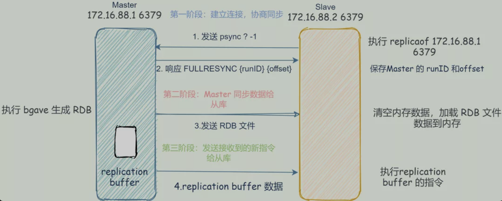

# 一、MySQL

- [100道MySQL数据库经典面试题解析](https://juejin.im/post/5ec15ab9f265da7bc60e1910)

## 1、MySQL自增主键问题

[AUTO_INCREMENT Handling in InnoDB](https://dev.mysql.com/doc/refman/5.7/en/innodb-auto-increment-handling.html)

### 1.1、数据库重启对自增主键的影响

问题：一张表里有自增主键，当自增到 17后，删除了低15，16，17三条记录，再把mysql重启，在插入一条记录，该记录的ID是18还是15？
- `AUTO_INCREMENT` 列在 InnoDB 里如何工作:
	- 如果为一个表指定 AUTO_INCREMENT 列，在数据词典里的InnoDB表句柄包含一个名为自动增长计数器的计数器，被用在为该列赋新值。自动增长计数器仅被存储在主内存中，而不是存在磁盘上.
	- InnoDB使用下列算法来为包含一个名为`ai_col`的`AUTO_INCREMENT`列的表T初始化自动增长计数器：服务器启动之后，当一个用户对表T做插入之时，InnoDB执行等价如下语句的动作:`SELECT MAX(ai_col) FROM T FOR UPDATE;`
- 如果 mysql 服务重启，因为自动增长计数器仅被存储在主内存中，所以每次重启mysql都会重置。解决方法:
	- 先不重启mysql，继续插入表一行记录，这行记录的id为 18，
	- 重启mysql，插入表一行记录，这行记录的id为 19

不同的引擎对于自增值的保存策略不同：
- MyISAM 引擎的自增值保存在数据文件中；
- InnoDB 引擎的自增值，之前保存在了内存里，在到了 MySQL 8.0 版本后，有了`自增值持久化`的能力，也就是实现了“如果发生重启，表的自增值可以恢复为 MySQL 重启前的值”，具体情况是：
    - 在 MySQL 5.7 及之前的版本，自增值保存在内存里，并没有持久化。每次重启后，第一次打开表的时候，都会去找自增值的最大值 `max(id)`，然后将 `max(id)+1` 作为这个表当前的自增值；
    - 在 MySQL 8.0 版本，将自增值的变更记录在了 redo log 中，重启的时候依靠 redo log 恢复重启之前的值；

### 1.2、自增值修改机制

在 MySQL 里面，如果字段 id 被定义为 AUTO_INCREMENT，在插入一行数据的时候，自增值的行为如下：
- 如果插入数据时 id 字段指定为 0、null 或未指定值，那么就把这个表当前的 AUTO_INCREMENT 值填到自增字段；
- 如果插入数据时 id 字段指定了具体的值，就直接使用语句里指定的值；

根据要插入的值和当前自增值的大小关系，自增值的变更结果也会有所不同。假设，某次要插入的值是 X，当前的自增值是 Y。
- 如果 `X<Y`，那么这个表的自增值不变；
- 如果 `X≥Y`，就需要把当前自增值修改为新的自增值；

新的自增值生成算法是：从 `auto_increment_offset` 开始，以 `auto_increment_increment` 为步长，持续叠加，直到找到第一个大于 X 的值，作为新的自增值。其中，`auto_increment_offset` 和 `auto_increment_increment` 是两个系统参数，分别用来表示自增的初始值和步长，默认值都是 1

- `REPLACE INTO...`对主键的影响：`REPLACE INTO...`每次插入的时候如果唯一索引对应的数据已经存在，会删除原数据，然后重新插入新的数据，这也就导致id会增大，但实际预期可能是更新那条数据；

- `INSERT ... ON DUPLICATE KEY UPDATE ...`对自增主键的影响：每次执行时主键ID都会自动加1，但是实际记录并没有增加；

	`INSERT ... ON DUPLICATE KEY UPDATE ...`影响的行数是1为什么返回2？插入影响1行，更新影响2行，0的话就是存在且更新前后值一样

	***原因：***mysql主键自增有个参数 innodb_autoinc_lock_mode，有三种可能只 0, 1, 2，mysql5.1之后加入的，默认值是 1，之前的版本可以看做都是 0
    - 模式 0的话就是不管什么情况都是加上表锁，等语句执行完成的时候在释放，如果真的添加了记录，将 auto_increment加1；
	- 数据库默认值也是1：
        - 当做简单插入（可以确定插入行数）的时候，直接将auto_increment加1，而不会去锁表，这也就提高了性能；
        - 类似 `insert … select` 这样的批量插入数据的语句，自增锁还是要等语句结束后才被释放；
	- 模式 2，什么情况都不加 AUTO_INC锁，存在安全问题，当 binlog格式设置为 Statement模式的时候，从库同步的时候，执行结果可能跟主库不一致，问题很大；全部都用轻量级锁 mutex，并发性能最高，按顺序依次分配自增值，不会预分配；在MySQL8.0.3之后成为默认值；

	由于 `innodb_autoinc_lock_mode`值是1， `INSERT...ON DUPLICATE KEY UPDATE...`是简单的语句，预先就可以计算出影响的行数，所以不管是否更新，这里都将 auto_increment加1（多行的话大于1）

	对于高并发的负载，在InnoDB中按主键顺序插入可能会造成明显的争用；

    在生产上，尤其是有 `insert … select` 这种批量插入数据的场景时，从并发插入数据性能的角度考虑，我建议你这样设置：`innodb_autoinc_lock_mode=2` ，并且 binlog_format=row. 这样做，既能提升并发性，又不会出现数据一致性问题

对于批量插入数据的语句，MySQL 有一个批量申请自增 id 的策略：
- 语句执行过程中，第一次申请自增 id，会分配 1 个；
- 1 个用完以后，这个语句第二次申请自增 id，会分配 2 个；
- 2 个用完以后，还是这个语句，第三次申请自增 id，会分配 4 个；
- 依此类推，同一个语句去申请自增 id，每次申请到的自增 id 个数都是上一次的两倍

### 1.3、为什么用自增列作为主键

- 如果我们定义了主键(PRIMARY KEY)，那么InnoDB会选择主键作为聚集索引、如果没有显式定义主键，则InnoDB会选择第一个不包含有NULL值的唯一索引作为主键索引、如果也没有这样的唯一索引，则InnoDB会选择内置6字节长的ROWID作为隐含的聚集索引(ROWID随着行记录的写入而主键递增，这个ROWID不像ORACLE的ROWID那样可引用，是隐含的)；
- 数据记录本身被存于主索引（一颗B+Tree）的叶子节点上。这就要求同一个叶子节点内（大小为一个内存页或磁盘页）的各条数据记录按主键顺序存放，因此每当有一条新的记录插入时，MySQL会根据其主键将其插入适当的节点和位置，如果页面达到装载因子（InnoDB默认为15/16），则开辟一个新的页（节点）；
- 如果表使用自增主键，那么每次插入新的记录，记录就会顺序添加到当前索引节点的后续位置，当一页写满，就会自动开辟一个新的页
- 如果使用非自增主键（如果身份证号或学号等），由于每次插入主键的值近似于随机，因此每次新纪录都要被插到现有索引页得中间某个位置，此时MySQL不得不为了将新记录插到合适位置而移动数据，甚至目标页面可能已经被回写到磁盘上而从缓存中清掉，此时又要从磁盘上读回来，这增加了很多开销，同时频繁的移动、分页操作造成了大量的碎片，得到了不够紧凑的索引结构，后续不得不通过OPTIMIZE TABLE来重建表并优化填充页面

### 1.4、主键的使用

当mysql中的自增ID用完了，再次往里面插入数据会报什么错？

这里是以无符号int类型作为自增主键ID的，会报主键冲突：`1062 - Duplicate entry '4294967295' for key 'PRIMARY', Time: 0.000000s`；
- 为了尽量避免id用完，可以用bigint unsigned；
- 不过，还存在另一种情况，如果在创建表没有显示申明主键，会怎么办？如果是这种情况，InnoDB会自动帮你创建一个不可见的、长度为6字节的row_id，而且InnoDB 维护了一个全局的 `dictsys.row_id`，所以未定义主键的表都共享该row_id，每次插入一条数据，都把全局row_id当成主键id，然后全局row_id加1；该全局row_id在代码实现上使用的是bigint unsigned类型，但实际上只给row_id留了6字节，这种设计就会存在一个问题：如果全局row_id一直涨，一直涨，直到$2^{48}-1$，这个时候再+1，row_id的低48位都为0，结果在插入新一行数据时，拿到的row_id就为0，存在主键冲突的可能性

### 1.5、为什么不建议使用外键

- 性能问题：因为外键会增加数据库的维护负担，因为每次插入、更新或删除数据时，数据库都需要检查外键约束的完整性；另外可能需要维护多个索引；
- 锁竞争问题：当多个事务同时尝试插入或更新一张表时，它们就需要去检查外键关联的表，就需要获得额外的锁，以确保一致性。这可能导致事务之间的锁竞争，降低并发性能。一旦有了锁竞争，就可能带来更加严重的死锁问题，所以都是需要尽量避免的；
- 热更新问题
- 降低耦合度
- 数据库分库分表：在分库分表环境中，相关数据可能分布在不同的数据库中，外键通常难以跨越不同数据库来建立关系。更重要的是，分库分表环境中，数据的一致性可能更难维护。跨库事务搞不定m

### 1.6、在什么场景下自增主键可能不连续

- 唯一键冲突：因为插入的时候是先获取的自增id的，但是在插入的时候因为唯一键冲突，导致数据插入失败；但是自增id是不会回退的；
- 事务回滚
- 自增主键的批量申请

### 1.7、为什么自增主键不回退

假设有两个并行执行的事务，在申请自增值的时候，为了避免两个事务申请到相同的自增 id，肯定要加锁，然后顺序申请。
- 假设事务 A 申请到了 id=2， 事务 B 申请到 id=3，那么这时候表 t 的自增值是 4，之后继续执行；
- 事务 B 正确提交了，但事务 A 出现了唯一键冲突。
- 如果允许事务 A 把自增 id 回退，也就是把表 t 的当前自增值改回 2，那么就会出现这样的情况：表里面已经有 id=3 的行，而当前的自增 id 值是 2。
- 接下来，继续执行的其他事务就会申请到 id=2，然后再申请到 id=3。这时，就会出现插入语句报错“主键冲突”；

而为了解决这个主键冲突，有两种方法：
- 每次申请 id 之前，先判断表里面是否已经存在这个 id。如果存在，就跳过这个 id。但是，这个方法的成本很高。因为，本来申请 id 是一个很快的操作，现在还要再去主键索引树上判断 id 是否存在。
- 把自增 id 的锁范围扩大，必须等到一个事务执行完成并提交，下一个事务才能再申请自增 id。这个方法的问题，就是锁的粒度太大，系统并发能力大大下降；

## 2、Mysql唯一键问题

被设置为唯一索引的列的值是允许有null值的，并且这个列中允许有多个重复的null值

**逻辑删除与唯一键：**

如果数据库表中设置了某个字段为唯一键，然后将这条数据做逻辑删除了，那么再次添加相同内容会报唯一键冲突；因为逻辑删除并未真正的删除表中的数据，哪怕此时我们在业务层做了唯一性校验依然会出现这种问题。因为唯一性校验的SQL默认会拼接上逻辑索引字段，导致无法查出相应数据，最终引发了Duplicate entry。。。

假设有表结构：
```sql
CREATE TABLE `test`.`user`  (
  `id` bigint(20) NOT NULL COMMENT '主键',
  `is_deleted` tinyint(4) NULL COMMENT '逻辑删除',
  `username` varchar(255) NULL COMMENT '用户名（唯一）',
  PRIMARY KEY (`id`),
  UNIQUE INDEX `uk_username`(`username`) USING BTREE COMMENT '用户名唯一索引';
);
```
现在一种方式是将 is_deleted 和 username 做联合唯一索引，但是这样如果多次删除相同的数据，还是会出现类似的问题

实际解决方案：
- 去除唯一索引，业务层做完善校验，但是并不推荐，因为即使在应用层做了非常完善的校验控制，只要没有唯一索引，根据墨菲定律，必然有脏数据产生；
- 建立联合索引，is_deleted字段不要用单纯的0和1来表示，可以用0来表示正常数据，逻辑删除数据可以有以下几种方案来表示（推荐）：
    - 将删除标识的正常设为固定值,删除值使用叠加值(-1,-2,-3)（该方案需保证字段值为全局递增或全局递减，分布式环境下实现复杂）；
    - 将删除标识的删除状态设为id（推荐，使用主键确保不会发生索引冲突，并且实现简单）；若使用的是mybatis-plus框架可将logic-delete-value设置为如下：`logic-delete-value: id`
    - 将删除标识设为当前时间戳（时间戳在极端情况下依旧有索引冲突的风险）；

## 3、分页查询优化

- [MySQL深度分页方案](https://my.oschina.net/u/1428688/blog/3065681)

### 3.1、一般分页查询

一般的分页查询使用简单的 limit 子句就可以实现。limit 子句声明如下：

`SELECT * FROM table LIMIT [offset,] rows | rows OFFSET offset`

LIMIT 子句可以被用于指定 SELECT 语句返回的记录数。需注意以下几点：
- 第一个参数指定第一个返回记录行的偏移量，注意从 0开始
- 第二个参数指定返回记录行的最大数目
- 如果只给定一个参数：它表示返回最大的记录行数目
- 第二个参数为 -1 表示检索从某一个偏移量到记录集的结束所有的记录行
- 初始记录行的偏移量是 0(而不是 1)

上面查询对于较少数据量查询时没有问题的，看下面一组SQL
```sql
SELECT * FROM emp  LIMIT 100, 100;
SELECT * FROM emp  LIMIT 1000, 100;
SELECT * FROM emp  LIMIT 10000, 100;
SELECT * FROM emp  LIMIT 100000, 100;
SELECT * FROM emp  LIMIT 1000000, 100;
```
随着查询偏移的增大，尤其查询偏移大于10万以后，查询时间急剧增加。

MySQL 执行此类SQL时需要先扫描到N行，然后再去取M行。对于此类操作，获取前面少数几行数据会很快，但是随着扫描的记录数越多，SQL的性能就会越差，因为N的值越大，MySQL需要扫描越多的数据来定位到具体的N行，这样耗费大量的 IO 成本和时间成本；

### 3.2、分页查询优化方案

#### 3.2.1、常见方案

- 前端加缓存、搜索，减少落到库的查询操作。比如海量商品可以放到搜索里面，使用瀑布流的方式展现数据；
- 优化 SQL 访问数据的方式，直接快速定位到要访问的数据行：通过使用覆盖索引查询返回需要的主键，再根据主键关联原表获得需要的数据

	```sql
	select t.id, t.name from t_test t join(select id from t_test limit 5000000, 100) tmp on t.id = tmp.id
	```

- 使用书签方式，记录上次查询最新/大的id值，向后追溯 M行记录

#### 3.2.2、使用 id 限定优化

这种方式假设数据表的id是连续递增的，则我们根据查询的页数和查询的记录数可以算出查询的id的范围，可以使用 `id between and` 来查询或者用`id>=`来查询；

```sql
select * from table where id>= 5000000 limit 10;
select * from table where id>= 5000000 and i <= 5000000 + 10;
select * from table where id > 15000000 ORDER BY `id` DESC limit 0, 100;
```
这是前提条件：必须是主键自增的且是连续的；

#### 3.2.2、使用临时表优化

对于使用 id 限定优化中的问题，需要 id 是连续递增的，但是在一些场景下，比如使用历史表的时候，或者出现过数据缺失问题时，可以考虑使用临时存储的表来记录分页的id，使用分页的id来进行 in 查询。这样能够极大的提高传统的分页查询速度，尤其是数据量上千万的时候

#### 3.2.3、在业务上限定不可用查询早期的数据

- 限制查询的总页数，比如淘宝、京东等搜索某个商品时是只能查询100页以内的数据，如果需要查询更到的数据，需要添加更多查询条件；
- 改写超过特定阈值的SQL；

#### 3.2.4、根据id排序，但是 id 不连续

通常翻页页数跳转都不会很大，那我们可以根据上一次查询的记录，算出来下一次分页查询对应的新的 `offset和 limit`，也就是离上一次查询记录的`offset`；分页查询一般会有两个参数：offset和limit，limit一般是固定，假设limit=10

那为了优化`offset`太大的情况，每次查询需要提供两个额外的参数：
- 参数`lastEndId`：上一次查询的最后一条记录的id
- 参数`lastEndOffset`：上一次查询的最后一条记录对应的offset，也就是上一次查询的`offset+limit`

**情况1：**跳转到下一页，增加查询条件：`id > lastEndId limit 10`；

**情况2：**往下翻页，跳转到下任意页，算出新的`newOffset=offset-lastEndOffset`,增加查询条件：`id>lastEndId offset newOffset limit 10`，但是如果newOffset也还是很大，比如，直接从第一页跳转到最后一页，这时候我们可以根据id逆序（如果原来id是正序的换成倒序，如果是倒序就换成正序）查询，根据总数量算出逆序查询对应的offset和limit，那么 newOffset = totalCount - offset - limit， 查询条件：`id < lastEndId offset newOffset limit 10` ,然后再通过代码逆序，得到正确顺序的数据，注意：最后一页 `offset + limit>=totalCount` ，也就是算出来的newOffset 可能小于0, 所以最后一页的`newOffset=0，limit = totalCount - offset`；

## 4、MySQL大表不停机添加字段有什么方案吗？

- [MySQL Online DDL : 历史演进到原理及使用](https://mp.weixin.qq.com/s/2CjMUQXT4q3i1moRMbX4cQ)
- https://dev.mysql.com/doc/refman/5.6/en/innodb-online-ddl-operations.html 
- https://dev.mysql.com/doc/refman/5.7/en/innodb-online-ddl-operations.html 
- https://dev.mysql.com/doc/refman/8.0/en/innodb-online-ddl-operations.html

percona提供了维护mysql的perconaTookit工具包，pt-online-schema-change可以完成在线修改表结构

其修改表结构原理：复制原表结构，使用触发器同步原表的数据到新表，删除新表，重命名复制出来的新表

## 5、物理删除与逻辑删除

### 5.1、物理删除

- 物理删除是真删除，所以数据库恢复起来难度很大；可以使用binlog或者数据库延时；
- 物理删除造成主键的不连续，导致分页查询变慢；
- 核心业务表的数据不建议做物理删除；
- 不删除数据又能缩小数据表体积，可以把记录转移到历史表；

### 5.2、逻辑删除

- 逻辑删除就是在数据表中添加一个字段，用字段值标记该数据已经逻辑删除，查询的时候跳过这些数据；
- 核心业务数据表，必须要采用逻辑删除；

## 6、读多写少与写多读少

### 6.1、读多写少

- CMS系统
- 电商网站的商品展示；
- 新闻、资讯网站


### 6.2、写多读少

- 如果是低价值的数据，可以使用nosql数据库来存储数据；
- 如果是高价值的数据，可以用TokuDB来作为数据库引擎保存；

### 6.3、写多读多业务场景

- 社交软件：qq、微信

## 7、如何让MySQL的MyIsam引擎支持事务

可以用lock table来实现，但是只能实现串行化隔离级别；

因为MyIsam不支持崩溃恢复，所以即使用lock table实现也是问题多多：
- ACID里面，原子性和持久性做不到；
- 隔离性只能实现基本用不上串行化；

## 8、InnoDB相关面试题

### 8.1、在什么情况下InnoDB无法在线修改表结构

- 不支持在线修改表结构的场景：
	- 加全文索引： `create fulltext index name on table(column);`
	- 加空间索引： `alter table geom add spatial index(g);`
	- 删除主键： `alter table table_name drop primary key;`
	- 增加自增列： `alter table table_name add column id int auto_increment not null primary key;`
	- 修改类类型： `alter table table_name change c1 c1 new_type;`
	- 修改表的字符集： `alter table table_name character set=charset_name`

- 在线DDL存在问题：
	- 有部分语句不支持在线DDL；
	- 长时间DDL操作会引起严重的主从延迟；
	- 无法对DDL操作进行资源限制；

**在无法进行在线修改表结构的情况下，要如何操作？**

pt-onlinbe-schema-change [options] DSN

**InnoDB是如何实现事务的**

事务的实现方式：
- 原子性：回滚日志（Undo Log），用于记录数据修改前的状态；
- 一致性：重作日志（Redo Log），用于记录数据修改后的状态；
- 隔离性：锁，用于资源隔离，分为共享锁和排它锁；
- 持久性：重作认知（Redo Log） + 回滚日志（Undo Log）

**innodb读操作是否会阻塞写操作**

- 查询需要对资源加共享锁；
- 数据修改需要对资源加排它锁

排它锁和共享锁是不兼容

**假如两个事务执行写操作，又怎么保证并发呢：**

假如事务1和事务2都要执行update操作，事务1先update数据行的时候，先回获取行锁，锁定数据，当事务2要进行update操作的时候，也会取获取该数据行的行锁，但是已经被事务1占有，事务2只能wait；若是事务1长时间没有释放锁，事务2就会出现超时异常；若是没有索引的条件下，就获取所有行，都加上行锁，然后Mysql会再次过滤符合条件的的行并释放锁，只有符合条件的行才会继续持有锁

## 9、mysql单表最大数量

- [MySQL单标最大数量](https://mp.weixin.qq.com/s/QHyCRnuAqUGFXlPCNvevHg)

MySQL单表可以存储10亿级数据，只是这时候性能比较差，业界公认MySQL单表容量在1KW量级是最佳状态，因为这时它的BTREE索引树高在3~5之间

## 10、大数量存储方案

## 11、MySQL主从复制原理

- MySQL 集群如何实现主从复制；
- 当你提交一个事务到 MySQL 集群后，MySQL 集群都执行了哪些操作？

上面两个问题的本质是：MySQL 的主从复制的过程是怎样的？

总的来讲，MySQL 的主从复制依赖于 binlog ，也就是记录 MySQL 上的所有变化并以二进制形式保存在磁盘上。复制的过程就是将 binlog 中的数据从主库传输到从库上。这个过程一般是异步的，也就是主库上执行事务操作的线程不会等待复制 binlog 的线程同步完成

### 11.1、主从复制是如何工作的

- 写入 Binlog：主库写 binlog 日志，提交事务，并更新本地存储数据；
- 然后从库连接到主库之后，从库有一个 IO 线程，将主库的 binlog 日志拷贝到自己本地，写入一个 relay 中继日志中；
- 接着从库中有一个 SQL 线程会从中继日志 读取 binlog，然后执行 binlog 日志中的内容，也就是在自己本地再次执行一遍 SQL，这样就可 以保证自己跟主库的数据是一样的；

从库同步主库数据的过程是串行化的，也就是说主库上并行的操作，在从库上会串行执行；由于从库从主库拷贝日志以 及串行执行 SQL 的特点，在高并发场景下，从库的数据一定会比主库慢一些，是有延时的；

MySQL 实际上在这一块有两个机制，一个是半同步复制，用来解决主库数据丢失问题; 一个是并行复制，用来解决主从同步延时问题；
- 所谓半同步复制 ，也叫 semi-sync 复制，指的就是主库写入 binlog 日志之后，就会将强制此时立即将数据同步到从库，从库将日志写入自己本地的 relay log 之后，接着会返回一个ack 给主库，主库接收到 的 ack 之后才会认为写操作完成了；
- 所谓并行复制，指的是从库开启多个线程，并行读取 relay log 中不同库的日志，然后并行重放不同库的日志，这是库级别的并行；

### 11.2、比较基于GTID方式的复制和基于日志点的复制

### 11.3、比较MMM和MHA两种高可用架构的优缺点

### 11.4、如何减少主从复制的延迟

**产生延迟原因？**
- 主节点如果执行一个很大的事务(更新千万行语句，总之执行很长时间的事务)，那么就会对主从延迟产生较大的影响
- 网络延迟，日志较大，slave数量过多。
- 主上多线程写入，从节点只有单线程恢复；

**处理办法：**
- 大事务：将大事务分为小事务，分批更新数据。
- 减少Slave的数量，不要超过5个，减少单次事务的大小。
- MySQL 5.7之后，可以使用多线程复制，使用MGR复制架构；
- 使用数据冗余：比如通过一些异步处理数据时，将所有必要输出传输过去，避免查询从库数据失败问题；

### 11.5、对MGR的认识

### 11.6、如何解决数据库读写负载大的问题

### 11.7、一主多从中，是否从库越多越好

不是。因为从库数量增加，从库连接上来的 I/O 线程也比较多，主库也要创建同样多的 log dump 线程来处理复制的请求，对主库资源消耗比较高，同时还受限于主库的网络带宽。所以在实际使用中，一个主库一般跟 2～3 个从库（1 套数据库，1 主 2 从 1 备主），这就是一主多从的 MySQL 集群结构

## 12、MySQL检查点、保存点、中间点

## 13、InnoDB一棵B+树可以存放多少行数据

答案是：约2千万

在计算机中磁盘存储数据最小单元是扇区，一个扇区的大小是512字节，而文件系统（例如XFS/EXT4）他的最小单元是块，一个块的大小是4k，而对于我们的InnoDB存储引擎也有自己的最小储存单元——`页（Page）`，一个页的大小是16K；

innodb的所有数据文件（后缀为ibd的文件），他的大小始终都是16384（16k）的整数倍

在MySQL中我们的InnoDB页的大小默认是16k，当然也可以通过参数设置：innodb_page_size
```
mysql> show variables like 'innodb_page_size';
+------------------+-------+
| Variable_name    | Value |
+------------------+-------+
| innodb_page_size | 16384 |
+------------------+-------+
1 row in set (0.03 sec)
```

InnoDB中数据存放方式：用B+树的组织方式存储数据：
- 先将数据记录按主键进行排序，分别存放在不同的页中；
- 除了存放数据的页以外，还有存放`键值+指针`的页，存放键值和指向数据页的指针，这样的页由N个键值+指针组成；

在B+树中叶子节点存放数据，非叶子节点存放键值+指针；索引通过非叶子节点的二分查找法以及指针确定数据在哪个页中，进而在去数据页中查找到需要的数据；

**通常一棵B+树可以存放多少行数据：**

假设B+树高为2，即存在一个根节点和若干个叶子节点，那么这棵B+树的存放总记录数为：根节点指针数*单个叶子节点记录行数；

单个叶子节点（页）中的记录数=16K/1K=16。（这里假设一行记录的数据大小为1k，实际上现在很多互联网业务数据记录大小通常就是1K左右）

**关于为什么MySQL单表最多2000万数据？**

并不是 MySQL 不能存储更多的数据，而限制我们的多数是数据查询效率问题；

MySQL 的 InnoDB 数据库的索引是 B+Tree，B+Tree 的特点在于只有在最底层才会存储真正的数据 ID，通过这个 ID 就可以提取到数据的具体内容，同时 B+Tree 索引最底层的数据是按索引字段顺序进行存储的。通过这种设计方式，我们只需进行 1～3 次 IO（树深度决定了 IO 次数）就能找到所查范围内排序好的数据，而树形的索引最影响查询效率的是树的深度以及数据量（数据越独特，筛选的数据范围就越少）；

但是什么会影响到索引树的深度个数呢？这是因为 MySQL 的索引是使用 Page 作为单位进行存储的，而每页只能存储 16KB（innodb_page_size）数据。如果每行数据的索引是 1KB，那么除去 Page 页的一些固定结构占用外，一页只能放 16 条数据，这导致树的一些分支装不下更多数据时，就需要对索引的深度再加一层；

索引第一层放 16 条，树第二层大概能放 2 万条，树第三层大概能放 2400 万条，三层的深度 B+Tree 按主键查找数据每次查询需要 3 次 IO（一层索引在内存，IO 两次索引，最后一次是拿数据）；

不过这个 2000 万并不是绝对的，如果每行数据是 0.5KB，那么大概在 4000 万以后才会出现第四层深度。而对于辅助索引，一页 Page 能存放 1170 个索引节点（主键 bigint8 字节 + 数据指针 6 字节），三层深度的辅助索引大概能记录 10 亿条索引记录；

可以看到，数据存储数量超过三层时，每次数据操作需要更多的 IO 操作来进行查询，这样做的后果就是查询数据返回的速度变慢

## 14、select*效率低下的原因

在阿里规约中有以下关于MySQL的描述：
```
4-1. **【强制】**在表查询中，一律不要使用 * 作为查询的字段列表，需要哪些字段必须明确写明。说明：
增加查询分析器解析成本。
增减字段容易与 resultMap 配置不一致。
无用字段增加网络 消耗，尤其是 text 类型的字段。
```
- 不需要的列会增加数据传输时间和网络开销：
    - 用`SELECT * `数据库需要解析更多的对象、字段、权限、属性等相关内容，在 SQL 语句复杂，硬解析较多的情况下，会对数据库造成沉重的负担；
    - 增大网络开销：`*` 有时会误带上如log、IconMD5之类的无用且大文本字段，数据传输size会几何增涨。如果DB和应用程序不在同一台机器，这种开销非常明显；
    - 即使 mysql 服务器和客户端是在同一台机器上，使用的协议还是 tcp，通信也是需要额外的时间
- 对于无用的大字段，如 varchar、blob、text，会增加 io 操作：长度超过 728 字节的时候，会先把超出的数据序列化到另外一个地方，因此读取这条记录会增加一次 io 操作。（MySQL InnoDB）；
- 失去MySQL优化器`覆盖索引`策略优化的可能性：`SELECT *` 杜绝了覆盖索引的可能性，而基于MySQL优化器的“覆盖索引”策略又是速度极快，效率极高

## 15、数据库可以部署到容器中

Docker不适合部署数据库的7大原因

- 数据安全问题：容器随时可以停止、或者删除。当容器被rm掉，容器里的数据将会丢失。为了避免数据丢失，用户可以使用数据卷挂载来存储数据。但是容器的 Volumes 设计是围绕 Union FS 镜像层提供持久存储，数据安全缺乏保证。如果容器突然崩溃，数据库未正常关闭，可能会损坏数据。另外，容器里共享数据卷组，对物理机硬件损伤也比较大；

- 性能问题：数据库的性能瓶颈一般出现在IO上面，如果按 Docker 的思路，那么多个docker最终IO请求又会出现在存储上面；

- 网络问题

## 16、数据库连接池是如何回收连接的

## 17、HikariCP 为什么快呢？

主要有三个方面：
- 它使用 FastList 替代 ArrayList，通过初始化的默认值，减少了越界检查的操作；
- 优化并精简了字节码，通过使用 Javassist，减少了动态代理的性能损耗，比如使用 invokestatic 指令代替 invokevirtual 指令；
- 实现了无锁的 ConcurrentBag，减少了并发场景下的锁竞争；

## 18、平常会把连接池设置成多大呢

- [关于连接池的设置](https://github.com/brettwooldridge/HikariCP/wiki/About-Pool-Sizing)

根据经验，数据库连接，只需要 20~50 个就够用了。具体的大小，要根据业务属性进行调整，但大得离谱肯定是不合适的；

HikariCP 官方是不推荐设置 minimumIdle 这个值的，它将被默认设置成和 maximumPoolSize 一样的大小。如果你的数据库Server端连接资源空闲较大，不妨也可以去掉连接池的动态调整功能

## 19、分库分表

### 19.1、何时分库分表

- 何时分表：当数据量过大造成事务执行缓慢时，就要考虑分表，因为减少每次查询数据总量是解决数据查询缓慢的主要原因；
- 何时分库：为了应对高并发，一个数据库实例撑不住，即单库的性能无法满足高并发的要求，就把并发请求分散到多个实例中去；

总的来说，分库分表使用的场景不一样：分表是因为数据量比较大，导致事务执行缓慢；分库是因为单库的性能无法满足要求；

### 19.2、如何分片

- 垂直拆分：是根据数据的业务相关性进行拆分。比如一个数据库里面既存在商品数据，又存在订单数据，那么垂直拆分可以把商品数据放到商品库，把订单数据放到订单库。一般情况，垂直拆库常伴随着系统架构上的调整；

    垂直拆分可以把不同的业务数据进行隔离，让系统和数据更为“纯粹”，更有助于架构上的扩展。但它依然不能解决某一个业务的数据大量膨胀的问题，一旦系统中的某一个业务库的数据量剧增，比如商品系统接入了一个大客户的供应链，对于商品数据的存储需求量暴增，在这个时候，就要把数据拆分到多个数据库和数据表中，也就是对数据做水平拆分；

- 水平拆分：指的是把单一库表数据按照规则拆分到多个数据库和多个数据表中，比如把单表 1 亿的数据按 Hash 取模拆分到 10 个相同结构的表中，每个表 1 千万的数据。并且拆分出来的表，可以分别存放到不同的物理数据库中，关注点在于数据扩展；

- Range（范围分片）：是按照某一个字段的区间来拆分，最好理解的就是按照时间字段分片，比如可以把一个月的数据放入一张表中，这样在查询时就可以根据时间先定位数据存储在哪个表里面，再按照查询条件来查询；

    在 Range 的基础上引入“分片元数据”的概念：分片的规则记录在一张表里面，每次执行查询的时候，先去表里查一下要找的数据在哪个分片中

### 19.3、分库分表后数据迁移

**停机迁移方案**


**双写迁移方案**

- 在对老数据库进行增删改的操作时，同时对分库分表的库进行增删改操作，即双写；优先保证老数据的写操作；
- 写完之后，对新、老库作数据对比，将不一致的数据进行修正操作；
- 经过一段时间后，当数据完全一致了，就 ok 了，基于仅仅使用分库分表的最新代码；

## 20、当update修改数据与原数据相同时会再次执行吗？

https://mp.weixin.qq.com/s/IsaOYm_YAEtP5JWFyPLbHw

## 21、MySQL架构问题

### 21.1、MySQL的框架有几个组件, 各是什么作用?

整体分为Server层和引擎层：
- `Server层`包含`连接器、查询缓存、分析器、优化器、执行器`等，以及所有的内置函数（如日期、时间、数学和加密函数等），所有跨存储引擎的功能都在这一层实现，比如存储过程、触发器、视图等；
    - `连接器`：负责客户端与MySQL的连接建立、管理与维护连接；以及连接建立之后的权限验证；可能出现比如用户名或密码不对，你就会收到一个"Access denied for user"的错误，然后客户端程序结束执行；一般会保持长连接；
    - `查询缓存`：MySQL查询的时候会先到查询缓存中，以类似key（执行的sql语句）-value的形式存储；如果查询缓存没有命中，那么在后面执行完获取到结果时也会将数据放到查询缓存中；不建议使用查询缓存，因为查询缓存的失效非常频繁，只要有对一个表的更新，这个表上所有的查询缓存都会被清空；MySQL8已经将查询缓存整个功能删掉了；
    - `分析器`：主要是词法分析与语法分析；如果你的语句不对，就会收到“You have an error in your SQL syntax”的错误提醒；
    - `优化器`：优化器是在表里面有多个索引的时候，决定使用哪个索引；或者在一个语句有多表关联（join）的时候，决定各个表的连接顺序；
    - `执行器`：开始执行的时候，要先判断一下你对这个表 T 有没有执行查询的权限，如果没有，就会返回没有权限的错误，(在工程实现上，如果命中查询缓存，会在查询缓存返回结果的时候，做权限验证。查询也会在优化器之前调用 precheck 验证权限)
        ```sql
        mysql> select * from T where ID=10;
        ERROR 1142 (42000): SELECT command denied to user 'b'@'localhost' for table 'T'
        ```
- `存储引擎层`负责数据的存储和提取。其架构模式是插件式的，支持 InnoDB、MyISAM、Memory 等多个存储引擎。现在最常用的存储引擎是 InnoDB，它从 MySQL 5.5.5 版本开始成为了默认存储引擎；

### 21.2、Server层和存储引擎层各是什么作用?

Server层包含连接器、查询缓存、分析器、优化器、执行器等，以及所有的内置函数（如日期、时间、数学和加密函数等），所有跨存储引擎的功能都在这一层实现，比如存储过程、触发器、视图等；

存储引擎层负责数据的存储和提取。其架构模式是插件式的，支持 InnoDB、MyISAM、Memory 等多个存储引擎。现在最常用的存储引擎是 InnoDB，它从 MySQL 5.5.5 版本开始成为了默认存储引擎；

### 21.3、you have an error in your SQL syntax 这个保存是在词法分析里还是在语法分析里报错?

语法分析

### 21.4、对于表的操作权限验证在哪里进行

- 如果查询缓存有命中数据，会在查询缓存中做 precheck；
- 如果没有命中，会对你需要操作的表做查询权限验证；

### 21.5、执行器的执行查询语句的流程是什么样的?

以InnoDB引擎来讲：
- 调用 InnoDB 引擎接口取这个表的第一行，判断 ID 值是不是 10，如果不是则跳过，如果是则将这行存在结果集中；
- 调用引擎接口取`下一行`，重复相同的判断逻辑，直到取到这个表的最后一行；
- 执行器将上述遍历过程中所有满足条件的行组成的记录集作为结果集返回给客户端；

## 22、一条SQL更新语句是如何执行

对表更新：`update T set c=c+1 where ID=2;`，其中id是索引字段；
- 连接器：执行连接与权限校验工作；
- 在一个表上有更新的时候，跟这个表有关的查询缓存会失效，所以这条语句就会把表 T 上所有缓存结果都清空；
- 分析器会通过词法和语法解析知道这是一条更新语句；
- 优化器决定要使用 ID 这个索引；
- 执行器负责具体执行，找到这一行，然后更新；

但是更新有两个重要的日志：redo log 和 binlog
- 当有一条记录需要更新的时候，InnoDB 引擎就会先把记录写到 redo log里面，并更新内存，这个时候更新就算完成了。同时，InnoDB 引擎会在适当的时候，将这个操作记录更新到磁盘里面，而这个更新往往是在系统比较空闲的时候做；

## 23、基数

基数（Cardinality）指的就是MySQL表中某一列的不同值的数量：
- 如果这一列是唯一索引，那基数 == 行数。
- 如果这一列是sex，枚举类型只有男女，那它是基数就是2；

Cardinality越高，列就越有成为索引的价值。MySQL执行计划也会基于Cardinality选择索引

## 24、慢查询

一般是由对应的DBA反馈，DBA会联系业务同学来处理，DBA一般会建议直接kill到对应的慢SQL，可以使用 kill 12 来断开它占用的连接，但是可能又马上建立起连接；

一般研发同学对应的会通过explain命令查看执行计划：
- 通过explain你可能会发现，SQL压根没走任何索引，而且现在表中的数据量巨大无比；这时就得根据select的内容创建合适索引；
- 可能是数据量太大了，即使走了索引依然超过了阈值；最好的解决方案其实是分表，比如将大表拆分成128张小表；
- 通过explain查看SQL执行计划中的key字段。如果发现优化器选择的Key和你预期的Key不一样。那显然是优化器选错了索引；那最快的解决方案就是：force index ，强制指定索引；

## 25、对NotNull字段插入Null值有啥现象

```sql
mysql> create table t3(
    -> id int(11) not null
    -> )engine=innodb default charset=latin1;
Query OK, 0 rows affected, 1 warning (0.04 sec)

mysql> insert into t3()values();
ERROR 1364 (HY000): Field 'id' doesn't have a default value
mysql> show errors;
+-------+------+-----------------------------------------+
| Level | Code | Message                                 |
+-------+------+-----------------------------------------+
| Error | 1364 | Field 'id' doesn't have a default value |
+-------+------+-----------------------------------------+
```
默认情况下，如果该列要求不能为null。用户还往里面写入null，就会报错：cannot be null；

默认情况下MySQL会用严格模式运行SQL：
```sql
mysql> select @@sql_mode;
+-----------------------------------------------------------------------------------------------------------------------+
| @@sql_mode                                                                                                            |
+-----------------------------------------------------------------------------------------------------------------------+
| ONLY_FULL_GROUP_BY,STRICT_TRANS_TABLES,NO_ZERO_IN_DATE,NO_ZERO_DATE,ERROR_FOR_DIVISION_BY_ZERO,NO_ENGINE_SUBSTITUTION |
+-----------------------------------------------------------------------------------------------------------------------+
```
覆盖sql_mode，关闭严格的sql mode后发现是 warning + MySQL帮你插入默认值
```sql
mysql> set sql_mode="NO_ENGINE_SUBSTITUTION";                    
Query OK, 0 rows affected (0.02 sec)

mysql> insert into t3()values();
Query OK, 1 row affected, 1 warning (0.01 sec)

mysql> show warnings;
+---------+------+-----------------------------------------+
| Level   | Code | Message                                 |
+---------+------+-----------------------------------------+
| Warning | 1364 | Field 'id' doesn't have a default value |
+---------+------+-----------------------------------------+
1 row in set (0.00 sec)
```
修改严格模式，插入空字符串
```sql
mysql> insert into t3(id)values(' ');
ERROR 1366 (HY000): Incorrect integer value: ' ' for column 'id' at row 1
mysql> show errors;
+-------+------+-------------------------------------------------------+
| Level | Code | Message                                               |
+-------+------+-------------------------------------------------------+
| Error | 1366 | Incorrect integer value: ' ' for column 'id' at row 1 |
+-------+------+-------------------------------------------------------+
1 row in set (0.00 sec)
mysql> set sql_mode="NO_ENGINE_SUBSTITUTION"; 
mysql> insert into t3(id)values(' ');
Query OK, 1 row affected, 1 warning (0.01 sec)

mysql> show warnings;
+---------+------+-------------------------------------------------------+
| Level   | Code | Message                                               |
+---------+------+-------------------------------------------------------+
| Warning | 1366 | Incorrect integer value: ' ' for column 'id' at row 1 |
+---------+------+-------------------------------------------------------+
1 row in set (0.00 sec)
```
无论是否开启了严格模式，MySQL都不允许往not null字段插入null值，它不会因为你插入null，而将null转成该数据类型的0值

关于常见的sql_mode：

**1、STRICT_TRANS_TABLES**

将其加入到sql_mode之后，MySQL会判断是否可以直接把用户给的值插入事务表中，如果不能就中止该语句。对于非事务表，如果该值出现在单行语句或多行语句的第一行中，则中止该语句。

结合上面的例子可以更好的理解STRICT_TRANS_TABLES的作用。

**2、NO_ZERO_IN_DA****TE**

将其加入到sql_model之后，MySQL将不允许你将诸如 0000-10-10、2020-00-10、2020-10-00等年份、月份、日期为零的值插入到Date列中。

目前该参数处于目前该参数默认会生效，但是在未来的版本中将会被删除。

**3、NO_ZERO_DATE：**

- 该参数控制MySQL是否允许将 `'0000-00-00'`作为有效日期。
- 如果未启用此模式， `'0000-00-00'`允许插入不会产生警告。
- 如果启用此模式，`'0000-00-00'` 允许插入且产生警告。

如果启用了此模式和严格模式， `'0000-00-00'` 插入产生错误，除非 `IGNORE`同样给出。对于 `INSERT IGNORE`和`UPDATE IGNORE`，`'0000-00-00'`允许插入且产生警告；

## 26、date、datetime、time、timestamp、year区别

有如下表：
```sql
create table t2(
    m_time time default null,
    m_date date default null,
    m_datetime datetime default null,
    m_timestamp timestamp null default null,
    m_year year(4) default null
)engine=innodb default charset=utf8;
```
### 26.1、year

支持范围：`1901～2155`，在 MySQL5.7.5 中删除了对Year(2)的支持，同一转换为Year(4)。所以如果你使用这个版本的MySQL，会发现它会把年份以4位长度的数字展示给我们看；

尝试插入一个超过它规定的上限2155的值 -- 2156 ，如下：
```sql
mysql> insert into t2(m_year) values(2156);
ERROR 1264 (22003): Out of range value for column 'm_year' at row 1
```
为什么会报错，因为这里是严格模式，如下关闭了严格模式的执行过程：然后插入非法值，结果很明显，不会报错。而且MySQL帮你插入了0000值
```sql
mysql> insert into t2(m_year) values(2156);
Query OK, 1 row affected, 1 warning (0.02 sec)

mysql> show warnings;
+---------+------+-------------------------------------------------+
| Level   | Code | Message                                         |
+---------+------+-------------------------------------------------+
| Warning | 1264 | Out of range value for column 'm_year' at row 1 |
+---------+------+-------------------------------------------------+
1 row in set (0.00 sec)
mysql> select * from t2;
+--------+--------+------------+-------------+--------+
| m_time | m_date | m_datetime | m_timestamp | m_year |
+--------+--------+------------+-------------+--------+
| NULL   | NULL   | NULL       | NULL        |   0000 |
+--------+--------+------------+-------------+--------+
```

### 26.2、Date

支持的范围：`1000-01-01 ～ 9999-12-31`
```sql
mysql> insert into t2(m_date)values('2020-10-24');
Query OK, 1 row affected (0.00 sec)
mysql> insert into t2(m_date)values('2020-10-31 21:53:59.057627'); # 会将后面的时分秒截断，只保留日期
Query OK, 1 row affected, 1 warning (0.01 sec)
mysql> show warnings;
+-------+------+---------------------------------------------------------------------------------+
| Level | Code | Message                                                                         |
+-------+------+---------------------------------------------------------------------------------+
| Note  | 1292 | Incorrect date value: '2020-10-31 21:53:59.057627' for column 'm_date' at row 1 |
+-------+------+---------------------------------------------------------------------------------+
1 row in set (0.00 sec)
mysql> insert into t2(m_date)values('999-10-24'); # 可以插入早于1000年的时间
Query OK, 1 row affected (0.00 sec)
mysql> insert into t2(m_date)values('99999-10-24'); # 不允许插入大于 9999年的时间
ERROR 1292 (22007): Incorrect date value: '99999-10-24' for column 'm_date' at row 1
mysql> insert into t2(m_date)values('-2020-10-24'); # 不允许插入非法的日期
ERROR 1292 (22007): Incorrect date value: '-2020-10-24' for column 'm_date' at row 1
```
能不能插入`0000-00-00` 取决于你使用的那种sql mode，默认情况下是插入不进去的，且开启使用了参数NO_ZERO_DATE，如下：
```sql
mysql> insert into t2(m_date)values('0000-00-00');
ERROR 1292 (22007): Incorrect date value: '0000-00-00' for column 'm_date' at row 1
```

### 26.3、Datetime

支持范围：`1000-01-01 00:00:00.000000  to  9999-12-31 23:59:59.999999`，datetime 比 date 更精确
- 如果不显示指定时分秒，默认是 00:00:00；
- 大于9999的年份无法插入；
- 秒的小数点后面多几位也没有关系，允许插入；

### 26.4、time

支持范围：`-838:59:59.000000  to 838:59:59.000000`，time类型不仅可以用来表示24h，还可以用来表示一个时间范围，这个时间范围可能会很大，甚至是负的
```sql
mysql> insert into t2(m_time) values(''); # 插入的都是时间零值 00:00:00
Query OK, 1 row affected (0.00 sec)
mysql> insert into t2(m_time) values('0'); # 插入的都是时间零值 00:00:00
Query OK, 1 row affected (0.01 sec)
mysql> insert into t2(m_time) values(0); # 插入的都是时间零值 00:00:00
Query OK, 1 row affected (0.01 sec)
mysql> insert into t2(m_time) values(12); # 00:00:12
Query OK, 1 row affected (0.02 sec)
mysql> insert into t2(m_time) values(1212); # 00:12:12
Query OK, 1 row affected (0.01 sec)
mysql> insert into t2(m_time) values(121212); # 12:12:12
Query OK, 1 row affected (0.01 sec)
mysql> insert into t2(m_time) values(60);
ERROR 1292 (22007): Incorrect time value: '60' for column 'm_time' at row 1
mysql> select * from t2;
+----------+------------+------------+-------------+--------+
| m_time   | m_date     | m_datetime | m_timestamp | m_year |
+----------+------------+------------+-------------+--------+
| 00:00:00 | NULL       | NULL       | NULL        |   NULL |
| 00:00:00 | NULL       | NULL       | NULL        |   NULL |
| 00:00:00 | NULL       | NULL       | NULL        |   NULL |
| 00:00:12 | NULL       | NULL       | NULL        |   NULL |
| 00:12:12 | NULL       | NULL       | NULL        |   NULL |
| 12:12:12 | NULL       | NULL       | NULL        |   NULL |
+----------+------------+------------+-------------+--------+
```

### 26.5、Timestamp

支持范围： 1970-01-01 00:00:01 UTC to 2038-01-19 03:14:07 UTC

> 因为32位能表示的最大值是2147483647。另外1年365天的总秒数是 31536000，2147483647/31536000 = 68.1，也就是说32位能表示的最长时间是68年，从1970年开始的话，加上68.1，实际最终到2038年01月19日03时14分07秒。过了这个上线，所有32位操作系统时间都会变成10000000 00000000 00000000 00000000

## 27、表空间与数据表

数据表其实是逻辑上的概念，而表空间是物理层面的概念

在innodb存储引擎中数据是按照表空间来组织存储的，表空间文件是实际存在的物理文件；

**系统表空间**

查看MySQL系统表空间：
```sql
mysql> show variables like '%innodb_data_file_path%';
+-----------------------+------------------------+
| Variable_name         | Value                  |
+-----------------------+------------------------+
| innodb_data_file_path | ibdata1:12M:autoextend |
+-----------------------+------------------------+
```
默认情况下，MySQL会初始化一个大小为12MB，名为ibdata1文件，并且随着数据的增多，它会自动扩容；这个ibdata1文件是系统表空间，也是默认的表空间，也是默认的表空间物理文件，也是传说中的共享表空间；

**file per table 表空间**

如果想让每一个数据表都有一个单独的表空间文件的话，可以通过参数`innodb_file_per_table`设置

> 这个参数只有在MySQL5.6或者是更高的版本中才可以使用。
```sql
mysql> show variables like '%innodb_file_per_table%';
+-----------------------+-------+
| Variable_name         | Value |
+-----------------------+-------+
| innodb_file_per_table | ON    |
+-----------------------+-------+
```
将其设置为ON，那之后InnoDB存储引擎产生的表都会自己独立的表空间文件；独立的表空间文件命名规则：表名.ibd

> 独立表空间文件中仅存放该表对应数据、索引、insert buffer bitmap。
> 其余的诸如：undo信息、insert buffer 索引页、double write buffer 等信息依然放在默认表空间，也就是共享表空间中；

file per table的优点
- 提升容错率，表A的表空间损坏后，其他表空间不会收到影响；
- 使用MySQL Enterprise Backup快速备份或还原在每表文件表空间中创建的表，不会中断其他InnoDB表的使用；

缺点：对fsync系统调用来说不友好，如果使用一个表空间文件的话单次系统调用可以完成数据的落盘，但是如果你将表空间文件拆分成多个。原来的一次fsync可能会就变成针对涉及到的所有表空间文件分别执行一次fsync，增加fsync的次数

**临时表空间：**

临时表空间用于存放用户创建的临时表和磁盘内部临时表，参数`innodb_temp_data_file_path`定义了临时表空间的一些名称、大小、规格属性如下图：
```sql
mysql> show variables like '%innodb_temp_data_file_path%';
+----------------------------+-----------------------+
| Variable_name              | Value                 |
+----------------------------+-----------------------+
| innodb_temp_data_file_path | ibtmp1:12M:autoextend |
+----------------------------+-----------------------+
```
查看临时表空间文件存放的目录：`innodb_data_home_dir`

## 28、数据页

InnoDB从磁盘中读取数据的最小单位是数据页。而你想得到的`id = xxx`的数据，就是这个数据页众多行中的一行，数据页的逻辑视图：


在InnoDB存储引擎中，数据页是InnoDB磁盘管理的最小的数据单位，数据页的默认大小为16KB。

单个数据页的大小并不是一成不变的。

在MySQL5.6中：你可以通过参数`innodb_page_size`设置每个数据页的大小为4KB、8KB、16KB。一旦设置完成后，所有表中的数据页大小都将是你设置的值且不可变。不论你将`innodb_page_size`设置成多大，一个区（extent）1MB的事实都不会改变。

在MySQL5.7.6中：允许你将`innodb_page_size`设置成 32KB、64KB大小。对于32KB大小的数据页来说区的大小被调整成2MB。对于64KB大小的数据页来说，区的大小被调整成4MB；

**数据区：**

在MySQL的设定中，同一个表空间内的一组连续的数据页为一个extent（区），默认区的大小为1MB，页的大小为16KB。16*64=1024，也就是说一个区里面会有64个连续的数据页。连续的256个数据区为一组数据区


**数据页分裂问题**

假设你现在已经有两个数据页了。并且你正在往第二个数据页中写数据。B+Tree中的叶子结点之间是通过双向链表关联起来的。

在InnoDB索引的设定中，要求主键索引是递增的，这样在构建索引树的时候才更加方便。可以思考一下。如果按1、2、3...递增的顺序给你这些数。是不是很方便的构建一棵树。然后可以方便的在这棵树上进行二分查找。

那假设你自定义了主键索引，而且你自定义的这个主键索引并不一定是自增的，然后随着你将数据写入。就导致后一个数据页中的所有行并不一定比前一个数据页中的行的id大。这时就会触发页分裂的逻辑。

页分裂的目的就是保证：后一个数据页中的所有行主键值比前一个数据页中主键值大；

## 29、MySQL的数据行与行溢出机制

可以这样看一下你的数据表的行格式：
```sql
mysql> show table status like '%t2%'\G
*************************** 1. row ***************************
           Name: t2
         Engine: InnoDB
        Version: 10
     Row_format: Dynamic
           Rows: 12
 Avg_row_length: 1365
    Data_length: 16384
Max_data_length: 0
   Index_length: 0
      Data_free: 0
 Auto_increment: NULL
    Create_time: 2021-11-06 09:49:11
    Update_time: 2021-11-06 10:06:49
     Check_time: NULL
      Collation: utf8_general_ci
       Checksum: NULL
 Create_options: 
        Comment: 
```
MySQL的数据行有四种格式：一种就是的 Compact格式，还有一种是Redundant格式、以及Dynamic、Compress；Compact是一种紧凑的行格式，设计的初衷就是为了让一个数据页中可以存放更多的数据行；

在MySQL的设定中，单行数据最大能存储65535byte的数据（注意是byte，而不是字符），但是当你像下面这样创建一张数据表时却发生了错误：
```sql
mysql> create table t4(a varchar(65535)not null)engine=innodb default charset=latin1;
ERROR 1118 (42000): Row size too large. The maximum row size for the used table type, not counting BLOBs, is 65535. This includes storage overhead, check the manual. You have to change some columns to TEXT or BLOBs
```
MySQL不允许创建一个长度为65535byte的列，因为数据页中每一行中都有之前提到的隐藏列,所以将varchar的长度降低到65532byte即可成功创建该表；所以如果你将charset换成utf8这种编码格式，那varchar(N)中的N其实指的N个字符，而不是N个byte

**行溢出：**

如果数据页默认大小为16KB，换算成byte：16*1024 = 16384 byte，那你有没有发现，单页能存储的16384byte和单行最大能存储的 65535byte 差了好几倍呢

## 30、数据库锁

### 30.1、关于一条sql的加锁与锁释放

有表结构如下：
```sql
CREATE TABLE `t` (
  `id` int(11) NOT NULL,
  `c` int(11) DEFAULT NULL,
  `d` int(11) DEFAULT NULL,
  PRIMARY KEY (`id`),
  KEY `c` (`c`)
) ENGINE=InnoDB;
insert into t values(0,0,0),(5,5,5),(10,10,10),(15,15,15),(20,20,20),(25,25,25);
```
在加锁读的时候，用的是这个语句，`select * from t where id=1 lock in share mode`。由于 id 上有索引，所以可以直接定位到 id=1 这一行，因此读锁也是只加在了这一行上；

如果有以下SQL语句
```sql
begin;
select * from t where d=5 for update;
commit;
```
这个语句会命中 d=5 的这一行，对应的主键 id=5，因此在 select 语句执行完成后，id=5 这一行会加一个写锁，而且由于两阶段锁协议，这个写锁会在执行 commit 语句的时候释放。语句执行完成后，InnoDB 就会把不满足条件的行行锁去掉；

### 30.2、为什么这几个sql会发生锁等待

参考上面的表结构与数据


上面session B 和 session C 的 insert 语句都会进入锁等待状态，为什么？
- 由于是 order by c desc，第一个要定位的是索引 c 上“最右边的”c=20 的行，所以会加上间隙锁 (20,25) 和 next-key lock (15,20]。执行c=20的时候，由于要order by c desc, 就要先找到“最右边第一个c=20的行”，这个怎么找呢，只能向右找到25，才能知道它左边那个20是“最右的20”
- 在索引 c 上向左遍历，要扫描到 c=10 才停下来，所以 next-key lock 会加到 (5,10]，这正是阻塞 session B 的 insert 语句的原因。
- 在扫描过程中，c=20、c=15、c=10 这三行都存在值，由于是 select *，所以会在主键 id 上加三个行锁。

因此，session A 的 select 语句锁的范围就是：
- 索引 c 上 (5, 25)；
- 主键索引上 id=15、20 两个行锁。

### 30.3、MVCC实现原理

总的来说，MVCC的实现原理就是通过给每行记录添加版本号，并为每个事务创建一个独立的快照版本来避免锁冲突和脏读等并发控制问题。同时，为了保证数据存储的效率和防止版本数据无限增长，还引入了垃圾回收机制；

MVCC可以有效地避免幻读的问题。幻读是指在一个事务中，由于其他事务插入了新的行或者删除了已有的行，导致原本应该查询到的数据变成了不一样的数据。MVCC通过在读取时创建事务独立的快照版本，确保事务可以读取到一个稳定的数据快照，从而避免了幻读的问题。

## 31、日志

- [MySQL日志相关](../数据库/MySQL/MySQL日志.md)

### 31.1、WAL 机制是减少磁盘写，可是每次提交事务都要写 redo log 和 binlog，这磁盘读写次数也没变少呀？

WAL 机制主要得益于两个方面：
- redo log 和 binlog 都是顺序写，磁盘的顺序写比随机写速度要快；
- 组提交机制，可以大幅度降低磁盘的 IOPS 消耗；

### 31.2、如果你的 MySQL 现在出现了性能瓶颈，而且瓶颈在 IO 上，可以通过哪些方法来提升性能呢？

针对这个问题，可以考虑以下三种方法：
- 设置 `binlog_group_commit_sync_delay` 和 `binlog_group_commit_sync_no_delay_count` 参数，减少 binlog 的写盘次数。这个方法是基于“额外的故意等待”来实现的，因此可能会增加语句的响应时间，但没有丢失数据的风险。
- 将 `sync_binlog` 设置为大于 1 的值（比较常见是 100~1000）。这样做的风险是，主机掉电时会丢 binlog 日志。
- 将 `innodb_flush_log_at_trx_commit` 设置为 2。这样做的风险是，主机掉电的时候会丢数据。

### 31.3、binlog cache 是每个线程自己维护的，而 redo log buffer 是全局共用的？

- MySQL 这么设计的主要原因是，binlog 是不能“被打断的”。一个事务的 binlog 必须连续写，因此要整个事务完成后，再一起写到文件里。
- 而 redo log 并没有这个要求，中间有生成的日志可以写到 redo log buffer 中。redo log buffer 中的内容还能“搭便车”，其他事务提交的时候可以被一起写到磁盘中；

### 31.4、crash-safe保证了什么

- 如果客户端收到事务成功的消息，事务就一定持久化了；
- 如果客户端收到事务失败（比如主键冲突、回滚等）的消息，事务就一定失败了；
- 如果客户端收到“执行异常”的消息，应用需要重连后通过查询当前状态来继续后续的逻辑。此时数据库只需要保证内部（数据和日志之间，主库和备库之间）一致就可以了。

## 32、MySQL如何保证数据不丢失的

只要 redo log 和 binlog 保证持久化到磁盘，就能确保 MySQL 异常重启后，数据可以恢复。

主要保证redo log 和binlog是完整的，那么MySQL的数据就不会丢失；

## 33、MySQL主备循环复制问题

双 M 结构（两个节点 A 和 B 之间总是互为主备关系）和 M-S 结构

MySQL主备切换：M-S结构


MySQL主备切换：双M结构


**循环复制：** 双 M 结构还有一个问题需要解决：业务逻辑在节点 A 上更新了一条语句，然后再把生成的 binlog 发给节点 B，节点 B 执行完这条更新语句后也会生成 binlog，那么，如果节点 A 同时是节点 B 的备库，相当于又把节点 B 新生成的 binlog 拿过来执行了一次，然后节点 A 和 B 间，会不断地循环执行这个更新语句，也就是循环复制了；

MySQL 在 binlog 中记录了这个命令第一次执行时所在实例的 `server id`。因此，可以用下面的逻辑，来解决两个节点间的循环复制的问题：
- 规定两个库的 `server id` 必须不同，如果相同，则它们之间不能设定为主备关系；
- 一个备库接到 binlog 并在重放的过程中，生成与原 binlog 的 `server id` 相同的新的 binlog；
- 每个库在收到从自己的主库发过来的日志后，先判断 `server id`，如果跟自己的相同，表示这个日志是自己生成的，就直接丢弃这个日志；

按照这个逻辑，如果我们设置了双 M 结构，日志的执行流就会变成这样：
- 从节点 A 更新的事务，binlog 里面记的都是 A 的 server id；
- 传到节点 B 执行一次以后，节点 B 生成的 binlog 的 server id 也是 A 的 server id；
- 再传回给节点 A，A 判断到这个 server id 与自己的相同，就不会再处理这个日志。所以，死循环在这里就断掉了；

**什么情况下双 M 结构会出现循环复制？**
- 一种场景是，在一个主库更新事务后，用命令 `set global server_id=x` 修改了 server_id。等日志再传回来的时候，发现 server_id 跟自己的 server_id 不同，就只能执行了；
- 另一种场景是，有三个节点的时候，trx1 是在节点 B 执行的，因此 binlog 上的 server_id 就是 B，binlog 传给节点 A，然后 A 和 A’搭建了双 M 结构，就会出现循环复制。

## 34、MySQL是怎么保证高可用的

在满足数据可靠性的前提下，MySQL 高可用系统的可用性，是依赖于主备延迟的。延迟的时间越小，在主库故障的时候，服务恢复需要的时间就越短，可用性就越高。

解决主备延迟的问题

## 35、怎么判断一个主库出现问题

**select 1 判断**

select 1 成功返回，只能说明这个库的进程还在，并不能说明主库没问题。在 InnoDB 中， `innodb_thread_concurrency` 这个参数的默认值是 0，表示不限制并发线程数量。但是，不限制并发线程数肯定是不行的。因为，一个机器的 CPU 核数有限，线程全冲进来，上下文切换的成本就会太高。所以，通常情况下，我们建议把 `innodb_thread_concurrency` 设置为 64~128 之间的值。这时，你一定会有疑问，并发线程上限数设置为 128 够干啥，线上的并发连接数动不动就上千了。

两个概念：并发连接和并发查询
- 并发连接和并发查询，并不是同一个概念。在 show processlist 的结果里，看到的几千个连接，指的就是并发连接。而`当前正在执行`的语句，才是我们所说的并发查询；
- 并发连接数达到几千个影响并不大，就是多占一些内存而已。应该关注的是并发查询，因为并发查询太高才是 CPU 杀手；
- 在线程进入锁等待以后，并发线程的计数会减一，也就是说等行锁（也包括间隙锁）的线程是不算在 128 里面的；因为，进入锁等待的线程已经不吃 CPU 了；更重要的是，必须这么设计，才能避免整个系统锁死
    - 线程 1 执行 begin; update t set c=c+1 where id=1, 启动了事务 trx1， 然后保持这个状态。这时候，线程处于空闲状态，不算在并发线程里面。- 线程 2 到线程 129 都执行 update t set c=c+1 where id=1; 由于等行锁，进入等待状态。这样就有 128 个线程处于等待状态；
    - 如果处于锁等待状态的线程计数不减一，InnoDB 就会认为线程数用满了，会阻止其他语句进入引擎执行，这样线程 1 不能提交事务。而另外的 128 个线程又处于锁等待状态，整个系统就堵住了；

**查表判断**

为了能够检测 InnoDB 并发线程数过多导致的系统不可用情况，我们需要找一个访问 InnoDB 的场景。一般的做法是，在系统库（mysql 库）里创建一个表，比如命名为 health_check，里面只放一行数据；

这个会存在一个问题：空间满了以后，这种方法又会变得不好使，因为更新事务要写 binlog，而一旦 binlog 所在磁盘的空间占用率达到 100%，那么所有的更新语句和事务提交的 commit 语句就都会被堵住。但是，系统这时候还是可以正常读数据的；

**更新判断**

既然要更新，就要放个有意义的字段，常见做法是放一个 timestamp 字段，用来表示最后一次执行检测的时间：`update mysql.health_check set t_modified=now();`

节点可用性的检测都应该包含主库和备库。如果用更新来检测主库的话，那么备库也要进行更新检测；但，备库的检测也是要写 binlog 的。由于我们一般会把数据库 A 和 B 的主备关系设计为双 M 结构，所以在备库 B 上执行的检测命令，也要发回给主库 A。但是，如果主库 A 和备库 B 都用相同的更新命令，就可能出现行冲突，也就是可能会导致主备同步停止；为了让主备之间的更新不产生冲突，我们可以在 mysql.health_check 表上存入多行数据，并用 A、B 的 server_id 做主键
```sql
insert into mysql.health_check(id, t_modified) values (@@server_id, now()) on duplicate key update t_modified=now();
```

**内部统计**

更新语句，如果失败或者超时，就可以发起主备切换了，为什么还会有判定慢的问题呢？涉及到的是服务器 IO 资源分配的问题；

MySQL 5.6 版本以后提供的 performance_schema 库，就在 `file_summary_by_event_name` 表里统计了每次 IO 请求的时间。file_summary_by_event_name 表里有很多行数据，我们先来看看 `event_name='wait/io/file/innodb/innodb_log_file'`这一行

## 36、join的原理

[MySQL-join的原理](../数据库/MySQL/MySQL.md#6join原理)

## 37、GROUP BY 如何去优化

[group by 优化思路](../数据库/MySQL/MySQL.md#84group-by)

## 38、MySQL为什么会使用临时表

- 如果语句执行过程可以一边读数据，一边直接得到结果，是不需要额外内存的，否则就需要额外的内存，来保存中间结果；
- join_buffer 是无序数组，sort_buffer 是有序数组，临时表是二维表结构；
- 如果执行逻辑需要用到二维表特性，就会优先考虑使用临时表。比如我们的例子中，union 需要用到唯一索引约束， group by 还需要用到另外一个字段来存累积计数；

## 39、如何快速在两张表中拷贝数据

为了避免对源表加读锁，更稳妥的方案是先将数据写到外部文本文件，然后再写回目标表；

物理拷贝的方式速度最快，尤其对于大表拷贝来说是最快的方法。如果出现误删表的情况，用备份恢复出误删之前的临时库，然后再把临时库中的表拷贝到生产库上，是恢复数据最快的方法。但是，这种方法的使用也有一定的局限性：必须是全表拷贝，不能只拷贝部分数据；需要到服务器上拷贝数据，在用户无法登录数据库主机的场景下无法使用；由于是通过拷贝物理文件实现的，源表和目标表都是使用 InnoDB 引擎时才能使用。nnoDB 的信息有一部分保存在系统表，直接拷贝文件，表空间id和索引id对不上；

用 mysqldump 生成包含 INSERT 语句文件的方法，可以在 where 参数增加过滤条件，来实现只导出部分数据。这个方式的不足之一是，不能使用 join 这种比较复杂的 where 条件写法。

用 select … into outfile 的方法是最灵活的，支持所有的 SQL 写法。但，这个方法的缺点之一就是，每次只能导出一张表的数据，而且表结构也需要另外的语句单独备份。

## 40、索引

### 40.1、B树和B+树的区别

对比B-树与B+Tree的区别：
- B 树的所有节点既存放键(key) 也存放 数据(data)，一个节点可以存放多个元素，也是排序的；而 B+树只有叶子节点存放 key 和 data，其他内节点只存放 key。
- B 树的叶子节点都是独立的;B+树的叶子节点有一条引用链指向与它相邻的叶子节点。
- B 树的检索的过程相当于对范围内的每个节点的关键字做二分查找，可能还没有到达叶子节点，检索就结束了。而 B+树的检索效率就很稳定了，任何查找都是从根节点到叶子节点的过程，叶子节点的顺序检索很明显；

### 40.2、为什么使用B+树

- 单一节点存储更多的元素，使得查询的IO次数更少，磁盘读写代价更低；
- 所有查询都要查找到叶子节点，查询性能稳定，查询效率更加稳定；
- 所有叶子节点形成有序链表，便于范围查询；非终结点并不是最终指向文件内容的结点，而只是叶子结点中关键字的索引
- 因为B树不管叶子节点还是非叶子节点，都会保存数据，这样导致在非叶子节点中能保存的指针数量变少（有些资料也称为扇出），指针少的情况下要保存大量数据，只能增加树的高度，导致IO操作变多，查询性能变低；
- 哈希虽然能够提供 O(1) 的单数据行操作性能，但是对于范围查询和排序却无法很好地支持，最终导致全表扫描；

### 40.3、数据库索引底层使用的是什么数据结构和算法呢

从数据结构的角度来看， MySQL 常见索引有 B+Tree 索引、HASH 索引、Full-Text 索引

InnoDB 是 MySQL 建表时默认的存储引擎，B+Tree 索引类型也是 MySQL 存储引擎采用最多的索引类型；

在创建表时，InnoDB 存储引擎默认使用表的主键作为主键索引，该主键索引就是聚簇索引（Clustered Index），如果表没有定义主键，InnoDB 就自己产生一个隐藏的 6 个字节的主键 ID 值作为主键索引，而创建的主键索引默认使用的是 B+Tree 索引

### 40.4、为什么要有最左匹配原则

最左匹配原则都是针对联合索引来说的，可以从联合索引的原理来了解最左匹配原则；

索引的底层是一颗 B+ 树，那么联合索引当然还是一颗 B+ 树，只不过联合索引的键值数量不是一个，而是多个。构建一颗 B+ 树只能根据一个值来构建，因此数据库依据联合索引最左的字段来构建 B+ 树。例子：假如创建一个（a,b,c)的联合索引，那么它的索引树是这样的：


该图就是一个形如(a,b,c)联合索引的 b+ 树，其中的非叶子节点存储的是第一个关键字的索引 a，而叶子节点存储的是三个关键字的数据。这里可以看出 a 是有序的，而 b，c 都是无序的。但是当在 a 相同的时候，b 是有序的，b 相同的时候，c 又是有序的。通过对联合索引的结构的了解，那么就可以很好的了解为什么最左匹配原则中如果遇到范围查询就会停止了。以 `select * from t where a=5 and b>0 and c =1`; #这样a,b可以用到（a,b,c），c不可以 为例子，当查询到 b 的值以后（这是一个范围值），c 是无序的。所以就不能根据联合索引来确定到底该取哪一行；

## 41、int(4)表示什么

https://www.jianshu.com/p/aee4d26bd831

这个Int括号中的数值4，并不是对数字长度的存储进行限制的，也就是说，只要不超过Int(有符号)类型的最小值和最大值的范围，都是可以正确存储的。

在数值列类型的字段上，如果没有显示声明“ZEROFILL”标识的话，只要存储的数值不超过该数字列类型( 有符号 )的数值范围，就都可以正确存储。也就是说Int(4)和Int(11)在存储大小上，是没有任何差别和限制的

数值列类型的补0长度的数值设置，只有在该数值列类型的字段上，显示声明“ZEROFILL”标识之后，才会按照数值列类型的补0长度( ZEROFILL长度参数 )，进行补0显示；

如果一个数值类型的列字段，加上了ZEROFILL的属性后，该列类型会自动变为Unsigned( 无符号 )类型，并具备自动补0的功能；

## 42、MySQL为什么不建议用Text

使用text可能的问题：导致binlog_cache频繁的flush，以及binlog过度切换，导致IOPS过高，影响了其他正常的DML操作；

TEXT类型最大存储长度$2^{16}-1$ = 65535 Bytes

Text类型改造建议：
- 使用es存储：在MySQL中，一般log表会存储text类型保存request或response类的数据，用于接口调用失败时去手动排查问题，使用频繁的很低。可以考虑写入本地log file，通过filebeat抽取到es中，按天索引，根据数据保留策略进行清理。
- 使用对象存储：有些业务场景表用到TEXT，BLOB类型，存储的一些图片信息，比如商品的图片，更新频率比较低，可以考虑使用对象存储，例如阿里云的OSS，AWS的S3都可以，能够方便且高效的实现这类需求；

## 43、为什么唯一索引不可以使用 change buffer

当页面通过其他读取操作加载到缓冲池中时，再将由INSERT，UPDATE或DELETE操作（DML）产生的 change buffer 合并到 buffer pool 的数据页中

针对唯一索引，如果 buffer pool 不存在对应的数据页，还是需要先去磁盘加载数据页，才能判断记录是否重复，这一步避免不了。

而普通索引是非唯一的，插入的时候以相对随机的顺序发生，删除和更新也会影响索引树中不相邻的二级索引树，通过使用合并缓冲，避免了在磁盘产生大量的随机 IO 访问获取普通索引页

## 44、为什么PrepareStatement性能更好更安全？

- 一个是 PrepareStatement 会预先提交带占位符的 SQL 到数据库进行预处理，提前生成执行计划，当给定占位符参数，真正执行 SQL 的时候，执行引擎可以直接执行，效率更好一点；
- 另一个好处则更为重要，PrepareStatement 可以防止 SQL 注入攻击；因为一开始构造 PrepareStatement 的时候就已经提交了查询 SQL，并被数据库预先生成好了执行计划，后面黑客不管提交什么样的字符串，都只能交给这个执行计划去执行，不可能再生成一个新的 SQL 了，也就不会被攻击了；

## 45、JOIN 和 in 的性能比较

IN 是子查询的关键字，JOIN 是连接的关键字；
- 非相关（无索引）的多表查询中，使用IN与JOIN的查询都是先将外部表的查询结果加入到连接缓冲区，再从内部表拿取数据进入缓冲区进行比较（嵌套循环）。查询计划几乎没有区别。但是，IN存在优先级的关系，比JOIN多了一次subquery的查询，在这种情况下，JOIN更优；

## 46、Mysql大数据量表如何添加索引

**方案1：** 在线无锁加索引使用：`ALTER TABLE tbl_name ADD PRIMARY KEY (column), ALGORITHM=INPLACE, LOCK=NONE;`，这个特性是Mysql 5.6以后才支持；

**方案2：**可在通过 “影子拷贝”来解决，先创建一张和源表无关的新表，然后通过重命名和删表操作交换两张表；
```sql
#操作步骤：
#1、创建一张和原表结构一样的空表，只是表名不一样
    create table tb_name_tmp like tb_name;
 
#2、把新建的空表非主键索引都删掉，因为这样在往新表导数据的时候效率会很快（因为除了必要的主键以外，不用再去建立其它索引数据了）
    alter tb_name_tmp drop index index_name;
 
#3、从旧表往主表里导数据，如果数据太大，建议分批导入，只需确保无重复数据就行，因为导入数据太大，会很占用资源(内存，磁盘io, cpu等)，可能会影响旧表在线上的业务。建议每批次100万条数据导入，基本上每次都是在 20s左右
    insert into tb_name_tmp select * from tb_name where id between start_id and end_id;
 
#4、数据导完后，再对新表进行添加索引
     create index index_name on tb_name_tmp(column_name);
 
#5、当大部分数据导入后，索引也建立好了，但是旧表数据量还是会因业务的增长而增长，这时候为了确保新旧表的数据一至性和平滑切换，建议写一个脚本，判断当旧表的数据行数与新表一致时，就切换。我是以 max(id)来判断的。
    rename table tb_name to tb_name_tmp1;
    rename table tb_name_tmp to tb_name;
```
**方案3：**mysql在线改表工具pt-osc天然支持上述操作


## 47、mysql在哪些情况下锁表


## 48、ON UPDATE CURRENT_TIMESTAMP使用注意事项

日常工作当中，表中经常会有更新时间字段，如果我们不想手动去维护它，那么可以通过设置自动更新来实现：
```sql
`update_time` datetime DEFAULT CURRENT_TIMESTAMP ON UPDATE CURRENT_TIMESTAMP COMMENT '更新时间';
```
若一个时间列设置了自动更新ON UPDATE，当数据行发生更新时，数据库自动设置该列的值为当前时间；

从MySQL 5.6.5开始，TIMESTAMP和DATETIME列都支持自动更新，且一个表可设置多个自动更新列

在MySQL 5.6.5之前:
- 只有TIMESTAMP支持自动更新
- 每个表只能有一个自动更新的时间列
- 不允许同时存在两个列：其中一个设置了DEFAULT CURRENT_TIMESTAMP，另一个设置了ON UPDATE CURRENT_TIMESTAMP；

**自动更新的触发时机：**
- 插入时如未指定该列值时；
- 当该行数据其他列有值变化时，如update：
    - 如果有更新操作、但其他列值并未变化，不会触发。此时要更新时间戳，需在SQL中指定新值给它（例如CURRENT_TIMESTAMP）；
    - 如果更新时不想触发，可显式设置时间戳列为当前值

## 49、如果不考虑网络传输慢的问题，我在 MySQL 里执行 SELECT * 一次性查 2000 万条数据，MySQL 的 Server 端会不会内存溢出（OOM）？

这个问题要从两个维度看。
- 第一，关于 OOM（内存溢出）： MySQL 服务端绝对不会 OOM。因为 MySQL 采用的是‘边读边发’的流式协议。数据是分批填充到 net_buffer（全称 net_buffer_length，默认 16KB）发送的，内存里不积压数据。真正可能 OOM 的是客户端（比如 Java List 接不住）。
- 第二，真正的隐患（Buffer Pool 污染）： 虽然物理内存不会崩，但全表扫描最大的风险是淘汰热点缓存。 如果是朴素的 LRU 算法，全表扫描会将热点数据全部挤出内存，导致磁盘 IO 飙升，引发系统雪崩。
- 第三，InnoDB 的源码级防御： InnoDB 采用了‘冷热分离’策略（Midpoint Insertion）。我看过 buf0lru.cc 的源码，新数据默认插入到 LRU_old 列表。 配合 innodb_old_blocks_time（默认 1s），全表扫描的数据因为‘访问间隔极短’，不满足晋升条件，只能在冷区被淘汰，从而完美保护了热点数据。”

# 二、Redis

- [Redis常见面试题](https://mp.weixin.qq.com/s/LAWkUOn2iQaDC_bxm_NwbQ)
- [Redis面试题](https://xie.infoq.cn/article/0a1848dd6e6ae390d14017f9f)
- [那些年背过的Redis面试题](https://mp.weixin.qq.com/s/8-Lf5KiyclW77uQwrYDTCw)

## 1、Redis基本

### 1.1、动态字符串sds的优缺点

- 常数复杂度获取字符串长度：由于 len 属性的存在，我们获取 SDS 字符串的长度只需要读取 len 属性，时间复杂度为 O(1)。而对于 C 语言，获取字符串的长度通常是经过遍历计数来实现的，时间复杂度为 O(n)。通过 strlen key 命令可以获取 key 的字符串长度；

- 杜绝缓冲区溢出：在 C 语言中使用 strcat  函数来进行两个字符串的拼接，一旦没有分配足够长度的内存空间，就会造成缓冲区溢出。而对于 SDS 数据类型，在进行字符修改的时候，会首先根据记录的 len 属性检查内存空间是否满足需求，如果不满足，会进行相应的空间扩展，然后在进行修改操作，所以不会出现缓冲区溢出；

- 减少修改字符串的内存重新分配次数：
    而对于SDS，由于len属性和alloc属性的存在，对于修改字符串SDS实现了空间预分配和惰性空间释放两种策略： 
    - 1、空间预分配：对字符串进行空间扩展的时候，扩展的内存比实际需要的多，这样可以减少连续执行字符串增长操作所需的内存重分配次数。 
    - 2、惰性空间释放：对字符串进行缩短操作时，程序不立即使用内存重新分配来回收缩短后多余的字节，而是使用 alloc 属性将这些字节的数量记录下来，等待后续使用。（当然SDS也提供了相应的API，当我们有需要时，也可以手动释放这些未使用的空间。）

- 二进制安全：所有 SDS 的API 都是以处理二进制的方式来处理 buf 里面的元素，并且 SDS 不是以空字符串来判断是否结束，而是以 len 属性表示的长度来判断字符串是否结束

### 1.2、Redis 如何做内存优化？

尽可能使用散列表（hashes），散列表（是说散列表里面存储的数少）使用的内存非常小，所以你应该尽可能的将你的数据模型抽象到一个散列表里面。比如你的web系统中有一个用户对象，不要为这个用户的名称，姓氏，邮箱，密码设置单独的key,而是应该把这个用户的所有信息存储到一张散列表里面

### 1.3、Redis 回收进程如何工作的？

- 一个客户端运行了新的命令，添加了新的数据。
- redis检查内存使用情况，如果大于maxmemory的限制，则根据设定好的策略进行回收。
- 一个新的命令被执行等等，所以我们不断地穿越内存限制的边界，通过不断达到边界然后不断回收回到边界以下。
- 如果一个命令的结果导致大量内存被使用(例如很大的集合的交集保存到一个新的键)，不用多久内存限制就会被这个内存使用量超越

### 1.4、都有哪些办法可以降低 Redis 的内存使用情况呢？

### 1.5、Redis 的内存用完了会发生什么？

会进行缓存淘汰策略

### 1.6、一个 Redis 实例最多能存放多少的 keys？List、Set、Sorted Set他们最多能存放多少元素？

理论上Redis可以处理多达2^32的keys，并且在实际中进行了测试，每个实例至少存放了2亿5千万的keys。我们正在测试一些较大的值。任何list、set、和sorted set都可以放2^32个元素。换句话说，Redis的存储极限是系统中的可用内存值

### 1.7、Redis 过期键的删除策略

定时删除

惰性删除

### 1.8、Redis 的回收策略（淘汰策略）?

| 策略 | 描述 |
| -- | -- |
| volatile-lru | 从已设置过期时间的数据集中挑选最近最少使用的数据淘汰 |
| volatile-ttl | 从已设置过期时间的数据集中挑选将要过期的数据淘汰 |
| volatile-random | 从已设置过期时间的数据集中任意选择数据淘汰 |
| allkeys-lru | 从所有数据集中挑选最近最少使用的数据淘汰 |
| allkeys-random | 从所有数据集中任意选择数据进行淘汰 |
| noeviction | 禁止淘汰数据，默认的策略 |

**Redis内存满了还会继续写吗？**

- 实际的存储中超出了Redis的配置参数的大小时，Redis中有淘汰策略，把需要淘汰的key给淘汰掉，整理出干净的一块内存给新的key值使用
- 如果设置的是禁止淘汰数据，

### 1.9、怎么理解 Redis 事务？

事务是一个单独的隔离操作：事务中的所有命令都会序列化、按顺序地执行。事务在执行的过程中，不会被其他客户端发送来的命令请求所打断。事务是一个原子操作：事务中的命令要么全部被执行，要么全部都不执行。

### 1.10、Redis 事务相关的命令有哪几个？

MULTI、EXEC、DISCARD、WATCH 

### 1.11、Redis key的过期时间和永久有效分别怎么设置？ 

- EXPIRE：用于设置 key 的过期时间，key 过期后将不再可用。单位以秒计 `Expire KEY_NAME TIME_IN_SECONDS`；设置成功返回 1 。 当 key 不存在或者不能为 key 设置过期时间时返回 0；
- PERSIST：用于移除给定 key 的过期时间，使得 key 永不过期：`PERSIST KEY_NAME`

### 1.12、Hash 冲突怎么办

Redis 通过链式哈希解决冲突：也就是同一个桶里面的元素使用链表保存。但是当链表过长就会导致查找性能变差可能，所以 Redis 为了追求快，使用了两个全局哈希表。用于 rehash 操作，增加现有的哈希桶数量，减少哈希冲突，

开始默认使用 「hash 表 1 」保存键值对数据，「hash 表 2」 此刻没有分配空间。当数据越来越多触发 rehash 操作，则执行以下操作：
- 给 「hash 表 2 」分配更大的空间；
- 将 「hash 表 1 」的数据重新映射拷贝到 「hash 表 2」 中；
- 释放 「hash 表 1」 的空间；

值得注意的是，将 hash 表 1 的数据重新映射到 hash 表 2 的过程中并不是一次性的，这样会造成 Redis 阻塞，无法提供服务。

而是采用了渐进式 rehash，每次处理客户端请求的时候，先从「 hash 表 1」 中第一个索引开始，将这个位置的 所有数据拷贝到 「hash 表 2」 中，就这样将 rehash 分散到多次请求过程中，避免耗时阻塞

### 1.13、整数数组和压缩列表为什么会被作为Redis底层数据结构

- 内存利用率，数组和压缩列表都是非常紧凑的数据结构，它比链表占用的内存要更少。Redis是内存数据库，大量数据存到内存中，此时需要做尽可能的优化，提高内存的利用率。
- 数组对CPU高速缓存支持更友好，所以Redis在设计时，集合数据元素较少情况下，默认采用内存紧凑排列的方式存储，同时利用CPU高速缓存不会降低访问速度。当数据元素超过设定阈值后，避免查询时间复杂度太高，转为哈希和跳表数据结构存储，保证查询效率；

### 1.14、Raft协议

### 1.15、redis如果list较大，怎么优化


## 2、持久化

### 2.1、Redis是如何实现数据不丢失的

Redis数据是存储在内存中的，为了保证Redis数据不丢失，那就要把数据从内存存储到磁盘上，以便在服务器重启后还能够从磁盘中恢复原有数据，这就是Redis的数据持久化。Redis数据持久化有三种方式：
- AOF 日志（Append Only File，文件追加方式）：记录所有的操作命令，并以文本的形式追加到文件中。
- RDB 快照（Redis DataBase）：将某一个时刻的内存数据，以二进制的方式写入磁盘。
- 混合持久化方式：Redis 4.0 新增了混合持久化的方式，集成了 RDB 和 AOF 的优点：简单来说，内存快照以一定的频率执行，在两次快照之间，使用 AOF 日志记录这期间的所有命令操作；这样一来，快照不用很频繁地执行，这就避免了频繁 fork 对主线程的影响。而且，AOF 日志也只用记录两次快照间的操作，也就是说，不需要记录所有操作了，因此，就不会出现文件过大的情况了，也可以避免重写开销

### 2.2、RDB快照是否可以每秒做一次

一般的想法：每次快照都是由 bgsave 子进程在后台执行，也不会阻塞主线程；**但是实际上这种想法是错误的**，虽然 bgsave 执行时不阻塞主线程，但是，如果频繁地执行全量快照，也会带来两方面的开销：
- 频繁将全量数据写入磁盘，会给磁盘带来很大压力，多个快照竞争有限的磁盘带宽，前一个快照还没有做完，后一个又开始做了，容易造成恶性循环；
- bgsave 子进程需要通过 fork 操作从主线程创建出来。虽然，子进程在创建后不会再阻塞主线程，但是，fork 这个创建过程本身会阻塞主线程，而且主线程的内存越大，阻塞时间越长。如果频繁 fork 出 bgsave 子进程，这就会频繁阻塞主线程了（所以，在 Redis 中如果有一个 bgsave 在运行，就不会再启动第二个 bgsave 子进程）；

可以做增量快照，所谓增量快照，就是指，做了一次全量快照后，后续的快照只对修改的数据进行快照记录，这样可以避免每次全量快照的开销；这么做的前提是，我们需要记住哪些数据被修改了；但是会引入额外的内存开销

### 2.3、AOF重写过程有没有其他潜在的阻塞风险呢

潜在的阻塞风险包括：fork子进程 和 AOF重写过程中父进程产生写入的场景
- fork子进程，fork这个瞬间一定是会阻塞主线程的，fork采用操作系统提供的写实复制(Copy On Write)机制，就是为了避免一次性拷贝大量内存数据给子进程造成的长时间阻塞问题，但fork子进程需要拷贝进程必要的数据结构，其中有一项就是拷贝内存页表（虚拟内存和物理内存的映射索引表），这个拷贝过程会消耗大量CPU资源，拷贝完成之前整个进程是会阻塞的，阻塞时间取决于整个实例的内存大小，实例越大，内存页表越大，fork阻塞时间越久。拷贝内存页表完成后，子进程与父进程指向相同的内存地址空间，也就是说此时虽然产生了子进程，但是并没有申请与父进程相同的内存大小；
- fork出的子进程指向与父进程相同的内存地址空间，此时子进程就可以执行AOF重写，把内存中的所有数据写入到AOF文件中；但是此时父进程依旧是会有流量写入的，如果父进程操作的是一个已经存在的key，那么这个时候父进程就会真正拷贝这个key对应的内存数据，申请新的内存空间，这样逐渐地，父子进程内存数据开始分离，父子进程逐渐拥有各自独立的内存空间。因为内存分配是以页为单位进行分配的，默认4k，如果父进程此时操作的是一个bigkey，重新申请大块内存耗时会变长，可能会产阻塞风险。另外，如果操作系统开启了内存大页机制(Huge Page，页面大小2M)，那么父进程申请内存时阻塞的概率将会大大提高，所以在Redis机器上需要关闭Huge Page机制。Redis每次fork生成RDB或AOF重写完成后，都可以在Redis log中看到父进程重新申请了多大的内存空间

### 2.4、在生成 RDB 期间，Redis 可以同时处理写请求么

可以的，Redis 使用操作系统的多进程写时复制技术 COW(Copy On Write) 来实现快照持久化，保证数据一致性。Redis 在持久化时会调用 glibc 的函数fork产生一个子进程，快照持久化完全交给子进程来处理，父进程继续处理客户端请求。

- 当主线程执行写指令修改数据的时候，这个数据就会复制一份副本， bgsave 子进程读取这个副本数据写到 RDB 文件。这既保证了快照的完整性，也允许主线程同时对数据进行修改，避免了对正常业务的影响
- 如果主线程执行读操作，则主线程和 bgsave 子进程互相不影响；

### 2.5、AOF 重写也有一个重写日志，为什么它不共享使用 AOF 本身的日志

- 一个原因是父子进程写同一个文件必然会产生竞争问题，控制竞争就意味着会影响父进程的性能。
- 如果 AOF 重写过程中失败了，那么原本的 AOF 文件相当于被污染了，无法做恢复使用。所以 Redis AOF 重写一个新文件，重写失败的话，直接删除这个文件就好了，不会对原先的 AOF 文件产生影响。等重写完成之后，直接替换旧文件即可。

### 2.6、为什么是先执行命令，再把数据写入日志呢？

由于Redis在写入日志之前，不对命令进行语法检查，所以只记录执行成功的命令，避免出现记录错误命令的情况，而且在命令执行后再写日志不会阻塞当前的写操作；

当然，这样做也会带来风险：
- 数据可能会丢失：如果 Redis 刚执行完命令，此时发生故障宕机，会导致这条命令存在丢失的风险。
- 可能阻塞其他操作：虽然 AOF 是写后日志，避免阻塞当前命令的执行，但因为 AOF 日志也是在主线程中执行，所以当 Redis 把日志文件写入磁盘的时候，还是会阻塞后续的操作无法执行

### 2.7、RDB 做快照时会阻塞线程吗？

Redis 提供了两个命令来生成 RDB 快照文件，分别是 save 和 bgsave：
- save 命令在主线程中执行，会导致阻塞；
- bgsave 命令则会fork一个子进程，用于写入 RDB 文件的操作，避免了对主线程的阻塞，这也是 Redis RDB 的默认配置

### 2.8、场景题：2核CPU、4GB内存、500G磁盘，Redis实例占用2GB，写读比例为8:2，此时做RDB持久化的风险

产生的风险主要在于 CPU资源 和 内存资源 这2方面：
（1）内存资源风险：Redis fork子进程做RDB持久化，由于写的比例为80%，那么在持久化过程中，“写实复制”会重新分配整个实例80%的内存副本，大约需要重新分配1.6GB内存空间，这样整个系统的内存使用接近饱和，如果此时父进程又有大量新key写入，很快机器内存就会被吃光，如果机器开启了Swap机制，那么Redis会有一部分数据被换到磁盘上，当Redis访问这部分在磁盘上的数据时，性能会急剧下降，已经达不到高性能的标准（可以理解为武功被废）。如果机器没有开启Swap，会直接触发OOM，父子进程会面临被系统kill掉的风险

（2）CPU资源风险：虽然子进程在做RDB持久化，但生成RDB快照过程会消耗大量的CPU资源，虽然Redis处理请求是单线程的，但Redis Server还有其他线程在后台工作，例如AOF每秒刷盘、异步关闭文件描述符这些操作。由于机器只有2核CPU，这也就意味着父进程占用了超过一半的CPU资源，此时子进程做RDB持久化，可能会产生CPU竞争，导致的结果就是父进程处理请求延迟增大，子进程生成RDB快照的时间也会变长，整个Redis Server性能下降。

（3）Redis进程是否绑定了CPU，如果绑定了CPU，那么子进程会继承父进程的CPU亲和性属性，子进程必然会与父进程争夺同一个CPU资源，整个Redis Server的性能必然会受到影响！所以如果Redis需要开启定时RDB和AOF重写，进程一定不要绑定CPU

## 3、高性能

### 3.1、Redis是单线程还是多线程呢

Redis不同版本之间采用的线程模型是不一样的，在Redis4.0版本之前使用的是单线程模型，在4.0版本之后增加了多线程的支持；
- 在4.0之前虽然我们说Redis是单线程，也只是说它的网络I/O线程以及Set 和 Get操作是由一个线程完成的。但是Redis的持久化、集群同步还是使用其他线程来完成。
- 4.0之后添加了多线程的支持，主要是体现在大数据的异步删除功能上，例如 unlink key、flushdb async、flushall async 等；
- Redis6.0 引入了多线程，但是 Redis 的多线程只是在网络数据的读写和协议解析这类耗时操作上使用了，执行命令仍然是单线程顺序执行

### 3.2、redis的单线程特性有什么优缺点

- 不会因为线程创建导致的性能消耗；
- 避免上下文切换引起的 CPU 消耗，没有多线程切换的开销；
- 避免了线程之间的竞争问题，比如添加锁、释放锁、死锁等，不需要考虑各种锁问题。
- 代码更清晰，处理逻辑简单。

Redis单线程快的原因：
- Redis 的大部分操作都在内存中完成，内存中的执行效率本身就很快，并且采用了高效的数据结构，比如哈希表和跳表。
- 使用单线程避免了多线程的竞争，省去了多线程切换带来的时间和性能开销，并且不会出现死锁。
- 采用 I/O 多路复用机制处理大量客户端的Socket请求，因为这是基于非阻塞的 I/O 模型，这就让Redis可以高效地进行网络通信，I/O的读写流程也不再阻塞。

[单线程特性](../Java/分布式/Redis与Memcached.md#2.1Redis单线程)

### 3.3、Redis并发竞争问题

线上非常常见的一个问题，就是 一个 key，可能本来应该先到的 数据后到了，导致数据版本错了;或者是多客户端同时获取一个 key，修改值之后再写回去， 只要顺序错了，数据就错了；

### 3.4、Redis 事务的 CAS 方案

首先redis为单进程单线程模式，采用队列模式将并发访问变为串行访问。redis本身时没有锁的概念的，redis对多个客户端连接并不存在竞争，但是在Jedis客户端对redis进行并发访问时会产生一系列问题，这些问题时由于客户端连接混乱造成的。有两种方案解决。
- 在客户端，对连接进行池化，同时对客户端读写redis操作采用内部锁synchronized。
- 在服务器角度，利用setnx实现锁

### 3.5、Redis内存

**Redis 如何做内存优化：**

尽可能使用散列表（hashes），散列表（是说散列表里面存储的数少）使用的内存非常小，所以你应该尽可能的将你的数据模型抽象到一个散列表里面

**如何降低 Redis 的内存使用情况：**

如果你使用的是 32 位的 Redis 实例，可以好好利用 Hash,list,sorted set,set等集合类型数据，因为通常情况下很多小的 Key-Value 可以用更紧凑的方式存放到一起

**Redis 的内存用完了会发生什么：**

如果达到设置的上限，Redis 的写命令会返回错误信息（但是读命令还可以正常返回。）或者你可以将 Redis 当缓存来使用配置淘汰机制，当 Redis 达到内存上限时会冲刷掉旧的内容

### 3.6、Redis高性能

- Redis是基于内存的，内存的读写速度非常快；避免磁盘IO
- 底层使用高效的数据结构
- redis是单线程的，省去了很多上下文切换线程和竞争的时间；
- redis使用多路复用技术，可以处理并发的连接。非阻塞IO 内部实现采用epoll，采用了epoll+自己实现的简单的事件框架。epoll中的读、写、关闭、连接都转化成了事件，然后利用epoll的多路复用特性，绝不在IO上浪费一点时间；执行命令上是单线程的；`多路指的是多个 socket 连接，复用指的是复用一个线程`
- 根据实际数据类型选择合理的数据编码：
    - String：存储数字的话，采用 int 类型的编码，如果是非数字的话，采用 raw 编码；
    - List：List 对象的编码可以是 ziplist 或 linkedlist，字符串长度 < 64 字节且元素个数 < 512 使用 ziplist 编码，否则转化为 linkedlist 编码；这两个条件是可以修改如下配置来更改的：
        ```
        list-max-ziplist-entries 512
        list-max-ziplist-value 64
        ```
    - Hash：Hash 对象的编码可以是 ziplist 或 hashtable。当 Hash 对象同时满足以下两个条件时，Hash 对象采用 ziplist 编码：
        - Hash 对象保存的所有键值对的键和值的字符串长度均小于 64 字节。
        - Hash 对象保存的键值对数量小于 512 个。

        否则就是 hashtable 编码。
    - Set：Set 对象的编码可以是 intset 或 hashtable，intset 编码的对象使用整数集合作为底层实现，把所有元素都保存在一个整数集合里面；
    - Zset 对象的编码可以是 ziplist 或 zkiplist，当采用 ziplist 编码存储时，每个集合元素使用两个紧挨在一起的压缩列表来存储


**为什么将数据放到内存中？**

redis为了达到最快的读写速度，将数据都读到内存中，并通过异步的方式将数据写入磁盘。如果不将数据放在内存中，磁盘IO速度会严重影响redis的性能

### 3.7、Redis Lua 脚本执行满足原子性吗？

Redis 从 2.6 版本开始支持执行 Lua 脚本，它的功能和事务非常类似。我们可以利用 Lua 脚本来批量执行多条 Redis 命令，这些 Redis 命令会被提交到 Redis 服务器一次性执行完成，大幅减小了网络开销。

一段 Lua 脚本可以视作一条命令执行，一段 Lua 脚本执行过程中不会有其他脚本或 Redis 命令同时执行，保证了操作不会被其他指令插入或打扰。

不过，如果 Lua 脚本运行时出错并中途结束，出错之后的命令是不会被执行的。并且，出错之前执行的命令是无法被撤销的，无法实现类似关系型数据库执行失败可以回滚的那种原子性效果。因此， 严格来说的话，通过 Lua 脚本来批量执行 Redis 命令实际也是不完全满足原子性的。

如果想要让 Lua 脚本中的命令全部执行，必须保证语句语法和命令都是对的。

## 4、高可用架构

### 4.1、redis通讯协议

[官方文档](https://redis.io/topics/protocol)

Redis客户端和服务端之间使用一种名为RESP(REdis Serialization Protocol)的二进制安全文本协议进行通信


用SET命令来举例说明RESP协议的格式：
```
redis> SET mykey "Hello"
"OK"
```
- 实际发送的请求数据：`*3\r\n$3\r\nSET\r\n$5\r\nmykey\r\n$5\r\nHello\r\n`
- 实际收到的响应数据：`+OK\r\n`

### 4.2、Redis集群原理

### 4.3、Redis集群不可用的情况

- 集群主库半数宕机(根据 failover 原理，fail 掉一个主需要一半以上主都投票通过才可以)
- 集群某一节点的主从全数宕机


### 4.4、Redis密码

### 4.5、Redis哈希槽

集群Redis Cluster 方案采用哈希槽（Hash Slot），来处理数据和实例之间的映射关系。在 Redis Cluster 方案中，一个切片集群共有 16384 个哈希槽，这些哈希槽类似于数据分区，每个键值对都会根据它的 key，被映射到一个哈希槽中，具体执行过程分为两大步：
- 根据键值对的 key，按照 CRC16 算法计算一个 16 bit 的值。
- 再用 16bit 值对 16384 取模，得到 0~16383 范围内的模数，每个模数代表一个相应编号的哈希槽。

**哈希槽怎么被映射到具体的 Redis 实例上的呢？**
- 平均分配：在使用 cluster create 命令创建 Redis 集群时，Redis 会自动把所有哈希槽平均分布到集群实例上。比如集群中有 9 个实例，则每个实例上槽的个数为 16384/9 个
- 手动分配：可以使用 cluster meet 命令手动建立实例间的连接，组成集群，再使用 cluster addslots 命令，指定每个实例上的哈希槽个数

### 4.6、Redis 集群的主从复制模型是怎样的？

### 4.7、Redis 集群会有写操作丢失吗？为什么？

**（1）是否有大量过期key被清理**
- 原因：这种情况并不是真正的“丢失”键值，只是达到了设置的key的过期值
- 应对方案：根据项目情况设置合理的键值过期时间，或者设置为不过期，对不使用的key进行删除

**（2）是否maxmemory不足导致redis自动清理部分key以节省空间**
- 原因：redis内存使用达到设置的可用内存的上限，redis自动清理部分key已节省空间给新的key使用
- 应对方案：适当的调大maxmemory

**（3）主库故障后自动重启**
- 原因：主库由于某种原因挂掉，但是在redis哨兵发现并启动切换之前被监控程序重启，如果主库有完整的备份策略，则丢失重启之前的一小段时间的数据，如果主库为了性能没有设置备份策略，则可能重启之后成为一个空的库，一段时间后，从库发现主库的runid发生变化，自动同步主库，导致数据丢失严重
- 应对方案：
    - 建议对主库使用至少一种持久化策略，即使频率低
    - 如果没有完整的持久化策略不建议使用自动重启操作，特别是在redis集群方案中，因为在集群方案中使用哨兵的判断和操作是最安全的

**（4）网络分区的问题，可能导致短时间的写入数据丢失**
- 原因：网络不稳定导致的短时写入失败或触发哨兵的自动切换（单独的主备方案触发切换期间会有数据丢失）
- 应对方案：保障网络环境稳定可达

**（5）由于网络等原因导致主从复制数据不一致，发生故障切换后，出现数据丢失**
业务逻辑bug或者代码bug导致误删除
原因：代码运行中有对key的删除操作，导致误删了不该删除的key
应对方案：改代码

### 4.8、Redis 集群之间是如何复制的？

### 4.9、Redis 集群最大节点个数是多少？

1000个

### 4.10、Redis 集群如何选择数据库？

Redis集群目前无法做数据库选择，默认在0数据库。

### 4.11、怎么测试 Redis 的连通性？

ping 如果连通的话，一般会返回 PONG

### 4.12、Redis如何保证高并发和高可用

主从 -> 读写分离

### 4.13、主从之间如何保证数据一致性

为了保证副本数据的一致性，主从架构采用了读写分离的方式。
- 读操作：主、从库都可以执行；
- 写操作：主库先执行，之后将写操作同步到从库；

另外主从复制还有如下作用：
- 故障恢复：当主节点宕机，其他节点依然可以提供服务；
- 负载均衡：Master 节点提供写服务，Slave 节点提供读服务，分担压力；
- 高可用基石：是哨兵和 cluster 实施的基础，是高可用的基石。

### 4.14、Pipeline 有什么好处，为什么要用 Pipeline？

### 4.15、主从全量同步为什么使用RDB而不使用AOF

- RDB文件内容是经过压缩的二进制数据（不同数据类型数据做了针对性优化），文件很小。而AOF文件记录的是每一次写操作的命令，写操作越多文件会变得很大，其中还包括很多对同一个key的多次冗余操作。在主从全量数据同步时，传输RDB文件可以尽量降低对主库机器网络带宽的消耗，从库在加载RDB文件时，一是文件小，读取整个文件的速度会很快，二是因为RDB文件存储的都是二进制数据，从库直接按照RDB协议解析还原数据即可，速度会非常快，而AOF需要依次重放每个写命令，这个过程会经历冗长的处理逻辑，恢复速度相比RDB会慢得多，所以使用RDB进行主从全量同步的成本最低。

- 假设要使用AOF做全量同步，意味着必须打开AOF功能，打开AOF就要选择文件刷盘的策略，选择不当会严重影响Redis性能。而RDB只有在需要定时备份和主从全量同步数据时才会触发生成一次快照。而在很多丢失数据不敏感的业务场景，其实是不需要开启AOF的

### 4.16、哨兵在操作主从切换的过程中，客户端能否正常地进行请求操作

如果客户端使用了读写分离，那么读请求可以在从库上正常执行，不会受到影响。但是由于此时主库已经挂了，而且哨兵还没有选出新的主库，所以在这期间写请求会失败，`失败持续的时间 = 哨兵切换主从的时间 + 客户端感知到新主库` 的时间。

如果不想让业务感知到异常，客户端只能把写失败的请求先缓存起来或写入消息队列中间件中，等哨兵切换完主从后，再把这些写请求发给新的主库，但这种场景只适合对写入请求返回值不敏感的业务，而且还需要业务层做适配，另外主从切换时间过长，也会导致客户端或消息队列中间件缓存写请求过多，切换完成之后重放这些请求的时间变长；

应用程序不感知服务的中断，还需要哨兵和客户端做些什么？当哨兵完成主从切换后，客户端需要及时感知到主库发生了变更，然后把缓存的写请求写入到新库中，保证后续写请求不会再受到影响，具体做法如下：哨兵提升一个从库为新主库后，哨兵会把新主库的地址写入自己实例的pubsub（switch-master）中。客户端需要订阅这个pubsub，当这个pubsub有数据时，客户端就能感知到主库发生变更，同时可以拿到最新的主库地址，然后把写请求写到这个新主库即可，这种机制属于哨兵主动通知客户端。

### 4.17、主从复制如何实现的？

同步分为三种情况：
- 第一次主从库全量复制；
- 主从正常运行期间的同步；
- 主从库间网络断开重连同步；

**第一次复制**

主从库第一次复制过程大体可以分为 3 个阶段：连接建立阶段（即准备阶段）、主库同步数据到从库阶段、发送同步期间新写命令到从库阶段；



- 建立连接：从库会和主库建立连接，从库执行 replicaof 并发送 psync 命令并告诉主库即将进行同步，主库确认回复后，主从库间就开始同步了。
- 主库同步数据给从库：master 执行 bgsave命令生成 RDB 文件，并将文件发送给从库，同时主库为每一个 slave 开辟一块 replication buffer 缓冲区记录从生成 RDB 文件开始收到的所有写命令。从库保存 RDB 并清空数据库再加载 RDB 数据到内存中。
- 发送 RDB 之后接收到的新写命令到从库：在生成 RDB 文件之后的写操作并没有记录到刚刚的 RDB 文件中，为了保证主从库数据的一致性，所以主库会在内存中使用一个叫 replication buffer 记录 RDB 文件生成后的所有写操作。并将里面的数据发送到 slave；

当主从库完成了全量复制，它们之间就会一直维护一个网络连接，主库会通过这个连接将后续陆续收到的命令操作再同步给从库，这个过程也称为基于长连接的命令传播，使用长连接的目的就是避免频繁建立连接导致的开销；

### 4.18、主从库间的网络断了咋办

在 Redis 2.8 之前，如果主从库在命令传播时出现了网络闪断，那么，从库就会和主库重新进行一次全量复制，开销非常大；

从 Redis 2.8 开始，网络断了之后，主从库会采用增量复制的方式继续同步。增量复制：用于网络中断等情况后的复制，只将中断期间主节点执行的写命令发送给从节点，与全量复制相比更加高效；

断开重连增量复制的实现就是 `repl_backlog_buffer` 缓冲区，不管在什么时候 master 都会将写指令操作记录在 `repl_backlog_buffer` 中，因为内存有限， `repl_backlog_buffer` 是一个定长的环形数组，如果数组内容满了，就会从头开始覆盖前面的内容。
- master 使用 master_repl_offset 记录自己写到的位置偏移量，slave 则使用 slave_repl_offset 记录已经读取到的偏移量；
- 当主从断开重连后，slave 会先发送 psync 命令给 master，同时将自己的 runID，slave_repl_offset 发送给 master；
- master 只需要把 master_repl_offset与 slave_repl_offset之间的命令同步给从库即可；

### 4.20、从节点会删除过期数据吗？

为了主从节点的数据一致性，从节点不会主动删除数据。Redis 有两种删除策略：
- 惰性删除：当客户端查询对应的数据时，Redis 判断该数据是否过期，过期则删除；
- 定期删除：Redis 通过定时任务删除过期数据；

Redis 3.2 开始，通过从节点读取数据时，先判断数据是否已过期。如果过期则不返回客户端，并且删除数据

### 4.21、主从复制不足之处

主从复制虽然解决或缓解了数据冗余、故障恢复、读负载均衡等问题，但其缺陷仍很明显：
- 故障恢复无法自动化；
- 写操作无法负载均衡；
- 存储能力受到单机的限制；

这些问题的解决，需要哨兵和集群；

### 4.22、哨兵集群之间是如何知道彼此的

`pub/sub` 实现哨兵间通信和发现 slave；哨兵之间可以相互通信搞事情，主要归功于 Redis 的 `pub/sub` 发布/订阅机制。哨兵与 master 建立通信，利用 master 提供发布/订阅机制发布自己的信息

### 4.23、Redis为什么不把键值对和实例的对应关系记录下来

Redis Cluster 方案通过哈希槽的方式把键值对分配到不同的实例上，这个过程需要对键值对的 key 做 CRC 计算，然后再和哈希槽做映射，这样做有什么好处吗？如果用一个表直接把键值对和实例的对应关系记录下来（例如键值对 1 在实例 2 上，键值对 2 在实例 1 上），这样就不用计算 key 和哈希槽的对应关系了，只用查表就行了，Redis 为什么不这么做呢？

如果使用表记录键值对和实例的对应关系，一旦键值对和实例的对应关系发生了变化（例如实例有增减或者数据重新分布），就要修改表。如果是单线程操作表，那么所有操作都要串行执行，性能慢；如果是多线程操作表，就涉及到加锁开销。此外，如果数据量非常大，使用表记录键值对和实例的对应关系，需要的额外存储空间也会增加。

基于哈希槽计算时，虽然也要记录哈希槽和实例的对应关系，但是哈希槽的个数要比键值对的个数少很多，无论是修改哈希槽和实例的对应关系，还是使用额外空间存储哈希槽和实例的对应关系，都比直接记录键值对和实例的关系的开销小得多。

### 4.24、replication buffer 和 repl_backlog_buffer 的区别

总的来说：
- replication buffer 是主从库在进行全量复制时，主库上用于和从库连接的客户端的 buffer
- repl_backlog_buffer 是为了支持从库增量复制，主库上用于持续保存写操作的一块专用 buffer。

Redis 主从库在进行复制时，当主库要把全量复制期间的写操作命令发给从库时，主库会先创建一个客户端，用来连接从库，然后通过这个客户端，把写操作命令发给从库。在内存中，主库上的客户端就会对应一个 buffer，这个 buffer 就被称为 replication buffer。Redis 通过 client_buffer 配置项来控制这个 buffer 的大小。主库会给每个从库建立一个客户端，所以 replication buffer 不是共享的，而是每个从库都有一个对应的客户端。

repl_backlog_buffer 是一块专用 buffer，在 Redis 服务器启动后，开始一直接收写操作命令，这是所有从库共享的。主库和从库会各自记录自己的复制进度，所以，不同的从库在进行恢复时，会把自己的复制进度（slave_repl_offset）发给主库，主库就可以和它独立同步。

### 4.25、Redis挂了怎么办

https://mp.weixin.qq.com/s/c1dZBIAImU4QP597aOe_6A

## 5、应用场景

### 5.1、redis如何用作缓存？如何确保不脏数据

- 设置过期时间
- 缓存与数据一致性；

### 5.2、Redis 和 Memcache区别

两者都是非关系型数据库，主要区别如下：
- 数据类型：
	* Memcached 仅支持`字符串`类型；
	* Redis 支持五种不同种类的数据类型，使得它可以更灵活地解决问题
- 数据持久化：
	* Memcached 不支持持久化；
	* Redis 支持两种持久化策略：RDB 快照和 AOF 日志
- 分布式：
	* Memcached 不支持分布式，只能通过在客户端使用像一致性哈希这样的分布式算法来实现分布式存储，这种方式在存储和查询时都需要先在客户端计算一次数据所在的节点；
	* Redis Cluster 实现了分布式的支持
- 内存管理机制：
	* Memcached 将内存分割成特定长度的块来存储数据，以完全解决内存碎片的问题，但是这种方式会使得内存的利用率不高；例如块的大小为 128 bytes，只存储 100 bytes 的数据，那么剩下的 28 bytes 就浪费掉了
	* 在 Redis 中，并不是所有数据都一直存储在内存中，可以将一些很久没用的 value 交换到磁盘。而 Memcached 的数据则会一直在内存中

### 5.3、从海量Key里查询出某一固定前缀的key

需要从数据规模考虑
- Keys pattern：查找出符合给定模式pattern的key；
	- keys 指令一次性返回所有匹配的key；
	- 键的数量过大会使服务卡顿；

- scan cusor [match pattern] [count count]
	- 基于游标的迭代器，需要基于上一次的游标延续之前的迭代过程；
	- 以0作为游标开始一次新的迭代，直到命令返回游标0完成一次遍历；
	- 不保证每次执行都返回某个给定数量的元素，支持模糊查询；
	- 一次返回的数量不可控，只能是大概率符合count参数；
	- 
	keys 指令会导致线程阻塞一段时间，线上服务会停顿，直到指令执行完毕，服务才能恢复。这个时候可以使用 scan 指令，scan 指令可以无阻塞的提取出指定模式的 key 列表，但是会有一定的重复概率，在客户端做一次去重就可以了，但是整体所花费的时间会比直接用 keys 指令长

**注意：**

对于会影响Redis性能的一些命令，可以给其设置别名，或者直接禁止执行，比如：`keys *`

### 5.4、大量的key同时过期需要注意什么

集中过期，由于清楚大量的key很耗时，会出现短暂的卡顿现象；

解决方案：在设置key的过期时间时，给每个key加上一个随机值，使得过期时间分散开来；

### 5.5、使用redis做消息队列

**如何实现：**使用list作为队列，LPUSH生产消息，RPOP消费消息

**存在问题：**
- LPUSH、RPOP 存在一个性能风险，生产者向队列插入数据的时候，List 并不会主动通知消费者及时消费，需要写一个 while(true) 不停地调用 RPOP 指令，当有新消息就会返回消息，否则返回空；程序需要不断轮询并判断是否为空再执行消费逻辑，这就会导致即使没有新消息写入到队列，消费者也要不停地调用 RPOP 命令占用 CPU 资源；该问题解决思路：Redis 提供了 BLPOP、BRPOP 阻塞读取的命令，消费者在在读取队列没有数据的时候自动阻塞，直到有新的消息写入队列，才会继续读取新消息执行业务逻辑

- 重复消费问题：消息队列为每一条消息生成一个「全局 ID」；生产者为每一条消息创建一条「全局 ID」，消费者把一件处理过的消息 ID 记录下来判断是否重复

- 消息可靠性：Redis 提供了 RPOPLPUSH、BRPOPLPUSH(阻塞)两个指令，含义是从 List 从读取消息的同时把这条消息复制到另一个 List 中（备份），并且是原子操作；可以在业务流程正确处理完成后再删除队列消息实现消息确认机制。如果在处理消息的时候宕机了，重启后再从备份 List 中读取消息处理；

    生产者用 LPUSH 把消息插入到 redisMQ 队列中，消费者使用 BRPOPLPUSH 读取消息，同时该消息会被插入到 「redisMQBack」队列中。如果消费成功则把「redisMQBack」的消息删除即可，异常的话可以继续从 「redisMQBack」再次读取消息处理


BLPOP key [key ...] timeout：阻塞知道队列有消息或者超时；
- 缺点：只能提供一个消费者消费；

pub/sub：主题订阅模式，可以实现1:N 的消息队列
- 消息的发布是无状态，无法保证状态可达；

如何实现：
- 可以使用 List 数据结构来实现消息队列，满足先进先出。为了实现消息可靠性，Redis 提供了 BRPOPLPUSH 命令是解决；
- 需要注意的是，我们要避免生产者过快，消费者过慢导致的消息堆积占用 Redis 的内存

延时队列：使用 sortedset，拿时间戳作为score，消息内容作为 key 调用 zadd 来生产消息，消费者用 zrangebyscore 指令获取 N 秒之前的数据轮询进行处理


### 5.6、Redis的key和value的大小多少合适？

Set、List大小多少合适？

一个字符串类型的值能存储最大容量是多少？  512M

### 5.7、Redis 常见性能问题和解决方案

- Master 最好不要写内存快照，如果 Master 写内存快照，save 命令调度 rdbSave函数，会阻塞主线程的工作，当快照比较大时对性能影响是非常大的，会间断性暂停服务
- 如果数据比较重要，某个 Slave 开启 AOF 备份数据，策略设置为每秒同步一
- 为了主从复制的速度和连接的稳定性，Master 和 Slave 最好在同一个局域网
- 尽量避免在压力很大的主库上增加从
- 主从复制不要用图状结构，用单向链表结构更为稳定，即：Master <- Slave1<- Slave2 <- Slave3…这样的结构方便解决单点故障问题，实现 Slave 对 Master的替换。如果 Master 挂了，可以立刻启用 Slave1 做 Master，其他不变

### 5.8、MySQL 里有 2000w 数据，Redis 中只存 20w 的数据，如何保证Redis 中的数据都是热点数据？

### 5.9、Redis 最适合的场景是什么？

### 5.10、如果有大量的 key 需要设置同一时间过期，一般需要注意什么？

大量的 key 集中在某个时间点过期，Redis 可能会出现短暂的卡顿现象。如果访问量大的情况下，还可能出现缓存雪崩

处理办法：可以在时间上加一个随机值，分散过期时间点

### 5.11、使用过 Redis 分布式锁么，它是什么回事？

### 5.12、如何预防缓存穿透与雪崩？


### 5.13、Redis如何实现延时队列

### 5.14、客户端类型

- Jedis：比较全面的提供了Redis的操作特性；使用阻塞的I/O，且其方法调用都是同步的，程序流需要等到sockets处理完I/O才能执行，不支持异步。Jedis客户端实例不是线程安全的，所以需要通过连接池来使用Jedis
- Redisson： 实现了分布式和可扩展的Java数据结构，促使使用者对Redis的关注分离，提供很多分布式相关操作服务，例如，分布式锁，分布式集合，可通过Redis支持延迟队列
- Lettuce：基于Netty框架的事件驱动的通信层，其方法调用是异步的。Lettuce的API是线程安全的，所以可以操作单个Lettuce连接来完成各种操作；lettuce能够支持redis4，需要java8及以上。

### 5.15、Redis如何保存更多数据

Redis 应对数据量增多的方案：纵向扩展（scale up）和横向扩展（scale out）。

**纵向扩展：** 升级单个 Redis 实例的资源配置，包括增加内存容量、增加磁盘容量、使用更高配置的 CPU。比如原来的实例内存是 8GB，硬盘是 50GB，纵向扩展后，内存增加到 24GB，磁盘增加到 150GB。

**横向扩展：** 横向增加当前 Redis 实例的个数，原来使用 1 个 8GB 内存、50GB 磁盘的实例，现在使用三个相同配置的实例；

纵向扩展的好处是，实施起来简单、直接。不过，这个方案也面临两个潜在的问题：
- 第一个问题是，当使用 RDB 对数据进行持久化时，如果数据量增加，需要的内存也会增加，主线程 fork 子进程时就可能会阻塞（比如刚刚的例子中的情况）。不过，如果你不要求持久化保存 Redis 数据，那么，纵向扩展会是一个不错的选择；
- 第二个问题：纵向扩展会受到硬件和成本的限制。这很容易理解，毕竟，把内存从 32GB 扩展到 64GB 还算容易，但是，要想扩充到 1TB，就会面临硬件容量和成本上的限制了。

横向扩展是一个扩展性更好的方案。这是因为，要想保存更多的数据，采用这种方案的话，只用增加 Redis 的实例个数就行了，不用担心单个实例的硬件和成本限制。在面向百万、千万级别的用户规模时，横向扩展的 Redis 切片集群会是一个非常好的选择，但是需要解决两个问题：
- 数据切片后，在多个实例之间如何分布？
- 客户端怎么确定想要访问的数据在哪个实例上？

参考：[Redis集群](../数据库/NoSQL/Redis/Redis_性能与架构.md#7redis-cluster)

### 5.16、Redis 在接收多个网络客户端发送的请求操作时，如果有一个客户端和 Redis 的网络连接断开了，Redis 会一直等待该客户端恢复连接吗？为什么？

Redis 不会等待客户端恢复连接。

原因是，Redis 的网络连接是由操作系统进行处理的，操作系统内核负责监听网络连接套接字上的连接请求或数据请求，而 Redis 采用了 IO 多路复用机制 epoll，不会阻塞在某一个特定的套接字上。epoll 机制监测到套接字上有请求到达时，就会触发相应的事件，并把事件放到一个队列中，Redis 就会对这个事件队列中的事件进行处理。这样一来，Redis 只用查看和处理事件队列，就可以了。当客户端网络连接断开或恢复时，操作系统会进行处理，并且在客户端能再次发送请求时，把接收到的请求以事件形式通知 Redis。

### 5.17、场景设计：如何存储短视频属性信息

假设在业务场景中，有 20GB 的短视频属性信息（包括短视频 ID、短视频基本信息，例如短视频作者、创建时间等）要持久化保存，并且线上负载以读为主，需要能快速查询到这些短视频信息。现在，针对这个需求，想使用 Redis 来解决，请你来设计一个解决方案。
- 用 Redis 的什么数据类型来保存数据？
- 如果我们只用单个实例来运行的话，会采用什么样的持久化方案来保证数据的可靠性？
- 另外，如果不使用单实例运行，有两个备选方案：
    - 一个是用两台 32GB 内存的云主机来运行主从两个 Redis 实例；
    - 另一个是用 10 台 8GB 的云主机来运行 Redis Cluster，每两台云主机分别运行一个 Redis 实例主库和从库，分别保存 4GB 数据，
    你会用哪种方案呢？请聊一聊你的想法。

Redis 的 Hash 类型属于典型的集合类型，可以保存 key-value 形式的数据。而且，当 Hash 类型中保存较多数据时，它的底层是由哈希表实现的。哈希表的存取复杂度是 O(1)，所以可以实现快速访问。在这道题中，短视频属性信息属于典型 key-value 形式，所以，我们可以使用 Hash 类型保存短视频信息。具体来说，就是将一个短视频 ID 作为 Hash 集合的 key，将短视频的其他属性信息作为 Hash 集合内部的键值对，例如“作者”:“实际姓名”，“创建时间”:“实际时间”。这样既满足了保存数据的需求，也可以利用 Hash 快速查询的特点，快速查到相应的信息   

Redis 的 AOF 日志会记录客户端发送给实例的每一次写操作命令，在 Redis 实例恢复时，可以通过重新运行 AOF 文件中的命令，实现恢复数据的目的。在这道题的业务场景中，负载以读为主，因此，写命令不会太多，AOF 日志文件的体量不会太大，即使实例故障了，也可以快速完成恢复。所以，当使用单实例运行时，我们可以使用 AOF 日志来做持久化方案。

**方案1：**
- 优势：可以节省云主机数量和成本。虽然主从节点进行第一次全量同步时，RDB 文件较大，耗时会长些，但是因为写请求少，所以复制缓冲区的压力不大。
- 不足：如果网络环境不好，需要频繁地进行全量同步的话，这种方案的优势就小了，每次全量同步时的 RDB 生成和传输压力都很大。

**方案2：**
- 优势：每个实例只用保存 4GB 数据，和从库同步时的压力较小。而且，这种方案的可扩展性更好，如果有新增数据，可以更好地应对。
- 不足：需要较多的云主机，运维和资源成本较高。


## 6、数据结构

### 6.1、为什么 String 类型内存开销大

因为String类型除了记录数据，String 类型还需要额外的内存空间记录数据长度、空间使用等信息，这些信息也叫作元数据。当实际保存的数据较小时，元数据的空间开销就显得比较大了：
- 当你保存 64 位有符号整数时，String 类型会把它保存为一个 8 字节的 Long 类型整数，这种保存方式通常也叫作 int 编码方式；
- 但是，当你保存的数据中包含字符时，String 类型就会用简单动态字符串（Simple Dynamic String，SDS）结构体来保存；
- 对于 String 类型来说，除了 SDS 的额外开销，还有一个来自于 RedisObject 结构体的开销，一个 RedisObject 包含了 8 字节的元数据和一个 8 字节指针，这个指针再进一步指向具体数据类型的实际数据所在；
- 当保存的是字符串数据，并且字符串小于等于 44 字节时，RedisObject 中的元数据、指针和 SDS 是一块连续的内存区域，这样就可以避免内存碎片。这种布局方式也被称为 embstr 编码方式

### 6.2、为什么使用跳表，不使用哈希表或者平衡树

- 从内存占用上来说，skiplist比平衡树更灵活一些。一般来说，平衡树每个节点包含2个指针（分别指向左右子树），而skiplist每个节点包含的指针数目平均为1/(1-p)，具体取决于参数p的大小。如果像Redis里的实现一样，取p=1/4，那么平均每个节点包含1.33个指针，比平衡树更有优势；
- 对范围查找的支持：在做范围查找的时候，平衡树比skiplist操作要复杂；只需要在找到小值之后，对第1层链表进行若干步的遍历就可以实现
- 更容易实现：平衡树的插入和删除操作可能引发子树的调整，逻辑复杂，而skiplist的插入和删除只需要修改相邻节点的指针，操作简单又快速；
- 从算法实现难度上来比较，skiplist比平衡树要简单得多；
- 哈希表不是有序的，因此，在哈希表上只能做单个key的查找，不适宜做范围查找。所谓范围查找，指的是查找那些大小在指定的两个值之间的所有节点。

### 6.3、为什么InnoDB为什么不用跳表，Redis为什么不用B+树？

- [MySQL与Redis中数据存储结构](https://mp.weixin.qq.com/s/1mx5inKTwcVcUWRM7KcsRw)

Innodb是MySQL的执行引擎，MySQL是一种关系型数据库，而Redis是一种非关系型数据库。这两者之间比较大的区别是：关系型数据库以表的形式进行存储数据，而非关系型数据库以Key-value的形式存储数据；

在InnoDB中，索引是采用B+树实现的，在Redis中，ZSET是采用跳表（不只是跳表）实现的，无论是B+树，还是跳表，都是性能很好的数据结构，那么，为什么InnoDB为什么不用跳表，Redis为什么不用B+树？

MySQL是基于磁盘存储的，Redis是基于内存存储的；而之所以Innodb用B+树，主要是因为B+树是一种磁盘IO友好型的数据结构，而Redis使用跳表，是因为跳表则是一种内存友好型的数据结构

**MySQL索引使用B+树：**
- 首先，B+树的叶子节点形成有序链表，可以方便地进行范围查询操作。对于磁盘存储来说，顺序读取的效率要高于随机读取，因为它可以充分利用磁盘预读和缓存机制，减少磁盘 I/O 的次数；
- 其次，由于B+树的节点大小是固定的，因此可以很好地利用磁盘预读特性，一次性读取多个节点到内存中，这样可以减少IO操作次数，提高查询效率；
- 还有就是，B+树的叶子节点都存储数据，而非数据和指针混合，所以叶子节点的大小是固定的，而且节点的大小一般都会设置为一页的大小，这就使得节点分裂和合并时，IO操作很少，只需读取和写入一页；

而跳表就不一样了，跳表的索引节点通过跳跃指针连接，形成多级索引结构。这导致了跳表的索引节点在磁盘上存储时会出现数据分散的情况，即索引节点之间的物理距离可能较远。对于磁盘存储来说，随机访问分散的数据会增加磁头的寻道时间，导致磁盘 I/O 的性能下降

**Redis使用跳表：**
- Redis是一种基于内存的数据结构。他其实不需要考虑磁盘IO的性能问题，所以，他完全可以选择一个简单的数据结构，并且性能也能接受的 ，那么跳表就很合适；
- 跳表相对于B+树来说，更简单。相比之下，B+树作为一种复杂的索引结构，需要考虑节点分裂和合并等复杂操作，增加了实现和维护的复杂度；
- Redis的有序集合经常需要进行插入、删除和更新操作。跳表在动态性能方面具有良好的表现，特别是在插入和删除操作上。相比之下，B+树的插入和删除需要考虑平衡性，所以还是成本挺高的
