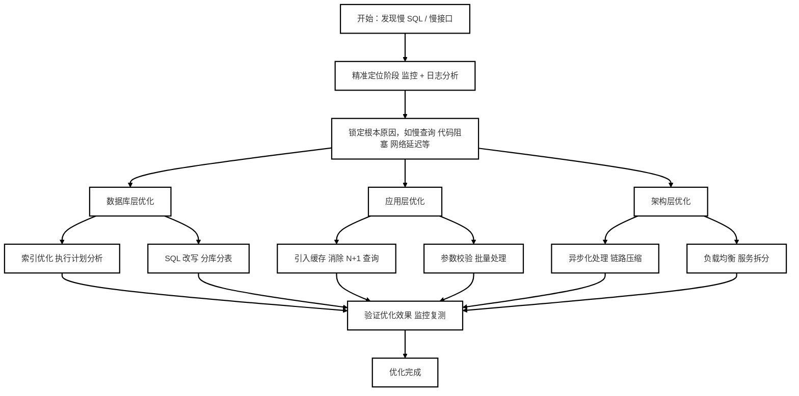

# 一条sql慢怎么处理，一个接口慢怎么处理？

https://mp.weixin.qq.com/s/uGpikSpdn1VZrCTOawcjUg

```mermaid
---
config:
  theme: neo
---
flowchart TB
    A["开始：发现慢 SQL / 慢接口"] --> B["精准定位阶段 监控 + 日志分析"]
    B --> C["锁定根本原因，如慢查询 代码阻塞 网络延迟等"]
    C --> D1["数据库层优化"] & D2["应用层优化"] & D3["架构层优化"]
    D1 --> E1["索引优化 执行计划分析"] & E2["SQL 改写 分库分表"]
    D2 --> F1["引入缓存 消除 N+1 查询"] & F2["参数校验 批量处理"]
    D3 --> G1["异步化处理 链路压缩"] & G2["负载均衡 服务拆分"]
    E1 --> H["验证优化效果 监控复测"]
    E2 --> H
    F1 --> H
    F2 --> H
    G1 --> H
    G2 --> H
    H --> I["优化完成"]
```